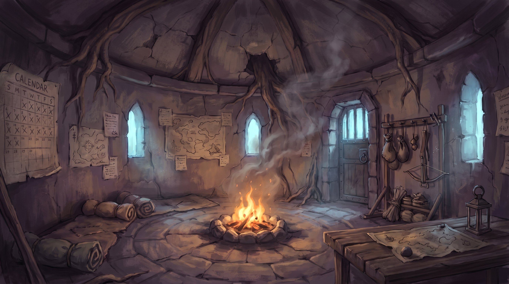
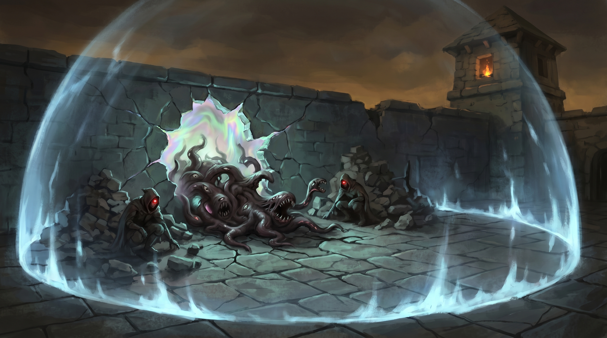

# Chapter 1: The Drawing

**Session(s):** 1
**Level:** 4
**Expected Duration:** 3-4 hours
**Time:** Day 1 of the campaign

---

## Chapter Overview

**Synopsis:** Each PC is wrenched through a malfunctioning Eld Pylon portal at a moment of crisis in their life and deposited at the Waystation -- a crumbling watchtower where reality still obeys its rules, maintained by an old man named Aldric Vane. Disoriented, suspicious, and cut off from everything they knew, the PCs learn they are bound by the Constant and that the world outside is dying. A Thinny breach at the Waystation's perimeter forces them to fight together for the first time.

**Objectives:**
- Experience each PC's "Door moment" through collaborative flashback
- Arrive at the Waystation and meet [Aldric Vane](npcs.md#aldric-vane)
- Learn the premise: the Fracturing, the Ley Beams, the Constant
- Demonstrate the Constant bond through the directional sense mechanic
- Survive the first Thinny breach as a party
- Receive the quest: travel to [Loom](locations.md#loom) and find the Covenant of the Pylon

**Key NPCs:** [Aldric Vane](npcs.md#aldric-vane)
**Key Locations:** [The Waystation](locations.md#the-waystation)

---

## Scene 1: The Doors

*Estimated time: 30-45 minutes*

### Introduction

This scene is a series of collaborative flashbacks -- one per PC -- in which the player and DM co-narrate the moment their character was Drawn. Each vignette follows the same structure: establish the character in a moment of extreme emotion or crisis, introduce the Door, and pull them through. Work with each player to shape their vignette around their backstory.

The Door is always the same: a rectangle of light that appears where no door should be. It shimmers with colors that don't have names. It hums at a frequency felt in the teeth and behind the eyes. And it pulls.

### DM Guidance

Run each vignette one at a time, giving the rest of the table a front-row seat to each character's origin moment. Keep each one to 5-8 minutes. These should feel like cold opens -- in medias res, no preamble.

**Before the session:** Ask each player for a one-sentence description of the worst or most pivotal moment in their character's backstory. Build the vignette around that moment.

**The Vignette Structure:**
1. Set the scene (2-3 sentences of read-aloud, tailored to the PC)
2. Let the player act or react (one or two exchanges of dialogue or action)
3. The Door appears
4. The pull -- involuntary, irresistible
5. Transition: darkness, the sensation of drowning in starlight, then the sound of wind

No dice are rolled in this scene. This is pure narrative.

### Example Vignettes

Use these as templates. Adapt them to the actual PCs at your table.

**The Soldier (Fighter, Paladin, Ranger)**

> The battle has turned. You know it the way soldiers know -- not from the commander's horn or the enemy's advance, but from the sound. The sound changes when you're losing. Steel stops ringing and starts scraping. War cries become screams. The mud under your boots is warm and red, and the line you've been holding for three hours is about to break.
>
> Your shield arm is numb. The soldier beside you -- you knew their name this morning -- is face down in the dirt and not moving. Across the field, the enemy reforms for the push that will end this.
>
> You raise your weapon. You will die here. You have accepted it.
>
> And then -- behind you, where there was nothing but churned earth and broken wagons -- light. A rectangle of it, standing upright in the air like a doorway cut from the sky. The colors are wrong. The light bends in ways light should not bend. It hums, low and deep, and you feel it in your chest like a second heartbeat.
>
> The pull starts in your spine. Your feet slide backward through the mud. You drop your shield, grab for anything solid -- but there is nothing solid near a Door.
>
> The light swallows you. For one eternal moment, you are drowning in starlight -- cold and bright and impossibly vast, a sky without a world beneath it.
>
> Then darkness. And the sound of wind.

**The Exile (Warlock, Sorcerer, Wizard)**

> The tribunal has rendered its verdict. You stand in the center of the chamber, wrists bound, while the words wash over you like cold water: *exiled, stripped of rank, forbidden from practice*. The faces looking down at you are people you studied with. People you trusted. Their expressions range from pity to satisfaction.
>
> The head magistrate is still speaking, but you've stopped listening. You're watching the shadows in the corner of the chamber -- shadows that have been wrong all day, falling at angles that don't match the torchlight. You thought it was your imagination. You thought the stress was getting to you.
>
> The shadow moves. It peels itself off the wall and stands upright -- a rectangle of shimmering, impossible light where the darkness was. No one else sees it. The tribunal drones on. The guards grip your arms.
>
> But the Door sees *you*. You feel it -- a recognition, bone-deep and undeniable. Like meeting someone you've known in a dream. The pull begins, gentle at first, then insistent, then absolute.
>
> The guards' hands pass through your arms as if you were smoke. The tribunal's voices stretch and distort. The light takes you.
>
> You drown in starlight.
>
> Darkness. Wind.

**The Urchin (Rogue, Monk, Bard)**

> The alley dead-ends at a brick wall and you hit it at full speed, palms scraping stone. Behind you, boots on cobblestone -- three sets, maybe four, and they're not running anymore. They know you're trapped. You can hear them laughing.
>
> The thing in your pocket -- the thing you stole, the thing that was supposed to buy a week of meals -- presses against your hip like an accusation. It seemed so easy. The merchant wasn't even looking. But the merchant had friends, and the friends had knives, and now the alley stinks of garbage and rain and the particular metallic taste of being very, very afraid.
>
> You press your back against the wall. The bricks are cold and wet. There is no way out.
>
> Except -- the wall behind you is warm. Where there were bricks, there is light. You spin and see it: a doorway carved from nothing, shimmering with colors that make your eyes ache. It smells like a storm that hasn't broken yet -- ozone and copper and something older. Something that has been waiting.
>
> The pull takes you before you can choose. Your feet leave the ground. The alley, the boots, the laughter -- all of it stretches thin and snaps like a thread.
>
> Starlight fills your lungs. You cannot breathe. You cannot stop.
>
> Darkness. Wind.

**The Construct (Warforged, Artificer)**

> The workshop is quiet now. The artificer who built you -- who gave you language, purpose, the approximation of a name -- lies on the floor surrounded by shattered glass and the acrid stench of a spell gone wrong. Their breathing has stopped. You checked. You checked again. You do not understand why checking a third time felt necessary, but you did it anyway.
>
> You stand in the silence and experience something you have no framework for. Your diagnostics return nominal readings. Your joints are functional. Your core is stable. But something inside your chest -- not a component, not anything on your schematics -- aches. The closest word you have for it is *loss*, but the word is too small for the sensation.
>
> The far wall of the workshop begins to glow. A rectangle of light materializes between the tool rack and the window, humming at a frequency that resonates with your core in a way no external signal ever has. Your optical sensors cannot process the colors. Your threat assessment returns no data -- not *safe*, not *dangerous*, simply... *unknown*.
>
> The pull activates servos you didn't know you had. Your feet scrape across the workshop floor, past the body of the only person who ever called you by name.
>
> You do not resist. There is nothing left to stay for.
>
> The light takes you apart, molecule by molecule, and reassembles you somewhere else.
>
> Darkness. The sound of wind. And for the first time, the sensation of cold.

### Transition

After all vignettes are complete, pause for a beat of silence. Then:

> Darkness. Not the darkness of a room or a cave -- the darkness of *between*. You are nowhere. You are nothing. You are a thought the universe hasn't finished thinking yet.
>
> Then -- sensation. Stone under your back, cold and rough. Wind against your face, carrying grit and the smell of ash. The sound of fire, crackling low. And something else: a feeling you've never experienced before. A tug behind your sternum, subtle as a compass needle finding north. It points sideways, toward warmth you can't see. Toward people you haven't met.
>
> You open your eyes.

---

## Scene 2: The Waystation

*Estimated time: 60-75 minutes*

### Introduction

> You are lying on a stone floor inside a circular room. The ceiling is low and vaulted, cracked with age, held together by roots that have grown through the masonry and chosen to grip rather than destroy. A fire burns in a pit at the room's center -- the only source of warmth. The smoke rises through a chimney that might have been an arrow slit in another life. The walls are covered in scrawled notes, tacked-up maps with routes crossed out, and what looks like a calendar with far too many days marked off.
>
> The air smells of woodsmoke, old stone, and something faintly electric -- like the memory of a lightning strike.
>
> An old man sits on a stool by the fire, watching you. All of you. He has a blanket over his knees and a clay mug in his hands, and he looks like he has been sitting here for a very long time. His face is weathered like driftwood -- deep lines, sun-dark skin, white hair pulled back in a loose knot. His eyes are the pale blue of ice on a lake, and they are sharp. He has been expecting you. Or at least expecting *someone*.
>
> "Don't try to stand yet," he says. His voice is quiet and measured, each word chosen the way a mason chooses stones -- carefully, with weight. "The Door takes something out of you. It puts it back, eventually. But for now... sit. Breathe." A pause. He looks into the fire. "You'll have questions. I'll answer what I can."



### DM Information

This is the exposition and bonding scene. It has two purposes: deliver the premise through Aldric's dialogue, and give the players space to roleplay their characters' reactions to each other and to an impossible situation.

**Pacing is critical here.** Aldric has a lot of information to deliver, but it should come through conversation, not monologue. Let the players interrupt, question, argue, and process. Aldric is patient -- he has had decades of silence and is genuinely relieved to have someone to talk to.

**The Room:** The interior of [the Waystation](locations.md#the-waystation) is a single large ground-floor chamber (the upper floors are collapsed). Bedrolls line one wall -- far more than are needed, as if Aldric once expected more guests. A table holds a map of the surrounding Ashlands, weighted down with stones. A rack near the door holds supplies: water skins, travel rations, a battered lantern, and a crossbow that hasn't been fired in years. Stairs against one wall lead up to a collapsed landing.

**Hidden Details:**
- **DC 12 Perception:** The notes on the walls are in multiple handwriting styles. Aldric has been here a long time, but he wasn't always alone. Some of the handwriting is shaky -- written by people who were afraid.
- **DC 14 Investigation:** Among the maps and notes, there is a faded diagram of an Eld Pylon -- highly detailed, with annotations in a technical hand. Aldric's handwriting matches the annotations. He knows more about Pylon technology than a simple hermit should.
- **DC 16 Arcana:** The electric smell in the air is residual portal energy -- the same signature as the Doors. The Waystation itself sits on or near an Eld Pylon junction point.

### NPC Present

**[Aldric Vane](npcs.md#aldric-vane) -- The Keeper**
- **Appearance:** Late 60s, lean and weathered, white hair in a loose knot, pale blue eyes, calloused hands, a slight stoop from years of bending over maps and machinery. Wears a faded cloak with the hood down. A thin scar runs from his left temple to his jaw -- old, well-healed.
- **Attitude:** Patient, precise, quietly relieved. A man who chose his words carefully even before decades of solitude forced the habit deeper. He measures the PCs not with suspicion but with concern -- he needs them to understand, and he's afraid they won't believe him.
- **Speech Pattern:** Measured, with deliberate pauses. Speaks in complete sentences. Occasionally stops mid-thought and chooses a different word, as if the first one wasn't precise enough. *"The world is... no. The world is dying. That's the right word. Dying."*
- **Wants:** For the PCs to understand, to trust each other, and to reach Loom alive.
- **Knows:** The Fracturing, the Beams, the Constant, the Eld Pylons, the route to Loom, and far more about Pylon technology than he initially reveals.
- **Will Reveal:** Everything listed in the exposition below. He holds nothing back about the state of the world -- the truth is too urgent for secrets.
- **Won't Reveal:** That he was once an Unraveler. If directly asked about his past, he pauses longer than usual and says, "I've made mistakes. The kind you can't fix -- only try to balance." He will not elaborate.
- **Stats:** Archmage (MM p.342), but he will not enter combat. He must maintain concentration on the Waystation's barrier at all times. If his concentration breaks, the barrier fails within minutes.

### Aldric's Exposition

Aldric delivers the following information through natural conversation. Don't dump it -- let it emerge as the PCs ask questions. If they don't ask, Aldric prompts them gently: *"You want to know where you are. Or perhaps when. Both are fair questions."*

**The Fracturing (what happened):**

> "Two hundred years ago, the Divine Gate shattered. Not the way a window breaks -- the way a bone breaks. The fracture lines spread. The planar boundaries that kept the worlds apart began to fail. Raw magic bled through. The Feywild, the Shadowfell, the Far Realm -- all of them pressing against a barrier that wasn't there anymore."
>
> He traces a line in the ash by the fire.
>
> "The world should have ended. It didn't. Because something older than the gods was already in place."

**The Ley Beams (what's holding reality together):**

> "The Eld Pylons. Built by a civilization so old we don't even have a name for them -- we call them the Old Ones because that's all we know. Massive crystalline engines, scattered across the continent, connected by lines of force we call Ley Beams. Six of them. They hold reality together the way... the way sutures hold a wound."
>
> He holds up his hands, fingers spread, pressing against each other.
>
> "When the Gate shattered, the Beams caught the strain. They've been holding ever since. But they were never meant to hold this long. And four of them have already fallen."

If a PC asks what happens when a Beam falls:

> "Things stop working. Levitation spells fail. A city that floated for centuries drops out of the sky. Time flows wrong -- you walk a mile and an hour passes, or you walk ten miles and no time passes at all. The sky changes color. Shadows fall at the wrong angle. And the Thinnies come."
>
> His voice drops.
>
> "Tears in reality. Where a Thinny passes, the rules stop. Creatures from places that shouldn't exist bleed through. People... unmake. I've seen it. I don't recommend it."

**The Constant (why them):**

> "You felt it when you woke up. That pull." He touches his own chest, over his heart. "Like a compass needle. Pointing at each other."
>
> He sets down his mug.
>
> "The Constant is... call it fate. Call it the universe's immune system. When the Beams started failing, the Constant began Drawing people. Pulling them through malfunctioning Pylon portals -- the Doors -- and binding them together. You can feel each other. You'll dream each other's dreams. When one of you is hurt, the others will feel an echo of it."
>
> A pause. The fire crackles.
>
> "I don't know why it chose you. I don't know what you're meant to do. But the Constant doesn't make mistakes -- at least, it hasn't yet."

### The Constant Demonstration

After Aldric's exposition, he demonstrates the bond.

> "Close your eyes. All of you."
>
> He waits.
>
> "Now point. Don't think about it. Just... point at someone else in this room. Someone you didn't know existed an hour ago."

Each PC makes no roll -- they simply point. And every one of them points at another PC, unerringly. Even through closed eyes. Even through walls, if someone has moved to a different part of the Waystation.

> "There it is," Aldric says quietly. "You'll always know where they are. Always. It's not magic -- or it's not *only* magic. It's something deeper. The Constant made you a unit. A... *ka-tet*, an old word. A group bound by purpose."

**DM Note -- The Shared Dream Mechanic:** From this point forward, the PCs share dreams during long rests. These dreams are fragmentary, surreal, and blend the PCs' memories together. Describe them as brief flashes at the start of the next session: a fighter sees a library they've never visited (the wizard's childhood); a rogue hears a war horn they've never heard (the paladin's last battle). These dreams serve three purposes: (1) they build inter-character bonds, (2) they foreshadow future events (a PC might dream of crystalline towers or a woman's voice saying "the chains must break"), and (3) they establish the phantom pain mechanic -- when a PC takes significant damage, every other PC feels a brief, sharp ache in the same location. This costs nothing mechanically but should be narrated every time.

### Social Encounter -- Introductions

This is the players' space. Let them introduce their characters to each other. Aldric steps back, tends the fire, and lets them talk.

**DM Prompts (if the table is quiet):**
- Aldric asks each PC their name, then repeats it carefully, as if committing it to memory. *"Names matter. The world forgets enough as it is."*
- If a PC examines the map on the table, Aldric joins them and points out the route to Loom. *"Three days' walk, if the Ashlands behave. They usually don't."*
- If a PC asks about the other bedrolls, Aldric is quiet for a moment. *"Others were Drawn before you. They went out. Looking for answers. They didn't come back."* He does not elaborate.
- If a PC investigates the Pylon diagram on the wall, Aldric watches them carefully but doesn't interrupt. If they ask about it, he says, *"The Pylons are the key to everything. To fixing this. Maybe."*

**Possible Player Actions:**
1. **If players are suspicious of Aldric:** Good. He accepts their suspicion without offense. DC 15 Insight reveals he is hiding something about his past, but his concern for them is genuine. He's not lying about the state of the world.
2. **If players try to leave immediately:** Aldric doesn't stop them, but points at the barrier. *"Take a look outside first. Then decide."* Outside the barrier, the Ashlands stretch in every direction -- a blighted landscape of ash-gray dirt, leafless trees, and a sky that is the wrong shade of amber. Shadows fall at angles that don't match the light source.
3. **If players ask why Aldric doesn't come with them:** He gestures at the shimmering barrier visible through the doorway. *"I leave, the barrier falls. Everything within a hundred feet of this tower becomes Ashlands within the hour. This place is all I have to give. And it's almost not enough."*
4. **If players do something unexpected:** Aldric is patient and adaptable. If they refuse to engage with the premise, let them explore. The Waystation is small and its contents tell the story -- the maps, the notes, the empty bedrolls, the faded diagram. The world outside the barrier tells the rest.

### Connections
- **To Scene 3:** The barrier flickers. Aldric's head snaps up. His mug slips from his fingers. *"No. Not yet. It's too soon."*

---

## Scene 3: The Breach

*Estimated time: 45-60 minutes*

### Introduction

> Aldric is on his feet before the mug hits the ground, his hands already raised, fingers spread toward the walls. The pale blue light of the barrier -- visible through every window and doorway -- stutters. It flickers like a candle in a draft, and for one heartbeat, you see through it to what lies beyond: the Ashlands, close and wrong and *hungry*.
>
> Then the sound comes. Not a crash, not a tear -- a *whine*. High-pitched, building, like a violin string being tightened past its limit. It's coming from the north wall of the courtyard.
>
> "The barrier," Aldric says, and his measured voice cracks for the first time. "Something is pushing through. A Thinny -- a tear in the fabric. I can feel it. The barrier is trying to hold, but it's..." He presses his palms together, hard, and the blue light steadies -- but only barely. Sweat beads on his forehead.
>
> "I can't fight and hold the barrier. I need you to get to the courtyard. Seal the breach before more of them get through." His eyes find each of you in turn. "Please."



### DM Information

This is the chapter's combat encounter and its dramatic climax. The PCs must fight creatures pouring through a Thinny breach in the Waystation's barrier while simultaneously working to seal the breach itself. Aldric provides guidance but cannot fight -- his concentration is the only thing keeping the rest of the barrier intact.

**Dramatic Question:** Can they seal the breach before the Waystation is overrun?

### The Courtyard

Read when the PCs enter the courtyard:

> The Waystation's courtyard is a rough square of cracked flagstone, forty feet to a side. The tower rises behind you to the south -- the only way back inside. The barrier wall shimmers on the east, west, and north sides, a curtain of pale blue light that usually looks solid as glass. On the north wall, it is anything but.
>
> A crack runs through the barrier like a fracture in ice -- ten feet wide, edges rippling and distorting. Through the crack, the Ashlands bleed in: the air smells of copper and ozone, colors at the edges of your vision run like wet paint, and the ground beneath the breach writhes as if something is pushing up from below.
>
> Two shapes have already come through. They are wrong in the way that nightmares are wrong -- geometry that refuses to resolve, flesh that shouldn't be flesh, eyes in places where eyes don't belong.
>
> They see you. They are hungry.

**Terrain Map:**

```
N (Breach -- 10 ft wide crack in barrier)
+----------------------------------------+
|              BREACH (10 ft)            |
|          xxxxxxxxxxxxxxxx              |
|                                        |
|   [Rubble]                   [Rubble]  |
|   (half                      (half     |
|    cover)                     cover)   |
|                                        |
|                                        |
|                                        |
|                                        |
|                                        |
|             [Waystation]               |
|               Tower                    |
|              Entrance                  |
+----------------------------------------+
S (Tower)            40 ft x 40 ft
```

- The **breach** is a 10-foot-wide crack in the barrier along the north wall. Its edges shimmer and distort. Creatures emerge from it.
- Two piles of **rubble** (fallen masonry from the tower's upper floors) provide half cover. One is 10 feet from the west wall, 15 feet from the breach. The other is 10 feet from the east wall, 15 feet from the breach.
- The **tower entrance** on the south wall is the only way back inside.
- The courtyard floor is cracked flagstone -- difficult terrain within 5 feet of the breach due to reality distortion (the ground shifts and warps subtly).

### Encounter: The Breach

**Creatures:**
- 1 **Gibbering Mouther** (MM p.157)
- 2 **Nothics** (MM p.236)

The Gibbering Mouther entered first and occupies the center of the courtyard, between the rubble piles. The two Nothics came through moments later and are flanking, one near each rubble pile.

**Initiative:** Roll normally. The creatures act on their own initiative counts.

**Creature Tactics:**

*Gibbering Mouther:* It advances toward the nearest PC, using its Aberrant Ground trait to create difficult terrain in a 10-foot radius. It targets whoever is closest, driven by mindless hunger. It does not retreat. Its gibbering fills the courtyard with maddening sound -- remind the PCs of the DC 10 Wisdom save for any creature starting its turn within 20 feet.

*Nothics:* They are more cunning. They use Weird Insight on PCs who look like spellcasters (attempting to steal secrets), then attack with their rotting gaze from range. If a PC approaches the breach to begin sealing it, one Nothic will disengage and move to intercept. They fight with desperate intelligence -- they didn't choose to come through the Thinny, but now that they're here, the Waystation's stable reality is intoxicating to them. They want to stay.

### Sealing the Breach

**Aldric's Instructions:**

On his first turn in the initiative order (use his initiative modifier of +0, or place him at the end of the round), Aldric shouts from inside the tower:

> "The breach! You need to channel energy into the barrier -- press your hands against the edge of the crack and *push*. Feed it your will. I can guide you if you're close enough to hear me!"

**The Mechanic:**

A PC can attempt to channel energy into the breach to seal it. This requires the following:

- The PC must be **within 5 feet of the breach** (in the difficult terrain zone).
- The PC must use their **action** to channel. This is a **DC 14 Arcana check**. If Aldric is guiding them (the PC is within 30 feet of the tower entrance where Aldric is concentrating), the DC is reduced to **DC 12**.
- **Any class can attempt this.** The Constant flowing through the PCs is what allows them to interface with the barrier -- it's not spellcasting, it's instinct.
- **Three successful rounds of channeling seals the breach.** The successes do not need to be consecutive, and multiple PCs can channel simultaneously (each success counts separately).
- On a **failed check**, the channeling PC takes **1d6 force damage** from backlash as the barrier's energy rejects their attempt. They can try again next round.
- On a **natural 20**, the channeling counts as two successes.

**Narrative Beats During Channeling:**

*First successful channel:*
> The barrier responds to your touch. The crack's edges glow brighter where your hands meet it, and for a moment, you feel the barrier's structure -- vast and intricate, like pressing your palm against a spiderweb the size of the sky. The crack narrows by a third. Through the remaining gap, the Ashlands howl.

*Second successful channel:*
> The crack contracts further. The wrongness bleeding through it lessens -- colors stabilize, the copper taste in the air fades. But the barrier is fighting you, too. It's old and tired and it doesn't entirely trust you. Holding it feels like holding a door shut against a storm.

*Third successful channel (breach sealed):*
> The crack snaps shut like a healing wound. The barrier flares brilliant blue -- brighter than you've seen it -- then settles back to its steady, pale glow. The howling stops. The distortion fades. The flagstones under your feet are just flagstones again.
>
> From inside the tower, you hear Aldric let out a breath he's been holding for what sounds like a very long time.

### Escalation

**If the breach is not sealed by the end of Round 5:** A third **Nothic** (MM p.236) pushes through the crack. Read:

> The crack pulses. Something else is coming through -- another shape, hunched and watching, a single burning eye scanning the courtyard with terrible intelligence. The breach is widening. If you don't seal it soon, there won't be a barrier left to save.

The third Nothic acts on the same initiative count as the original Nothics. It prioritizes attacking whoever is channeling the barrier.

**If a PC drops to 0 HP:** Every other PC feels a sharp, cold pain in the same location where the blow landed. Describe it. This is the phantom pain mechanic in action -- it costs nothing mechanically but makes the Constant real.

**If the Gibbering Mouther is killed:** Its body dissolves into the flagstones, leaving a slick of iridescent residue that smells of ozone. The residue evaporates within a minute.

**If all creatures are killed but the breach isn't sealed:** More creatures are visible through the crack -- twisted shapes pressing against the thinning barrier. The PCs still need to seal it, but without combat pressure, they can take 10 on the Arcana check (automatic success) and close it in three rounds.

### Possible Player Actions

1. **Split the party -- some fight, some seal:** This is the intended approach. The encounter is designed so that 1-2 PCs can handle the creatures while 1-2 channel the breach. Reward this tactical thinking.
2. **Everyone fights first, then seals:** Viable, but risks the Round 5 escalation. If they kill all three starting creatures quickly, they can seal the breach without additional pressure.
3. **Use spells on the breach:** Creative use of spells (Mending, Shield, Dispel Magic, etc.) can be flavored as assisting the channeling. The DM should allow any spell that thematically fits to grant advantage on the Arcana check for that round. This does not replace the check -- the barrier requires the Constant-touched to do the actual sealing.
4. **Try to go through the breach:** The PC takes 3d6 psychic damage and must succeed on a DC 15 Wisdom save or be stunned until the end of their next turn. The Ashlands on the other side are hostile to life -- there is nothing to gain and everything to lose.
5. **Call to Aldric for more help:** Aldric cannot leave the tower. He can shout tactical advice (granting advantage on one Arcana check per round) and he can use his action to briefly bolster the barrier (reducing breach-adjacent difficult terrain for one round). But if he stops concentrating, the entire barrier fails -- and everything outside rushes in.

---

## Chapter Resolution

*Estimated time: 15-20 minutes*

### Aftermath

After the breach is sealed and any remaining creatures are dealt with, read:

> The courtyard is quiet. The kind of quiet that follows a storm -- fragile, disbelieving, not quite trusting itself. The barrier hums steadily, its pale blue light undisturbed. The Ashlands beyond it are still, for now.
>
> Aldric emerges from the tower. He looks ten years older than he did an hour ago. His hands tremble as he lowers them, and he steadies himself against the doorframe before speaking.
>
> "That will happen again." His voice is measured, but thinner. "And soon. The barrier has held for... a long time. But it's failing. I can feel it -- like trying to hold water in cracked hands." He looks at each of you. "I can't stop it. And I can't leave."

He pauses. Chooses his next word carefully.

> "But you can."

### Aldric's Send-Off

Aldric leads the PCs back inside and presses supplies into their hands:

**Supplies Given:**
- A leather pack for each PC containing basic adventuring gear (50 ft rope, tinderbox, waterskin, bedroll)
- 10 days of rations (dried meat, hardtack, sealed water -- enough for a party of 4)
- An outdated map of the Ashlands, hand-drawn, with a route to Loom marked in red ink. Annotations in Aldric's handwriting note hazards: *"Temporal eddies -- stay on the road"* and *"Skyship wreckage -- possible salvage"* and *"DO NOT APPROACH"* over a region marked with a skull
- A **Beam-Shard Crystal** -- a small, rough-cut crystal that fits in a palm. It pulses with a faint inner light, rhythmic as a heartbeat
- A **Communication Crystal** -- a flat, disc-shaped crystal etched with concentric rings. Aldric keeps its twin. Holding it and speaking Aldric's name allows a brief two-way conversation (functions as *Sending*, once per day)

> Aldric places the crystal in the nearest PC's hand and closes their fingers around it.
>
> "This is a piece of the Beam's resonance. Crude. I made it years ago. It glows brighter the closer you are to an active Beam -- or to anything connected to one. Follow the light. It won't lead you wrong."
>
> He presses a second crystal into another PC's palm -- flat, disc-shaped, warm. Its surface is etched with concentric rings that catch the light.
>
> "And this. Hold it. Say my name. You'll hear me, and I'll hear you. Once a day, no more -- the resonance can't sustain it. But if you need me..." He trails off. The implication is clear: he expects them to need him.
>
> He straightens. The trembling in his hands stops -- or he forces it to stop.
>
> "Loom. Three days east, if the Ashlands are kind. It's a city -- or it was. It phases now, slipping between time periods. But there are people there. And the Covenant of the Pylon has a presence in the city. Find them. Tell them a Keeper sent you. They'll know what it means."
>
> He pauses again. Longer this time.
>
> "I won't pretend to know why the Constant chose you. Maybe it knows something I don't. But I've spent decades in this tower waiting for someone the Doors would send, and you're here. That has to mean something."

### The Cliffhanger

When the PCs are ready to leave, read:

> Aldric walks you to the Waystation gate -- an iron-banded wooden door in the barrier wall, the only controlled opening. He pulls it open. Beyond, the Ashlands stretch to the horizon under an amber sky that has too few clouds and too many colors. The road is a thin, pale line of packed dirt cutting east through the ash.
>
> You step through the gate. The air on this side is different immediately -- thinner, drier, carrying the faint tang of copper and the absence of something you can't name.
>
> "Stay on the road," Aldric says behind you. "And trust the pull. Trust each other."
>
> You look back.
>
> The Waystation stands behind the barrier like a ship in a bottle -- small, fragile, impossibly brave. Aldric raises one hand in farewell. The barrier shimmers around him, pale blue and steady.
>
> Then it flickers.
>
> Just once. A stutter, like a candle in wind. The light dims, the edges waver, and for one heartbeat you can see the Ashlands *through* the barrier, pressing against it like hands against glass.
>
> Then it steadies. Aldric's hand drops. The gate closes.
>
> But you all saw it. The barrier flickered.
>
> Ahead of you, the road stretches east. The Beam-Shard Crystal in your pack pulses once, faintly, like a heartbeat calling you forward.

---

## DM Notes & Tips

### Pacing This Chapter

| Scene | Time | Energy Level | Key Moments |
|-------|------|-------------|-------------|
| Scene 1: The Doors | 30-45 min | Medium -- emotional, collaborative | Each PC's origin; the sensation of Drowning in starlight |
| Scene 2: The Waystation | 60-75 min | Low/Medium -- social, expository | Meeting Aldric; learning the premise; the Constant demonstration |
| Scene 3: The Breach | 45-60 min | High -- combat, urgency | First fight together; sealing the breach; phantom pain |
| Resolution | 15-20 min | Falling -- quiet, ominous | Supplies; the send-off; the flickering barrier |

**Tempo Notes:**
- Scene 1 should feel dreamlike and personal. Don't rush the vignettes -- each player deserves their moment.
- Scene 2 is where you'll feel the most temptation to infodump. Resist it. Let Aldric's information emerge through dialogue. If a player asks a question Aldric hasn't covered yet, answer it out of order -- it means they're engaged.
- Scene 3 should snap the energy up sharply. The transition from campfire conversation to combat should feel sudden and alarming.
- The Resolution is a breather, but the cliffhanger should leave the table unsettled. End on the flicker.

### Common Player Approaches

**"I don't trust Aldric":** Perfect. Let them investigate him. The Pylon diagram on the wall and the hidden details reward suspicion. Aldric's secret (former Unraveler) won't be revealed this chapter, but smart players will sense something. Don't confirm or deny -- just let Aldric be a person who carries visible weight.

**"I want to explore outside the barrier":** Allow it briefly, but make the Ashlands feel immediately, viscerally wrong. The sky is the wrong color. Shadows fall at impossible angles. The air tastes of copper. After one minute outside the barrier, a PC must make a DC 12 Wisdom save or feel a deep, irrational urge to go back inside. The Ashlands are not hostile in an active way -- they are hostile in the way vacuum is hostile. They are the absence of rules.

**"I refuse the quest":** Aldric doesn't argue. He simply points out that the barrier is failing, the Waystation will fall, and the Ashlands will consume this pocket of reality. There is no safe place to stay. The only direction is forward. If the PCs still refuse, the next Thinny breach -- which will come in hours, not days -- will make the decision for them.

**"Can we take Aldric with us?":** No. He explains clearly that his concentration is the barrier. If he leaves, this pocket of stable reality dies. He's made peace with this. It's the only thing he can do, and he does it.

**"We fight among ourselves":** The Constant makes it uncomfortable. If one PC attacks another, both feel phantom pain -- not enough to stop them, but enough to make it deeply unpleasant. Narrate it: their blows connect, but so does the echoed pain. This is the universe saying *no*.

### What-If Contingencies

**If a PC dies in the Breach encounter:** This is unlikely at level 4 against these creatures, but possible. If it happens, Aldric can stabilize them (Medicine +9 from the Archmage stat block) after the encounter, provided the breach is sealed first. If the PC dies outright, Aldric is shaken. *"The Constant chose you. It doesn't let go easily. Something is very wrong."* This raises the stakes but should not happen in a well-balanced encounter.

**If the players seal the breach before any creatures come through:** Not possible as written (the creatures are already through when the scene begins), but if the players find a creative way to close the breach on Round 1, let them. Award full XP and describe Aldric's astonished relief. The chapter still ends the same way -- the barrier is failing regardless.

**If the players try to use the Beam-Shard Crystal during combat:** It pulses erratically during the Thinny breach -- the crystal reacts to the breach's energy. It cannot be used as a weapon, but its pulsing might give a PC advantage on one Arcana check to seal the breach (DM discretion).

**If a player knows the Dark Tower source material:** Lean into the parallels without confirming them. The Constant, the ka-tet, the Doors -- these are deliberate echoes. But the campaign diverges from the source in key ways. Let knowledgeable players feel clever when they recognize references, but subvert their expectations where the story demands it. The Waystation is not the same as the Way Station. Aldric is not who they think he is.

### The Constant in Play

Starting this session, track the following:

- **Shared Dreams:** At the beginning of each subsequent session, describe a brief dream fragment blending the PCs' memories. Keep it to 2-3 sentences. These accumulate into a tapestry of shared experience.
- **Phantom Pain:** Whenever a PC takes damage equal to or greater than half their max HP in a single hit, describe the phantom echo felt by all other PCs. It's brief, sharp, and fades quickly.
- **Directional Sense:** Each PC always knows the approximate direction and distance of every other PC. This cannot be blocked by magic short of a Wish spell. It is not magical -- it is fundamental.

---

## Quick Reference

### NPCs This Chapter

| Name | Location | Attitude | Key Info |
|------|----------|----------|----------|
| [Aldric Vane](npcs.md#aldric-vane) | The Waystation | Patient, precise, quietly desperate | Keeper of the barrier; former Unraveler (secret); sends party to Loom |

### Encounters This Chapter

| Scene | Type | Creatures | Difficulty |
|-------|------|-----------|------------|
| Scene 1: The Doors | Narrative (no combat) | None | -- |
| Scene 2: The Waystation | Social / Exploration | None | -- |
| Scene 3: The Breach | Combat + Skill Challenge | 1 Gibbering Mouther, 2 Nothics (+ 1 Nothic escalation) | Medium-Hard |

### Treasure & Rewards

| Item | Type | Source |
|------|------|--------|
| Basic adventuring gear (per PC) | Equipment | Aldric |
| 10 days of rations (party) | Consumable | Aldric |
| Outdated Ashlands map | Quest item | Aldric |
| Beam-Shard Crystal | Quest item (wondrous) | Aldric |

### Skill Check DCs

| Check | DC | Context |
|-------|----|---------|
| Perception (wall notes) | 12 | Notice multiple handwriting styles in Waystation |
| Investigation (Pylon diagram) | 14 | Find detailed Eld Pylon schematic on wall |
| Arcana (residual energy) | 16 | Identify portal energy signature in Waystation |
| Insight (Aldric's honesty) | 15 | Detect he is hiding something about his past |
| Arcana (seal breach, guided) | 12 | Channel energy into barrier with Aldric's guidance |
| Arcana (seal breach, unguided) | 14 | Channel energy into barrier without guidance |
| Wisdom save (Gibbering Mouther) | 10 | Resist gibbering within 20 ft (creature ability) |
| Wisdom save (Ashlands exposure) | 12 | Resist unease when outside the barrier |

---

*End of Chapter 1*
