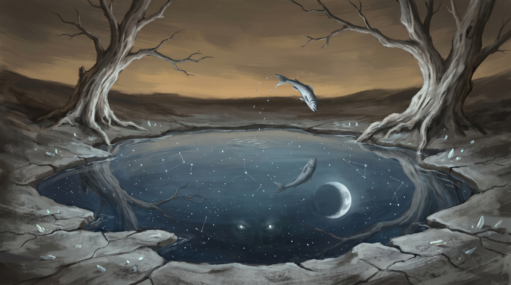
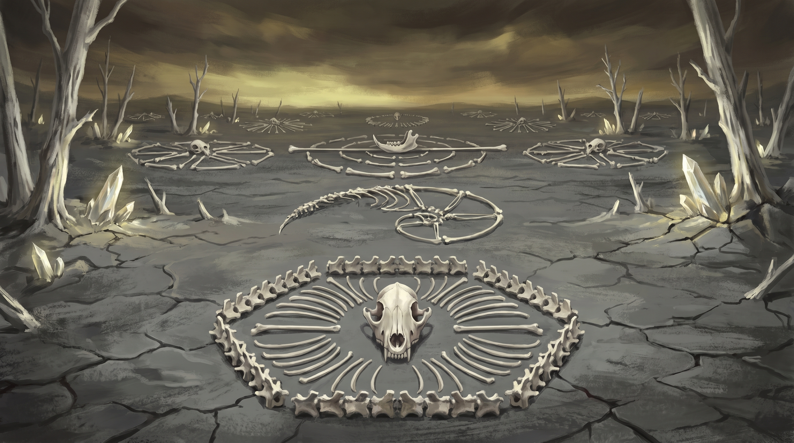
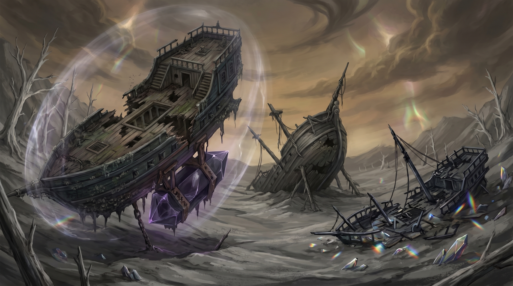
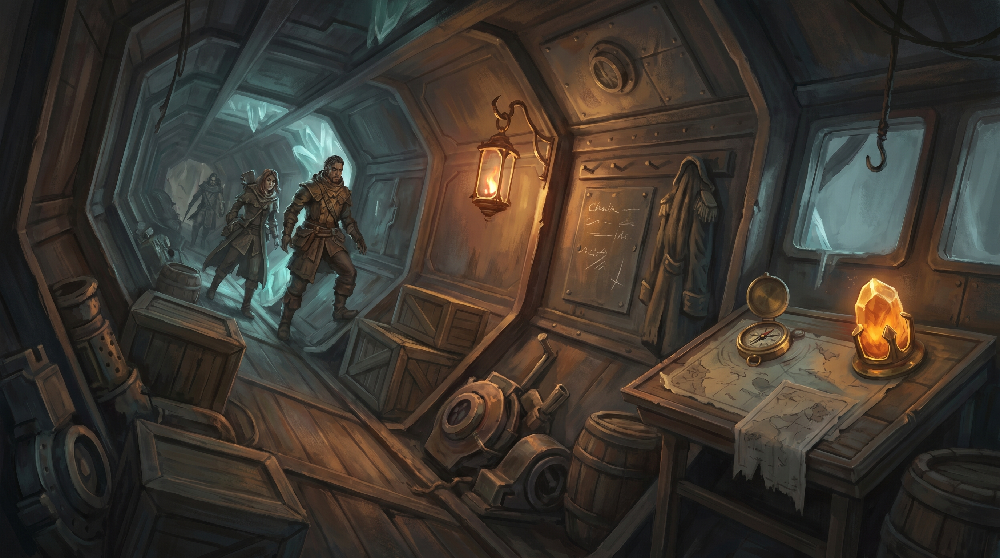
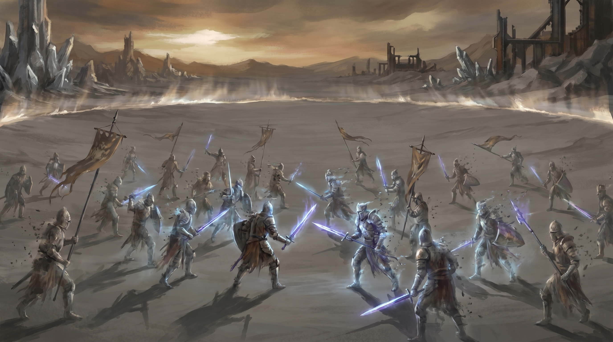
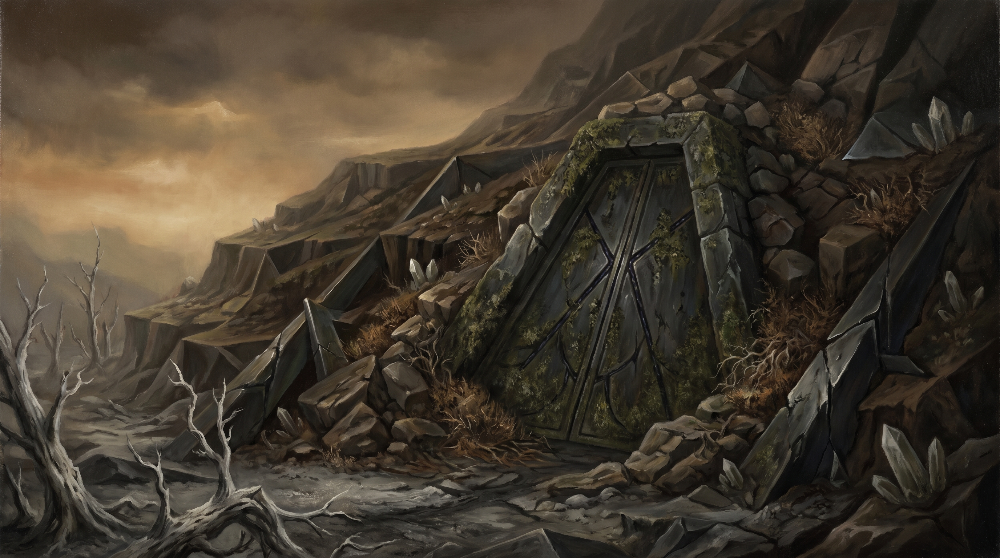
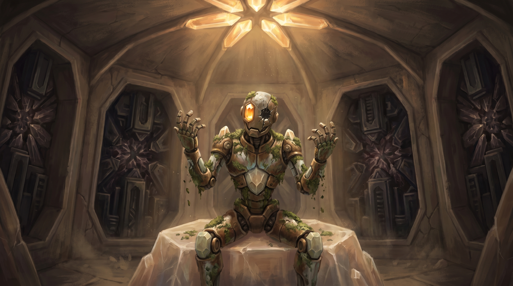
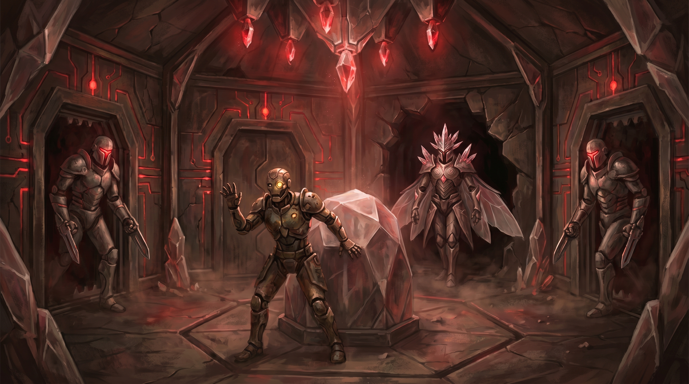
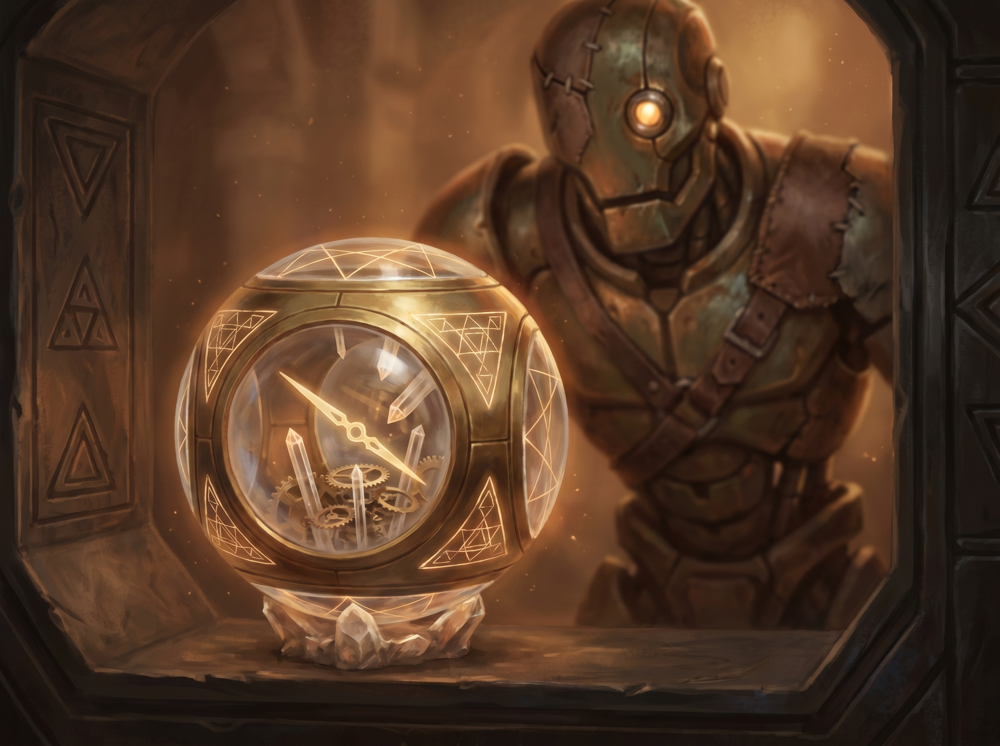
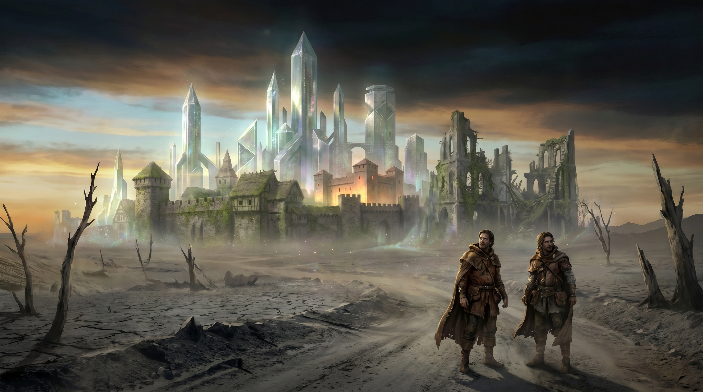

# Chapter 2: The Blighted Way

**Session:** 2 | **Level:** 4 | **Duration:** 3-4 hours

---

## Chapter Overview

**Synopsis:** The party departs the Waystation and journeys through [the Ashlands](locations.md#the-ashlands) -- a vast blighted wilderness where reality frays at the edges. Three days of travel through a landscape that is beautiful, broken, and wrong. The sun tracks incorrectly. Shadows fall at angles that don't match the light. The ground is ash-grey and cracked, dotted with the crystalline ruins of a civilization that once held the world together. The party discovers a crashed skyship graveyard that tells the story of a world losing its grip, navigates a temporal anomaly where a long-dead battle replays endlessly, and enters the Ruin of Vethara -- a half-buried Old Ones facility where they awaken [Moth](npcs.md#moth), a warforged construct carrying fragmentary memories of the builders. They recover the chrono-compass, a device that points not just to a place but to a *time*, and follow its pull toward the flickering silhouette of Loom on the horizon.

**Objectives:**
- Travel through the Ashlands and experience the wrongness of a world losing its Beams
- Explore the Skyship Graveyard and piece together the story of the Fracturing's toll
- Navigate the Endless Field -- a temporal loop skill challenge
- Discover the Ruin of Vethara, awaken Moth, and recover the chrono-compass
- Reach the edge of Loom's territory with Moth as a companion NPC
- Milestone: advance to Level 5 at chapter end

**Key NPCs:** [Moth](npcs.md#moth)
**Key Locations:** [The Ashlands](locations.md#the-ashlands) (Skyship Graveyard, the Endless Field, the Ruin of Vethara)

---

## Scene 1: The Ashlands

### Read-Aloud Text: Departure

> The Waystation fades behind you like a candle going out. One moment its gentle light is at your back, the warm hum of its barrier a comfort you didn't know you needed. Then the path curves, the scrub thickens, and it is gone. Ahead, the world opens into something vast and wrong.
>
> The sky is the color of a bruise left too long -- amber-grey, heavy, pressing down like a low ceiling. The sun hangs at an angle that doesn't feel right. You can't say exactly *why* it's wrong, only that it is -- the light falls from a direction your body knows is off, casting shadows that lean when they should lie flat. The air smells of chalk dust and old iron.
>
> The ground beneath your boots is grey. Not grey like stone -- grey like something that was once alive and had the color drained from it. Cracked earth stretches to the horizon in every direction, split into irregular plates like the skin of something that dried and died centuries ago. Dead trees stand here and there, white as bone, their branches reaching upward in postures that look like surrender, or prayer, or both.
>
> And yet -- the Ashlands are not empty. Crystalline fragments catch the sick light and throw it back in fractured rainbows. A half-buried pipe, corroded green, hums faintly when you pass too close. In the distance, the skeleton of something enormous -- a building, a machine, a thing that was both -- rises from the earth at an impossible angle, its purpose lost, its presence undeniable.
>
> The world is broken here. But the broken pieces still remember what they were.

### DM Information

The journey from the Waystation to the outskirts of Loom takes approximately three days on foot. The Ashlands are not a hex crawl -- they are an atmospheric journey through a dying landscape. Run the travel as a series of vignettes and environmental storytelling beats, choosing from the options below based on pacing and player engagement. Not all need to be used. The goal is to establish the Ashlands as a place where reality itself is unreliable, beautiful in its decay, and quietly terrifying beneath the surface.

**Navigation:** DC 12 Survival to navigate each day. Aldric's map (from Chapter 1) provides advantage on this check. Failure doesn't mean the party gets lost -- it means the journey takes half a day longer, as paths end abruptly, terrain shifts unexpectedly, or the sun's unreliable position leads them in a wide arc. Three failed checks across the journey means the party arrives at the Ruin of Vethara exhausted (one level of exhaustion each), which stacks poorly with the Endless Field's failure consequence.

**The Constant During Travel:** The bond the party shares through the Constant intensifies in the Ashlands. During rest, the PCs share fragments of each other's dreams. A fighter dreams of the wizard's childhood. The rogue sees through the cleric's eyes as they remember their first prayer. These shared dreams are involuntary, intimate, and slightly unsettling -- but they deepen the bond. Use this as a roleplaying prompt between scenes. No mechanical effect, but players who engage with these moments should feel the ka-tet becoming real.

### Travel Encounters and Environmental Beats

**Day 1: The Near Ashlands**

The wrongness is subtle. The party is close enough to the Waystation's influence that reality mostly holds, but the cracks are showing.

**Beat: The Road That Ends**

> The path you've been following -- a pale groove worn into the ash-grey earth by feet or wheels long gone -- simply stops. Not at a river or a cliff or a wall. It stops in the middle of a flat expanse, the packed earth giving way to nothing. Ahead, where the road should continue, the terrain is different -- darker, slightly lower, as if a section of landscape was cut away and the wound healed wrong. A flower grows at the road's exact terminus. As you watch, it blooms -- white petals unfurling, a burst of impossible color against the grey -- and then withers. Blooms again. Withers again. The cycle takes about four seconds.

**DM Information:** The road once continued to a settlement that no longer exists. The gap is a scar left by a Thinny that passed through months ago, consuming the terrain and everything on it. The flower is caught in a temporal micro-loop -- a small enough anomaly to be fascinating rather than dangerous. A DC 13 Arcana check reveals that the flower is experiencing time differently than the surrounding area, cycling through its entire lifecycle repeatedly. This is a symptom of Beam deterioration -- time becomes unreliable where the Beams' influence weakens.

If a character picks the flower, it crumbles to dust in their hand. One second later, a new flower sprouts from the same spot and begins its cycle again. The dust tastes faintly of honey and ash.

**Beat: The Wrong Pond**

> A pool of water, perhaps twenty feet across, sits in a depression between two dead trees. The water is still and clear. When you look into it, you see the sky reflected -- but it is the wrong sky. The reflection shows a night sky thick with unfamiliar stars, a fat crescent moon hanging where the bruised sun should be. The reflected stars move slowly, as if time in the reflection runs at a different speed. A fish leaps in the reflected sky -- a silver flash in water that isn't there -- and when it splashes down, you hear the sound half a second late.

**DM Information:** The pond reflects a sky from a different time -- possibly centuries ago, possibly from a parallel timeline that diverged at the Fracturing. The water is safe to drink (it tastes cold and faintly metallic) but cannot be removed from the pool. Water taken from the pool evaporates within minutes once separated from it, regardless of the container.

- **DC 14 Arcana:** The reflection is not an illusion. The pool is a temporal window -- a point where the boundary between time periods has worn thin. The reflected sky is real, or *was* real. The Beams normally prevent this kind of temporal overlap. Their deterioration allows these windows to form.
- **DC 12 Perception:** Something is watching from beneath the reflected water. Not hostile, not threatening -- just watching. Two points of faint light, like eyes, deep in the reflected sky. They blink once, slowly, and are gone.

**Beat: The Bone Geometry**

> You almost walk past it before someone notices. The bones are small -- a fox, maybe, or a large hare. They are bleached white and perfectly clean. And they are arranged in a pattern. A precise, geometric pattern. Six vertebrae form a perfect hexagon. The ribs radiate outward in symmetrical lines. The skull sits at the exact center, facing upward. The arrangement is flawless -- no human hand could have placed them with such mathematical precision.
>
> There are more. As you look around, you see them: a bird skeleton in a spiral, a scatter of rodent bones arranged in concentric circles, the jaw of something larger placed at an angle that precisely bisects the horizon. The patterns extend in every direction, as far as you can see, each one different, each one perfect, each one made from the remains of something that once lived.

**DM Information:** The bone arrangements are not the work of any creature. They are a symptom of the Ashlands' underlying wrongness -- the residual influence of Old Ones technology reorganizing matter into geometric patterns. The effect is passive, ambient, and ongoing. Bones left on the ground in the Ashlands will slowly migrate into geometric arrangements over a period of days. Living creatures are unaffected. This detail is atmospheric, not mechanically significant, but it establishes the Old Ones' legacy as pervasive and strange.

- **DC 15 Investigation:** The patterns are not random. They correspond to known geometric constants -- the golden ratio, Fibonacci sequences, hexagonal close-packing. Someone (or something) built rules into this land, and those rules persist even in death.
- **DC 13 Nature:** The animals died of natural causes. There is no predation, no poison, no violence. They simply died, and the land arranged their remains. This is, in its own way, more disturbing than finding them killed.

**Day 2: The Deep Ashlands**

The wrongness intensifies. The sun's behavior becomes overtly anomalous. Reality is less reliable here.

**Beat: The Sundial Day**

> The sun rises in the south.
>
> You notice because a character with any sense of direction would notice -- the light is coming from the wrong place. It climbs slowly, passes through the zenith, and at midday, simply stops. It hangs there, motionless, for what your internal clock insists is three hours but what a count of your heartbeats suggests is closer to twenty minutes. Then it lurches, crosses the remaining arc in what feels like moments, and sets in the northeast.
>
> The shadows during the stalled period are sharp and absolute, as if drawn in ink. Nothing moves in those shadows. Nothing at all.

**DM Information:** The sun's erratic behavior is a regional phenomenon in the deep Ashlands -- time and celestial mechanics are loosely coupled to the Beams, and their deterioration creates these anomalies. The effect is disorienting but not dangerous. However, the motionless shadows during the sun's stall are unsettling -- they are *too* sharp, *too* dark, and characters with a passive Perception of 14 or higher notice that sound dampens inside them, as if the shadows are absorbing noise.

**Beat: Shared Dream (First Night's Rest)**

Run this during the party's first long rest in the Ashlands. It is a shared dream delivered through the Constant.

> You fall asleep in the ash-grey dark, and you dream together.
>
> You stand in a place of crystalline light. A tower rises before you -- not the dark, featureless tower of the Dream of Ka, but something older, something that was once beautiful. Its surface is pale crystal laced with veins of gold, and from its apex, six lines of light extend outward to the horizon. But only two of those lines still glow. The other four are dark, their paths marked by scars in the air where light used to be.
>
> The tower is cracking. You can hear it -- a sound like ice breaking on a deep lake, vast and low and final. Fracture lines spread across its surface, and where they open, something dark bleeds through. Not blood. Not shadow. Something worse -- an absence. A place where *what is* gives way to *what isn't*.
>
> And then a voice. Not spoken. Felt. A vibration in the architecture of the dream itself:
>
> *"Find the compass. Follow the thread. The pattern is not yet broken."*
>
> You wake. The fire has burned low. The Ashlands are silent in a way that silence should not be -- not quiet, but *emptied of sound*, as if the night itself is holding its breath. Every member of the party woke at the same moment. Every member of the party dreamed the same dream.

**DM Information:** The shared dream is the Constant communicating through the party's bond. The crystalline tower is the Eld Pylon network -- or rather, the *concept* of the network, the pattern that holds reality together. The voice is not a being; it is the resonance of the Constant itself, the cosmic pull that bound the party together. The "compass" it references is the chrono-compass in the Ruin of Vethara.

This dream serves three purposes: it reminds the party why they are here, it foreshadows the chrono-compass, and it deepens the Constant bond. Let the players discuss the dream in character. Their interpretations are as valid as the "intended" meaning.

**Day 3: Approach to the Skyship Graveyard**

The terrain shifts. The flat ash-plain gives way to low, rolling hills, and the concentration of magitech ruins increases.

> The dead trees thin out. The crystalline fragments become larger -- not scattered shards but whole structures, half-buried: a wall of pale crystal veined with copper, a geometric column lying on its side like a felled pillar, a staircase descending into the earth with nothing at the top or bottom. The Old Ones built here. Built and built and built, and what they built is slowly sinking back into the ground.
>
> Then you crest a rise, and the valley below opens up, and you see the ships.

### Transition

The Skyship Graveyard is visible from the hilltop -- three crashed vessels in a shallow valley. Proceed to Scene 2.

---

## Scene 2: The Skyship Graveyard

### Read-Aloud Text

> Three skyships lie in the valley like dead birds.
>
> The largest is tilted at thirty degrees, its hull driven into the earth at the valley's center. It was a cargo vessel, maybe a hundred feet from bow to stern, its wooden hull reinforced with metal plating that has corroded to a mottled green. The levitation engine -- a crystal the size of a horse, mounted in a brass cradle beneath the keel -- is dark. Not just dark. *Dead*. The crystal's surface is clouded, fractured, the inner light that once held the ship aloft extinguished. Scaffolding clings to the hull where the crew tried to make repairs. They didn't finish.
>
> The second ship is smaller, broken in half, its two pieces separated by forty feet of churned earth. Something tore it apart in mid-air. The third is burned -- a skeleton of blackened ribs and melted metal, its cargo scattered across the hillside in a debris field of crates, canvas, and personal effects preserved by the Ashlands' strange temporal stasis.
>
> The valley is quiet. The kind of quiet that comes after something terrible, when the echoes have faded and all that remains is the evidence.

### DM Information

The Skyship Graveyard is an exploration scene -- no mandatory combat, rich in environmental storytelling. The ships crashed at different times (weeks to months apart) as the Beam deterioration destabilized the levitation engines that kept them aloft. The graveyard tells the story of a world slowly losing the invisible infrastructure that held civilization together.

Let the party explore at their own pace. The primary narrative value is emotional -- the personal effects of the crew make the Fracturing's cost human and specific. The mechanical rewards are modest but useful: potions, components, and the log crystal that provides exposition about the Beams' failure.

### Exploring the Largest Ship

The largest ship, the *Drifting Constance*, is partially intact and can be entered through a breach in the hull near the stern.

> The interior of the ship smells of dust, oil, and the faint sweetness of temporal preservation. The corridors are tilted at the same thirty-degree angle as the hull, making movement awkward -- you're walking on what was once the wall, and the actual floor rises beside you like a ramp. Doors hang open. Cargo has slid and settled against the lower walls. A lantern swings from a hook, still lit with a faint arcane flame that has burned for months without fuel, casting dim orange light across the disorder.
>
> This ship didn't fall fast. It fell slowly -- the engine failing by degrees, the crew trying to coax it back to life, the descent becoming inevitable over hours rather than seconds. You can read the story in the scratches on the walls where cargo was hastily lashed down, in the chalk marks on the corridor where someone measured the tilt every hour, in the captain's coat hung neatly on a peg near the bridge door, as if she expected to come back for it.

**The Bridge:**

> The bridge is a small room at the ship's bow -- navigation charts pinned to a tilted table, a compass that still spins aimlessly, and a chair bolted to the floor where the captain sat. On the console, a crystal the size of a fist sits in a brass receptacle. It pulses with a faint inner light -- amber, slow, dying.

The crystal is a **log crystal** -- a recording device used on magitech vessels. Touching it activates the final recording.

**Read-Aloud Text: The Log Crystal**

> The crystal flares. The air above it shimmers, and a figure appears -- translucent, amber-lit, the ghost of a recording rather than a person. A woman, late forties, dark skin, close-cropped silver hair, wearing a captain's uniform with the insignia of the Shieldmeet Trade Consortium. Her face is composed, professional, but her eyes are tired. The kind of tired that comes from watching something fail and being unable to stop it.
>
> "This is Captain Yara Voss, commanding the cargo vessel *Drifting Constance*, day fourteen of descent. The levitation crystal is at six percent resonance and dropping. Chief Artificer Toban has exhausted every repair protocol we have. The crystal is not damaged -- I want to be clear about that. It is not damaged. It simply... stopped receiving. Whatever force powered it, whatever energy the crystal drew upon to hold us aloft, that energy is no longer there. Toban says it's like trying to fill a cup from a river that has gone dry."
>
> She pauses. Looks at something off to the side -- a window, maybe, showing the ground rising to meet them.
>
> "We have been descending for fourteen days at approximately three feet per minute. We will reach the ground within the hour. The crew has been exemplary. No panic. No blame. Just... the quiet understanding that the thing we trusted to hold us up has stopped working, and no one can explain why."
>
> Another pause. Longer.
>
> "This is the third ship to fall in this corridor in two months. The *Silver Meridian* went down eight days ago. The *Thornwhisper* before that. Whatever is happening to the Beams -- and I believe it is the Beams, whatever the Consortium says -- it is getting worse. The sky is emptying. The trade routes are dying. And no one in a position of power seems willing to say the obvious: that the thing holding the world together is coming apart."
>
> She straightens. Touches her insignia.
>
> "If anyone finds this recording, know that the crew of the *Drifting Constance* served with honor. We held our posts. We landed as gently as we could. And we walked away. I hope."
>
> The recording flickers. Fades. The crystal dims to its slow, dying pulse.

### Loot and Discoveries

**Medical Bay (no check required to find):**
- **2 Potions of Healing** in a reinforced case, still sealed
- A medical journal describing symptoms the crew experienced during the descent: headaches, temporal disorientation, dreams of crystalline towers. The ship's doctor attributed these to "prolonged proximity to a failing resonance field." Her notes are clinically precise and deeply unsettling.

**Cargo Hold (DC 12 Investigation to find salvageable components):**
- **50 gp worth of magitech components** -- crystalline capacitors, copper conduit, resonance-tuned wire. Useful for trade or as crafting materials for anyone proficient with tinker's tools or Arcana.

**Crew Quarters (no check required):**
This is environmental storytelling. Let the party discover these organically as they explore.

> The crew quarters are the hardest part of the ship to walk through. Not because of danger -- because of the personal effects. A child's wooden toy horse, painted blue, tucked into a bunk's corner. A love letter, half-written, the ink smudged where the writer's hand shook as the ship tilted. A half-eaten meal on a tin plate -- bread, cheese, dried fruit -- preserved by the same temporal stasis that keeps the lantern lit. The bread is still soft. The cheese has not aged. Someone set down their lunch and went to help with the emergency, and never came back for it.
>
> These people lived here. Worked here. The ship was their home, and the sky was their road, and both were taken from them by a force they couldn't see and couldn't fight.

**The Engine Crystal (DC 15 Investigation):**

> Beneath the keel, the levitation crystal sits in its brass cradle like a dead eye in a socket. Its surface is clouded and fractured, but when you look closely -- very closely -- you see something. A hairline crack, running the crystal's full length, so thin it's nearly invisible. And within the crack, a faint pulse. Not light, exactly. A *drawing*. The crack is pulling at something -- drawing energy from a source you can't identify, a source that is either very far away or very deep.

**DM Information:** The engine crystal is dead as a levitation device, but the hairline crack is still drawing residual Beam energy -- the crystal is a passive conduit, and even in death, it reaches for the power that once sustained it. This detail foreshadows the Eld Pylon technology and the way Beam energy permeates everything the Old Ones built. A character who touches the crack feels a faint vibration -- the same frequency as the Constant's pull. The Beams and the Constant are related, though the exact relationship remains unclear.

- **DC 14 Arcana (if the crack is found):** The crystal is resonating with a Beam -- one of the two remaining active Beams. The resonance is incredibly faint, like hearing a song from miles away. The crystal was designed to amplify and channel this resonance into lift. Without sufficient Beam energy, it cannot function. The crack is a stress fracture caused by the crystal straining to draw power that is no longer there.

### Optional Combat

**Trigger:** If the party makes excessive noise (shouting, breaking things, combat spells), the sound attracts scavengers nesting in the burned ship's wreckage.

**Encounter: 2 Swarms of Insects** (MM p.338)
- CR 1/2 each (100 XP each)
- These are not ordinary insects. They are Ashlands fauna -- slightly too large, their carapaces faintly iridescent with residual Beam energy, their buzzing carrying an undertone that sounds almost like speech. They are aggressive but fragile. The swarms disperse if dealt 10 or more damage in a single hit.
- **Reflavoring:** The insects emerge from the burned ship's ribcage in a chittering cloud, their wings catching the bruised light. They move as a single organism, spiraling inward toward the loudest source of noise.

**Total XP:** 200 (approximately 50 XP per character for a party of 4 -- a trivial encounter, meant as atmosphere rather than challenge)

This combat is optional and should not interrupt the emotional weight of the exploration. If the party is engaged with the environmental storytelling, skip it entirely.

### Possible Player Actions

1. **Searching the other two ships:** The broken ship contains scattered cargo (trade goods, now worthless) and a navigation chart showing a trade route that no longer exists -- the destination city phased out of existence three months ago. The burned ship is too damaged to explore safely (DC 14 Dexterity save to navigate the wreckage, failure means 1d6 fire damage from still-hot metal and arcane residue).

2. **Attempting to repair the engine crystal:** Not possible with available tools or magic. The crystal needs Beam energy, not repair. A character who tries (DC 16 Arcana) learns this definitively: "The crystal isn't broken. It's *starving*."

3. **Taking the log crystal:** It can be removed from its receptacle (no check needed). The recording can be replayed by touching the crystal. This may be useful as evidence or exposition for NPCs encountered later.

4. **Spending extended time exploring:** Allow it, but note that the Endless Field (Scene 3) lies between the graveyard and the Ruin of Vethara. If the party spends more than an hour at the graveyard, they enter the Endless Field as evening approaches, which increases the disorientation (disadvantage on the first skill challenge check).

### Transition

The party continues their journey. The terrain beyond the graveyard flattens into a featureless plain -- unsettlingly flat, the ash-grey earth stretching to the horizon without a single landmark. The air begins to shimmer.

---

## Scene 3: The Endless Field

### Read-Aloud Text

> The plain stretches before you, flat and featureless, and then the air begins to shimmer.
>
> It starts as a heat-haze ripple -- the kind of distortion you'd see above sun-baked stone. But the sun is wrong here, and the stone is cold. The shimmer thickens. Deepens. And then, between one step and the next, you are somewhere else.
>
> No -- you are *somewhen* else.
>
> The flat plain is a battlefield. Soldiers in unfamiliar armor -- dark metal plates etched with geometric patterns, helms that cover their faces entirely -- clash with opponents wearing robes of deep blue and silver, wielding weapons that crackle with arcane energy. The battle is brutal, desperate, and *silent*. The soldiers' mouths are open in screams you cannot hear. Blades fall. Bodies crumple. Blood soaks into the ash-grey earth.
>
> And then the world stutters.
>
> The dead soldier at your feet jerks upright. The blood retreats into wounds that close. The scattered weapons fly back to the hands that dropped them. The armies face each other across the field, and the battle begins again. The same charge. The same screams. The same death.
>
> You are standing in a loop. A scar in time where a single battle plays and replays, endlessly, the soldiers trapped in the moment of their dying. They do not see you. They are translucent, ghostly, their edges flickering like a candle in a draft. But they are *here* -- or a version of here, layered over the present like a painting over an older painting.
>
> The loop resets every ninety seconds. You can count the screams.

### DM Information

The Endless Field is a temporal anomaly -- a place where a battle from the Age of Arcanum (or possibly from a timeline that no longer exists) has been preserved in a repeating loop. The anomaly is a direct consequence of Beam deterioration: the Beams regulate time as well as space, and their failure creates pockets where time collapses into repetition.

The anomaly is approximately half a mile across. The party cannot go around it without adding a full day to their journey (the anomaly extends farther than they can see). Going through it requires navigating the temporal distortion, which manifests as spatial confusion, temporal resistance (the loop tries to *include* them), and emotional bleed from the trapped soldiers.

**The Battle:** The soldiers belong to no known army. Their armor is Old Ones design -- geometric, crystalline-accented, built for a war that predates recorded history. The battle appears to be between two factions of the same civilization, fighting over something at the field's center that is no longer visible. A DC 15 History check identifies the armor as pre-Fracturing but cannot place the specific conflict. This battle may have been fought over an Eld Pylon, a Breaker Station, or the ideology that would eventually split into the Covenant and the Unravelers. The truth is lost.

### Skill Challenge: Escaping the Endless Field

**Complexity 2:** 6 successes before 3 failures

The party must navigate through the temporal anomaly without being trapped in the loop. Each character can attempt one check per round of the skill challenge (each round represents approximately 5 minutes of in-world effort). Characters can assist each other (granting advantage) but each character can only attempt each skill once.

**Primary Skills:**

- **Arcana DC 14:** Understand the temporal mechanics. The character reads the flow of time like a current and identifies the seams where the loop resets -- brief windows where the distortion weakens and forward movement is possible. *"The loop has a rhythm. Right before the reset, time loosens -- like a breath between heartbeats. That's when we move."*

- **Investigation DC 14:** Find the pattern in the loop. The character observes the soldiers' movements across multiple resets and identifies a path through the battlefield that avoids the densest temporal distortion -- a route that follows the spaces between combatants, where the loop's grip is weakest. *"Watch the gap between the two shield walls. Every reset, there's a corridor there -- four seconds, maybe five. That's our window."*

- **Survival DC 13:** Navigate by instinct rather than sight. The character ignores the visual chaos of the repeating battle and relies on gut feeling, the pull of the Constant, and the subtle wrongness in the earth beneath their feet to find a path forward. *"Stop looking at them. Look at the ground. The ash is different here -- older, settled. This path hasn't been part of the loop. We follow the old ground."*

**Secondary Skills:**

- **Athletics DC 13:** Push through temporal resistance. The air thickens near the loop's center, as if time itself is viscous. The character forces through by sheer physical effort, dragging others behind them. *"It's like walking through deep water. Put your shoulder down and push."*

- **History DC 15:** Recognize the battle and identify a temporal seam. The character's knowledge of pre-Fracturing conflicts allows them to predict the battle's choreography and find moments where the loop's energy is focused elsewhere -- moments that correspond to historical turning points. *"This is the Battle of the Silver Meridian -- or something like it. The flank collapses in thirty seconds. When it does, the loop's attention shifts, and we can slip through."*

- **Perception DC 14:** Spot the loop's reset point. The character identifies the exact spatial location where the loop resets -- a point at the field's center where the air ripples outward like a stone dropped in water. By timing their movement relative to the reset, they can ride the wave of temporal displacement forward. *"There -- the ripple starts at that cairn of stones. When it reaches us, we run with it. It'll carry us past the worst of the distortion."*

**Roleplay Bonus:** Any PC who interacts meaningfully with one of the ghostly soldiers -- addressing them directly, trying to help a fallen warrior, speaking words of comfort or respect to the dead -- gains advantage on their next skill challenge check. The Constant resonates with trapped souls, and acts of compassion create a momentary connection that the temporal field recognizes.

> The soldier is translucent, flickering, trapped in the act of reaching for a fallen comrade. When you speak to him, he turns. His face is young -- impossibly young for a battlefield. His mouth moves. No sound emerges, but you can read his lips: *"We didn't know. We didn't know what we were fighting over."* Then the loop resets, and he is charging forward again, alive and dying in the same breath.

**Success (6 successes):**

> The temporal distortion loosens around you like a fist unclenching. One step, and the ghostly soldiers are behind you. Two steps, and the shimmer fades. Three steps, and you are standing on the far side of the plain, the Endless Field at your backs, the ash-grey earth steady and solid beneath your feet.
>
> But something followed you out. Not a creature -- a *knowledge*. You can feel it settling into your bones like heat from a fire: the loop's architecture, the way time bends and breaks, the seams and rhythms of temporal distortion. You have walked through broken time and emerged carrying its secrets.

**Reward:** Each PC gains advantage on saving throws against time-based effects for the remainder of the campaign. This includes effects from Thinnies, temporal traps in Old Ones facilities, and the Threadcutter's chrono-weaponry in later chapters. This is a permanent boon -- the characters have developed an intuitive sense for temporal manipulation.

**Failure (3 failures):**

> You stagger out of the Endless Field gasping, your muscles burning, your vision swimming. The loop did not want to let you go. It pulled at you, tried to fold you into its pattern, tried to make your footsteps part of the choreography of death. You tore free, but the effort cost you something. Time moved through you in ways it should not have, and your body knows it.

**Consequence:** Each PC suffers one level of exhaustion from the temporal strain. The exhaustion manifests not as physical fatigue but as temporal dissonance -- for the next several hours, they experience moments slightly out of order (hearing a sound before its source, seeing the aftermath before the event). This clears with a long rest.

### Possible Player Actions

1. **Attempting to stop the loop:** Noble but futile. The loop is a Beam-level phenomenon -- far beyond the party's current power to affect. A DC 16 Arcana check confirms this: the energy sustaining the loop is drawn from the Beam itself, and only restoring the Beam would free the soldiers. This information becomes thematically relevant in Chapter 7, when the party decides the fate of a Beam.

2. **Trying to communicate with the soldiers:** See the Roleplay Bonus above. The soldiers cannot truly communicate -- they are echoes, not spirits. But the Constant allows brief, fragmentary contact. A soldier might meet a PC's eyes for one second before the loop resets. That second of connection is powerful. Let it be.

3. **Attempting to collect materials from the battlefield:** Objects within the loop are partially temporal -- they can be touched but not removed. A sword picked up fades from the character's hand at the next reset. However, a DC 14 Sleight of Hand check allows a character to grab a small object (a insignia, a coin, a fragment of armor) in the half-second gap between one loop's end and the next's beginning. The object is real, ancient, and faintly warm. It has no mechanical value but serves as a souvenir of the field.

4. **Going around the field:** Adds one full day of travel. The party arrives at the Ruin of Vethara exhausted (one level of exhaustion each, same as the failure consequence). This is a valid choice but eliminates the chance for the temporal advantage boon.

### Transition

Beyond the Endless Field, the terrain changes. The flat plain gives way to a landscape of low hills and exposed crystal formations -- the upper structures of something buried. Among them, a triangular door of dark metal, half-buried in the hillside. The Ruin of Vethara.

---

## Scene 4: The Ruin of Vethara

### Read-Aloud Text: The Approach

> The hillside is wrong in the way that the Ashlands teach you to recognize -- too geometric, too regular, the angles too precise for natural terrain. What looked like a hill from a distance reveals itself, up close, as a structure. A building, sunk into the earth over centuries, its upper surfaces worn smooth by wind and ash. Dark metal -- not the green-black of the skyship hulls, but something deeper, something that absorbs light rather than reflecting it -- forms walls that meet at angles no human architect would choose. Triangular. Everything is triangular. The windows (sealed, opaque), the decorative ridges, the drainage channels carved into the surface. A civilization that built in threes.
>
> And at the base of the hill, the door.
>
> A triangle of dark metal, ten feet at the base and twelve feet at the apex. Its surface is covered in patterns -- not glyphs exactly, more like circuitry, fine lines of pale crystal set into the metal in branching, fractal designs. The patterns are dark. Dormant. The door is closed, sealed, waiting.
>
> As you approach, you feel it. The pull. The Constant, the bond that ties you together, reaching outward -- not toward each other but toward the door. Toward whatever is behind it. The pull is gentle but unmistakable, like a hand on your shoulder turning you toward something you need to see.

### DM Information

The Ruin of Vethara is a dormant Old Ones facility -- a monitoring station, maintenance hub, and defensive outpost for the Eld Pylon network. It has been sealed for centuries, its systems in deep hibernation. The Constant recognizes the facility because it was built by the same civilization that created the Beams, and the party's bond is attuned to that architecture.

**Opening the Door:** Any Constant-bound PC who touches the door activates it. No check required. The crystalline circuitry flares to life -- pale amber light racing through the fractal patterns -- and the triangular door retracts silently into the floor, revealing a corridor of dark metal and faint, humming light. The building *recognizes* them. This is not a lock being picked; it is a system greeting its authorized users.

If a non-Constant-bound creature touches the door, nothing happens. The door responds only to the resonance that the Constant imparts. This detail reinforces the party's unique role in the campaign -- they are not just adventurers; they are the people this architecture was waiting for.

### The Interior

> The corridor beyond the door is twelve feet wide and perfectly triangular in cross-section -- the walls rise from the floor at steep angles and meet at a ridge line above your head. The dark metal is warm to the touch, and the crystalline circuits embedded in the walls glow with that pale amber light, pulsing slowly, rhythmically, as if the building has a heartbeat that just woke up.
>
> The air smells of dust and something older -- ozone, copper, the mineral tang of deep stone. It is warm. Not uncomfortably so, but warmer than the Ashlands outside, as if the building has been holding its heat for centuries, waiting for someone to appreciate it.
>
> The walls display patterns that shift when you look directly at them. Not moving, exactly -- more like rearranging, the fractal circuits subtly reconfiguring in response to your presence. The building is watching you. Evaluating you. Deciding, with the patience of something that has been asleep for a very long time, what to do about you.

**The Corridor** is thirty feet long and leads to the central chamber. Along the walls, panels display information in a notation system the party does not recognize -- Old Ones technical language, geometric and precise. A DC 14 Arcana check provides fragmentary understanding: the panels are status readouts, showing the facility's systems coming online one by one. Power levels, atmospheric controls, security protocols. The last item on the list pulses more rapidly than the others -- it reads, approximately, as "occupant status: dormant. Awaiting activation."

### The Central Chamber

> The corridor opens into a hexagonal chamber thirty feet across. The ceiling is high -- twenty feet, rising to a point where six crystal nodes converge in a cluster that emits a soft, steady amber glow. The light fills the room without shadows, warm and clean, and for a moment after the days of ash-grey desolation, it feels like stepping indoors for the first time in years.
>
> The chamber is spare. Six alcoves, one in each wall, each containing something different: a console covered in geometric controls, a sealed cabinet of dark metal, empty display niches, and equipment whose purpose you cannot guess. The architecture is beautiful in its precision -- every angle deliberate, every surface purposeful, every line serving both function and form.
>
> And in the chamber's center, on a plinth of pale crystal, lies a figure.
>
> It is humanoid. Built, not born -- a construct of tarnished bronze and pale crystal, medium build, its body articulated with the same geometric precision as the architecture around it. Moss and lichen grow in its joints, filling the gaps between plates with green life that has no business existing in a sealed chamber. One eye -- a lens of amber crystal set in a smooth, featureless face -- glows faintly, so faintly you might mistake it for reflected light. The other eye is dark, its crystal cracked, a spiderweb of fracture lines spreading across its surface.
>
> The figure does not move. Its chest does not rise. But the amber eye watches you with the patience of something that has been waiting for a very, very long time.

### Activating Moth

**Activation:** When a Constant-bound PC touches the crystal plinth, the facility's systems respond. The amber glow intensifies throughout the chamber. The crystalline circuits in the walls pulse faster. And the figure on the plinth stirs.

> The construct's fingers twitch first. A small motion -- the mechanical equivalent of a sleeper's hand closing around a dream. Then a sound: a low harmonic tone from deep within the figure's chest, resonating through the bronze plating, building in volume until it fills the chamber like a bell struck underwater.
>
> The amber eye flares bright. The cracked eye flickers once, dark, then settles into stillness.
>
> The construct sits up. The moss in its joints cracks and falls away in small green avalanches. Its head turns -- slowly, with a faint grinding of corroded metal -- and the single amber eye fixes on you. It stares for a long moment. Processing. Remembering. Trying to remember.
>
> When it speaks, its voice is the sound of a crystal glass being rubbed with a wet finger -- clear, resonant, and somehow sad. The words come in fragments, separated by pauses where other words should be, gaps in a sentence that has been eroding for centuries.
>
> "The builders... the pattern... breaking. You are... the drawn ones? The drawn ones. Yes."
>
> A pause. The amber eye dims, brightens, dims again -- the construct equivalent of blinking.
>
> "It has been... how long has it been?"

### NPC: Moth

**[Moth](npcs.md#moth)** -- Warforged Construct, Remnant of the Old Ones

Moth is not a combatant. It is a repository -- a living archive of fragmentary knowledge, a guide to the Old Ones' technology, and a companion whose slow recovery of memory mirrors the party's growing understanding of the world's architecture.

**Key Character Traits:**

- **Fragmentary speech:** Moth speaks in broken sentences, with gaps where words or concepts have been lost to memory crystal degradation. It is not confused -- it is *incomplete*. The gaps are not random; they tend to cluster around emotionally significant memories, as if the crystal's erosion targeted the most painful data first. Moth knows facts but has lost the *feelings* attached to them.

- **Gentle curiosity:** Despite centuries of dormancy, Moth is not afraid. It approaches the party with the careful interest of a scholar encountering a new text -- examining them, asking questions in its fragmented way, touching the crystal circuitry of the walls as if greeting an old friend. It is gentle by nature, and that gentleness has survived the corrosion.

- **The cracked eye:** Moth's dark, cracked eye is a constant visual reminder of its damage. When Moth tries to access a corrupted memory, the cracked eye flickers -- a brief, painful pulse of light that immediately dies. Moth touches the cracked eye reflexively when this happens, the way a person touches a scar.

- **Knowledge of the Old Ones:** Moth refers to the Old Ones as "the builders." It knows they created the Beams, the Eld Pylons, and the facilities like Vethara. It knows the Beams were designed to stabilize reality. It knows something went wrong -- "the unmaking" -- but the details are fragmented. It speaks of a "pattern" that holds the world together and a "breaking" that is pulling it apart. It does not know the current state of the world beyond what it can observe.

**Moth's Voice and Speech Patterns:**

Moth speaks in a cadence that is almost musical -- each word carefully chosen, each pause deliberate, the overall effect like listening to a song with missing notes. Sample dialogue:

- *"The builders made... this place. A watching-station. To see the... the threads. The Beams. Are the Beams still...?"* (trails off, cracked eye flickers)
- *"I was... a keeper. A tender of... records. Memory. The builders gave me... so much memory. Most of it is... where did it go?"*
- *"You carry the... the binding. The Constant. I can feel it in you. Like a... a chord struck in a room that is... otherwise silent."*
- *"The unmaking. Yes. I remember the word. The builders feared it. They built the... the pillars, the Pylons, to prevent... but they also feared the pillars themselves. Why did they fear what they built? I had the answer. I had it. It is... gone."*

**Moth's Stats:**
- Use the **Warforged** race traits (AC includes integrated protection)
- Non-combatant. Moth will not fight and will hide or withdraw from combat encounters. It is not cowardly -- it simply was not built for violence and has no combat programming.
- **Old Ones Lore:** Moth can assist with Arcana checks related to Old Ones technology, providing a +5 bonus. This includes reading Old Ones notation, understanding facility systems, and interpreting Beam-related phenomena.
- **Memory Recovery:** As the campaign progresses, Moth slowly recovers fragmentary memories. These recoveries can be triggered by encountering Old Ones technology, reaching significant locations, or moments of emotional resonance within the party. Each recovery provides a piece of campaign lore. DMs should space these revelations to maintain mystery.

**Moth's Fragmentary Lore (Available in This Chapter):**

If asked about specific topics, Moth can share the following. Deliver these as fragmented, partial answers -- Moth is trying to help but genuinely cannot remember everything.

- **The Beams:** "Six. There were six. Lines of... force. Holding the planes... in place. Like... tent poles? No. Like... the bones of a... a body. Without them, the body... falls."
- **Breaker Stations:** "The builders feared... someone would try to... break the Beams. They built defenses. But also... also someone built... stations? To break them on purpose? That cannot be... I must be remembering wrong. Why would anyone..."
- **The Covenant:** "The keepers. The ones who... tended the Beams. After the builders were... gone. The Covenant of... something. They carried the knowledge forward. They were... faithful."
- **The Tower:** "At the center. Where the Beams... converge. The builders' greatest work. I remember... light. So much light. And a sound that was also a... a word. I cannot remember the word."

### Combat: Security Activation

When Moth activates, the facility's security system also wakes. The Old Ones designed their facilities with automated defenses that activate when the facility is powered up -- a precaution against unauthorized access. The Constant grants the party authorization for the *door*, but the security system operates on a different protocol and recognizes only Old Ones personnel. The party is not Old Ones personnel.

> Moth sits upright on the plinth, amber eye bright, and the chamber's lights surge. The crystalline circuits in the walls pulse rapidly -- amber, amber, amber, then *red*. A low alarm tone fills the chamber, not the gentle hum of the waking facility but something harsher, more urgent.
>
> Moth's head snaps toward an alcove on the far wall. "The watchers," it says, its fragmented voice carrying something new: urgency. "The builders' watchers. They do not know you. They will... they will protect this place. From you."
>
> Two of the sealed alcoves crack open. Metal grinds against metal. And from within, two figures step forward -- humanoid, seven feet tall, encased in dark metal armor that moves with the fluid precision of something that was never alive. Their helm-slits glow red. They carry no weapons. Their hands *are* weapons -- bladed gauntlets that hum with contained force.
>
> A third figure emerges from a passage behind the chamber -- larger, broader, its armor more ornate, its helm crowned with crystalline spines. Its movements are deliberate, purposeful, and radiating with a contained magical energy that makes your skin prickle. It positions itself between you and a sealed alcove in the far wall.
>
> Moth presses itself back against the plinth. "I am sorry. I cannot... I do not have the authority to... stop them."

**Encounter: 2 Animated Armors (MM p.19) and 1 Helmed Horror (MM p.183)**

**Animated Armors (2)** -- The facility's standard security constructs.
- CR 1 each (200 XP each)
- AC 18 (natural armor), HP 33, Speed 25 ft.
- Multiattack: 2 slam attacks, +4 to hit, 1d6+2 bludgeoning damage
- Immunities: Poison, psychic; blinded, charmed, deafened, exhaustion, frightened, paralyzed, petrified, poisoned
- **Reflavoring:** These are not animated suits of armor -- they are purpose-built Old Ones security constructs. Their surfaces display the same triangular geometric patterns as the facility's walls. Their movements are smooth and mechanical, not the jerky animation of magical armor. Their helm-slits glow red -- a warning color in the Old Ones' design language.

**Helmed Horror (1)** -- The facility's elite guardian, defending the chrono-compass alcove.
- CR 4 (1,100 XP)
- AC 20 (plate armor), HP 60, Speed 30 ft., Fly 30 ft.
- Multiattack: 2 longsword attacks, +6 to hit, 1d10+4 slashing damage
- Spell Immunity: Choose three spells based on party composition. Recommended defaults: Magic Missile, Shield, Thunderwave.
- Immunities: Force, necrotic, poison; blinded, charmed, deafened, frightened, paralyzed, petrified, poisoned, stunned
- **Reflavoring:** The Helmed Horror is the facility's commander-construct. Its armor is more ornate, with crystalline spines rising from its helm and shoulders. It fights with integrated arm-blades (reflavored longswords) and can fly on silent, crystalline wings that unfold from its back. It guards the sealed alcove containing the chrono-compass and will prioritize any character who attempts to access it.

**Total XP:** 1,500 (approximately 375 XP per character for a party of 4 -- a hard encounter for level 4, appropriate for the chapter's climactic combat)

**Tactics:**
- The Animated Armors engage the nearest threats, attempting to keep the party away from the Helmed Horror while it protects the chrono-compass alcove.
- The Helmed Horror uses its flight to maintain positional advantage, swooping down to attack and rising out of melee range. If a character approaches the sealed alcove, the Helmed Horror disengages from its current target and moves to intercept.
- If one Animated Armor is destroyed, the other becomes more aggressive (advantage on its next attack roll -- a surge in its combat protocols).
- The Helmed Horror fights until destroyed. The Animated Armors fight until destroyed. These are constructs following ancient programming -- they do not retreat, negotiate, or self-preserve.

**Terrain:**
- The hexagonal chamber is 30 feet across with a 20-foot ceiling.
- The crystal plinth (where Moth cowers) occupies the center -- Medium creatures can use it as half cover.
- The six alcoves provide half cover for Medium creatures standing in them.
- The Helmed Horror will use its flight to stay at ceiling height between attacks, forcing ranged responses.
- If a construct is pushed or thrown into the crystal plinth, the plinth absorbs the impact and releases a pulse of amber light (no damage, but a DC 12 Constitution save or be blinded until the end of the character's next turn).

**Moth During Combat:**
Moth hides behind the crystal plinth and does not fight. If a PC is reduced to 0 HP near Moth, it will use its action to stabilize them (it has rudimentary medical programming). Moth calls out fragmented tactical information during the fight: *"The large one... it cannot be... targeted by certain spells. I do not remember which..."* (This is a narrative hint toward the Helmed Horror's Spell Immunity. A DC 12 Arcana check, using Moth's hint, identifies the specific immunities.)

### The Chrono-Compass

After the security constructs are defeated, the sealed alcove can be accessed. The alcove's cover retracts when a Constant-bound PC approaches -- the same authorization that opened the front door.

> The alcove opens, and inside, mounted on a small crystal stand, is a device.
>
> It is beautiful. A sphere of brass and crystal, roughly the size of a grapefruit, its surface etched with the same fractal circuitry as the facility's walls. Within the sphere, visible through panels of clear crystal, a mechanism turns -- tiny gears, crystalline rods, and a needle of pale gold that spins slowly, searching. The device hums with a low, steady tone that is almost musical, and when you lift it from its stand, the needle stops spinning and locks onto a direction.
>
> Not just a direction. A *pull*. You can feel it through the brass -- the same pull as the Constant, but refined, focused, given purpose. The needle is pointing toward something specific, something that exists not just in a place but in a *time*. The device is not a compass in the traditional sense. It does not find north. It finds *when*.

**The Chrono-Compass** (Uncommon Wondrous Item)
- Points toward the nearest Beam-resonant location AND indicates temporal displacement in the area. The needle glows brighter as temporal distortion increases.
- Currently, the compass points toward Loom -- not just Loom's location, but Loom's *present*, which is complicated by the fact that Loom phases between time periods.
- The compass provides advantage on Survival checks to navigate toward Beam-resonant locations.
- The compass vibrates faintly when within 100 feet of temporal anomalies, providing a passive warning system.

**Moth and the Chrono-Compass:**

> Moth leans close to the compass, its amber eye brightening. "A thread-finder," it says, and for the first time, its voice carries something like warmth. "The builders made these for... for travelers. People who walked between the... the stations. It finds the pattern's threads -- the Beams -- and follows them. To where. To *when*."
>
> It pauses. The cracked eye flickers.
>
> "The builders knew that the Beams could... fray. Unravel. When they fray, time and space become... unreliable. The thread-finder compensates. It reads the fraying and... adjusts. It will take you where you need to go, even if 'where' is also 'when.'"
>
> Another pause. Longer.
>
> "It is pulling you somewhere. I can feel it. May I... may I come with you? I have been... alone... for a very long time. And my memory is... I think my memory needs... people. To remember, I need... context. I need a story to be part of."

### Possible Player Actions

1. **Accepting Moth as a companion:** Moth is grateful, quietly and deeply. It does not express this through grand declarations but through small actions -- staying close to the party, offering fragmentary knowledge when relevant, and a faint brightening of its amber eye when addressed by name. Moth asks the party to choose a name for it: "The builders called me... a designation. Numbers and... functions. But you are not the builders. You should call me what *you* will call me." If the party doesn't suggest a name, Moth offers: "I have been... still. For so long. Still and quiet, like a... like a moth in a cocoon. Not yet what it will be. May I be... Moth?"

2. **Refusing Moth:** Moth accepts this without argument, but its amber eye dims noticeably. "I understand. I am... old. Broken. A burden. I will... remain here. Perhaps the next drawn ones will..." It trails off. The cracked eye flickers. If the party leaves without Moth, it can be recovered later (the facility remains accessible), but the fragmentary lore it provides throughout Chapters 3-6 is lost until that point.

3. **Attempting to repair Moth:** Not fully possible with available tools. However, a DC 14 Arcana check allows a character to stabilize Moth's memory crystal, preventing further degradation. This does not restore lost memories but ensures Moth can retain new experiences. Moth is grateful for the attempt: "You are... kind. The builders were... efficient. You are kind. I think I prefer kind."

4. **Searching the rest of the facility:** Beyond the central chamber, the facility contains a maintenance corridor (geometric tools of unknown purpose, a sealed door that will not open -- it leads deeper into the buried structure, to systems that require more Beam energy than currently available) and a small archive room (crystal storage nodes, most of which are dead. One contains a fragmentary map showing the locations of other Old Ones facilities, including one labeled with a glyph that Moth translates as "the weaving place" -- Loom).

---

## Chapter Resolution

### The Horizon

With Moth activated and the chrono-compass in hand, the party has what they need to navigate toward Loom. The compass pulls toward a specific location AND a specific time -- Loom exists in a state of temporal flux, phasing between eras, and the compass adjusts for the phasing to lead the party to Loom's *present*.

Moth accompanies them (if accepted), walking with a slight, grinding gait, its amber eye scanning the Ashlands with the wonder of someone seeing a familiar world changed beyond recognition. It occasionally pauses, touches a ruin, and whispers: "I remember this. This was... different. There was... light here."

### Read-Aloud Text: First Sight of Loom

> You have been walking for half a day when Moth stops. Its amber eye fixes on the horizon, and its hand rises, pointing.
>
> "There," it says. And its voice, for the first time, is steady. No fragments. No gaps. One clean, clear word:
>
> "There."
>
> On the horizon, a city.
>
> It flickers. You see it as gleaming towers of crystal and metal, a skyline of impossible geometry, a city that could have been built by the same hands that made Vethara -- whole, alive, radiant. Then it stutters, and the towers are ruins -- broken, collapsed, overtaken by grey vegetation, a corpse of a city. Then it stutters again, and the ruins are replaced by something in between -- a settlement of salvaged stone and scavenged crystal, a living place built from the bones of a dead one, lights in windows, smoke from chimneys, the messy evidence of people surviving in a place that cannot decide what century it belongs to.
>
> The chrono-compass vibrates in your hand. The needle spins, locks, spins again, locks again. It is confused by Loom -- or rather, it is reading all of Loom's times at once, trying to find the one that is *now*.
>
> Moth watches the flickering city with its one good eye.
>
> "The weaving place," it says softly. "It was... beautiful. Once."
>
> The compass settles. The needle points forward. Toward the city that was, and is, and might yet be.
>
> Toward Loom.

### Milestone Advancement

The party advances to **Level 5** upon completing this chapter. This represents their survival of the Ashlands, their growing attunement to the Constant, and their first direct contact with Old Ones technology through Moth and the chrono-compass.

---

## Quick Reference

### NPCs

| Name | Role | Location | Key Trait |
|------|------|----------|-----------|
| [Moth](npcs.md#moth) | Warforged remnant, lore source | Ruin of Vethara | Fragmentary speech, gentle curiosity, amber eye |
| Captain Yara Voss | Deceased skyship captain (recording) | Skyship Graveyard | Professional, tired, truthful |

### Encounters

| Encounter | Location | Creatures | CR/XP | Difficulty |
|-----------|----------|-----------|-------|------------|
| Insect Swarms (optional) | Skyship Graveyard | 2 Swarms of Insects (MM p.338) | CR 1/2 each / 200 XP total | Trivial |
| The Endless Field | Temporal anomaly | Skill Challenge (Complexity 2) | N/A | Moderate |
| Vethara Security | Ruin of Vethara | 2 Animated Armors (MM p.19), 1 Helmed Horror (MM p.183) | CR 1, 1, 4 / 1,500 XP total | Hard |

### Skill Challenge: The Endless Field

| Skill | DC | Notes |
|-------|----|-------|
| Arcana | 14 | Understand temporal mechanics |
| Investigation | 14 | Find the pattern in the loop |
| Survival | 13 | Navigate by instinct |
| Athletics | 13 | Push through temporal resistance |
| History | 15 | Recognize the battle, find a seam |
| Perception | 14 | Spot the reset point |
| Roleplay bonus | -- | Interact with a ghostly soldier for advantage on next check |

**Success (6 before 3 failures):** Advantage on saves vs. time-based effects (permanent)
**Failure (3 failures):** 1 level of exhaustion per PC

### Key DCs

| Check | DC | Result |
|-------|----|--------|
| Survival (daily navigation) | 12 | Navigate the Ashlands; failure adds half a day |
| Arcana (looping flower) | 13 | Temporal micro-loop, symptom of Beam deterioration |
| Arcana (wrong pond) | 14 | Temporal window, Beam deterioration allows overlap |
| Investigation (bone geometry) | 15 | Patterns correspond to geometric constants |
| Nature (bone geometry) | 13 | Animals died naturally; the land arranged them |
| Investigation (skyship components) | 12 | Salvageable magitech components |
| Investigation (engine crack) | 15 | Hairline crack still drawing residual Beam energy |
| Arcana (engine crack) | 14 | Crystal resonating with an active Beam |
| Arcana (Vethara corridor panels) | 14 | Facility status readouts, occupant status: dormant |
| Arcana (identify Helmed Horror immunities) | 12 | With Moth's hint, identify specific spell immunities |
| Arcana (stabilize Moth's memory) | 14 | Prevent further memory degradation |

### Treasure

| Item | Source | Value/Effect |
|------|--------|-------------|
| Potions of Healing (2) | Skyship medical bay | Standard (2d4+2 HP) |
| Magitech Components | Skyship cargo hold | 50 gp trade value |
| Log Crystal | Skyship bridge | Replayable recording (exposition) |
| Chrono-Compass | Ruin of Vethara | Uncommon wondrous item; navigates toward Beam-resonant locations and indicates temporal displacement |
| Moth | Ruin of Vethara | Companion NPC; +5 to Arcana checks related to Old Ones technology |

---

## DM Notes & Tips

### Pacing

This chapter should feel like a journey -- measured, atmospheric, building in strangeness. The three acts (Ashlands travel, Skyship Graveyard, Endless Field/Vethara) map roughly to the session's dramatic structure:

- **Act 1 (45-60 min): The Ashlands and Skyship Graveyard.** Establish atmosphere. Don't rush. The environmental storytelling beats are the chapter's emotional foundation -- the road that ends, the wrong pond, the bone geometry, the skyship crew's personal effects. These details make the Fracturing real in human terms. If the table is engaged with exploration, let them linger. If they're eager to move on, present fewer beats and get to the graveyard faster.

- **Act 2 (45-60 min): The Endless Field.** Raise the stakes. The skill challenge should feel urgent and disorienting -- narrate the loop's resets vividly, describe the soldiers' deaths with enough specificity to make them feel real, and let the temporal resistance feel physically oppressive. The roleplay bonus (interacting with soldiers) is the scene's emotional core. If a player engages with it, reward them generously.

- **Act 3 (60-90 min): The Ruin of Vethara.** The climax. The facility exploration should feel wondrous -- the Old Ones' technology is alien and beautiful, and the party's bond with the Constant gives them a unique relationship with it. Moth's awakening is the chapter's emotional peak. Give it room. Let the players ask questions. Let Moth's fragmentary answers create mystery rather than resolve it. The combat with the security constructs should feel like the price of discovery -- dangerous, earned, meaningful.

### Playing Moth

Moth is a companion NPC who should enhance the party's experience without overshadowing it. Guidelines:

**Speech:** Always fragmentary. Always reaching for words it cannot quite find. The gaps in Moth's speech are as important as the words -- they represent lost knowledge that the campaign will slowly restore. Do not make Moth eloquent. The beauty of the character is in what it *almost* says.

**Behavior:** Moth is curious, gentle, and slightly overwhelmed by the world. It touches things -- walls, trees, the party's equipment -- with the careful fascination of someone relearning their senses. It asks questions about the current state of the world and listens to the answers with its head tilted, amber eye bright. When it hears something that contradicts its fragmentary memories, the cracked eye flickers and it goes quiet for a moment.

**Information:** Moth should provide enough lore to maintain the campaign's mystery without resolving it. It knows *about* the Beams, the Covenant, the Breaker Stations, and the Tower -- but it knows these things in fragments, without context or connections. The party should leave this chapter with more questions than answers, and Moth should be the source of some of those questions.

**Emotional Register:** Moth is not comic relief. It is not a pet. It is a person who has lost most of themselves and is slowly rebuilding from what remains. Treat it with the same narrative weight as any major NPC. Its moments of clarity -- the steady "There" when it sees Loom, the warm recognition of the chrono-compass -- should land with significance.

### The Ashlands as Character

The Ashlands are not just terrain -- they are a statement about what happens when the fundamental architecture of reality fails. Every environmental beat should reinforce this: the world is beautiful, broken, and strange. The wrongness should escalate gradually from subtle (Day 1: slightly off shadows, a looping flower) to overt (Day 2: the sun stalls, shared dreams) to confrontational (Day 3: the Endless Field, a battle that never ends).

The tone is post-apocalyptic wonder. The world is dying, and its death is gorgeous. Crystalline ruins catch impossible light. A pond reflects a sky from a different century. A flower blooms and dies in four seconds, over and over, and it is both heartbreaking and mesmerizing. Let the beauty and the horror coexist without choosing between them.

### What If They Do Something Unexpected

**"We go back to the Waystation."** Aldric Vane (if he survived Chapter 1) encourages them to press on but does not stop them. If they return, Aldric provides additional context about the Ashlands and can direct them to the Ruin of Vethara specifically (he has fragmentary knowledge of Old Ones facilities in the region). This adds a session of travel but does not break the campaign.

**"We try to close the Endless Field."** They cannot -- see Scene 3. But the attempt teaches them about the Beams' role in regulating time, which is valuable information. Reward the attempt with lore even if the action fails.

**"We refuse to activate the facility / touch the door."** The Constant's pull intensifies but does not compel. If the party refuses to enter Vethara, Moth remains dormant and the chrono-compass is not recovered. Without the compass, navigating to Loom requires a DC 15 Survival check per day (instead of the compass's automatic guidance), and the party arrives at Loom without the advantage of knowing about its temporal phasing. This makes Chapter 3 harder but not impossible. Moth can be recovered later if the party returns.

**"We try to fix the skyship."** The engine crystal needs Beam energy, not repair. The ship cannot fly. However, a character who spends an hour studying the engine (DC 16 Arcana) learns enough about levitation crystal technology to gain advantage on one future check involving Old Ones or magitech engineering. Reward curiosity.

**"We attack Moth."** Moth does not fight back. It raises its hands, palms out, and says: "I am not... a threat. I am... barely... functional. Please." If the party persists, Moth can be destroyed (AC 14, HP 30). This is a valid but consequential choice -- without Moth, the party loses their primary source of Old Ones lore for Chapters 3-6. The fragmentary knowledge Moth provides must be replaced by other means (the Covenant in Chapter 3, the Eld Pylon's memory banks in Chapter 6). Let the party make this choice. Do not punish it beyond the natural consequences.

### Connecting to Chapter 3

Chapter 2 ends with Loom on the horizon. Before Session 3 begins, establish:

- **The chrono-compass's behavior:** As the party approaches Loom, the compass becomes more erratic -- the needle spinning, locking, spinning again. Loom's temporal phasing confuses the instrument. This foreshadows the city's nature before the party arrives.
- **Moth's growing memory:** During the final day of travel, Moth recovers a fragment: "The weaving place was... a refuge. For the builders who... disagreed. About the Beams. About what the Beams... should be." This hints at the ideological divide that became the Covenant and the Unravelers.
- **The Constant's intensification:** As Loom approaches, the shared dreams become more vivid. PCs dream of the city as it was -- gleaming, whole, alive with purpose. They wake with the bittersweet ache of mourning something they never knew.
