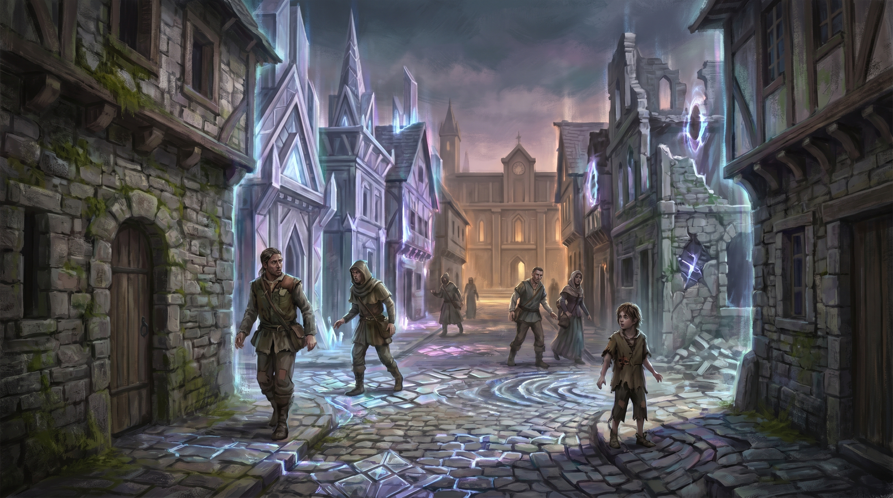
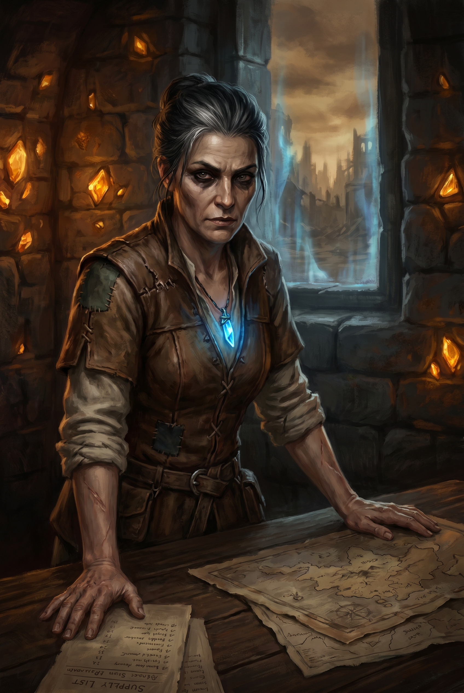
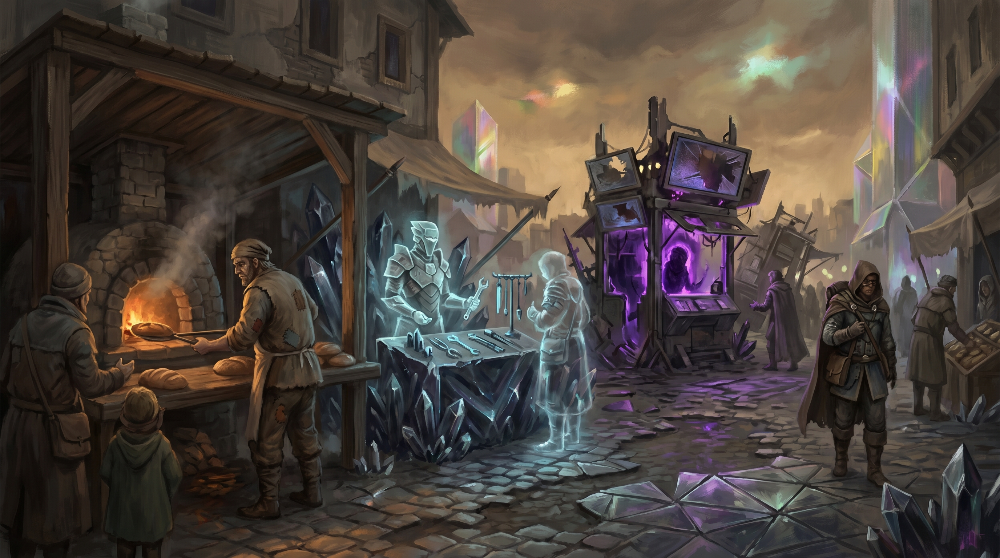
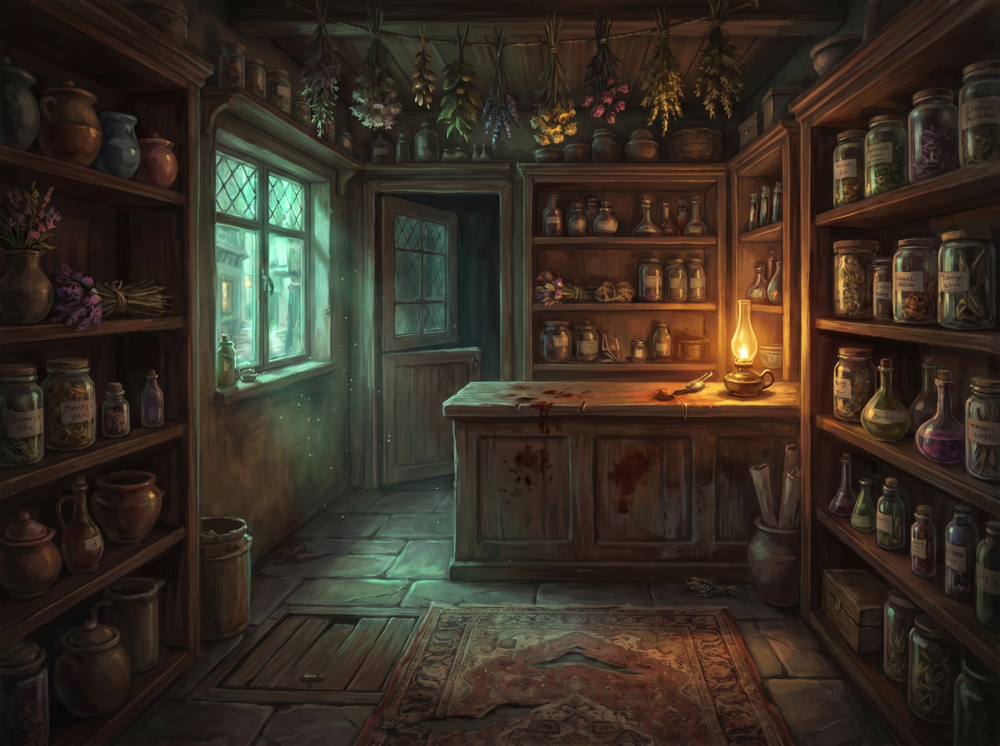

# Chapter 3: Loom

**Session(s):** 1 (Session 3)
**Level:** 5
**Expected Duration:** 3-4 hours
**Time:** Days 5-6 of the campaign

---

## Chapter Overview

**Synopsis:** The party arrives at [Loom](locations.md#loom), a city caught in temporal flux where streets phase between medieval hovels, gleaming Old Ones architecture, and crumbling ruins in the space of a breath. They navigate its unstable reality, earn the trust of [Elder Soraya](npcs.md#elder-soraya) — the settlement's pragmatic and secretive leader — and make contact with the remnants of the [Covenant of the Pylon](factions.md#the-covenant-of-the-pylon) through a nervous apothecary named Keeper Jorin. Through social encounters, exploration of the Phasing Market, and intelligence gathering, they learn the name of the [Threadcutter](npcs.md#sera-mourne-the-threadcutter), the existence of the Breaker Stations, and the location of the nearest one: Terminus. This is the breather between the wilderness of the Ashlands and the claustrophobic horror of the Breaker Station — a chapter built on conversation, atmosphere, and the slow accumulation of dread.

**Objectives:**
- **Primary:** Make contact with the Covenant of the Pylon and learn the location and defenses of Breaker Station Terminus
- **Secondary:** Earn Elder Soraya's trust and gather intelligence on the Unravelers and the Threadcutter
- **Optional:** Discover Soraya's secret deal with the Unravelers; find the Covenant dead drop in the Phasing Market

**Key NPCs:** [Elder Soraya](npcs.md#elder-soraya), Keeper Jorin (minor NPC, Covenant contact)
**Key Locations:** [Loom](locations.md#loom) — The Council Hall, The Phasing Market, Jorin's Apothecary

---

## Scene 1: Arrival at Loom

*Estimated time: 20-30 minutes*

### Introduction

> The city appears between one step and the next. Not all at once — in *layers*, like a painting that can't decide what it wants to be.
>
> First: stone walls, low and weathered, the color of old bone. A gatehouse with rusted hinges and moss climbing its flanks. A medieval settlement crouching against the wind. Then the air shivers, and for three heartbeats the walls are crystalline — soaring, impossibly thin, catching light from a sun that set two centuries ago. Architecture that hums. Streets paved in geometric patterns that shift like a living thing. The Old Ones' city, remembered by the earth itself.
>
> Then it flickers again. Ruins. Foundations and dust. A few shattered pillars reaching toward a sky the color of bruised fruit. Nothing alive. Nothing left.
>
> And then — stone walls again. The medieval version. The *present* version. As if reality took a breath and chose this one.
>
> You cross an invisible threshold and the phasing steadies. Not stops — *steadies*. The buildings still shimmer at their edges, ghosts of other times bleeding through like watermarks in old paper. But the ground holds. The people hold. A street stretches ahead, half-cobbled and half-crystal, lined with buildings that flicker between eras like candle flames in a draft.
>
> The air tastes of stone dust and temporal static — a faint metallic tang, like licking a copper coin. Somewhere, someone is cooking something with rosemary. A child's laughter cuts short as the cobblestones beneath their feet ripple like water, then solidify again. The child doesn't cry. They're used to it.
>
> The people of Loom move with the particular caution of those who have learned, through painful repetition, not to trust the ground beneath their feet. They walk the center of streets, avoiding walls that might phase. They reach for doorknobs slowly, confirming the door exists before turning the handle. They do not run.
>
> Ahead, near the center of the settlement, a building of stone and crystal radiates steady warmth — the one structure that doesn't shimmer, doesn't phase, doesn't breathe between versions of itself. The Council Hall. An anchor in a city made of maybes.

### DM Information

This scene establishes Loom's atmosphere and the unsettling wonder of temporal flux. Take your time. Let the players absorb the strangeness before moving them into social encounters. The goal is to make Loom feel like a place that is simultaneously beautiful, fragile, and deeply wrong.

**Population:** Approximately 800 in the "present" phase, though the phasing means different people and buildings appear and disappear. Most residents are human or half-human, with a scattering of dwarves, gnomes, and a few warforged remnants from the Old Ones era who phase in and out with no awareness of the passage of time.

**The Phasing:** Loom sits on a convergence point where a damaged Beam's influence has destabilized local time. Three temporal layers bleed together:
- **Past:** The Old Ones' city — crystalline, geometric, humming with dormant magitech. Beautiful but empty. Structures from this era phase in for seconds to minutes before fading.
- **Present:** The current settlement — medieval stone, practical construction, lived-in. This is the "real" Loom, anchored by Beam-shard fragments Elder Soraya has embedded in the Council Hall's foundation.
- **Future:** Ruins. Dust and broken foundations. A version of Loom where no one survived. This phase is rare — it flickers through for a heartbeat at most — but when it does, the temperature drops and the silence is absolute.

**Environmental Details (use liberally):**
- A building that's half-tavern, half-ruins — the back wall phases between eras, and the bartender has learned to serve drinks only from the front half
- Children playing in a square where the cobblestones occasionally ripple like water beneath their feet
- A dog barking at a shadow that belongs to a person from another time
- An old woman knitting on a bench that phases to crystalline for three seconds — she doesn't stop knitting, just shifts her weight when the seat changes texture
- A well that sometimes draws water and sometimes draws light — a faintly glowing liquid from the Old Ones' era that tastes of nothing and evaporates in minutes

**Temporal Disorientation:** When entering Loom for the first time, each PC makes a DC 12 Wisdom saving throw. On a failure, they experience a brief moment of temporal vertigo — a flash of the city as ruins, a phantom sound of crowds from centuries past, a feeling that they've been here before. No mechanical effect; this is purely narrative. Describe the sensation to each player who fails individually. It should feel personal and slightly unnerving.

**Possible Player Actions:**
1. **Investigate the phasing:** DC 14 Arcana reveals the temporal instability is connected to a damaged Beam. DC 16 Arcana identifies the Council Hall's stability as artificial — something is anchoring it.
2. **Talk to residents:** The people of Loom are wary but not hostile. They've seen outsiders before. Most will direct the party to the Council Hall — "If you're looking for answers, talk to Elder Soraya. If you're looking for trouble, keep walking."
3. **Examine the chrono-compass:** The compass reacts to Loom's temporal flux, its needle spinning erratically before settling to point toward the Council Hall. The compass's behavior confirms the Beam-shard anchor.
4. **Look for the Covenant:** DC 16 Investigation to find Jorin's Apothecary without a referral. The shop is deliberately inconspicuous — no sign, just a faded green door in a side street that smells of dried herbs.

### Connections
- **To Scene 2:** The party approaches the Council Hall or is directed there by residents

---

## Scene 2: The Council Hall

*Estimated time: 30-40 minutes*

### Introduction

> The Council Hall is the stillest place in Loom. You feel the difference the moment you step through the doors — the faint temporal static that hums in your teeth outside goes quiet here. The air is warm, dry, and smells of beeswax candles and old stone. The walls are thick — three feet of quarried granite reinforced with veins of crystal that pulse with a slow, steady light. Beam-shard fragments, set into the foundations like the bones of the building itself.
>
> The hall is modest. A long table of dark wood, scarred with use. Maps pinned to the walls — some hand-drawn, some phased-in replicas of Old Ones cartography, shimmering faintly at the edges. Shelves of supplies: grain, dried meat, medicine, carefully rationed. This is not a throne room. This is the headquarters of a siege.
>
> A woman stands at the far end of the table, studying a map with the intensity of someone reading a death sentence. Mid-fifties. Silver-streaked black hair pulled tight against her skull. Dark eyes that catalogue you in the time it takes to blink — what you're carrying, how you carry yourselves, whether you're going to be useful or another problem she has to manage. She wears practical clothes: leather jerkin over a linen shirt, boots that have seen miles. One piece of jewelry: a pendant on a thin chain, a shard of crystal that catches the light with the same slow pulse as the walls.
>
> She doesn't smile. She doesn't offer pleasantries.
>
> "You came from the Ashlands. On foot. Which means you're either desperate, foolish, or someone sent you." A pause. Those dark eyes settle on the chrono-compass if it's visible. "Or all three. Sit down. Tell me what you want — quickly. I have a city that's trying to become three cities at once, and my patience is rationed along with everything else."

### DM Information

This is the chapter's central social encounter. Soraya is the gatekeeper — she controls information, resources, and access to the Covenant. She is not an enemy, but she is not a friend until the party earns it. She's been keeping Loom alive through pragmatism and difficult choices, and she has no time for heroes who bring trouble without solutions.

**Roleplaying Elder Soraya:**
- **Speech pattern:** Direct. Economical. She cuts to the point and expects others to do the same. She does not ask rhetorical questions. She does not soften bad news. She speaks the way a surgeon works — precise, efficient, no wasted motion.
- **Body language:** Still. She doesn't fidget, doesn't pace. Her hands rest on the table when she's listening. When she's made a decision, she stands straighter — a fraction of an inch — and her voice drops half a register.
- **What she wants:** To know if the party is useful. She has no interest in their backstory unless it's relevant to Loom's survival.
- **What she needs:** Help. Desperately. She won't admit it, but Loom is running out of options and she knows it.
- **Her line she won't cross:** She will not sacrifice her people. Everything else is negotiable.

**Social Encounter — Earning Soraya's Trust:**

| Check | DC | Result |
|-------|:---:|--------|
| Persuasion (earn trust) | 14 | Soraya accepts they're genuine. Opens up about the Beams, the Threadcutter (name only), and the Breaker Stations (knows they exist, claims not to know specifics). Directs them to Jorin. |
| Persuasion (with Constant bond demonstrated or chrono-compass shown) | 12 | The Constant bond or the compass changes her calculation. These aren't ordinary travelers — they're Drawn. She provides everything above plus more detailed information about the Beams' deterioration in the region. |
| Insight (sense she's hiding something) | 16 | Something behind her composure. She's too calm for someone leading a settlement this fragile. She steers conversation away from certain topics — how Loom has avoided the worst Thinny incursions, where her pendant came from. |
| Insight (detect the deal during this conversation) | 18 | She touches the pendant when she mentions the Unravelers. Just once. Barely noticeable. But combined with her careful omissions, a pattern emerges: she knows more about the Unravelers than she's admitting, and the knowledge doesn't come from intelligence reports. It comes from conversation. |
| Intimidation (force information) | 16 | Soraya does not respond well to threats. Success gets the information but poisons the relationship. She'll cooperate but provide the minimum. She has guards and she has the only stable building in the city — she does not feel threatened by outsiders. |

**What Soraya Provides (if trusted):**
- The Beams are deteriorating faster. The phasing in Loom has worsened in the last six months. Two years ago, the future-ruins phase appeared once a week. Now it appears daily.
- Someone is deliberately accelerating the process. She's heard the name "Threadcutter" — a leader of a group called the Unravelers who believe the Beams should come down.
- She knows the Unravelers operate Breaker Stations — facilities that weaponize captive psychics against the Beams — but claims not to know specifics. (This is a lie. She knows the nearest one is called Terminus, but she won't volunteer this unless pressed or unless the party has already earned deep trust.)
- She directs them to "someone who knows more" — a half-elf apothecary named Jorin, down the side street with the green door. "Tell him I sent you. He'll know what that means."

**What Soraya Won't Say (without the Optional Scene):**
- That she's been receiving Unraveler messengers who promise Loom will be spared from Thinny incursions in exchange for non-interference
- That her pendant is a Beam shard gifted to her by the Unravelers as a gesture of "goodwill"
- That Loom's relative safety from Thinnies is not luck — it's the price she's paying

**Possible Player Actions:**
1. **Ask about the phasing:** Soraya explains the Beam-shard anchors but downplays her role. "I did what anyone would do. Found a way to stabilize the ground under our feet."
2. **Ask about the Covenant:** She knows they exist, knows Jorin is their local contact, but claims only passing familiarity. "I know he does more than sell poultices. I don't ask what."
3. **Offer to help Loom:** This is the fastest path to trust. Soraya's armor cracks slightly — not much, but enough. "If you mean that, talk to Jorin. He has information about a facility south of here. Shut it down, and you might slow the decay enough to matter."
4. **Press her on the pendant:** She deflects. "A keepsake. Nothing more." DC 18 Insight to read the lie in the way her fingers close around it.

### Connections
- **To Scene 3:** Soraya directs the party to the Phasing Market or Jorin's Apothecary (their choice of which to visit first)

---

## Scene 3: The Phasing Market

*Estimated time: 30-40 minutes*

### Introduction

> The Phasing Market is chaos made tangible. A wide plaza near the eastern edge of Loom where the temporal anchoring is weakest and the layering of eras is thickest. Stalls crowd the space — but not all of them belong to the same century.
>
> A present-day merchant selling dried fish and clay pots stands three feet from a translucent booth of crystalline shelving where an Old Ones vendor arranges vials of liquid starlight, humming to herself in a language that died two hundred years ago. She can't see the fish merchant. He can't see her. They exist side by side without touching, separated by centuries.
>
> Beyond them, the ruins-phase flickers in for a heartbeat — an empty plaza, nothing but dust and silence — and then it's gone, replaced by the bustle of three timelines sharing one market square.
>
> The smell is layered too: woodsmoke and roasting nuts from the present, ozone and something floral from the past, nothing at all from the future. The sounds bleed together — haggling in Common, the chime of crystalline instruments from an era that forgot what strings were, the hollow wind of the ruins singing through broken foundations for half a second before the present reasserts itself.
>
> A child tugs your sleeve. Present-day, small, missing a front tooth. "Don't buy from the shiny ones," she whispers. "Their money goes funny in your pocket. Turns to sand."

### DM Information

The Phasing Market is a spectacle and a shopping opportunity, but it also contains a Covenant dead drop with intelligence on Breaker Station Terminus. This scene balances wonder, commerce, and investigation.

**Temporal Disorientation:** Browsing the market requires a DC 12 Wisdom saving throw. On a failure, the PC experiences one minute of temporal confusion — they perceive all three time layers simultaneously, overlapping and contradicting. During this minute, they have disadvantage on ability checks. The disorientation is discomforting but not dangerous. Describe it vividly: they reach for a present-day apple and their hand passes through a crystalline sculpture that isn't there yet. They step backward and their heel crunches on rubble from the ruins-phase.

**Market Vendors:**

| Vendor | Era | Goods | Notes |
|--------|-----|-------|-------|
| Hask | Present | Dried goods, rope, torches, trail rations | Gruff, fair prices, gives directions |
| Mira | Present | Healing potions (50 gp each), herbalist kit, antitoxin | Knows Jorin, will mention his shop if asked about "unusual remedies" |
| The Crystal Woman | Past (Old Ones) | Magitech trinkets: a compass that points to the nearest door, a vial of light that never dims, a ring that hums near temporal fractures | Cannot be interacted with — she's a temporal echo. Her goods can be taken from the phased-in shelving (DC 14 Sleight of Hand to grab something before the phase shifts), but they have a 50% chance of fading to sand within 1d4 hours |
| The Ruins Vendor | Future | Nothing. An empty stall, half-collapsed. A scrap of paper pinned to the counter with a nail reads, in a hand that hasn't written yet: "SORRY — CLOSED FOREVER" | Deeply unsettling. No mechanical effect. |

**Shopping Opportunities (Present-Era):**
- Healing potions: 50 gp each (Mira has 4 in stock)
- Antitoxin: 50 gp
- Basic adventuring gear: standard PHB prices
- Trail rations (1 week): 5 gp
- A battered spyglass: 100 gp (functions normally)
- A journal written in an unknown script, found in the ruins-phase and sold by Hask: 25 gp. DC 16 History or DC 14 Intelligence (with Moth's help) to translate fragments — it's an Old Ones technician's maintenance log for a Breaker Station. Contains partial schematics. (If purchased, grants advantage on one Arcana check inside Breaker Station Terminus in Chapter 4.)

**The Covenant Dead Drop:**
Hidden within the market, tucked into a crack in the base of a stone fountain that phases between a working well (present) and a crystalline obelisk (past). The dead drop is a sealed leather scroll tube containing partial intelligence on Breaker Station Terminus: guard rotation schedules (outdated by two weeks but still useful), a rough exterior layout, and a note in Jorin's handwriting: "Three levels. Breaker Chamber is lowest. The psychics are the priority."

- **Finding it without a tip:** DC 14 Investigation while exploring the market. The fountain is a natural gathering point, and a DC 12 Perception notices scratches on the stone at the fountain's base — Covenant markings.
- **Finding it with Jorin's tip:** Jorin directs them to the fountain if they visit his shop first. No check required.

**Temporal Echo Encounter:**
While browsing, a phased-in merchant from the Old Ones' past era notices the chrono-compass. This is unusual — most temporal echoes don't interact with present-day people. But the compass resonates with the Old Ones' technology, creating a brief bridge between eras.

The merchant — an elderly dwarf in crystalline robes — turns, stares at the compass, and speaks. The words are in Old Common, thick with an accent that died with the language. DC 15 History to piece together the meaning:

*"The compass finds the breaks. The breaks find you. Do not trust the silence between the ticks."*

If the check fails, the party catches fragments — "compass," "finds," and a word that sounds like "danger" or "hunger." The dwarf fades back into the past-phase before they can respond.

**DM Note:** This foreshadows the chrono-compass's dual nature. It's a tool, but it's also a beacon — the Unravelers can detect its resonance. This will matter in Chapter 4 when the party approaches Breaker Station Terminus.

**Possible Player Actions:**
1. **Shop:** Browse the present-era merchants. Standard transactions.
2. **Grab from the past-phase:** DC 14 Sleight of Hand to snag an item from the Crystal Woman's shelves. 50% chance it fades to sand within 1d4 hours. Interesting gamble.
3. **Study the phasing:** DC 14 Arcana to understand the temporal mechanics. Conclusion: the phasing is worsening. The intervals between shifts are getting shorter. At the current rate, the market will become unusable within a few months.
4. **Search for the dead drop:** See above.
5. **Follow up on the temporal echo:** DC 18 Arcana to understand the resonance between the chrono-compass and the Old Ones' technology. Success reveals that the compass is an Old Ones device — it was built to locate Beam fractures, which means it was built to find *exactly* what the Breaker Stations cause.

### Connections
- **To Scene 4:** The party proceeds to Jorin's Apothecary (either directed by Soraya, by Mira the herbalist, or by their own investigation)

---

## Scene 4: Jorin's Apothecary

*Estimated time: 30-40 minutes*

### Introduction

> The side street smells of dried sage and something acrid — an alchemical process left to simmer too long. The green door is unmarked, paint peeling, hinges oiled to silence. When you push it open, a bell doesn't ring. Nothing announces your arrival. That's intentional.
>
> The shop inside is narrow and cluttered in the way that only an apothecary can manage — shelves floor to ceiling, jars of powdered roots and dried flowers, bundles of herbs hanging from hooks in the ceiling, a mortar and pestle abandoned mid-grind on the counter. The air is thick with competing scents: mint, sulfur, lavender, something that smells like burnt copper.
>
> Behind the counter, a thin half-elf looks up from a ledger. Forty-something, with the angular features of his elven heritage softened by human worry lines. His eyes are the kind of eyes that never quite settle — they flick to the door, to the window, to your hands, to the door again. A nervous habit worn into reflex.
>
> He speaks before you do. Rapid. Hushed. Barely above a whisper.
>
> "Soraya sent you? She sent you. Yes. I can see — you're them, aren't you. The Drawn. The ones the Constant pulled through. I've been waiting — we've been waiting. Close the door. *Please* close the door."

### DM Information

Jorin is the party's primary intelligence source for the Breaker Station infiltration. He's nervous, talkative, and desperate — the Covenant of the Pylon is a shadow of what it once was, and Jorin is essentially a one-man cell operating behind enemy lines. He's been maintaining the dead drop in the market for months with no one to read it.

**Roleplaying Keeper Jorin:**
- **Speech pattern:** Rapid whispers. He speaks in bursts, then pauses to listen. He answers questions before they're fully asked because he's already anticipated them. He checks over his shoulder even when his back is to a wall.
- **Body language:** Restless. His hands are never still — straightening jars, adjusting herbs, wiping the counter. When he's delivering critical information, his hands stop. That's how you know it matters.
- **What he wants:** Someone — anyone — capable of shutting down Breaker Station Terminus. The Covenant doesn't have the fighters.
- **What he fears:** That the party will fail and the Unravelers will trace them back to him. He's not a coward, but he's realistic about his odds.
- **His competence:** Don't let the nervousness fool the players. Jorin is a trained intelligence operative. His anxiety is a survival mechanism, not weakness. His information is precise, organized, and actionable.

**The Basement:**
Behind a shelf of dried mushrooms, a trapdoor leads to Jorin's real operation: a low-ceilinged basement lit by a single oil lamp, containing:
- A map table with a detailed approach route to Breaker Station Terminus
- Intelligence reports pinned to the walls (guard counts, patrol schedules, supply deliveries)
- A communication crystal — cracked, barely functional — that connects to other Covenant cells (Jorin hasn't received a signal in three weeks)
- A small cache of supplies (see Rewards below)

**What Jorin Provides:**

**On Breaker Station Terminus:**
- **Location:** Half a day's travel south through the Ashlands. Built into a collapsed mesa — the entrance is a reinforced tunnel mouth disguised as a natural cave.
- **Layout:** Three levels, descending. Level 1 is barracks and storage. Level 2 is the processing level — magitech systems, power conduits, the machinery that channels psychic energy. Level 3 is the Breaker Chamber — the captive psychics, strapped into magitech chairs, their minds weaponized against the Beam.
- **Defenses:** Unraveler soldiers — Jorin estimates 12-15, rotating in shifts of 4-5. At least one Channeler (an Unraveler mage) on each level. Magitech traps on the processing level — proximity-triggered energy discharges. The station commander is a hard case named Sergeant Dray — competent, loyal to the Threadcutter, not cruel but not merciful.
- **The Breakers:** Four captive psychics, all civilians taken from settlements across the region. They've been in the chairs for weeks to months. They're semiconscious, in pain, and their psychic energy is being siphoned continuously.

**On the Threadcutter:**
- Her real name is **Sera Mourne**. Former Covenant scholar — brilliant, passionate, one of the best minds in the organization.
- Five years ago, she accessed Old Ones records that the Covenant had been sitting on for decades. Whatever she found changed her. She left the Covenant, took followers, and founded the Unravelers.
- She believes the Beams are not sutures holding reality together but *chains* binding it in a fixed state — that the Old Ones built them not to save reality but to prevent it from evolving beyond their design.
- Jorin's voice when he talks about her: quiet, pained. "She wasn't wrong about everything. The Covenant had been hoarding knowledge, keeping secrets. She was right to be angry. But what she's doing to those people in the stations — that's not liberation. That's torture wearing a philosophy."

**On the Controlled Shutdown:**
- Jorin warns them: freeing the Breakers by simply disconnecting them from the chairs will cause a psychic energy surge. The sudden release of channeled power will destabilize the Beam further and could trigger a Thinny storm in the region.
- The Covenant's research suggests a controlled shutdown is possible — gradually reducing the psychic load, redirecting the energy through the station's own systems — but it requires someone with Arcana skill, time, and steady nerves. Even then, it's extremely difficult.
- "The Breakers are people. Whatever you decide about the station, remember that. Don't sacrifice them for the mission. Don't sacrifice the mission for them. Find the third way. That's what the Drawn are supposed to be for."

**Covenant Resources:**
Jorin provides what he can:
- 2 potions of healing
- A rope of climbing
- A Covenant signet ring (brass, set with a small crystal that glows faintly in the presence of Beam energy. Identifies the wearer to other Covenant members.)
- The dead drop intelligence (if the party hasn't already found it in the market)
- A rough map of the Breaker Station approach route (not the interior — Jorin's never been inside)

**Possible Player Actions:**
1. **Ask about the Covenant's strength:** Jorin is honest. The Covenant is fractured and undermanned. His cell is just him. The nearest active cell is weeks of travel away. He hasn't received communication in three weeks. "We were supposed to be the watchers. The ones who kept the Beams safe. We failed. Now we're just the ones who know they're failing."
2. **Ask why the Covenant doesn't act:** "With what? I'm an apothecary. My predecessor was a scholar. The Covenant was never a military organization. We recorded, we maintained, we watched. We weren't built for a war." He looks at them. "You were."
3. **Press for more on Sera Mourne:** Jorin knew her personally. They studied together. He admired her. He still does, in the part of himself he doesn't examine too closely. "She's not evil. She's wrong in the worst possible way — she's wrong about the method while being at least partly right about the cause."
4. **Ask about Elder Soraya:** Jorin hesitates. "She's a good leader. She's kept Loom alive longer than anyone thought possible." A pause. "I trust her. Mostly." DC 14 Insight: Jorin suspects something about Soraya but doesn't have proof. He's noticed that Loom seems suspiciously safe from Thinny incursions, but he's been too afraid — or too tactful — to investigate.

### Connections
- **To Optional Scene:** If the party has gathered enough suspicion about Soraya (high Insight rolls in Scene 2, or Jorin's hesitation here), they may choose to investigate
- **To Chapter Resolution:** If the party is satisfied with their intelligence, they prepare to depart for Breaker Station Terminus

---

## Optional Scene: Soraya's Secret

*Estimated time: 20-30 minutes*

### Introduction

This scene triggers if the party investigates Soraya's behavior. It can be prompted by high Insight checks in Scene 2, Jorin's hesitation, or the party's own initiative. It plays out as an investigation followed by a confrontation.

### DM Information

**Evidence Trail:**

The party can gather evidence through observation, investigation, and social checks. Each piece of evidence builds the case:

1. **The Messenger (Observation):** If the party watches the Council Hall at night (or asks around), DC 14 Perception or DC 12 Investigation through questioning residents: an Unraveler messenger has been seen entering the Council Hall after dark. Cloaked, quiet, arriving and departing within minutes. The guards at the door let them through without challenge.

2. **The Pendant (Arcana):** DC 14 Arcana when examining or recalling Soraya's pendant: it's a Beam shard, but it's been *attuned* — calibrated to resonate with the Council Hall's anchor stones. This isn't something Soraya could have done herself. Someone with deep knowledge of Beam mechanics — Old Ones-level knowledge — prepared this for her. The kind of knowledge the Unravelers have been hoarding.

3. **The Pattern (Investigation/History):** DC 15 Investigation or History: Loom has not suffered a major Thinny incursion in over a year. Every other settlement in the region has been hit multiple times. Loom's anchor stones help, but they shouldn't provide *this* much protection. Something else is diverting the storms.

4. **The Guard's Slip (Social):** DC 13 Persuasion with one of the Council Hall's guards, a young woman named Tallis who's been on night duty: "The Elder meets with all kinds of people. It's not my place to ask who." DC 16 Persuasion or DC 14 Deception to get more: "There was a man last week. Wore a gray cloak with that symbol — the one like a broken circle. I know what it means. I'm not stupid. But the Elder told me to let him through, so I let him through." The broken circle is the Unravelers' mark.

**The Confrontation:**

If the party presents evidence to Soraya, read or paraphrase:

> She listens. Her face doesn't change — not at first. She takes in the evidence with the same economical attention she gives everything. The messenger. The pendant. The pattern. The guard's account.
>
> Then something cracks. Not dramatically — Soraya is not a woman who breaks dramatically. It's small. A breath that catches. A hand that rises to the pendant and holds it, not as jewelry but as an anchor. Her eyes close for two seconds. When they open, the composure is still there, but the woman beneath it is visible for the first time.
>
> "You want to know if I sold my soul to keep my people alive. The answer is: not yet. But I've been negotiating the price."

**What Soraya Reveals:**
- Six months ago, an Unraveler emissary approached her. He offered a deal: Loom would be spared from Thinny incursions — the Unravelers have technology that can redirect the storms — in exchange for Loom's non-interference with Unraveler operations in the region.
- Soraya took the deal. She didn't have a choice — or she felt she didn't. Loom was being hit by Thinnies every week. People were dying. Children were dying. The Covenant had no answers. The Beams were failing regardless. She chose her people.
- The pendant was part of the deal — a Beam shard attuned to reinforce the Council Hall's anchoring. A gift. A bribe. She wears it every day and she hates it every day.
- She hasn't provided the Unravelers with anything except her silence. She hasn't betrayed the Covenant (she doesn't know enough to betray them meaningfully). She hasn't sabotaged anyone. She has simply... looked the other way.
- She knows it can't last. She knows the deal trades the world's future for her city's present. She's been waiting for someone to force her hand.

**If the party is sympathetic:** Soraya's relief is quiet but real. She provides additional resources:
- Access to the Council Hall's Beam-shard anchor for study (DC 14 Arcana to understand the anchoring mechanism — this knowledge provides advantage on Arcana checks related to Beam mechanics in future chapters)
- More detailed maps of the region south of Loom, including terrain features near Breaker Station Terminus
- A promise: if they stop the Threadcutter, Loom will support them however it can. "I owe a debt. Not to you — to everyone I turned away from while I was busy keeping my own people safe."

**If the party is hostile:** Soraya does not apologize. "I kept eight hundred people alive for six months. Show me the manual that explains how to do that without getting your hands dirty. Show me the chapter where it says 'let your people die so you can keep your principles.'" She cooperates — she has no choice — but the relationship is damaged. She provides the maps but not the anchor access, and her promise of future support is absent.

**If the party exposes her publicly:** This is an option, but it should have consequences. Loom's population is divided. Some understand her choice. Others feel betrayed. The settlement's fragile stability cracks. Soraya doesn't resist — she accepts whatever judgment comes — but the party should feel the weight of what they've done. There is no clean answer here. That's the point.

### Connections
- **To Chapter Resolution:** The party has all available intelligence and must decide when to depart

---

## Chapter Resolution

*Estimated time: 10-15 minutes*

### Departure

> Morning in Loom. Or what passes for morning — the light doesn't change, but the people do. They emerge from buildings that were solid when they went to sleep and are now half-phased, one wall showing crumbling ruins where last night there was plaster. They don't comment on it. They adjust.
>
> The Ashlands wait to the south. Half a day's travel to Breaker Station Terminus, through blighted scrubland and the skeletal remains of settlements that didn't have an Elder Soraya to keep them anchored. The chrono-compass points steadily south-southwest, its needle no longer spinning. It knows where you're going. It has always known.
>
> Jorin presses the last of his supplies into your hands at the green door. His eyes are bright with something between hope and terror. "The Breakers are on the lowest level. The station commander is competent but not brilliant. The traps on Level 2 are the real threat — the Old Ones built them and the Unravelers repurposed them. Be careful." He grips the doorframe. "Be *careful*. And come back. Someone needs to."

**If Soraya's deal was exposed:** She meets the party at the edge of Loom's stable zone. She doesn't say much. She hands them a folded map — the detailed one, with terrain features and water sources marked. "I'll have supplies ready when you return. *If* you return." A pause. "I hope you do. I'd like the chance to be better than the deal I made."

**If Soraya's deal remains hidden:** She watches them leave from the Council Hall steps. Her hand rests on the pendant. Her expression is complicated — relief that they're going, guilt that she isn't telling them everything, hope that they'll succeed and make her secret irrelevant. She raises one hand in farewell. It is the gesture of someone who knows she should say something and has chosen, again, not to.

**What the Party Should Have:**
- Intelligence on Breaker Station Terminus: location, general layout (three levels), known defenses, the Breaker Chamber on Level 3
- The name Sera Mourne / the Threadcutter, and her history as a former Covenant scholar
- Understanding of the Breaker mechanism and the risks of a sudden shutdown
- Covenant supplies: 2 potions of healing, rope of climbing, Covenant signet ring
- Optional: dead drop intelligence (guard rotations, exterior layout)
- Optional: Old Ones maintenance journal from the market (advantage on one Arcana check in the Breaker Station)
- Optional: Council Hall anchor knowledge (advantage on Beam mechanics checks)
- Optional: Soraya's detailed maps and promise of support

### Transition to Chapter 4

The journey south takes half a day. The landscape deteriorates — the phasing that makes Loom strange becomes the decay that makes the Ashlands hostile. Reality frays at the edges. The ground is dry and cracked, scattered with the remnants of settlements that lost their anchors. Somewhere ahead, beneath a collapsed mesa, the Breaker Station hums with stolen psychic energy.

The compass doesn't waver. It points to the break in the Beam. It points to the Breakers. It points to the choice the party hasn't made yet.

---

## DM Notes & Tips

### Running This Chapter

**Tone:** Atmospheric unease beneath surface calm. Loom is not a horror — it's a wonder that's slowly becoming a horror. The phasing should feel magical at first and deeply unsettling by the time the party leaves. The NPCs should feel like people living under siege conditions who have normalized the abnormal.

**Pacing:** This is the campaign's breather chapter. Let it breathe. Don't rush the social encounters. The players should feel the weight of information accumulating — each conversation adds a piece to the picture, and by the time they leave Loom, they should understand what they're walking into at the Breaker Station.

**The Social Spine:** This chapter lives or dies on NPC interaction. Soraya and Jorin are the pillars. Soraya is the moral complexity — a good person making terrible choices for understandable reasons. Jorin is the moral clarity — a frightened man who knows what's right and can't do it alone. Together, they frame the campaign's central tension: how far do you go to protect what you love?

### Session Pacing Guide

| Scene | Time | Energy Level | Key Moments |
|-------|------|-------------|-------------|
| Scene 1: Arrival | 20-30 min | Medium — atmospheric, exploratory | The phasing city; temporal disorientation; first impressions |
| Scene 2: Council Hall | 30-40 min | Medium/High — social tension | Earning Soraya's trust; first mention of Threadcutter and Breaker Stations |
| Scene 3: Phasing Market | 30-40 min | Medium — wonder, shopping, investigation | The temporal echo; the dead drop; the ruins-phase vendor |
| Scene 4: Jorin's Apothecary | 30-40 min | High — critical intelligence delivery | Breaker Station details; Sera Mourne's identity; the moral weight of the mission |
| Optional: Soraya's Secret | 20-30 min | High — emotional confrontation | The deal exposed; moral complexity; additional resources |
| Resolution | 10-15 min | Falling — departure, anticipation | Final supplies; last words; the road south |

### Common Player Approaches

**Investigation-Heavy Party:**
- They'll want to explore every corner of Loom, study the phasing, and interrogate everyone. Let them. Reward curiosity with the dead drop, the Old Ones journal, and the Soraya evidence trail. The more they investigate, the more prepared they'll be for the Breaker Station.

**Combat-Heavy Party:**
- This chapter has no combat encounters by design. If the party is restless, let them know through environmental cues that the danger is coming — the compass pointing south, Jorin's urgency, the ruins-phase flickering more frequently. The Breaker Station awaits.
- If you absolutely need a combat beat, a brief Thinny incursion at Loom's edge (2 Nothics phasing through a weakened section of the perimeter) can serve as a reminder that the world is dying while they shop.

**Social-Heavy Party:**
- This is their chapter. Let them talk to everyone. Encourage conversations between PCs about what they've learned. The campfire-equivalent here is a table at the half-phased tavern, drinking ale that occasionally turns to crystalline liquid for a second before becoming ale again. Let them process.

**Rushed Party:**
- If the party wants to skip Loom and head straight to the Breaker Station, let them — but make the cost clear. They arrive without intelligence, without supplies, and without the Covenant's support. Chapter 4 becomes significantly harder. Jorin and the dead drop intelligence can be backfilled through Wren if needed, but the party loses the advantage of preparation.

### If Things Go Wrong

**If the party antagonizes Soraya:**
- She's not petty, but she's not generous with people who waste her time. She'll provide the minimum — Jorin's name and location — and nothing more. The optional scene becomes nearly impossible to trigger because she won't let them close enough to find evidence.

**If the party can't find Jorin:**
- Soraya gives directions if trusted. Mira the herbalist mentions his shop if asked about unusual remedies. As a last resort, the dead drop in the market contains his name and shop location alongside the intelligence.

**If the party discovers Soraya's secret and reacts badly:**
- Soraya accepts judgment. She will not fight for her reputation. But Loom's stability depends on her leadership, and the party should feel the consequences if they destabilize it. Removing Soraya means no one is maintaining the Beam-shard anchors. Loom's phasing will worsen dramatically. This is a preview of the stakes they'll face in Chapter 5.

**If the party tries to confront the Unravelers in Loom:**
- There are no Unraveler agents permanently stationed in Loom. The messengers come and go — Soraya's deal is maintained through periodic contact, not a permanent presence. The party can't fight what isn't there. Direct them toward the Breaker Station instead.

**If Moth is with the party:**
- Moth reacts to Loom's phasing with fragments of recognition — the Old Ones' city was real, and Moth may have walked its streets. This manifests as brief, confused statements: "These halls were... maintenance corridors. Level 7. Subsection... I can't remember." Moth's fragmentary memories can supplement Jorin's intelligence, particularly regarding the Old Ones' technology in the Breaker Station.

### Foreshadowing

- **The ruins-phase:** Every glimpse of Loom-as-ruins foreshadows what happens if the Beams fall. This is the future if the party fails. Let the players sit with that.
- **The chrono-compass's dual nature:** The temporal echo's warning ("The compass finds the breaks. The breaks find *you*.") plants the seed that the compass may attract Unraveler attention. This pays off in Chapter 4's approach to the Breaker Station.
- **Sera Mourne's complexity:** Jorin's obvious conflict about Sera — the fact that he still respects her even as he opposes her — sets up the Threadcutter as a villain worth engaging with, not just defeating. This pays off in Chapter 7.
- **Soraya's deal as thematic mirror:** Soraya's pragmatic compromise mirrors the larger question of the campaign — how much are you willing to sacrifice to protect what you love? The party will face this question themselves at the Breaker Station, at Loom again during the Thinny Storm, and at the Eld Pylon.

---

## Quick Reference

### NPCs This Chapter

| Name | Location | Attitude | Key Info |
|------|----------|----------|----------|
| [Elder Soraya](npcs.md#elder-soraya) | Council Hall | Suspicious, pragmatic, guarded | Leader of Loom; has secret deal with Unravelers; provides initial intelligence and directions to Jorin |
| Keeper Jorin | Apothecary (side street, green door) | Nervous, relieved, desperate | Covenant contact; provides detailed Breaker Station intelligence, supplies, and Threadcutter identity |
| Hask | Phasing Market | Gruff, fair | Present-era merchant; sells basic goods and directions |
| Mira | Phasing Market | Friendly, helpful | Herbalist; sells healing potions; knows Jorin |
| Tallis | Council Hall (night guard) | Dutiful, conflicted | Can provide evidence of Unraveler messenger visits |

### Key DCs This Chapter

| Task | Ability | DC |
|------|---------|:---:|
| Resist temporal disorientation (entering Loom) | Wisdom save | 12 |
| Resist temporal disorientation (Phasing Market) | Wisdom save | 12 |
| Earn Soraya's trust | Persuasion | 14 |
| Earn Soraya's trust (with Constant bond / chrono-compass) | Persuasion | 12 |
| Sense Soraya is hiding something | Insight | 16 |
| Detect Soraya's deal (during conversation) | Insight | 18 |
| Find Jorin's Apothecary without referral | Investigation | 16 |
| Find Covenant dead drop (without tip) | Investigation | 14 |
| Understand temporal echo's warning | History | 15 |
| Grab item from past-phase vendor | Sleight of Hand | 14 |
| Translate Old Ones journal | History (or Int with Moth) | 16/14 |
| Identify pendant as Unraveler gift | Arcana | 14 |
| Identify Loom's Thinny immunity pattern | Investigation / History | 15 |
| Get Tallis to talk | Persuasion / Deception | 13-16 |

### Rewards This Chapter

| Item | Source | Notes |
|------|--------|-------|
| 2 potions of healing | Jorin | Standard potions (2d4+2 HP) |
| Rope of climbing | Jorin | DMG p.197 |
| Covenant signet ring | Jorin | Identifies wearer to Covenant members; glows near Beam energy |
| Breaker Station intelligence | Jorin / dead drop | Location, layout, defenses, guard rotations |
| Old Ones maintenance journal | Phasing Market (25 gp) | Advantage on one Arcana check in Breaker Station Terminus |
| Beam-shard anchor knowledge | Soraya (optional) | Advantage on Beam mechanics Arcana checks |
| Detailed regional maps | Soraya (optional, if deal exposed) | Terrain features and water sources south of Loom |
| Healing potions (up to 4) | Mira, Phasing Market | 50 gp each |

### Encounter Summary

| Scene | Type | Combat? | Key Challenge |
|-------|------|---------|--------------|
| Scene 1: Arrival | Exploration | No | Establishing atmosphere; temporal disorientation |
| Scene 2: Council Hall | Social | No | Earning Soraya's trust; navigating her suspicion |
| Scene 3: Phasing Market | Exploration / Social | No | Shopping; finding dead drop; temporal echo encounter |
| Scene 4: Jorin's Apothecary | Social | No | Intelligence gathering; moral weight of the mission |
| Optional: Soraya's Secret | Investigation / Social | No | Gathering evidence; confrontation; moral complexity |

---

*End of Chapter 3*
