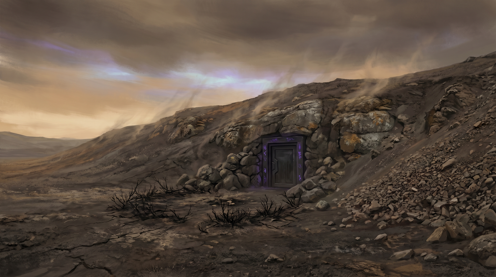
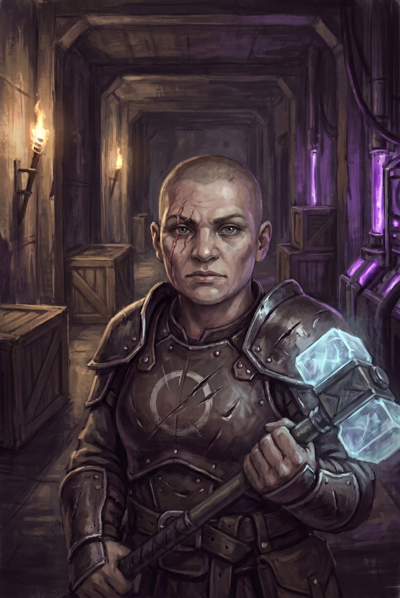
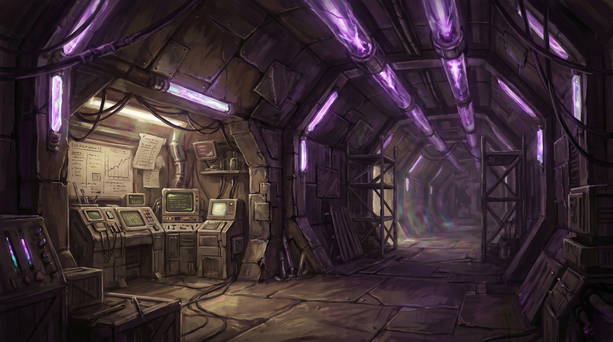

# Chapter 4: The Breaker Station

**Sessions:** 4--5 | **Level:** 5 | **Expected Duration:** 3-4 hours per session
**Themes:** Complicity and resistance, the machinery of cruelty, what freedom costs
**Dark Tower Parallel:** The Breakers of Algul Siento -- ordinary people enslaved and weaponized against the very fabric of reality

---

## Previously

The party has spent time in Loom, navigating its phasing streets and temporal instability. They made contact with the Covenant of the Pylon through Keeper Jorin, who revealed the existence of the Breaker Stations -- underground facilities where captive psychics are strapped into magitech chairs and their minds turned against the Beams. They gathered intelligence on the nearest station: Breaker Station Terminus, built into a hillside half a day's travel from Loom.

**What the Party Knows:** The Breaker Station is actively eroding the fifth Beam. It has a small garrison of Unraveler soldiers and at least one mage maintaining the magitech systems. Keeper Jorin warned against simply freeing the Breakers -- the stored psychic energy could discharge catastrophically. If the party discovered [Elder Soraya's](npcs.md#elder-soraya) secret deal with the Unravelers, they may carry additional suspicion about what they'll find.

**What the Party Doesn't Know:** One of the captive Breakers is different. Her name is Wren, and her psychic abilities dwarf the others. She can perceive the Beams directly, sense the Constant, and feel the party coming from miles away. She has been in the chair for weeks, and she is still fighting. The station's commander, Vekk, is not a fanatic -- she is a soldier who believes in a cause, and that distinction will matter when the party has to decide what to do with her.

**DM Note:** This chapter is the campaign's moral fulcrum. Everything before it has been building toward a question the party cannot avoid: *what are you willing to accept?* The Breaker Station is not a dungeon to be cleared -- it is a machine made of people, and every choice the party makes here carries weight forward through the rest of the campaign. Pacing should feel claustrophobic and urgent. The walls press in. The hum never stops.

---

## Scene 1: Approach and Infiltration

### Read-Aloud: The Hillside

> The terrain changes an hour out of Loom. The phasing stops -- reality here is solid, stable, as if something nearby is holding it in place by sheer force. The ground is bare grey earth, scrubbed clean of vegetation in a wide ring around a low, unremarkable hillside. No birds. No insects. The silence has weight.
>
> Your chrono-compass needle swings hard toward the hill and stays there, trembling. The Constant hums in your bones -- not the warm pull you've come to recognize, but something sharper. A vibration with teeth. Something ahead is resonating at a frequency that makes your fillings ache and your vision swim at the edges.
>
> The hillside looks natural. Weathered stone, sparse lichen, a scree slope on the eastern face. But there -- half-hidden behind a fall of loose rock -- a door. Reinforced metal, ancient alloy, set flush into the stone with the seamless precision of the Old Ones. Someone has scratched Unraveler sigils into the frame. Recent. The scratches are bright against the dark metal.
>
> The air tastes of copper and static. A low hum rises from the earth itself, felt more than heard, like standing too close to a lightning strike that hasn't happened yet.

### DM Information

**The Approach:** The station is built into a hillside in a region where the Beam's presence has scoured the landscape. The dead zone around the station extends roughly 200 feet in every direction -- no natural growth, no wildlife, an eerie stillness that perceptive characters will find deeply wrong.

**Guard Presence:** Two Unraveler soldiers patrol the exterior in a circuit that takes 15 minutes to complete. If the party has Covenant intelligence from Chapter 3, they know the patrol timing and routes (advantage on Stealth checks for the initial approach). Without intelligence, spotting the patrol requires DC 13 Perception from a distance of 100 feet or more.

**Three Entry Points:**

**1. The Main Entrance (Front Door)**
- Reinforced metal door, locked from inside. Two guards patrol the exterior.
- DC 15 group Stealth check to approach unseen during the gap in patrol rotation.
- DC 17 Thieves' Tools to pick the lock, or DC 20 Athletics to force (noisy -- alerts Level 1).
- If the party has Covenant intelligence: advantage on the Stealth check, and Keeper Jorin provided a signal knock pattern that the guards may respond to (DC 14 Deception to impersonate an expected supply runner).

**2. The Ventilation Shaft**

> Thirty feet up the hillside's western face, partially screened by a shelf of crumbling rock, a metal grate breathes warm air into the cold. The exhalation carries the smell of ozone and machine oil and something organic underneath -- sweat, unwashed bodies, the sour tang of captivity.

- DC 14 Perception to spot from the base of the hill (DC 10 if actively searching the hillside for alternative entrances).
- DC 12 Athletics to climb the scree slope to the grate. The grate is corroded -- DC 10 Athletics to pull it free (quiet) or a simple weapon strike (noisy, DC 13 Perception for anyone inside to hear).
- The shaft is tight: Medium creatures must squeeze (half speed, disadvantage on attack rolls and Dexterity saves while inside). Small creatures move normally.
- The shaft descends 20 feet and opens into the ceiling of the Processing Hall (Level 2), bypassing Level 1 entirely.

**3. The Collapsed Section**

> The ravine cuts deep into the hillside's eastern face, its walls raw earth and shattered stone. At its lowest point, where shadow pools thick enough to touch, a section of wall has given way -- revealing a jagged gap in the station's infrastructure. Old Ones alloy, fractured by centuries of geological pressure, opening into darkness. A draft carries the hum outward, and with it, the faintest sound: someone crying.

- DC 15 Investigation to find (requires exploring the ravine, which is not visible from the main approach -- the party must circle the hill).
- DC 13 Athletics to enter (the gap is tight and unstable; on a failure by 5 or more, loose stone falls, making noise audible on Level 2 -- DC 15 Perception for the Channeler to notice).
- Opens into a storage room on Level 2, adjacent to the Processing Hall.

### Possible Player Actions

- **Scout the exterior:** DC 13 Perception to spot the patrol. DC 15 to determine patrol timing without Covenant intelligence (10 minutes of observation required).
- **Use magic:** *Pass Without Trace* trivializes the approach Stealth checks. *Invisibility* works until the party interacts with the door or guards. *Knock* opens the main door but is audible (all of Level 1 hears it).
- **Create a distraction:** Drawing the patrol away from the entrance is creative and should be rewarded. DC 13 Deception or Performance to create a convincing disturbance. One guard investigates; the other stays at the door but is distracted (advantage on Stealth to approach).
- **Wait for a shift change:** If the party observes for 4 hours, they see a shift change where the door opens and two fresh guards replace the patrol. This provides a 30-second window where the door is open and attention is divided.

### Transition

The party enters the station. The hum grows louder with every step downward. The air grows warmer, thicker, charged with a static that makes hair stand on end and loose fabric cling. Whatever is happening below, they can feel it in their teeth.

---

## Scene 2: The Guard Barracks

### Read-Aloud: Level 1

> The corridor is functional and joyless. Old Ones architecture -- geometric, precise, walls of dark alloy that drink the light -- repurposed with rough-hewn furniture, supply crates stamped with Unraveler marks, and the accumulated grime of people living underground for too long. Torches in iron brackets throw uneven light. The hum from below vibrates through the floor, a constant bass note that settles behind your eyes.
>
> Ahead, an open doorway spills warm light and the sound of low conversation. The smell of overcooked beans and weapon oil. A barracks. Bedrolls on stone shelves, a rack of weapons by the door, a table where four soldiers sit playing cards with the desperate boredom of people posted somewhere they'd rather not be.
>
> At the head of the table, a dwarf woman with a shaved head and a scar that runs from her left temple to her jaw studies a map, ignoring the card game entirely. A warhammer with a faintly luminous head rests against her chair within easy reach. She looks up as you enter the corridor.
>
> Not surprised. *Prepared.* Her hand moves to the warhammer the way a hand moves to a cup of coffee -- casually, automatically, without thought.
>
> "Well," she says. Her voice is flat, clipped, the voice of someone who has given a lot of orders and doesn't waste words. "You're not the supply run."

### DM Information

**Level 1 Layout:** A straight corridor with four rooms branching off.
- **Guard Post** (first room on right): Empty during off-hours. Contains a desk, a logbook (see below), and a speaking tube that connects to Level 2.
- **Barracks** (second room on left, 30 ft x 20 ft): Where the soldiers eat, sleep, and wait. Four soldiers and Commander Vekk are here during default conditions.
- **Storage** (third room on right): Supplies, rations, spare parts for the magitech systems. **Vekk's private quarters** are sectioned off with a canvas partition at the back of this room -- a bedroll, a footlocker, and a small shrine to an unnamed god of purpose.
- **Mess Hall** (end of corridor): A table, a cookfire, a pot of something that stopped being identifiable days ago.

**The Logbook (Guard Post):** DC 12 Investigation to find if the party enters the guard post. Contains supply schedules, guard rotations, and a note in Vekk's hand: *"Channeler reports Subject 5 deteriorating. Increased sedation. Subject 3 (Wren) still resisting -- output remains highest despite noncompliance. Recommend increased restraint protocols."* This is the first written evidence of what's happening below.

**Vekk's Footlocker:** DC 14 Thieves' Tools to pick or DC 16 Athletics to force. Contains personal effects, 35 gp, a letter from Sera Mourne commending Vekk's service, and the **Beam-Shard Amulet** (see Rewards).

### NPCs Present

**Station Commander Vekk** (see [npcs.md#station-commander-vekk](npcs.md#station-commander-vekk))
- **Race/Gender:** Female dwarf, mid-40s
- **Appearance:** Shaved head, deep scar from left temple to jaw (old burn, healed rough). Stocky, muscular, economical in movement. Wears practical leather armor over chain, no decoration except a single Unraveler sigil pin at her collar. Her eyes are dark brown and miss nothing.
- **Personality:** Pragmatic to the bone. Not cruel -- she doesn't enjoy what the station does. But she believes in it. Sera Mourne showed her the mathematics: the Beams are artificial, the world is caged, and every day they persist is a day reality cannot heal. Vekk has made peace with the cost. She runs the station efficiently because efficiency means fewer people suffer longer than necessary. She would be horrified to be called a torturer. She thinks of herself as a surgeon.
- **Speech:** Short sentences. Declarative. Never asks questions she doesn't need answered. "You're here to shut us down. Expected this eventually. The Covenant sends their regards, I assume."
- **Combat:** Veteran (MM p.350) with the following modifications: +1 warhammer (1d8+4 bludgeoning), AC 17 (chain mail + shield), HP 65. She fights with disciplined precision -- shield work, controlled strikes, no wasted movement.
- **Morale:** Surrenders if reduced below 15 HP. She is a soldier, not a fanatic. She will not die for a facility that can be rebuilt. If the party has killed her soldiers, her surrender is cold and bitter. If the party subdued them nonlethally, a flicker of respect crosses her face.
- **Stat Block:** Veteran (MM p.350)

**Unraveler Soldiers (4)**
- Veterans (MM p.350), standard stats.
- Mixed races and genders. They are soldiers, not zealots. They volunteered for the Unravelers because the world is ending and Sera Mourne offered a plan. They follow Vekk's orders without question.
- **Morale:** If Vekk surrenders or falls, the remaining soldiers surrender within 1 round. Without her, they have no leadership and no desire to die in a hole.

### Encounter: Combat or Stealth

**If the Party Uses Stealth (bypassing Level 1):**
- DC 15 group Stealth check to move through the corridor without alerting the barracks. The corridor is 5 feet wide -- single file.
- **Success:** The party passes the barracks undetected. The soldiers continue their card game. Vekk continues studying her map.
- **Failure:** Two soldiers come to investigate. They are cautious, not hostile -- they assume it might be rats or a malfunctioning system. If they spot the party, they shout for Vekk, and combat begins in the corridor (confined space, 5-foot width, one doorway -- chokepoint favors whoever holds it).

**If the Party Attacks Directly:**
- Initiative. All four soldiers and Vekk respond within 2 rounds (Round 1: the soldiers nearest the door engage; Round 2: Vekk and remaining soldiers join).
- Vekk's first action is to shout into the speaking tube: "Breach on Level 1! Channeler, lock down the lower levels!" The Channeler on Level 2 hears this and begins preparing (see Scene 3).
- **Terrain:** The barracks has two overturnable tables (half cover), a weapon rack (improvised weapons), and a narrow doorway (one Medium creature can pass through at a time). If the party is fighting from the corridor, the doorway is a lethal chokepoint.
- **Tactics:** Vekk commands the soldiers to hold the doorway while she flanks through the mess hall corridor (she knows the layout, the party doesn't). She attempts to reach the speaking tube in the guard post if she hasn't already. The soldiers fight in pairs, using the Shield Wall trait (advantage on Dexterity saves when adjacent to an ally).

**If Vekk Is Captured or Interrogated:**

Vekk cooperates -- up to a point. She provides information freely about the station's layout and the Breaker Chamber, because she believes in the Unraveler cause and wants the party to understand what they're interfering with.

> "You want to know what's down there? Fine. Five people in chairs. Their minds generate psychic energy. The machinery channels that energy into a counter-resonance that disrupts the Beam's frequency. Slowly. Precisely. Like cutting a wire one strand at a time."
>
> She meets your eyes without flinching.
>
> "I won't pretend it's kind. It isn't. But the Beams aren't kind either. They're chains on a world that should have healed two centuries ago. Every day those chains hold, reality decays a little more. The Thinnies, the phasing, Loom coming apart at the seams -- that's the Beams failing and taking everything with them. We're not destroying the world. We're cutting the stitches so the wound can finally close."

- She warns against freeing the Breakers without a controlled shutdown: "Pull them out of the chairs and every volt of stored energy releases at once. You'll create a Thinny right here. Probably kill everyone in the station, including the people you're trying to save."
- She will not reveal Sera Mourne's current location voluntarily -- but the letters on the Channeler's desk (Scene 3) provide this information regardless.
- If asked about Wren specifically: "Subject 3. Strongest output we've ever recorded. She fights the system every waking moment. Exhausting. For her and for us." A pause. Something that might be guilt crosses her face. "She's young. I'm aware of that."

### Possible Player Actions

- **Negotiate passage:** DC 16 Persuasion. Vekk is willing to let the party see the Breaker Chamber if she believes they'll understand and leave the system intact. She is wrong about this, but she'll offer the tour. This bypasses combat on Level 1 entirely but means Vekk and her soldiers are free and armed behind the party.
- **Use the speaking tube:** If the party captures the guard post, they can use the speaking tube to communicate with (or deceive) the Channeler on Level 2. DC 15 Deception to impersonate Vekk's voice convincingly.
- **Search Vekk's quarters:** The Beam-Shard Amulet is in her footlocker. DC 14 Thieves' Tools or DC 16 Athletics to open. If Vekk is conscious and sees this, she doesn't object -- "Take it. It's a piece of what you're protecting. Maybe it'll help you understand what you're protecting."

### Transition

The stairs descend. The hum grows louder, transitioning from background noise to a physical presence -- a pressure in the chest, a buzz in the skull. The walls are warmer here. Condensation beads on the dark metal. And beneath the mechanical drone, something else: voices. Faint, fragmented, bleeding through the walls like whispers from a room you can't find.

---

## Scene 3: The Processing Hall

### Read-Aloud: Level 2

> The stairwell opens into a cathedral of pain.
>
> The Processing Hall is vast -- fifty feet across, thirty deep, its ceiling lost in a web of crystalline conduits that pulse with sickly violet light. The conduits run from the floor below, up through the ceiling above, and outward through the walls in every direction like the roots of some luminous, poisonous tree. They are warm to the touch -- almost hot -- and they hum with a frequency that crawls beneath your skin and settles in your molars.
>
> The machinery is Old Ones work, repurposed. Geometric housings of dark alloy cradle crystal arrays that split and redirect energy streams. Copper-bright cables -- newer, cruder, Unraveler additions -- splice into the ancient systems with the inelegance of a field repair. At the room's center, a massive antenna array rises like a metal spine, its tip lost in the conduit web above. This is what broadcasts the interference. This is the weapon.
>
> And the whispers. You can hear them now -- not with your ears, but somewhere behind your ears, in the place where sound becomes thought. Fragments. Pleading. A woman's voice repeating a name you can't quite catch. A man's voice counting backward from a number that doesn't exist. Someone humming a lullaby, the melody fraying at the edges, coming apart like wet paper.
>
> The psychics' thoughts, bleeding through the conduits. Their minds, leaking through the machinery that eats them.
>
> One voice is singing. The song has no words. It is beautiful and it is the worst thing you have ever heard.

### DM Information

**Environmental Effect:** The Processing Hall's resonance frequency is oppressive. Any creature that enters must make a DC 12 Constitution saving throw or suffer disadvantage on Concentration checks while in this room. The save can be repeated at the start of each turn. The Beam-Shard Amulet grants advantage on this save.

**The Channeler:** An Unraveler mage who maintains the magitech systems. They are here when the party arrives, monitoring a bank of crystal displays and making minute adjustments to the energy flow.

**Unraveler Channeler**
- **Race/Gender:** Human man, middle-aged, gaunt, dark circles under the eyes
- **Appearance:** Robes that were once fine, now stained with conduit fluid and sweat. Ink-stained fingers. The expression of someone who has been doing precise, terrible work for too long and has stopped seeing the terrible part.
- **Personality:** Academic. Detached. He refers to the Breakers as "subjects" and their suffering as "output variance." He is not a soldier -- he is an engineer, and he has engineered himself past empathy.
- **Stat Block:** Mage (MM p.347). Prepared spells should emphasize control: *Shield*, *Counterspell*, *Hold Person*, *Misty Step*. He fights defensively and attempts to flee to Level 3 if overwhelmed.
- **Morale:** He does not surrender. If he cannot flee, he attempts to trigger a partial system overload as a last resort (see below).

**If Combat Occurs:**
- The Channeler uses the conduit network to his advantage: as a bonus action, he can cause a conduit junction within 30 feet to discharge, forcing one creature within 5 feet of the junction to make a DC 13 Dexterity save or take 2d6 force damage.
- The conduits provide half cover if a creature positions itself behind a major junction.
- If the Channeler was warned by Vekk (via speaking tube), he has cast *Mage Armor* and positioned himself near the stairwell to Level 3, ready to retreat.
- **Partial System Overload:** If reduced below 10 HP and unable to flee, the Channeler attempts to trigger a conduit overload. This requires his action and takes effect at the start of his next turn: all creatures in the Processing Hall must make a DC 14 Dexterity save, taking 3d6 force damage on a failure, half on a success. The overload also damages the machinery, imposing disadvantage on the DC 18 Arcana check for controlled shutdown in Scene 4.

**If Stealth or Surprise:**
- DC 14 Stealth to approach the Channeler undetected (he is absorbed in his work). On success, the party can surprise him. On failure, he sees them at 30 feet and acts immediately -- *Misty Step* to the Level 3 stairwell and shouts a warning.

### Understanding the System

**DC 16 Arcana (examining the machinery):** The character understands the mechanism. The chairs on Level 3 channel psychic energy through the conduit network to the antenna array, which broadcasts destructive interference at the Beam's specific resonance frequency. The process is slow -- like erosion rather than demolition -- but relentless. At current output, the fifth Beam will fail completely within six months.

**DC 18 Arcana (understanding disruption consequences):** A sudden disconnection of the Breakers from the system will cause all stored energy in the conduit network to release simultaneously. This creates a localized Thinny effect within the station and potentially triggers a larger Thinny storm in the surrounding region. The energy release is equivalent to weeks of compressed psychic output detonating in seconds.

**If Moth is present and can interface with the Old Ones systems:** Moth confirms the Arcana findings and adds context. The original system was not designed for this purpose -- the Old Ones built the conduit infrastructure as part of the Pylon's support network. The Unravelers repurposed it, crudely but effectively. Moth's tone (if Moth has one) carries something like disgust.

### The Channeler's Desk

Whether the Channeler is defeated, captured, or absent (if the party enters via the ventilation shaft and he hasn't noticed them yet), his desk contains critical intelligence.

**Letters from Sera Mourne:**

> *Commander Vekk --*
>
> *The work at Terminus continues to exceed projections. Subject 3's output alone accounts for forty percent of the station's total interference. I regret the necessity of increased restraint protocols, but the data is clear: her resistance, paradoxically, amplifies her output. The system feeds on the struggle.*
>
> *The Covenant's network in Loom is more active than our scouts reported. Expect interference. If the station is compromised, prioritize the antenna array data -- the subjects are replaceable, the calibration data is not.*
>
> *I write to you from the road. I am making for the Eld Pylon of Keth directly. The Breaker method is effective but slow. At the Pylon, I can sever the Beam at its root. The calibration data from Terminus will allow me to tune the Resonance Key to the fifth Beam's frequency. I expect to arrive within eight days.*
>
> *The cage comes down, Commander. All of them. Every last bar.*
>
> *For the Unwoven World,*
> *Sera Mourne*

**DM Note:** This letter accomplishes three things at once: it identifies the Threadcutter as Sera Mourne (a name the Covenant will recognize -- Keeper Jorin will confirm she was a brilliant scholar who disappeared from the Covenant three years ago); it reveals her destination (the Eld Pylon of Keth); and it establishes her timeline (eight days from the date of the letter, which Vekk's logbook confirms was written six days ago -- leaving two days). It also reveals something about Sera's character: she regrets the necessity. She is not indifferent to suffering. She has simply decided the suffering is justified.

**A Map:** Pinned to the wall above the desk. A regional map showing the location of the Eld Pylon of Keth, circled in red ink, with a date written beside it: eight days from the letter's date. The route is marked. Travel time annotations suggest a day and a half on foot from Loom.

### Possible Player Actions

- **Sabotage the antenna array:** DC 16 Arcana or Tinker's Tools to disable the broadcast system without triggering a surge. On success, the Beam's erosion stops immediately, but the Breakers remain connected and in pain. This is a partial solution that buys time but doesn't resolve the moral question.
- **Study the conduit network for controlled shutdown information:** DC 16 Investigation to find the Channeler's technical notes, which provide advantage on the DC 18 Arcana check for controlled shutdown in Scene 4.
- **Attempt to communicate with the Breakers through the conduits:** DC 15 Arcana. On success, the character hears the psychics' thoughts more clearly. Most are fragmentary, confused, lost. But one mind pushes back -- clear, focused, aware. It says: *"You're here. I felt you coming. Please. Hurry."* This is Wren.
- **Take the Channeler's notes and Sera's letters:** No check required. These are critical intelligence items.

### Transition

The stairs to Level 3 descend into cold air and the smell of ozone and unwashed bodies. The hum is different here -- lower, slower, almost rhythmic. Like a heartbeat. Like eight heartbeats, out of sync, struggling.

---

## Scene 4: The Breaker Chamber

### Read-Aloud: Level 3

> The Breaker Chamber is a circle of suffering.
>
> Eight chairs arranged around a central crystal node, each one a nightmare of form meeting function. The chairs are Old Ones work -- elegant geometric frames of dark alloy -- fitted with Unraveler additions: leather restraints at wrists, ankles, and forehead, crude copper contacts pressed against temples, crystalline tendrils that extend from the chair's headrest and burrow into the base of each occupant's skull. The tendrils pulse with that sickly violet light, rhythmic, hungry.
>
> Five of the chairs are occupied.
>
> The occupants are human, or were. Emaciated, pale, their skin carrying the grey translucence of people who haven't seen sunlight in weeks. Their heads are shaved. Their eyes are open but unseeing -- rolled back, showing whites, twitching with the rapid movement of minds trapped somewhere between consciousness and void. Their mouths move silently. One drools. One weeps without sound. One's hands open and close, open and close, grasping at something that isn't there.
>
> The room is cold. The air smells of ozone, stale sweat, and the sharp ammonia tang of bodies that have been sitting in the same chairs for too long. Condensation runs down the walls in slow tears.
>
> The central crystal node -- a jagged formation of pale quartz the size of a horse, shot through with violet veins of energy -- pulses in time with the tendrils. It is the heart of the machine. It takes what the chairs harvest and feeds it upward, through the conduits, to the antenna. Destroying it would stop everything. Destroying it would also release everything.
>
> And then one of them looks at you.
>
> Not the blank, rolling gaze of the others. A direct look. Focused. *Present.* Grey eyes, luminous, enormous in a face carved down to bone. A young woman -- late teens, maybe early twenties, impossible to tell under the damage. Gaunt. Shaved head. Dark circles so deep they look like bruises. The crystalline tendrils at her temples pulse faster when she focuses on you, as if the machine is punishing her for paying attention to something other than the Beam.
>
> Her lips move. Her voice is a thread, barely audible above the hum.
>
> "The Drawn... ones. I felt you... coming. Like a..." She pauses. Swallows. The effort of speaking is visible -- every word is pulled from a body running on nothing. "...like warmth. In a cold... room."
>
> Her grey eyes track across your group, and you feel something brush against the edges of your mind -- not invasive, not hostile, but *present*. An awareness. She is looking at you with more than her eyes.
>
> "My name is... Wren."

### DM Information

**The Chamber:** 40 feet in diameter, circular, carved from bedrock and reinforced with Old Ones alloy. The eight chairs are evenly spaced around the central node, connected to it by conduit cables that run along the floor like exposed veins. The only entrance is the stairwell from Level 2. The ceiling is low -- 8 feet -- and the violet light from the conduits casts harsh, shifting shadows. The room feels like the inside of a machine. Because it is.

**The Breakers:**

| Chair | Occupant | Condition | Notes |
|-------|----------|-----------|-------|
| 1 | Human male, 40s | Catatonic | No response to stimuli. Mind is gone. |
| 2 | Human female, 30s | Semiconscious | Weeps silently. Responds to touch (flinches). |
| 3 | **Wren** | Lucid | Aware, communicative, fighting the system actively. |
| 4 | Half-elf male, 50s | Catatonic | Hands clench and unclench rhythmically. |
| 5 | Human female, 20s | Semiconscious | Mouths words -- prayers, maybe, or a name repeated endlessly. |
| 6-8 | Empty | -- | Show signs of recent use. Dried blood on the contacts. |

**Three chairs are empty.** The previous occupants died. Vekk's logbook (if found) records the deaths clinically: "Subject 1 expired, cardiac arrest. Subject 6 expired, cerebral hemorrhage. Subject 8 expired, cause undetermined -- simply stopped." The dead were removed and buried in unmarked graves outside the station. The empty chairs are a silent testament to the cost.

### NPC: Wren

**[Wren](npcs.md#wren)**
- **Race/Gender:** Human female, late teens or early twenties
- **Appearance:** Gaunt to the point of skeletal. Shaved head (the tendrils require direct scalp contact). Skin the color of old paper. Dark circles beneath luminous grey eyes that seem too large for her face. The crystalline tendrils at her temples have left raw, inflamed marks where they interface with her skin. Her hands, resting on the chair's arms, are thin enough to see the tendons move. She wears a shapeless grey shift, stained and worn.
- **Personality:** Wren is still *here* -- present, aware, fighting -- and that is both her strength and her tragedy. She knows exactly what is happening to her. She knows what the machine does, how it works, what it costs. She knows the consequences of her own release. She has had weeks to contemplate all of it, strapped into a chair, unable to move, while her mind is slowly eaten.
- **Speech:** Halting. Words come in clusters, separated by pauses where she gathers the strength to continue. She drifts between lucidity and a trance-like state where her eyes go distant and her voice takes on a resonant quality -- these are moments when the machine pulls her back toward the Beam, and she has to fight free. Sometimes she finishes others' sentences before they speak them. Not to be impressive -- she simply can't always tell the difference between what someone has said and what they're about to say.
- **Psychic Abilities:** Wren's powers are immense. She can perceive the Beams directly -- she describes them as "lines of light that hold the sky together." She can sense the Constant binding the party and recognizes them as Drawn. She projects emotions involuntarily -- characters within 10 feet may feel flashes of her fear, her exhaustion, her desperate hope. This is not a magical effect that can be resisted. It is simply being near someone whose inner life is broadcasting on a frequency the Constant allows the party to receive.
- **What She Knows:**
  - The machine's function and the consequences of disruption (she has overheard the Channeler discussing it).
  - The names and fates of the other Breakers. She has been aware of them, psychically, for weeks. She felt the three who died. "They just... went quiet. Like a candle. One moment they were there. Then they... weren't."
  - The Beam is weakening. She can feel it fraying. "It sounds like a string about to snap. The note gets higher and higher and thinner and thinner and then..."
  - Something is coming from the west. A storm. A Thinny storm. She can feel it gathering, drawn by the disruption the station is causing.
- **What She Wants:** Freedom. She knows the cost. She has calculated the odds. She has spent weeks doing nothing but calculating the odds. And she has decided: "I would rather die free than live as... *this*."

### The Conversation with Wren

This is the chapter's dramatic core. Give it room. Let the players talk to Wren. Let them ask questions. Let them sit with the horror of what they're seeing.

**Key Dialogue Moments:**

If asked how she got here:
> "They took me from... the road. I was traveling. Alone." A pause. Her eyes go distant. "I've always been... different. I hear things other people don't. The world has... a sound. A hum. I thought I was..." A thin, bitter smile. "I thought I was broken. Turns out I was just... tuned to the right frequency. The Unravelers knew what I was before I did."

If asked about the other Breakers:
> "Tam." She looks at Chair 1. "He was a farmer. He doesn't... he's not in there anymore. His body is alive but his mind..." She closes her eyes. "Lira." Chair 2. "She was a healer. She still prays. I can hear the prayers. They don't go anywhere."
>
> She looks at the empty chairs. Three of them. Her jaw tightens.
>
> "I felt them go. Each one. Like a door closing. Gently, gently, and then... nothing. The machine didn't even slow down. It just... redistributed the load."

If asked about the consequences of freeing her:
> "The conduits are full. Weeks of stored energy. If you pull us out... all of it releases. At once." She is clinical about this, in the way of someone who has had nothing to do but think about it. "The Channeler said it would be like... a bomb. A psychic bomb. It would tear a hole. A Thinny. Right here."
>
> She meets your eyes. Steady. Clear. The most present she has been since you entered.
>
> "I know the math. I know what it costs. And I am telling you -- I would rather burn in that fire than spend one more hour in this chair. But that's..." She falters. "...that's my choice to make. Not yours. Not about me. The others can't choose. Tam and Lira and Jin -- they can't tell you what they want. So you have to decide for them."

If asked what she thinks they should do:
> A long pause. Her grey eyes are ancient.
>
> "I think... you should do what you can live with. After. When you're lying in the dark and the quiet comes, and you have to look at the ceiling and think about what you did today... choose the thing you can live with."
>
> Another pause. Softer.
>
> "But please. Whatever you choose. Be quick about it."

### The Decision

**This is the chapter's centerpiece. Present all three options clearly, without judgment. Each has costs. None is clean.**

**Option 1: Free the Breakers**

Pull them from the chairs or destroy the central crystal node. The crystalline tendrils disengage automatically if the node is destroyed -- a safety mechanism the Old Ones built that the Unravelers couldn't (or didn't) override.

**Mechanical Consequences:**
- Energy surge. Every creature in the Breaker Chamber must make a DC 14 Dexterity saving throw, taking 3d6 force damage on a failure, half on a success.
- A Thinny begins forming at the center of the chamber -- a shimmering wound in reality, edges screaming with a sound that isn't sound. It expands 5 feet per round.
- The station becomes unstable. The party has 5 rounds to exit before the ceiling begins collapsing (see Scene 5).
- The surge accelerates the Thinny storm heading toward Loom, increasing urgency in Chapter 5. If the party freed the Breakers, the storm arrives a full day earlier than expected.

**Narrative Consequences:**
- The Breakers are free. Wren is free. The two semiconscious Breakers (Lira and Jin) collapse and must be carried. The two catatonic Breakers (Tam and the half-elf) are beyond help -- they can walk if led, but their minds are gone.
- Wren is weak but upright. She leans on whoever is nearest. Her first breath as a free person is a ragged, shaking gasp, and the emotion she projects is so overwhelming that every member of the party feels it: relief and grief and fury and gratitude, all at once, all tangled together, too large for language.
- The Thinny forming behind them as they flee is a visible consequence of the choice -- a wound they opened by doing the right thing.

**Option 2: Leave the Breakers**

Walk away. Leave the system intact. The Beam continues to degrade, but there is no surge, no Thinny, no immediate danger.

**Mechanical Consequences:**
- No surge. No damage. No Thinny acceleration.
- The Beam erosion continues. Without the station's disruption, the fifth Beam will fail in approximately six months. With it, three to four months.

**Narrative Consequences:**
- This is the hardest choice to make and the hardest to live with.
- Wren watches the party leave. She does not cry. She does not beg -- she already begged, and she will not beg twice. She simply watches, with those enormous grey eyes, and the emotion she projects is not accusation. It is understanding. She *understands*. And that understanding is worse than any accusation could be.
- If the party returns to the station later (after completing other objectives), the Breakers are gone. The Unravelers, warned by the intrusion, have moved them to another facility. The chairs are empty. The room smells of disinfectant and guilt.
- The party carries this choice. It should echo. In quiet moments, in camp, in the dark -- they chose to leave people in torment because the alternative was worse. Was it? They'll have time to wonder.

**Option 3: Controlled Shutdown**

Attempt to disconnect the Breakers safely by performing a gradual power-down of the conduit network, bleeding off stored energy in controlled increments before disengaging the tendrils.

**Mechanical Requirements:**
- DC 18 Arcana check. This can be attempted by any character with proficiency in Arcana.
- **Advantage** if Moth is present and assists (Moth can interface with the Old Ones systems to manage the power bleed).
- **Advantage** if the party found the Channeler's technical notes on Level 2 (DC 16 Investigation).
- If both conditions are met, the character rolls with advantage and the Channeler's notes provide a +2 bonus (effectively reducing the DC to 16 with advantage).
- The process takes 10 minutes of uninterrupted work. If combat occurs during the shutdown, the character performing the check must maintain concentration (Constitution save, DC 10 or half the damage taken, whichever is higher, to avoid interruption -- a failed save means the process must restart).

**On Success:**
- The Breakers are safely disconnected over 10 minutes. The tendrils retract. The conduits dim. The hum fades, slowly, like a held note finally released.
- No surge. No Thinny. The stored energy is bled off harmlessly into the earth.
- The Breakers collapse, unconscious but alive and free. Wren remains conscious, barely. She looks at the darkened node, at the silent conduits, at her own unshackled wrists, and she says nothing for a very long time. Then: "Thank you. That's... insufficient. But thank you."

**On Success by 5 or More (total roll of 23+):**
- As above, but the system provides a final data burst as it powers down -- a recording from the Old Ones, embedded in the node's memory, activated by the shutdown sequence. A voice, ancient and resonant, speaking in a language that Moth can translate: a fragment of the Old Ones' purpose for the Beams. This recording provides advantage on Persuasion checks when confronting the Threadcutter in Chapter 7 -- it proves the Beams were designed as a transitional system, not a permanent cage, which undermines Sera Mourne's core argument.

**On Failure:**
- The surge happens -- but the partial shutdown provides more warning and less force. Each creature in the Breaker Chamber takes 2d6 force damage (DC 14 Dexterity save for half) instead of 3d6. The Thinny still forms, but the party has 8 rounds to exit instead of 5.
- The Breakers are freed by the surge (the tendrils disengage as the system overloads) but are in worse condition -- each unconscious Breaker takes an additional 1d6 force damage from the uncontrolled disconnection.

### Regardless of Choice: The Threadcutter's Identity

Whether the party frees the Breakers, leaves them, or performs a controlled shutdown, they learn the critical intelligence this chapter delivers. The information comes from one of three sources:

- **Sera Mourne's letters** on the Channeler's desk (Scene 3) -- if the party found them.
- **Wren** -- if she is freed or spoken to at length. She has overheard Vekk and the Channeler discussing "Sera" and "the Pylon" and can piece together the plan.
- **The station's systems** -- if a character with Arcana proficiency examines the antenna array's targeting data (DC 14 Arcana), they find it is calibrated to a specific Beam, and the calibration notes reference "the Eld Pylon of Keth" as the Beam's anchor point.

**The Intelligence:**
- The Threadcutter is **Sera Mourne**, a former Covenant of the Pylon scholar who left the order three years ago.
- She is heading for the **Eld Pylon of Keth** to destroy the fifth Beam directly, using a device called the Resonance Key.
- She has approximately **two days' head start** -- possibly less, depending on how long the party spent in the station.

### Possible Player Actions

- **Attempt to heal the catatonic Breakers:** *Greater Restoration* can remove the psychic damage, but the party likely doesn't have access to 5th-level spells at Level 5. *Lesser Restoration* alleviates the physical symptoms (exhaustion, condition effects) but does not restore minds. The catatonic Breakers are beyond magical healing available at this level -- their minds were destroyed, not diseased. This is permanent damage. If a player asks, be honest: "Their eyes are open. But no one is looking out."
- **Destroy the station entirely:** The central node can be destroyed with sufficient damage (AC 15, HP 50, immune to psychic damage, vulnerable to thunder). Destroying it triggers the surge (as Option 1) and collapses the facility within 10 rounds.
- **Take the Channeler's notes and equipment:** No check. The technical notes on the conduit system are valuable to the Covenant (Keeper Jorin will reward them with additional resources in Chapter 5 if delivered).
- **Attempt to carry the unconscious Breakers out:** Each unconscious Breaker weighs roughly 100 lbs (they are severely underweight). A character can carry one while moving at half speed. This becomes critical in Scene 5 if the surge happens and the party must evacuate.

### Transition

The choice is made. The consequences begin.

---

## Scene 5: The Surge / Aftermath

### If the Surge Happens (Option 1 or Failed Option 3)

> The crystal node screams.
>
> Not a sound -- a *feeling*, a pressure wave that hits your chest and pushes the air from your lungs. The violet light in the conduits flares white, blinding, and the hum that has been a constant companion since you entered the station becomes a shriek -- a frequency that bypasses the ears and hammers directly against the inside of your skull.
>
> The tendrils retract from the Breakers with a wet, snapping sound. The occupants convulse, once, violently, and then collapse in their chairs -- limp, free, and impossibly fragile.
>
> At the center of the chamber, the air *tears*. There is no other word for it. Reality peels apart like wet cloth, and through the gap you see -- nothing. Not darkness. Not light. *Nothing.* An absence so absolute it has texture, has sound, has a smell like burned glass and old regret. The edges of the tear shimmer and scream. A Thinny. Forming. Growing. Five feet across and widening.
>
> The ceiling cracks. Dust rains down. A chunk of alloy the size of a fist hits the floor beside you. The station is coming apart.
>
> You have seconds. The stairs. The corridor. The surface. Everything behind you is collapsing into a wound in the world.
>
> **Run.**

**The Evacuation:**

The party has 5 rounds (8 on a failed controlled shutdown) to exit the station before it becomes impassable.

- **Round 1-2:** Level 3 to Level 2 (stairwell). No checks required, but characters carrying unconscious Breakers move at half speed.
- **Round 3:** Level 2 (Processing Hall). Collapsing conduits. Each character must make a DC 13 Dexterity saving throw or take 2d6 bludgeoning damage from falling debris. The Processing Hall is passable but dangerous -- crystal shards rain from the ceiling, and the conduit web is sparking and collapsing.
- **Round 4:** Level 2 to Level 1 (stairwell). DC 12 Athletics to navigate collapsing stairs. Failure: the character falls prone and must use half their next turn's movement to stand.
- **Round 5:** Level 1 corridor to the exit. The corridor is buckling. DC 13 Dexterity saving throw or take 1d6 bludgeoning damage. Then daylight.
- **After Round 5 (or 8):** The station collapses entirely. Any creature still inside takes 6d6 bludgeoning damage and is buried (DC 18 Athletics to dig out, or assistance from outside).

**If Vekk and her soldiers are still alive and free:** They evacuate on their own. Vekk moves with military efficiency, ordering her soldiers out ahead of her. If the party is struggling with the Breakers, she does not help -- but she does not hinder, either. She pauses at the exit and looks back at the party with an expression that is not quite respect and not quite contempt. Then she's gone, into the Ashlands, heading west toward the Threadcutter.

### Read-Aloud: Emerging into Daylight

> You burst from the hillside into cold, clean air and watery sunlight, and for a moment the contrast is so total -- warmth to cold, dark to light, the hum to silence -- that you stagger. The world is still here. The sky is still up. The ground is still down. You are alive.
>
> Behind you, the station groans. The hillside shifts, cracks, settles. A plume of dust rises from the entrance, followed by a pulse of violet light that fades as it climbs -- the last gasp of the machinery, exhausting itself into the atmosphere.
>
> And above the collapsed entrance, the air shimmers. A wound. Vertical, ragged-edged, roughly six feet tall and growing. Through it, the nothing -- that absolute absence -- flickers and pulses. The Thinny. Small, for now. Contained, for now. But alive. Breathing. Growing.
>
> The silence after the hum is louder than the hum ever was.

### If No Surge Happens (Successful Option 3 or Option 2)

**If Controlled Shutdown Succeeded:**

> The last conduit goes dark. The hum dies -- not suddenly, not violently, but the way a held breath finally releases. The silence that follows is the most beautiful sound you have ever heard.
>
> The Breakers slump in their chairs. The tendrils retract, leaving raw red marks at their temples that will scar. Lira -- the woman in Chair 2 -- gasps, and her eyes focus for the first time in weeks. She sees the ceiling. She sees the dark room. She sees you. She begins to cry -- real tears, conscious tears, the tears of someone who knows where she is and what just happened.
>
> Wren sits in her chair for a long moment after the tendrils release. She lifts her hands and looks at them as if she has never seen them before. She flexes her fingers. Opens them. Closes them.
>
> "I forgot," she says quietly, "what it felt like. To decide where my hands go."
>
> She stands. It takes two attempts and someone's arm to lean on, but she stands. Her legs shake. She weighs nothing. She is free.

**If the Party Left the Breakers (Option 2):**

> You climb the stairs in silence. The hum follows you -- or maybe you're imagining it, the way you imagine a sound continuing after it stops. The Processing Hall. The barracks. The corridor. The door. The daylight.
>
> You stand outside the station, in the dead zone where nothing grows, under a grey sky, and behind you, in the ground, five people sit in chairs and dream of nothing, and the machine eats them, and the Beam frays, and the world continues its slow, measured collapse.
>
> No one speaks for a while. There isn't anything to say that's adequate to what you just chose. The silence has the weight of the unsaid.
>
> The chrono-compass needle points east. The Eld Pylon of Keth. The Threadcutter. The next fight. Something to do that feels more like action and less like complicity.
>
> But the hum follows you. It will follow you for a long time.

### Wren After Rescue

If Wren is freed (by any method), she accompanies the party. She is physically weak -- unable to fight, barely able to walk without support, requiring frequent rest. But her mind is formidable, and her psychic senses are invaluable.

**Immediate capabilities:**
- She can sense the Beam's condition: "It's still holding. Barely. Like a frayed rope. But it's holding."
- She can sense the Constant connecting the party and confirms their nature: "You're Drawn. All of you. The Constant chose you. I can feel it -- the threads that connect you. They're beautiful. Stronger than they should be."
- She can sense the approaching Thinny storm: "Something is coming. From the west. A storm, but not... not weather. A Thinny storm. It's big. It's heading for Loom."
- She projects emotions involuntarily -- the party will feel her exhaustion, her gratitude, her lingering fear, and, underneath it all, a fierce, stubborn, unbroken will that survived weeks of psychic torture.

**Limitations:**
- She cannot fight. She is exhausted, malnourished, and her psychic abilities, while immense, are currently depleted from weeks of forced use.
- She needs food, water, rest, and time. She will be a liability in combat situations until she recovers (Chapter 5 at earliest).
- She has nightmares. Loud ones. The party will hear her screaming in her sleep, and the emotions she projects during those nightmares are devastating.

---

## Chapter Resolution

### What Has Changed

- **The Breaker Station** is disrupted (destroyed, shut down, or still operating but compromised by the party's intrusion and loss of the Channeler).
- **The Threadcutter's identity** is known: Sera Mourne, former Covenant scholar, driven by the belief that the Beams are chains, not sutures.
- **The Threadcutter's plan** is known: she is heading for the Eld Pylon of Keth to destroy the fifth Beam directly, and she has a two-day head start.
- **Wren** is either with the party (freed), left behind (a wound), or dead (if the surge killed her -- unlikely but possible if she failed the Dexterity save at 1 HP).
- **A Thinny storm** is forming, heading for Loom -- accelerated if the surge happened, approaching at normal speed if it didn't. Either way, it's coming.

### Transition to Chapter 5

> Camp that night is quiet. The fire crackles. The stars are wrong -- too bright in some places, too dim in others, the constellations slightly skewed, as if someone has bumped the table the sky sits on.
>
> Wren sits near the fire, wrapped in a borrowed blanket, eating slowly. She holds each bite in her mouth for a long time, as if reminding herself what food tastes like. The Beam-Shard Amulet, if someone is wearing it, pulses faintly -- a slow, steady rhythm that matches the distant Beam's resonance. A heartbeat. Weakening, but still there.
>
> "The storm," Wren says, not looking up from the fire. "It'll hit Loom in... two days. Maybe less." She looks west, where the horizon carries a shimmer that shouldn't be there -- a luminous wrongness, like heat haze in winter. "The people there. Elder Soraya. The Covenant cell. They don't have time to evacuate on their own."
>
> She looks east. Where the Eld Pylon of Keth waits. Where the Threadcutter is heading. Where the fifth Beam is anchored.
>
> "And the Threadcutter won't wait."
>
> The fire pops. Sparks rise into the broken sky.
>
> "So. What do we do?"

### Milestone Advancement

All characters advance to **Level 6** at the end of this chapter.

---

## Chapter Rewards

### Magic Items

**Beam-Shard Amulet** (Rare, Wondrous Item)

*Found in Commander Vekk's footlocker on Level 1.*

A fragment of crystallized Beam energy -- a sliver of pale, luminous quartz set in a simple silver frame on a chain. The crystal is warm to the touch and pulses with a slow, steady rhythm that changes based on the nearest Beam's condition. When the Beam is healthy, the pulse is strong and regular. As the Beam weakens, the pulse becomes erratic, faster, thinner.

- **Beam Sense:** The wearer can sense the nearest Beam's condition -- its strength, direction, and stability. This functions as a compass, always pointing toward the nearest active Beam.
- **Thinny Ward:** The wearer has advantage on saving throws against Thinny effects (psychic damage, Wisdom saves against Thinny-induced confusion or madness, Constitution saves against Thinny environmental hazards).
- **Resonance Awareness:** Once per long rest, the wearer can focus on the amulet for 1 minute to gain a general impression of Beam-related activity within 10 miles -- the presence of Breaker Stations, Unraveler operations, or Thinny formations. The impression is vague (direction and approximate distance) but reliable.

**Attunement:** Requires attunement by a creature bound by the Constant.

### Conditional Rewards

| Choice | Reward | Consequence |
|--------|--------|-------------|
| Breakers freed (surge) | Wren as ally; moral clarity; Thinny acceleration | Chapter 5 urgency increased; Thinny storm arrives 1 day earlier |
| Breakers left | No surge damage; slower Beam degradation | Moral weight; Wren unavailable; station relocated if revisited |
| Controlled shutdown (success) | Wren as ally; no surge; no Thinny acceleration | Best mechanical outcome; requires high Arcana and preparation |
| Controlled shutdown (critical success) | Above + Old Ones recording | Advantage on Persuasion vs. Threadcutter in Chapter 7 |
| Controlled shutdown (failure) | Wren as ally; reduced surge (2d6); Thinny forms | Middle ground -- consequences but less severe |

### Additional Loot

- **Sera Mourne's Letters:** Intelligence confirming the Threadcutter's identity, plan, and timeline. Keeper Jorin (if delivered to the Covenant) can provide additional context: Sera was the most brilliant researcher in the Covenant's history, and her departure was considered a catastrophic loss.
- **Channeler's Technical Notes:** Detailed documentation of the conduit system's operation. Valuable to the Covenant (provides understanding of Unraveler methods) and to the party (advantage on any future checks related to Breaker Station or conduit technology).
- **Commander Vekk's Warhammer:** +1 warhammer. Functional, well-maintained, unadorned. If Vekk surrendered and the party took it, it carries no enchantment beyond the mechanical bonus. If asked about it, Vekk says: "It was my mother's. She was a soldier too. Try not to use it on anything she wouldn't have approved of."
- **35 gp** from Vekk's footlocker.
- **2 Potions of Healing** from the station's medical supplies (Level 1 storage room).

---

## Quick Reference

### Key DCs

| Check | DC | Effect |
|-------|-----|--------|
| Perception (spot exterior patrol) | 13 | Identify patrol route and timing |
| Stealth (approach main entrance) | 15 | Reach door undetected during patrol gap |
| Perception (find ventilation shaft) | 14 | Locate alternate entry on hillside |
| Athletics (climb to ventilation shaft) | 12 | Reach the grate |
| Investigation (find collapsed section) | 15 | Locate ravine entry point |
| Athletics (enter collapsed section) | 13 | Squeeze through gap |
| Stealth (bypass Level 1 barracks) | 15 | Group check to pass undetected |
| Constitution (Processing Hall resonance) | 12 | Avoid disadvantage on Concentration |
| Arcana (understand conduit system) | 16 | Learn how the Breaker mechanism works |
| Arcana (understand disruption consequences) | 18 | Learn what happens if Breakers are freed suddenly |
| Investigation (find Channeler's notes) | 16 | Technical notes, advantage on controlled shutdown |
| Arcana (controlled shutdown) | 18 | Safely disconnect Breakers (reducible, see Scene 4) |
| Arcana (controlled shutdown critical) | 23+ | Unlock Old Ones recording |
| Dexterity (surge damage, full) | 14 | 3d6 force, half on save |
| Dexterity (surge damage, partial) | 14 | 2d6 force, half on save |
| Dexterity (evacuation debris, Level 2) | 13 | Avoid 2d6 bludgeoning |
| Athletics (evacuation stairs) | 12 | Navigate collapsing stairwell |
| Dexterity (evacuation corridor, Level 1) | 13 | Avoid 1d6 bludgeoning |

### Combat Encounters

| Encounter | Creatures | CR | XP |
|-----------|-----------|-----|-----|
| Level 1 Barracks (full) | Commander Vekk (Veteran+) + 4 Veterans | CR 3 each | 3,500 total |
| Level 1 Barracks (partial, stealth failure) | 2 Veterans | CR 3 each | 1,400 total |
| Level 2 Channeler | 1 Mage | CR 6 | 2,300 |
| Combined (if alarm raised) | Vekk + 4 Veterans + Mage | Mixed | 5,800 total |

### Key NPCs This Chapter

| NPC | Role | Stat Block | Location |
|-----|------|------------|----------|
| [Wren](npcs.md#wren) | Captive Breaker, potential ally | No combat stats | Breaker Chamber (Level 3) |
| Station Cmdr. Vekk | Station commander, pragmatic soldier | Veteran (MM p.350), +1 warhammer | Barracks (Level 1) |
| Unraveler Soldiers (4) | Garrison troops | Veteran (MM p.350) | Barracks (Level 1) |
| Unraveler Channeler | Magitech operator | Mage (MM p.347) | Processing Hall (Level 2) |

### Station Layout Quick Reference

| Level | Contents | Entry Points |
|-------|----------|-------------|
| Level 1 | Guard post, barracks, storage, mess hall, Vekk's quarters | Main entrance |
| Level 2 | Processing Hall (conduits, antenna array), Channeler's station | Ventilation shaft, collapsed section |
| Level 3 | Breaker Chamber (8 chairs, central node) | Stairs from Level 2 only |

### The Decision at a Glance

| Option | Requirement | Surge? | Damage | Thinny? | Wren Freed? |
|--------|------------|--------|--------|---------|-------------|
| Free Breakers | None | Yes | 3d6 (DC 14 Dex half) | Yes, accelerated | Yes |
| Leave Breakers | None | No | None | No acceleration | No |
| Controlled Shutdown (success) | DC 18 Arcana | No | None | No | Yes |
| Controlled Shutdown (failure) | DC 18 Arcana | Yes | 2d6 (DC 14 Dex half) | Yes | Yes |

---

## DM Notes & Tips

### Pacing This Chapter

**Session 4** should cover Scenes 1-3: approach, infiltration, the barracks encounter, and the Processing Hall. End Session 4 with the party descending the stairs to Level 3 -- the read-aloud for the Breaker Chamber should be the last thing they hear before the session ends. Let them sit with that image for a week. The hum. The chairs. The eyes that aren't seeing. And then one pair of eyes that *is*.

**Session 5** covers Scenes 4-5: the conversation with Wren, the decision, and the consequences. Budget at least 45 minutes for the conversation with Wren and the decision itself. Do not rush this. The players need time to discuss, argue, weigh options, and make their choice. If they're agonizing, *good*. That means the dilemma is working.

If the chapter runs as a single long session instead of two shorter ones, the Processing Hall (Scene 3) is where to take a break. Let the players process the horror of the whispers in the conduits before pushing them into the Breaker Chamber.

### Running the Moral Dilemma

**Do not signal a "correct" answer.** All three options have legitimate arguments. Freeing the Breakers is compassionate but destructive. Leaving them is pragmatic but monstrous. The controlled shutdown is ideal but risky and difficult. The party should feel the weight of each.

**Let the party argue.** If different players want different things, do not resolve the disagreement for them. This is the kind of intra-party conflict that makes campaigns memorable. Let them debate. Let them get heated. Let them find a consensus or a compromise or an impasse that forces action.

**Wren is not a guilt delivery system.** She does not manipulate. She does not cry or beg (after her initial plea). She presents information, shares her perspective, and then waits. Her dignity in suffering is what makes her compelling. If the party leaves her, she does not scream or curse -- she simply watches them go, and the emotion she projects is understanding. Understanding is worse.

**If the party tries a fourth option you didn't anticipate:** *Reward it.* If they come up with a creative solution that doesn't map to the three presented options -- a way to redirect the energy, a plan to evacuate the Breakers one at a time, an attempt to destroy the antenna while keeping the Breakers connected but inert -- let them try. Set a DC, determine consequences, and run with it. The best campaigns are the ones where the players surprise you.

### Running Wren

Wren's speech should be fragmented, effortful, and occasionally startling. She drifts. She loses track of sentences. She finishes yours.

**Physical cues:** When she speaks, she grips the arms of the chair (if still in it) or presses her palms flat against whatever surface is nearby. She needs to feel something solid. She closes her eyes when the machine pulls at her and opens them when she fights free. Her hands tremble. She is cold -- always cold.

**Psychic projections:** These should not be announced mechanically ("You feel Wren's sadness"). Instead, describe them as physical sensations the characters experience: "A pressure behind your sternum, like grief you can't name" or "The hair on your arms rises, and for a moment you taste copper and know what it feels like to be very, very tired." Let the players figure out the source.

**If a player asks Wren to use her powers:** She can't. Not yet. The machine has drained her. She compares it to asking someone who just ran a marathon to sprint -- the muscles are there, but they won't respond. Her abilities will return after rest (Chapter 5 at earliest, full recovery by Chapter 6).

### Commander Vekk as a Complex Antagonist

Vekk is not a villain. She is a soldier who believes in a cause. Play her with military dignity, not cruelty. She does not gloat, does not monologue, and does not explain herself unless asked.

If the party asks why she does this:
> "Because the alternative is watching everything end. Slowly. By degrees. The Thinnies, the phasing, the storms -- have you seen what a Thinny does to a person? I have. I've seen a woman unravel. Not metaphorically. *Literally.* Thread by thread, like a sweater coming apart, until there was nothing left but a sound that might have been a scream."
>
> She meets your eyes.
>
> "The Beams are failing anyway. We're accelerating a process that's already inevitable. The only question is whether the end is controlled or catastrophic. Sera has a plan for controlled. The Covenant's plan is 'hope the sutures hold.' I know which side I'd bet on."

This is the Threadcutter's argument in miniature, delivered by someone who has personally witnessed the consequences of inaction. It should give the party pause -- even if they ultimately disagree.

### Common Player Questions

**"Can we take Wren to Loom for healing?"** Yes, but the Thinny storm is heading for Loom. Taking Wren there puts her in danger again. This tension is deliberate -- there is no safe place.

**"Can we use the Channeler's equipment to signal the Covenant?"** DC 14 Arcana to repurpose the speaking tube or communication crystal. On success, the party can send a brief message to Keeper Jorin in Loom, warning of the Thinny storm and the Threadcutter's plan. This gives Loom extra preparation time in Chapter 5 (advantage on the Emergency Council social encounter).

**"What happens to Vekk if we let her go?"** She heads west toward the Threadcutter. She may appear in Chapter 6 or 7 as a minor adversary or, if the party earned her respect, a reluctant informant. She is a soldier following orders, and her orders are to support Sera Mourne.

**"Can we destroy the station entirely to prevent anyone from rebuilding it?"** Yes. Destroying the central node (AC 15, HP 50) after the Breakers are disconnected collapses the facility without triggering a surge (the stored energy has been bled off or already released). The station becomes a ruin. This takes 10 minutes of sustained effort after the Breakers are freed.

**"What about the catatonic Breakers?"** Tam and Jin are beyond recovery by any means available at this level. Their minds were consumed by the machine. They can walk if led, eat if fed, sleep if laid down -- but they will never speak, never recognize a face, never choose anything again. They are a responsibility the party inherits if they free them. Getting them to safety is a logistical and moral challenge that should be acknowledged, not handwaved. The Covenant in Loom will care for them if delivered.

### Connections to Other Chapters

**From Chapter 3:** Covenant intelligence (guard rotations, entry points) directly improves the party's chances in Scene 1. If the party discovered Soraya's secret deal with the Unravelers, they may enter the station with additional suspicion about what they'll find -- and Vekk's mention of "the Covenant's deal" (if prompted) confirms Soraya's complicity.

**To Chapter 5:** The Thinny storm's timing depends on whether the surge happened. If it did, the storm arrives a full day earlier, increasing urgency. Wren's presence (if freed) provides the party with psychic intelligence about the storm's strength and trajectory. If Wren was left behind, the party must rely on Elder Soraya's scouts for storm information.

**To Chapter 7:** The Channeler's technical notes, Sera's letters, and the Old Ones recording (if obtained via critical success on controlled shutdown) all provide leverage during the confrontation with the Threadcutter. Each piece of evidence reduces the DC of the final Persuasion check to convince Sera to stand down. The party's choice in this chapter also colors the moral authority of their argument: if they freed the Breakers and lived with the consequences, they speak from a position of someone who has paid the cost of mercy. If they left the Breakers, Sera will note it.

---

*End of Chapter 4*
