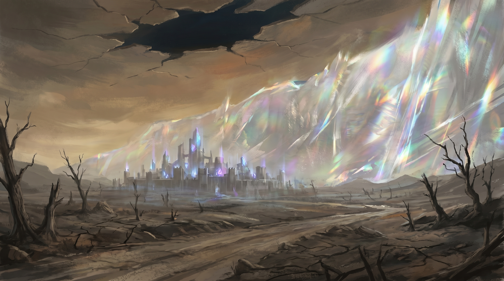
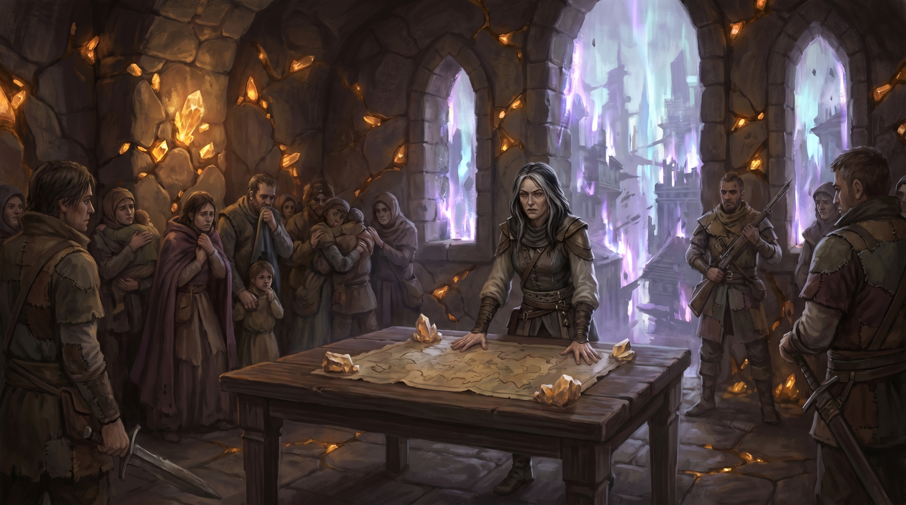
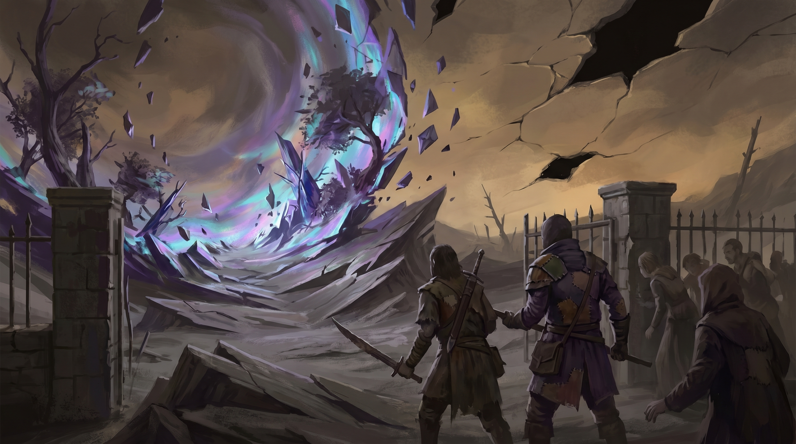

# Chapter 5: The Thinny Storm

**Session(s):** 5-6
**Level:** 6
**Expected Duration:** 3-4 hours
**Time:** Days 8-9 of the campaign

---

## Chapter Overview

**Synopsis:** The energy surge from the Breaker Station -- triggered or accelerated by the party's actions in Chapter 4 -- has spawned a massive Thinny storm bearing down on Loom. The party returns to a city in panic, its phasing more violent than ever, and must organize either a defense of the Eastern Gate or a full westward evacuation. The storm brings aberrations that pour through rents in reality -- a ticking-clock siege encounter where the party holds the line while civilians flee. Midway through, word arrives that the Threadcutter has been spotted approaching the Eld Pylon of Keth. The party must choose: stay and finish saving Loom's people, or leave now to intercept Sera Mourne before she reaches the Beam. Both choices carry real consequences that ripple through Chapters 6 and 7.

**Objectives:**
- **Primary:** Protect Loom's population from the Thinny storm
- **Secondary:** Choose between completing the defense/evacuation or pursuing the Threadcutter
- **Emotional:** Force the party to weigh the lives in front of them against the fate of reality itself

**Key NPCs:** [Elder Soraya](npcs.md#elder-soraya), [Wren](npcs.md#wren) (if freed in Chapter 4), Keeper Jorin (Covenant contact)
**Key Locations:** [Loom](locations.md#loom), The Eastern Gate, The Ashlands (western evacuation route)

---

## Scene 1: Return to Loom / The Storm Approaches

*Estimated time: 20-30 minutes*

### Introduction

> The sky to the east has gone wrong. You see it before you hear it -- a wall of shimmering, iridescent wrongness that stretches from horizon to horizon, dwarfing the landscape beneath it. It moves slowly but visibly, a curtain of unmaking drawn across the world. Where it passes, reality unravels: trees twist into shapes that have no name in any language, then collapse into themselves. The ground inverts -- soil and stone folding upward like pages in a burning book. The air itself seems to torque, bending light into spectra that shouldn't exist, colors your eyes recognize as *wrong* the way your tongue recognizes poison.
>
> The sound reaches you next. Not thunder. Not wind. A hum -- a deep, arrhythmic vibration that you feel in your molars and your sternum before your ears catch it. It sounds like a glass harmonica played by something that doesn't understand music. It sounds like the space between radio stations, stretched and amplified to cosmic volume.
>
> And beneath it all, a smell: ozone, copper, and something older. The smell of a place that has never existed and now has to. The smell of reality being forced into a shape it was never meant to hold.
>
> The storm is maybe an hour away. Maybe less. It swallows the eastern horizon like a slow tide of iridescent static, and the landscape ahead of it is already beginning to flicker.
>
> Loom is directly in its path.

### DM Information

This scene establishes the stakes and the clock. The party arrives back at Loom (or is already there, depending on how Chapter 4 ended) to find the city in escalating crisis. The Thinny storm is a direct consequence of the Breaker Station's disruption -- whether the party freed the Breakers, destroyed the station, or attempted a controlled shutdown, the disruption sent a shockwave through the Beam's resonance field that is now manifesting as a storm of unmaking.

**Time Pressure:** The party has approximately 1 hour of in-game time before the storm's edge reaches Loom's eastern boundary. Use this to create urgency but not panic -- they have time to plan, not time to waste.

**Loom's Condition:** The phasing is dramatically worse than when the party first visited in Chapter 3. The Beam-shard anchor in the Council Hall is the only thing keeping the city's core stable, but even it is straining.

**Environmental Details:**
- Buildings flicker more violently -- entire streets disappear for seconds at a time, then reappear in a different time period
- Citizens are screaming, running, praying. Some are frozen in shock.
- The stable core around the Council Hall (roughly a 200-foot radius) is holding, but the edges shimmer and warp
- The air tastes of tin and static electricity
- Animals are panicking -- dogs howling, horses bolting, rats fleeing eastward in rivers

**Wren's Reaction (if present):**

If the party freed Wren in Chapter 4, she collapses the moment the storm becomes visible. Read:

> Wren drops to her knees, both hands pressed against her temples. Her eyes go white -- not the blank white of unconsciousness but the blazing white of someone seeing too much. Her mouth opens but no sound comes out for three heartbeats. Then, barely a whisper:
>
> "It's... loud. Everything is screaming. The Beam -- the Beam is *crying*. I can feel it bending. Like a bowstring drawn back past the breaking point. The storm is... it's not just weather. It's a wound. Reality bleeding out through the hole we made."

Wren recovers after a minute but remains shaken. From this point forward, she can provide real-time updates on the Beam's condition and the storm's movement -- a living sensor the party can consult.

**If Wren was not freed:** The party lacks this early warning and real-time feedback. They must rely on their own observations and the chrono-compass (which spins wildly, its needle unable to find true north).

**Hidden Details:**
- **DC 12 Perception:** The storm is not uniform -- it has denser pockets and thinner bands, suggesting it flows along the Beam's resonance lines rather than moving like natural weather
- **DC 15 Arcana:** The aberrations the party fought in previous Thinny encounters were scouts. A storm this size will bring things through that are orders of magnitude worse.
- **DC 18 Arcana:** The storm's leading edge carries a wave of planar displacement -- the first 30 seconds of contact won't just damage structures, it will temporarily overlay Far Realm geography onto the physical world

**Possible Player Actions:**
1. **Rush to the Council Hall:** Soraya is already there. The party can reach her within minutes.
2. **Warn the population directly:** Effective but chaotic. The people of Loom know what Thinnies are -- the word alone causes panic.
3. **Study the storm:** Arcana checks can provide tactical information about its behavior, density, and speed.
4. **Consult the chrono-compass:** It spins wildly but, with a DC 14 Arcana check, can be recalibrated to track the storm's temporal displacement patterns, providing advantage on Arcana checks related to the storm for the rest of the chapter.
5. **Attempt to reinforce the Beam-shard anchor:** Possible but requires Scene 2's planning to be effective.

### Connections
- **To Scene 2:** The party reaches the Council Hall and the emergency meeting begins

---

## Scene 2: Emergency Council

*Estimated time: 25-35 minutes*

### Introduction

> The Council Hall is the eye of the storm -- literally. While buildings flicker and streets unmake and reform around it, the Beam-shard anchor in the hall's foundation holds the structure in a bubble of stability. The air here is still, the light steady. It feels like standing inside a soap bubble while the world burns.
>
> The hall is crowded. Frightened families press against the walls, clutching children and belongings. Militia members stand in uncertain knots, gripping weapons that are useless against what's coming. The air smells of sweat and fear and the copper tang of failing reality.
>
> [Elder Soraya](npcs.md#elder-soraya) stands at the central table, a map of Loom spread before her, weighted at the corners with chunks of stabilized crystal. Her hands are flat on the table. Her jaw is set. Her eyes are the eyes of a woman who has been waiting for the end of the world and has just watched it arrive on schedule.

### DM Information

This is a social and planning encounter. The party must decide -- quickly -- how to handle the storm. Elder Soraya has convened everyone who matters, but she's looking to the party for direction. She's a leader of refugees and tradespeople; she's out of her depth against a cosmic-scale threat and she knows it.

**NPCs Present:**

**[Elder Soraya](npcs.md#elder-soraya)**
- **If her secret deal with the Unravelers was exposed in Chapter 3:** She's desperate to prove herself. Her authority is damaged but not destroyed -- the people of Loom still follow her because no one else has stepped up. She volunteers harder, takes more risks, and defers to the party with an urgency that borders on subservience. She offers to use her remaining Unraveler contacts to send a message ahead to the Eld Pylon, buying the party time. (This provides advantage on the Choice in Scene 4 -- if she sends the message, the party learns the Threadcutter is a day ahead rather than merely learning she's "been spotted approaching.")
- **If her secret was NOT exposed:** She's grim but composed. Her authority is intact. She makes hard decisions without flinching. She's still out of her depth, but she hides it behind competence and will.
- **Either way, she says:** "Whatever you decide, you're the only ones who can actually *see* this thing for what it is. My people need to know someone is standing between them and the end of the world."

**Keeper Jorin** (Covenant contact from Chapter 3)
- Covenant scholar, thin, precise, frightened but hiding it behind academic detachment
- Has been studying the Beam-shard anchor and believes it can hold the Council Hall stable if the party defends the perimeter
- Provides tactical information about the Eastern Gate chokepoint
- "The old city wall was built during the Second Fracturing. It's the strongest structure in Loom aside from this hall. If you're going to hold ground, hold it there."

**Moth** (if still with the party)
- The warforged's fragmentary memories include data about Thinny storms: they pass in waves, with increasing intensity, and typically last 20-30 minutes before the leading edge moves on
- "My records indicate... temporal displacement events of this magnitude... resolve themselves once the primary wavefront passes a fixed point. Hold for thirty minutes. The worst will move past."

### The Two Options

Present both options honestly. Neither is wrong. Both have costs.

**Option 1: Defend the Eastern Gate**

Hold the chokepoint at the old city wall while the storm passes overhead. If the Beam-shard anchor in the Council Hall holds, the stable core might weather the storm -- meaning Loom survives, damaged but intact.

- **Advantages:** Preserves Loom. Keeps the population together. The Eastern Gate is a natural chokepoint that favors defenders. Fewer logistical problems (no managing a column of 800+ panicked civilians).
- **Risks:** If the anchor fails, everyone in Loom is caught in the storm. The party is exposed to the storm's edge at the gate. Aberrations will pour through the rents in reality directly at the defenders.
- **Requirements:** The party (and any fighters they can rally) must hold the 20-foot-wide gate for approximately 9 rounds while the storm's leading edge passes. Civilians shelter in the Council Hall's stable zone.

**Option 2: Evacuate West**

Move the entire population away from the storm's path. Abandon Loom and flee westward into the Ashlands.

- **Advantages:** Safer for civilians -- they're moving away from the storm rather than sheltering in its path. Even if the anchor fails, the population survives.
- **Risks:** Slower. Managing 800+ panicked people through phasing terrain is a logistical nightmare. The evacuation column is vulnerable to flanking aberrations. Loom will almost certainly be destroyed.
- **Requirements:** A skill challenge to manage the evacuation while fighting off attacks on the column's flanks.

**Planning Details:**

If the party asks for more information, Soraya and Jorin can provide:

| Question | Answer |
|----------|--------|
| How many fighters do we have? | "Thirty militia. Lightly armed. Most have never fought anything that bleeds wrong." |
| Can we reinforce the anchor? | Jorin: "With time, yes. But we don't have time. What we have is enough -- probably." (DC 16 Arcana to reinforce it, granting advantage on the anchor's stability check during Scene 3.) |
| What about the children? | "Two hundred children under twelve. They go wherever the adults go." |
| Can we do both? | Soraya: "Not with our numbers. We defend or we run. We can't split." |
| What happens if the anchor breaks? | Jorin, quietly: "Then everyone inside the stable zone phases. Maybe they come back. Maybe they don't." |

**Possible Player Actions:**
1. **Choose to defend:** Proceed to Scene 3, Gate Defense variant
2. **Choose to evacuate:** Proceed to Scene 3, Evacuation variant
3. **Attempt to reinforce the anchor first:** DC 16 Arcana check, 15 minutes of work. Success grants the anchor advantage on its stability check during the storm. Failure wastes time but doesn't make things worse.
4. **Rally the militia:** DC 13 Persuasion or Intimidation. Success grants the militia Inspiration for the first wave of combat. Failure doesn't demoralize them, but they fight nervously.
5. **Consult Wren about the storm's behavior:** If present, Wren can sense the storm's "shape" -- it hits hardest in the first three waves, then the leading edge passes. This confirms Moth's data and helps the party plan.

### Connections
- **To Scene 3:** The storm arrives. The chosen plan goes into action.

---

## Scene 3: The Storm Hits

*Estimated time: 60-75 minutes*

### Introduction

> The storm's edge reaches Loom.
>
> There is no warning crack of thunder, no flash of lightning. The world simply *tears*. The eastern sky goes from iridescent shimmer to open wound -- a ragged line of shimmering distortion that rips through the air like a blade through silk. The light goes wrong: too many colors, and some of them don't have names. Your shadow splits into three. The ground beneath your feet hums a note that makes your teeth ache.
>
> Shapes push through the rents. Things with too many limbs, or not enough dimensions. Things that gibber and wail in frequencies that make your eyes water. Things that smell of places that should not be.
>
> Behind you, the people of Loom are counting on you.
>
> The storm is here.

### DM Information

This is the chapter's action set piece. It plays out differently depending on the party's choice in Scene 2.

---

### Variant A: Gate Defense (Ticking Clock Combat)

**Setup:**

The party holds the Eastern Gate -- a 20-foot-wide gap in the old city wall where iron-reinforced doors once hung. The wall itself is 15 feet high and 5 feet thick, built from stabilized crystal-laced stone during the Second Fracturing. Rubble and hastily constructed barricades provide half cover across the gate's opening.

Behind the party, the stable zone around the Council Hall stretches 200 feet. Between the gate and the stable zone: open ground, flickering buildings, and the last of the civilians rushing toward safety.

**Terrain:**
- The gate is 20 feet wide, flanked by 15-foot walls
- Barricades across the opening provide half cover (+2 AC, +2 Dex saves)
- The wall can be climbed (DC 12 Athletics) for elevation -- ranged attackers on the wall have three-quarter cover from ground-level enemies
- The ground in front of the gate (the "kill zone") extends 60 feet to the storm's edge
- Rubble piles at 30 feet and 50 feet provide half cover for approaching enemies

**Militia Support:**
- Ten militia fighters hold positions on the walls (use Guard stat block, MM p.347)
- They deal chip damage to enemies each round (approximately 5-8 damage total per round, distributed among targets at DM discretion) but cannot hold the gate alone
- If the party rallied them in Scene 2, they have Inspiration for Wave 1

**Environmental Hazard -- Reality Warps:**

Starting in Round 4 (after Wave 1), the storm's proximity warps reality in the gate area. At the start of each round from Round 4 onward, roll 1d4:

| d4 | Effect |
|:--:|--------|
| 1 | **Gravity Shift.** Gravity briefly reorients 90 degrees in a random direction. All creatures in the gate area must succeed on a DC 12 Dexterity saving throw or fall prone. Creatures on the walls must succeed or fall off the wall (1d6 bludgeoning damage and prone). |
| 2 | **Time Stutter.** One random creature (enemy or ally) loses its next turn as time hiccups around it. The creature appears frozen in place, surrounded by a faint shimmer. Determine randomly -- roll among all creatures in the encounter. |
| 3 | **Spatial Displacement.** One random creature is teleported 15 feet in a random direction (roll 1d8 for direction). If this moves them off the wall, they fall. If this moves them into a solid object, they appear in the nearest unoccupied space and take 1d6 force damage. |
| 4 | **Stable.** No environmental effect this round. |

---

**Wave 1 (Rounds 1-3): The Bleeding Edge**

> The first shapes push through the storm's leading edge. They move wrong -- lurching, flowing, tumbling forward like things that have never had to exist in three dimensions before and haven't quite figured out the rules. Their mouths open in every direction. Their eyes, if they have eyes, see too much.

**Enemies:**
- 2 **Gibbering Mouthers** (MM p.157) -- push directly toward the gate, gibbering madly
- 4 **Cranium Rats** (VGM p.133) -- swarm through the rubble, attempting to flank

**Tactics:**
- The Mouthers advance relentlessly toward the gate, using their Gibbering ability to weaken defenders
- The Cranium Rats use Telepathic Shriek (if 4+ rats are within 30 feet of each other) and attempt to get past the barricades to the civilians beyond
- This wave is straightforward -- a warm-up to establish the rhythm

**DM Note:** If the party rallied the militia, the Guards have advantage on saves against the Mouthers' Gibbering for this wave (Inspiration). This makes Wave 1 feel manageable -- the real challenge is coming.

---

**Wave 2 (Rounds 4-6): The Teeth of the Storm**

> The rents in the sky widen. The light shifts from wrong to *actively hostile* -- looking at the sky now feels like staring into a migraine. Something large crashes through the rubble field, sending chunks of stone the size of barrels tumbling ahead of it. Behind it, two hunched figures scuttle along the wall's outer face, their single eyes gleaming with diseased intelligence.

**Enemies:**
- 1 **Otyugh** (MM p.248) -- crashes through the debris at the 30-foot mark and charges the barricades
- 2 **Nothics** (MM p.236) -- stay at 50-60 feet, using Rotting Gaze through the gaps in the rubble

**Tactics:**
- The Otyugh is the hammer. It charges the barricades and attempts to destroy them (Multiattack against the barricade structure -- treat as AC 15, 30 HP). If the barricade is destroyed, the gate loses its half cover.
- The Nothics are the scalpels. They use Rotting Gaze on anyone exposed on the walls and retreat behind rubble if approached. They prioritize spellcasters.
- Environmental hazards begin this wave -- the Reality Warp table is now active.

**The Barricade:** If the Otyugh destroys the barricade, the party loses half cover at the gate. A DC 14 Athletics check as an action can brace debris back into place, restoring partial cover (one-quarter cover, +2 AC only) until the Otyugh attacks it again.

**Civilian Evacuation Tracker (Behind the Screen):**
- By the end of Wave 2: 80% of civilians have reached the Council Hall's stable zone
- The remaining 20% are the slow, the injured, the stubborn, and the families who went back for belongings

---

**Wave 3 (Rounds 7-9): The Worst of It**

> The storm is overhead now. The sky is a kaleidoscope of impossible geometry -- angles that fold in on themselves, surfaces that exist in dimensions you can't quite count. The air tastes of mercury and prophecy. Something massive and armored drags itself through the largest rent, and behind it, reality shudders as two shapes *phase* through the wall itself -- bypassing the gate entirely, appearing behind your lines in stuttering flickers of displaced space.

**Enemies:**
- 1 **Chuul** (MM p.40) -- the anchor. It approaches the gate head-on, using its reach and grapple to pull defenders off the barricades.
- 2 **Phase Spiders** (MM p.334) -- phase through the wall using Ethereal Jaunt, appearing behind the party's line. They target anyone who appears isolated or injured.

**Tactics:**
- The Chuul is relentless and armored. It grapples the strongest-looking defender and attempts to paralyze them with its tentacles while weathering attacks. It does not retreat.
- The Phase Spiders are the true danger of this wave. They appear in the space between the gate and the Council Hall -- directly among the last stragglers of the civilian evacuation. The party must decide: hold the gate against the Chuul, or break formation to deal with the spiders threatening civilians.
- If a Phase Spider reaches civilians, it attacks 1d4 civilians per round it remains unchallenged. Each civilian has AC 10, 4 HP.

**DM Note:** This is the wave where the party should feel stretched. The Phase Spiders force a tactical split -- someone has to deal with the flankers while someone else holds the Chuul at the gate. If the party has clever solutions (area denial spells, Moth holding the gate, militia redirected), reward that creativity.

**Success Condition:** Hold for all 9 rounds (three waves). After Round 9, the storm's leading edge passes over Loom and the rents begin to close. Remaining aberrations collapse, dissolve, or flee back into the tears before they seal.

**Partial Success:** If the gate falls before Round 9 but the party fights a retreating defense toward the Council Hall, most civilians survive but Loom takes severe damage. The Beam-shard anchor holds (barely), but the city's outlying districts are destroyed.

**Failure:** If the party is overwhelmed or forced to abandon the gate before Round 7, the storm pours through into the city. The Beam-shard anchor holds the Council Hall (it was built for this), but everything outside the stable zone is devastated. Civilian casualties are significant -- 1d4 x 50 people lost.

---

### Variant B: Evacuation (Skill Challenge + Running Combat)

**Setup:**

The party leads 800+ panicked civilians westward, away from the storm. The evacuation column stretches through Loom's phasing streets and out into the Ashlands, heading for higher ground west of the city. The storm pursues from the east, its leading edge chewing through Loom's eastern districts.

**Skill Challenge: The Exodus**

**Complexity 3:** 8 successes before 3 failures

Each check represents approximately 5-10 minutes of evacuation time. The party can split up to cover different roles. Each character can attempt one check per round of the challenge.

| Skill | DC | Application |
|-------|----|-------------|
| Persuasion | 14 | Keep civilians calm, prevent stampedes, convince holdouts to leave their homes |
| Athletics | 13 | Clear debris from the path, carry the injured, force open stuck gates |
| Survival | 14 | Navigate the safest route through shifting terrain, avoid temporal dead zones |
| Arcana | 15 | Navigate temporal disruptions, identify stable ground, predict phasing patterns |
| Intimidation | 13 | Break through bottlenecks by commanding the crowd, force panicking groups to move |
| Medicine | 12 | Treat the injured who can't keep up, prevent deaths from exposure and shock |
| Investigation | 14 | Identify structural hazards before they collapse, spot safe shelter along the route |
| Animal Handling | 12 | Calm panicking draft animals pulling carts of supplies and the very young |

**On Success (reaching 8 successes):** The evacuation column clears Loom's western boundary and reaches high ground. Most of Loom's population survives. The city behind them is consumed by the storm -- buildings unmake, streets fold, the Eastern Gate collapses. But the people are alive.

**On Each Failure:** 1d4 x 10 civilians are lost -- swept up in a phasing event, caught by the storm's edge, or simply vanished during a temporal displacement. Describe each loss: a family that turned back for a pet, a group that took a wrong turn into a phasing street, an elder who couldn't keep up.

**On Overall Failure (3 failures before 8 successes):** Significant casualties. The column fractures -- groups scatter in different directions. The party saves whoever is closest, but 200-300 people are lost. Loom is destroyed.

**Midway Combat: The Flankers**

After the 4th skill check (regardless of successes/failures), the storm's edge catches up to the column's rear. Two **Phase Spiders** (MM p.334) materialize among the civilians, phasing in and out of the Ethereal Plane to strike.

This is combat while protecting non-combatants. The column cannot stop moving -- if it does, the storm catches them all.

**Combat Conditions:**
- The Phase Spiders attack civilians (AC 10, 4 HP) unless engaged by the party
- The evacuation column moves 30 feet per round (normal walking speed)
- The storm's edge advances at 35 feet per round -- it's catching up slowly
- If combat lasts more than 4 rounds, the storm catches the column's rear. All creatures within 30 feet of the column's rear edge take 2d6 force damage per round from reality warps.

**DM Note:** This combat should feel desperate and mobile. The party is fighting a rearguard action while the column shuffles forward. Encourage movement, improvisation, and hard choices about who to protect.

---

### Connections
- **To Scene 4:** After Wave 2 (Gate Defense) or after the midway combat (Evacuation), the messenger arrives with the Choice.

---

## Scene 4: The Choice

*Estimated time: 20-30 minutes*

### Introduction

Read this between Wave 2 and Wave 3 (Gate Defense) or after the midway combat (Evacuation). The timing matters -- the party should be mid-action, committed, bloodied, and now forced to make a decision with no time to prepare.

> A figure breaks through the chaos -- Keeper Jorin, covered in dust, a Covenant sending-bird clutched against his chest, its tiny crystal eyes blinking with encoded messages. He's bleeding from a cut above his eye. He doesn't notice.
>
> "The Covenant network -- we intercepted a signal. The Threadcutter. Sera Mourne. She's been spotted approaching the Eld Pylon of Keth." He's breathing hard. "She's a day ahead of you. If you leave now -- right now -- you might arrive at the Pylon before she can breach the outer defenses. If you wait..."
>
> He doesn't finish the sentence. He doesn't have to.

### DM Information

This is the chapter's emotional and narrative centerpiece. This is the moment the campaign asks the players who they are.

**The Choice:**

**Option A: Stay**
- Finish the defense (fight Wave 3) or complete the evacuation (finish the skill challenge)
- Save more lives. The remaining 20% of civilians still need protection.
- But the Threadcutter arrives at the Pylon first. She'll have time to prepare. Chapter 6 will be harder -- Dace will be reinforced, traps will be set, and Sera will have begun studying the Pylon's systems by the time the party arrives.

**Option B: Go Now**
- Leave immediately. The defense/evacuation continues without the party.
- Soraya and the remaining militia handle it. They'll manage -- mostly. But without the party, casualties are higher. If defending the gate, the militia holds but loses 1d4 x 20 civilians when the Phase Spiders get through unchecked. If evacuating, the column loses an additional 1d4 x 10 people.
- The party can potentially arrive at the Pylon before or alongside the Threadcutter, catching her before she's prepared.

**This is not a trick.** Both choices have real consequences. Do not telegraph a "right" answer. Present the information honestly and let the party debate.

**NPC Reactions to the Choice:**

**Elder Soraya:**
- If the party considers staying: "We will survive this. We've survived worse. But the Beam..." She looks east, toward the storm. "If the Beam breaks, there won't be a Loom to save. There won't be anything."
- If the party considers leaving: "Then go. We'll hold. I've held this city together through worse than this." She hasn't. But she'll try.
- If her secret was exposed: She offers additional intelligence from her Unraveler contacts, confirming the Threadcutter's timeline. This makes the "go" option more viable -- the party has clearer information about what they're racing toward.

**Wren (if present):**
> "The Beam... I can feel it bending. Like a string about to snap. Hours, not days. If she reaches the Pylon before you do, she'll start the process of unraveling the Beam's anchor points. Once that starts..." Wren shakes her head. "I don't know if it can be stopped."

Wren does not advocate for either choice. She provides information and lets the party decide. If asked directly what she thinks they should do, she says: "I spent weeks strapped to a chair being used to destroy something I didn't understand. I'm the wrong person to ask about what's worth sacrificing."

**Keeper Jorin:**
- Practical, clinical: "The mathematics are simple. If the Beam falls, everyone dies. Not just here -- everywhere, eventually. But those people behind you are dying right now."
- If pressed: "I'm a scholar, not a general. This is your decision."

**Moth (if present):**
- "The Constant drew you for a reason. My fragmentary records suggest... the Drawn were never meant to save everyone. They were meant to save the *Beams*." A pause. "But my records are fragmentary."

**Let the party debate.** Do not rush this scene. If they're agonizing, good -- that means it's working. Give them 10-15 real-world minutes if they need it. This is the moment they'll talk about after the campaign.

**If the party tries to split up:** Allow it, but warn them through NPC dialogue that splitting the party against the Threadcutter is dangerous. "She has an army. You have each other. Don't halve your strength." If they split anyway, run both scenarios -- but both are significantly harder.

### Connections
- **To Scene 3 (continued):** If they stay, Wave 3 begins immediately
- **To Chapter Resolution:** If they leave, proceed to the "If They Left" resolution

---

## Chapter Resolution

*Estimated time: 10-15 minutes*

### If They Stayed

> Dawn comes to Loom like a held breath finally released. The storm passed three hours ago, dragging its tail of wrongness eastward, and the rents in the sky have sealed themselves -- scarred over like wounds that will never fully heal. The air still tastes of copper, and the light is the gray-gold of a world that has been through something terrible and survived.
>
> The Eastern Gate is rubble. The barricades are splinters. The ground is littered with the dissolving remains of things that should never have existed in this reality. But behind you, in the Council Hall's stable zone, families are emerging. Children are crying -- the healthy kind, the kind that means they're alive and frightened and whole.
>
> Elder Soraya finds you among the wreckage. She is gray with exhaustion, blood on her sleeve (not hers), and she says nothing for a long moment. Then she takes your hand and squeezes it. That's enough.
>
> Keeper Jorin approaches as you rest. "Covenant reinforcements are a day out. If you're going to the Pylon, you won't go alone. I've sent word -- twenty fighters, armed, experienced. They'll meet you on the road."
>
> The people of Loom are alive. The city is damaged but standing. The Beam-shard anchor held. And the Threadcutter has a day's head start.

**Mechanical Consequences (Stay):**
- Loom survives. The party has a permanent safe haven and the gratitude of 800+ Remnants.
- Covenant reinforcements (20 fighters, Veteran stat block, MM p.350) will meet the party en route to the Pylon. These NPCs provide background support in Chapters 6-7 (holding corridors, fighting Unraveler soldiers, etc.) but do not accompany the party into the Pylon's core.
- The Threadcutter arrives at the Eld Pylon first. In Chapter 6, Commander Dace will be reinforced (additional 2 Unraveler soldiers in the Control Chamber), traps will be set in the Resonance Chamber, and Sera will have begun studying the Pylon's systems (she gains advantage on her first interaction with the Pylon's core in Chapter 7).

### If They Left

> You leave in the space between heartbeats -- between one wave of the storm and the next, between one scream and the silence that follows. You don't look back. You can't afford to.
>
> The Ashlands stretch before you in the storm-scarred dark. The ground is wrong -- soft in places, crystallized in others, still vibrating with the aftershocks of reality's distress. You travel through the night, following the chrono-compass needle as it steadies and points east, toward the Pylon, toward the Beam, toward whatever comes next.
>
> Behind you, hours after you've left, the storm hits Loom full force. You hear it -- even miles away, you hear it. A sound like glass breaking on a cosmic scale, like every window in the world shattering at once. It goes on for too long. Then silence.
>
> You don't know how many survived. You don't know if Soraya held the gate, or if the anchor held, or if the children made it to the stable zone in time. You know that you chose, and the choice was real, and the people behind you are paying for it one way or another.
>
> (DM Note: Soraya handles it. Most survive. The party does not learn this until after the campaign's climax -- if they return to Loom, or if a Covenant messenger reaches them at the Pylon. The uncertainty is the point.)

**Mechanical Consequences (Leave):**
- Casualties in Loom are higher but not catastrophic. Soraya and the militia hold -- barely. Approximately 100-150 civilians are lost (DM determines exact number; the party doesn't learn specifics for some time).
- No Covenant reinforcements -- Jorin is too busy with the aftermath to send word. The party approaches the Pylon alone.
- The party can potentially arrive at the Pylon before or simultaneously with the Threadcutter. In Chapter 6, Commander Dace has fewer soldiers (the Threadcutter's forces are still in transit), no traps are set in the Resonance Chamber, and Sera has not yet begun studying the Pylon's systems.
- The party carries guilt. Use this -- NPCs in later chapters may reference it. Wren, if present, is quiet and withdrawn for the journey. If asked, she says: "I'm not judging you. I'm trying to figure out if the Beam is worth what we just paid for it."

### Either Way

> The Eld Pylon of Keth lies to the east. The chrono-compass needle has stopped spinning. It points now with the steady certainty of something that knows exactly where it needs to be and cannot wait to get there.
>
> The Beam is bending. The Threadcutter is coming. And the only thing between the end of the world and the world itself is you.

---

## DM Notes & Tips

### Pacing This Chapter

| Scene | Time | Energy Level | Key Moments |
|-------|------|-------------|-------------|
| Scene 1: Storm Approaches | 20-30 min | Rising -- dread, urgency | Wren's collapse; the storm's visual horror; the clock starts |
| Scene 2: Emergency Council | 25-35 min | Medium -- planning, tension | Soraya's plea; the party's plan; rallying fighters |
| Scene 3: The Storm Hits | 60-75 min | Peak -- combat, desperation, heroism | Wave 2's barricade assault; Phase Spiders behind the lines |
| Scene 4: The Choice | 20-30 min | Emotional peak -- gut-punch decision | The debate; Wren's "hours, not days"; the party decides |
| Resolution | 10-15 min | Falling -- consequence, resolve | Aftermath; the road to the Pylon |

### Running the Combat

**Gate Defense Tips:**
- Describe each wave cinematically. The aberrations should feel *wrong* -- not just dangerous but fundamentally alien. A Gibbering Mouther isn't a monster; it's a wound in reality that grew teeth.
- Use the environmental hazards to create memorable moments, not to punish. A gravity shift that sends a PC flying onto a Nothic's back is more fun than one that makes them miss a turn.
- Track the civilian evacuation behind the screen but mention it: "Behind you, you hear the last families running for the Council Hall. A mother carrying two children. An old man who refuses to leave his dog." Make the stakes personal.
- The militia should fight bravely but visibly struggle. They're not heroes -- they're shopkeepers and farmers with swords. One of them should go down during Wave 2 and need to be helped.

**Evacuation Tips:**
- Make each skill check narrative, not mechanical. "You need to convince three hundred people to leave behind everything they own and walk into the dark" is more compelling than "roll Persuasion."
- Each failure should cost something the players feel. Not abstract "10 people." Name them. "A family of five -- the potter's family from the Phasing Market. You saw them laughing there three days ago."
- The Phase Spider combat during evacuation should feel like a horror movie -- things appearing in the middle of a crowd of defenseless people.

### Running the Choice

This is the most important scene in the chapter. Here's how to handle it:

**Do not advocate for either option.** Present the NPCs' reactions honestly, provide the information the party asks for, and then *shut up*. Let the players talk. Let them argue. Let them agonize.

**If the table is split:** This is ideal. Let them debate in character. The tension between "save these people" and "save the world" is the entire point. If they can't decide, remind them that the clock is ticking -- Wave 3 is coming (or the storm is catching up) and they need to decide *now*.

**If they try to have it both ways:** The scenario is designed to prevent this. They cannot split the party effectively (Sera has an army), they cannot pause the storm, and they cannot be in two places at once. One solution some parties may try: leaving Wren behind to help defend while the party goes to the Pylon. This is valid -- Wren's psychic abilities can help the militia coordinate -- but it costs the party their living sensor and a crucial ally for Chapters 6-7.

**If they decide instantly:** That's fine too. Not every group needs to agonize. If they choose quickly and with conviction, respect that -- it tells you what kind of heroes they are.

### What If They Split the Party?

If the party insists on splitting -- some staying, some going -- run it, but make the consequences real.

- **The defenders** face Wave 3 undermanned. Remove the Chuul's grapple attempts (it just attacks) but add an extra Phase Spider. The militia takes heavier casualties.
- **The advance party** travels alone through the storm-scarred Ashlands. They encounter a Thinny remnant (1 Gibbering Mouther and 2 Cranium Rats) along the road, fighting it without their full party.
- Both groups feel the split. The defenders wonder if they did the right thing; the advance party wonders what's happening behind them. This tension carries into Chapter 6.

### Adjusting Difficulty

**If the party is struggling (Gate Defense):**
- Moth steps up to hold part of the line, occupying one Gibbering Mouther for 2 rounds
- The militia gets a second wind (one dies heroically, inspiring the others to fight harder -- +2 damage per round from militia)
- Reduce the Chuul's HP by 25% and have it arrive a round late
- The Phase Spiders attack the militia instead of civilians, giving the party more time to respond

**If the party is dominating:**
- Wave 2 and 3 overlap by 1 round (the Chuul arrives while a Nothic is still active)
- An additional Cranium Rat swarm (4 rats) pours through a crack in the wall
- The environmental hazards escalate: at Round 8, roll twice on the Reality Warp table
- A chunk of the wall collapses (15-foot section), widening the breach

**If the evacuation is too easy:**
- A phasing event displaces a block of 50 civilians into a dead-end temporal loop -- the party must enter the loop (DC 15 Arcana to identify exit point, DC 13 Athletics to physically guide the civilians out) or lose them
- A third Phase Spider appears at the column's head, forcing a fight on two fronts
- The storm accelerates -- its movement speed increases to 40 feet per round

### Connecting to Chapters 6-7

The party's choice here creates a branching consequence structure:

| Choice | Chapter 6 Impact | Chapter 7 Impact |
|--------|-----------------|-----------------|
| **Stayed** | Dace reinforced, traps set, Sera studying systems. Covenant reinforcements arrive. | Sera is prepared. The Pylon's defenses are partially compromised. But the party has allies. |
| **Left** | Dace undermanned, no traps, Sera hasn't arrived yet. No reinforcements. | Sera arrives during or after the party's exploration. She's less prepared but the party is alone. |
| **Split** | Both effects at reduced scale. Defenders hold with casualties; advance party arrives underprepared. | Party reunites at the Pylon but both halves are weakened. |

Track the party's choice on the campaign's decision log. Reference it in Chapter 6's opening narration and in NPC reactions throughout the endgame.

---

## Quick Reference

### NPCs This Chapter

| Name | Location | Attitude | Key Info |
|------|----------|----------|----------|
| [Elder Soraya](npcs.md#elder-soraya) | Scene 2-4 | Grim, determined, out of her depth | Leader of Loom; looks to party for guidance |
| [Wren](npcs.md#wren) (conditional) | Scene 1-4 | Shaken, perceptive, honest | Living sensor; feels the Beam and storm |
| Keeper Jorin | Scene 2, 4 | Clinical, frightened, pragmatic | Covenant contact; delivers the Threadcutter intel |
| [Moth](npcs.md#moth) (conditional) | Scene 2-3 | Analytical, fragmentary | Provides data on Thinny storm behavior |

### Encounters This Chapter

| Scene | Type | Enemies | CR Budget |
|-------|------|---------|:---------:|
| Scene 3A, Wave 1 | Combat | 2 Gibbering Mouthers, 4 Cranium Rats | ~5 |
| Scene 3A, Wave 2 | Combat | 1 Otyugh, 2 Nothics | ~7 |
| Scene 3A, Wave 3 | Combat | 1 Chuul, 2 Phase Spiders | ~7 |
| Scene 3B | Skill Challenge + Combat | 2 Phase Spiders + evacuation challenge | ~4 + skill challenge |

### Stat Block Quick Reference

| Creature | AC | HP | Speed | Key Abilities |
|----------|:--:|:--:|:-----:|---------------|
| Gibbering Mouther (MM 157) | 9 | 67 | 10 ft., swim 10 ft. | Gibbering (DC 10 Wis), Blinding Spittle (DC 13 Dex), Aberrant Ground |
| Cranium Rat (VGM 133) | 12 | 2 | 30 ft. | Telepathic Shriek (when 4+ within 30 ft.: DC 13 Wis, 2d6 psychic), Illumination |
| Otyugh (MM 248) | 14 | 114 | 30 ft. | Multiattack (bite + 2 tentacles), Tentacle Slam (grapple, DC 15 Str) |
| Nothic (MM 236) | 15 | 45 | 30 ft. | Rotting Gaze (DC 12 Con, 3d6 necrotic), Weird Insight |
| Chuul (MM 40) | 16 | 93 | 30 ft., swim 30 ft. | Multiattack (2 pincers), Tentacles (paralysis, DC 13 Con), Sense Magic |
| Phase Spider (MM 334) | 13 | 32 | 30 ft., climb 30 ft. | Bite (DC 11 Con, 4d8 poison), Ethereal Jaunt |

### DC Reference

| Task | Ability | DC |
|------|---------|:--:|
| Recalibrate chrono-compass | Arcana | 14 |
| Reinforce Beam-shard anchor | Arcana | 16 |
| Rally militia | Persuasion or Intimidation | 13 |
| Climb the Eastern Gate wall | Athletics | 12 |
| Brace debris for partial cover | Athletics | 14 |
| Save vs. Gravity Shift | Dexterity | 12 |
| Identify storm's resonance patterns | Arcana | 15 |
| Detect storm's planar overlay | Arcana | 18 |
| Detect storm's non-uniform density | Perception | 12 |

### Environmental Hazard Table (Gate Defense, Rounds 4+)

| d4 | Effect |
|:--:|--------|
| 1 | **Gravity Shift:** DC 12 Dex save or fall prone; wall creatures fall |
| 2 | **Time Stutter:** Random creature loses next turn |
| 3 | **Spatial Displacement:** Random creature teleported 15 ft. in random direction |
| 4 | **Stable:** No effect |

### Skill Challenge Table (Evacuation)

| Skill | DC | Application |
|-------|----|-------------|
| Persuasion | 14 | Keep civilians calm, prevent stampedes |
| Athletics | 13 | Clear debris, carry injured |
| Survival | 14 | Navigate safest route |
| Arcana | 15 | Navigate temporal disruptions |
| Intimidation | 13 | Break bottlenecks, command crowds |
| Medicine | 12 | Treat injured, prevent shock deaths |
| Investigation | 14 | Identify structural hazards |
| Animal Handling | 12 | Calm panicking draft animals |

### Decision Tracker

Record the party's choices for Chapter 6-7 consequences:

- [ ] **Defense or Evacuation?** (Gate Defense / Evacuation West)
- [ ] **Barricade held or destroyed?** (Gate Defense only)
- [ ] **Anchor reinforced?** (DC 16 Arcana in Scene 2)
- [ ] **Militia rallied?** (DC 13 Persuasion/Intimidation in Scene 2)
- [ ] **Soraya's Unraveler message sent?** (Only if secret exposed in Ch. 3)
- [ ] **Stayed or Left?** (Scene 4 Choice)
- [ ] **Party split?** (If applicable)
- [ ] **Civilian casualties:** _____ (estimated)
- [ ] **Wren left behind?** (If applicable)

---

*End of Chapter 5*
