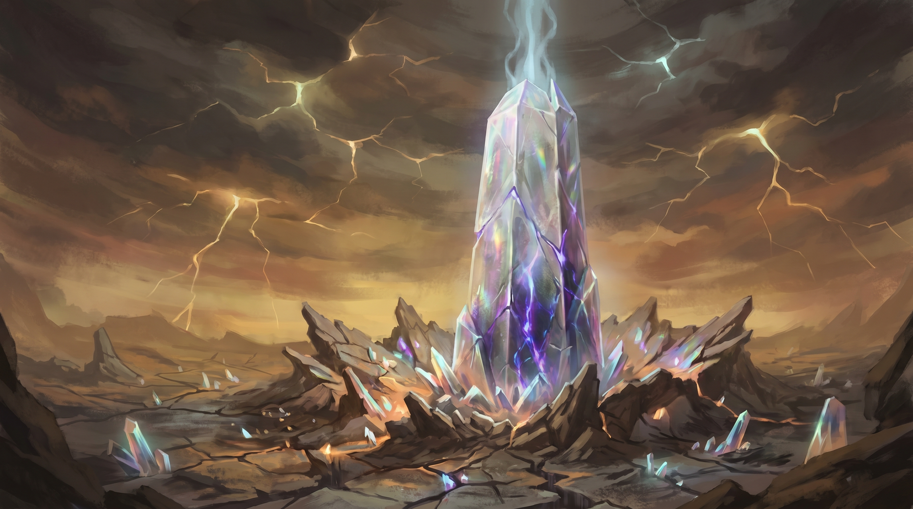
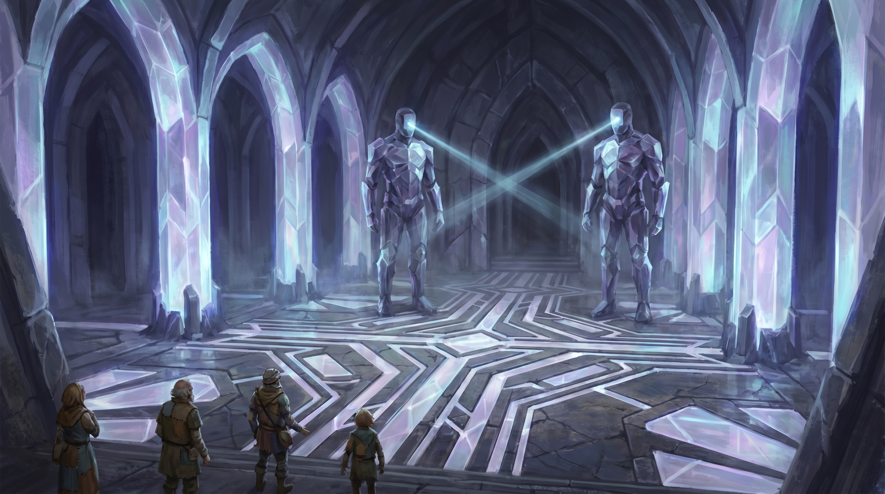
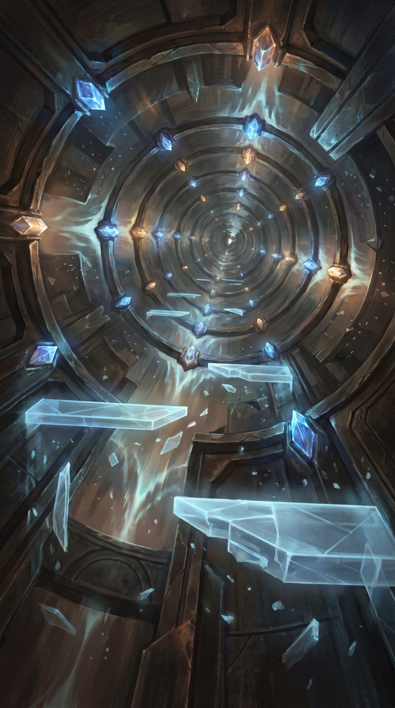
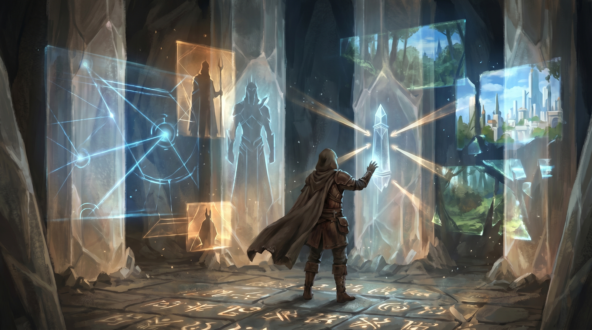
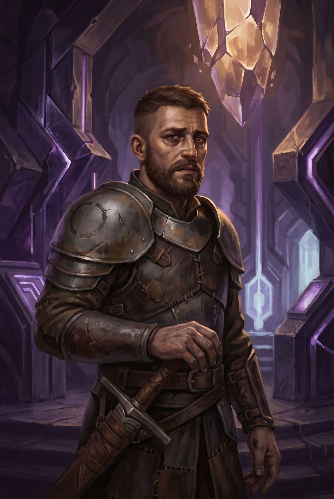

# Chapter 6: The Eld Pylon

**Session(s):** 6-7
**Level:** 6
**Expected Duration:** 3-4 hours
**Time:** Days 10-11 of the campaign

---

## Chapter Overview

**Synopsis:** The party reaches the Eld Pylon of Keth -- a massive crystalline tower rising two hundred feet from shattered earth, dormant but intact. Its interior is a vertical dungeon of ancient magitech: automated sentinels that test intent rather than strength, resonance hazards that punish recklessness, and the encoded memory of a civilization that vanished before its work was done. At the Control Chamber, the party confronts Commander Dace, the Threadcutter's pragmatic lieutenant -- a man fighting for a cause he's beginning to question. The Pylon's memory banks reveal the campaign's central truth: the Beams were designed as a *transitional* system, a scaffold meant to be gradually removed as the world healed. Not permanent chains. Not permanent sutures. A splint on a broken bone -- one the Old Ones intended to take off. They just never got the chance.

**Objectives:**
- Navigate the Eld Pylon's interior, ascending through its automated defenses and environmental hazards
- Discover the Armory and claim Old Ones weaponry, including the Essence Pistol
- Uncover the Old Ones' truth in the Memory Banks -- the Beams were transitional, not permanent
- Confront Commander Dace in the Control Chamber (combat, negotiation, or conversion)
- Learn the nature of the Resonance Key and the Threadcutter's imminent approach
- Prepare the Pylon's defenses for the final confrontation
- Milestone: party reaches Level 7 at end of chapter

**Key NPCs:** [Commander Dace](npcs.md#commander-dace), [Moth](npcs.md#moth)
**Key Locations:** [The Eld Pylon of Keth](locations.md#the-eld-pylon-of-keth)

---

## Scene 1: Approach to the Pylon

*Estimated time: 15-20 minutes*

### Introduction

> The Pylon rises from the landscape like a shard of frozen starlight.
>
> You see it long before you reach it -- a spire of faceted crystal, two hundred feet tall, catching the bruised amber light of the Ashlands sky and scattering it into prismatic shards that paint the wasteland in colors that have no business existing here. The earth around its base is cracked and uplifted, slabs of bedrock tilted at sharp angles, as if the tower punched upward from somewhere deep and ancient and the ground never forgave it. Crystalline fragments litter the broken terrain -- some the size of a fist, some the size of a door -- and a few of them still hum. You feel the sound more than hear it: a vibration in the soles of your feet, in the roots of your teeth, in the hollow behind your sternum where the Constant lives.
>
> The air changes as you approach. It thickens. Not with humidity or heat -- with *presence*. Colors are sharper within a hundred yards of the Pylon. The edge of a rock is crisper than it should be. The shadow it casts is darker, more defined, as if reality itself has better resolution here. Sounds carry strangely -- your footsteps on the broken ground arrive at your ears a half-beat late, as if the air is thinking about them first.
>
> And every one of you who carries the Constant feels it. A deep, resonant pull behind the breastbone. Not the sideways tug that points toward each other -- this is different. This pulls *forward*. Toward the Pylon. Toward something that recognizes you the way a lock recognizes a key.
>
> Like coming home to a place you have never been.

### DM Information

This scene is pure atmosphere. There are no enemies outside the Pylon. The environment should feel intense, alien, and awe-inspiring -- a stark contrast to the decaying Ashlands the party has been traveling through. The Pylon is *intact*. Unlike every other piece of Old Ones technology the party has encountered, this one still works. That should feel significant.

**The Constant Pull:** Every PC bonded to the Constant feels the pull toward the Pylon. It is not compulsive -- they can resist it easily -- but it is undeniable. It feels like recognition. Like the Pylon has been waiting for them specifically, and now that they are here, something ancient and patient has exhaled.

**If Moth Is Present:** Moth's optical sensors flicker rapidly as the Pylon comes into view. Moth stops walking. A long pause. Then, quietly: *"I know this place. I... maintained this place."* Moth's fragmented memories begin surfacing -- not complete, but clearer than they have been since activation. Moth remembers corridors. Moth remembers a hum. Moth remembers purpose.

**Signs of Recent Activity:** If the party stayed in Loom for the full defense during the Thinny Storm (Chapter 5), the Threadcutter has had time to send advance forces. Evidence is scattered across the approach:
- Boot prints in the ash-gray dirt, military spacing, heading toward the Pylon's entrance
- Three discarded supply crates stamped with the Unravelers' mark (a broken circle — a ring with a gap)
- A dead Unraveler soldier sprawled thirty feet from the entrance, his armor scorched with geometric burn patterns. He tripped the Pylon's exterior defenses. His expression is frozen in surprise, not pain -- the Guardians killed him instantly.
- DC 12 Investigation: The boot prints indicate a group of 4-6, entering the Pylon within the last day. Three to four are still inside.

**If the Party Left Loom Early:** No signs of recent activity. The Pylon has been undisturbed for centuries. The party arrives before Dace's advance team, but Dace and his soldiers reached the Pylon through a different route and are already inside.

### Possible Player Actions

1. **If they investigate the dead soldier:** The burn patterns match the geometric floor designs visible through the Pylon's entrance. The Guardians' defensive magic. The soldier has standard Unraveler equipment, a half-eaten ration bar, and a folded note in his pocket: *"Secure the Control Chamber. The Commander is en route. Do NOT engage the sentinels -- the scholar says they can be bypassed. Wait for Dace."* The note is signed with the broken-circle symbol.
2. **If they try to circle the Pylon first:** The tower has no other visible entrance. The crystal surface is seamless except for the main entrance -- a fifteen-foot archway on the south face, framed by geometric carvings that pulse with faint inner light. The crystal is warm to the touch and vibrates at the frequency of a heartbeat.
3. **If they approach cautiously:** Rewarded. They can observe the entrance from a distance and see the faint blue scanning beams sweeping the archway every few seconds. DC 14 Perception reveals the beams originate from two large humanoid shapes standing just inside the threshold.

### Connections
- **To Scene 2:** The archway stands open. The scanning beams sweep in slow, patient arcs. Something inside is waiting -- not with hostility, but with the mechanical patience of a system that has been standing by for a very long time.

---

## Scene 2: The Entry Hall

*Estimated time: 20-30 minutes*

### Introduction

> You step through the archway and the Ashlands vanish. Not gradually -- instantly. The amber sky, the copper-tasting air, the grit of ash under your boots -- gone. Replaced by cool, clean air that smells of ozone and something older, something mineral and crystalline, like the inside of a geode the size of a cathedral.
>
> The Entry Hall is vast. The ceiling arches sixty feet overhead, supported by pillars of translucent crystal that glow with a soft, steady light -- no torches, no lanterns, no flame. The floor is a mosaic of geometric patterns in dark stone and pale crystal, radiating outward from the center of the chamber in concentric rings. The patterns are too precise to be decorative. They feel *functional* -- circuitry written in architecture.
>
> Two figures stand at the center of the hall, flanking the path forward. They are ten feet tall, humanoid, and made of the same crystal as the Pylon itself -- smooth, faceted, catching the ambient light in their joints and edges. Their heads are featureless except for a single horizontal slit where eyes might be, and from that slit, a beam of pale blue light sweeps the chamber in slow, methodical arcs.
>
> They do not move as you enter. They do not react. The beams sweep past you, through you, and you feel the scan as a tingling warmth that starts at your scalp and passes through your body to your feet.
>
> They are waiting.

### DM Information

The Pylon Guardians are not hostile. They are security -- ancient, patient, and operating on protocols established millennia ago. They scan for the Constant bond. Any PC touched by the Constant passes the scan automatically. The Guardians do not care about species, alignment, class, or intent. They care about authorization.

**The Scan:** When a PC is scanned (which happens automatically within one round of entering the hall), the following occurs:

- **Constant-bound PCs:** The scan passes through them and the Guardian emits a low, resonant tone -- a chime of recognition. The Guardian's head-slit glows briefly green. The PC feels a moment of warmth and certainty, as if the building itself has said *welcome*.
- **Non-Constant NPCs (hired help, animal companions, etc.):** The scan causes the Guardian's head-slit to glow red. The Guardian takes one step toward the unauthorized individual and raises a crystalline hand, palm outward. It does not attack -- yet. It waits. If the individual does not leave within one round, the Guardian attacks.
- **Moth:** A special case. The scan passes through Moth and the Guardian emits a *different* tone -- higher, more complex, almost musical. Its head-slit glows amber. A voice emerges from the Guardian, speaking in the Old Ones' language. Moth translates: *"Maintenance Unit Seven. Status: offline for... it cannot calculate the duration. It has been too long. It is asking why I was gone."* A pause. *"I do not have a satisfactory answer."*

**If the Party Tries to Force Entry:**

The Guardians fight. This is a **hard encounter** at level 6 -- deliberately so. The intent is to demonstrate that the "puzzle" solution (using the Constant bond or communicating through Moth) is better than brute force.

- **2 Shield Guardians** (MM p.271), modified: within the Entry Hall, the geometric floor patterns enhance their defensive magic, granting them **advantage on all attack rolls** and **resistance to all damage except force and psychic** while standing on the patterned floor.
- If a Guardian is destroyed, the floor patterns beneath it shatter and go dark. The other Guardian loses its bonuses for that section of the floor.
- If both Guardians are destroyed, the Pylon's interior defenses become more aggressive in subsequent scenes (resonance pulses in the shaft deal an additional 1d6 damage; DCs in the Armory increase by 2).

**Moth's Communication:**

If Moth is present and functional, Moth can interface with the Guardians directly. This interaction reveals several pieces of information:

- The Pylon has been in standby mode for **centuries**, running on residual energy from the Beam anchor in the Control Chamber.
- The Guardians' last recorded visitors were Old Ones maintenance crews. They have no record of the Fracturing, the Unravelers, or anything that has happened since they were left standing here.
- Moth is recognized as authorized maintenance personnel. Moth can vouch for the party, granting them full access. The Guardians step aside with another chime and resume their passive scanning arcs.
- This interaction is deeply affecting for Moth. The Guardians treat Moth as a colleague returning from a routine absence. They do not understand that everything Moth knew is gone. Moth processes this quietly and says only: *"They think I went for parts. I was gone for a very long time."*

**Without Moth:**

The party must rely on the Constant bond. Any PC can approach a Guardian and allow themselves to be scanned. The Constant-recognition chime triggers the Guardian to step aside. The PCs can then gesture or lead non-Constant companions through, and the Guardians will accept anyone escorted by an authorized visitor.

### Possible Player Actions

1. **If they attack the Guardians:** See combat details above. The fight is winnable but costly, and it weakens the Pylon's defenses for Chapter 7.
2. **If they try to sneak past:** DC 18 Stealth. The Guardians' scanning beams are thorough. Failure triggers the same red-light rejection response. Success gets them past, but the Guardians will still be active and will block anyone trying to exit -- potentially trapping the party.
3. **If they try to communicate without Moth:** DC 16 Arcana or Intelligence check to interpret the Guardians' tonal language. Success conveys the basic message: *authorized visitors welcome, unauthorized rejected*. The PC understands they need to present themselves for scanning.
4. **If they present the Beam-Shard Crystal (from Chapter 1):** The Guardians react to it -- their head-slits pulse with interest. The Crystal's resonance is familiar to them, though it is not the same as the Constant bond. It reduces the Guardians' hostility threshold: they will allow one non-Constant companion to pass without escort for each PC that presents the Crystal during scanning.

### Connections
- **To Scene 3:** Beyond the Guardians, the hall narrows to a corridor of the same crystalline architecture. The corridor slopes upward and opens, after fifty feet, into empty air and light. The Resonance Chamber.

---

## Scene 3: The Resonance Chamber

*Estimated time: 30-45 minutes*

### Introduction

> The corridor ends and the world opens up.
>
> You stand at the edge of a vertical shaft that rises a hundred feet above you and drops twenty feet below. The shaft is cylindrical, forty feet in diameter, and lined with crystal nodes -- hundreds of them, each the size of a clenched fist, embedded in the walls in spiraling patterns that ascend toward a distant ceiling of pale, diffused light. The nodes pulse in sequence, soft blues and whites chasing each other up the walls in rhythmic waves, and each pulse carries a sound: a deep, resonant *thrum* that you feel in your ribs.
>
> There is no staircase. No ladder. No obvious path upward.
>
> But as you watch, a platform materializes in the air ten feet above you -- a disc of solid light, three feet across, crystalline and faintly translucent. It holds for five seconds. Then it dissolves and reforms eight feet to the left, at a different height. Another appears below it. Another above. A constantly shifting lattice of light-platforms, appearing and dissolving in patterns that seem almost -- but not quite -- predictable.
>
> The shaft is beautiful. Painfully, impractically beautiful. Light refracts through the crystal nodes and scatters across the walls in slow-moving prismatic patterns. The air hums with harmonics that layer over each other like a chord played on an instrument the size of a building. For a moment, the Ashlands, the Fracturing, the dying world outside -- all of it feels very far away. This is what the Old Ones built when they were building *well*. Technology indistinguishable from art.
>
> Then a resonance pulse hits. The nodes flare white-bright in unison, and a wave of sound crashes through the shaft like a physical thing -- a wall of compressed air and noise that shakes the platform under your feet and rattles your teeth.
>
> The beauty has claws.

### DM Information

The Resonance Chamber is a vertical traversal challenge -- part puzzle, part hazard, part environmental showcase. The party must ascend approximately eighty feet to reach the upper levels where the Memory Banks and Control Chamber are located. Halfway up (at roughly forty feet), a side passage leads to the Armory (Scene 3a).

**Platform Navigation:**

The light-platforms form and dissolve in semi-predictable patterns. Ascending requires reading the pattern and timing movements to match.

- **Three successful checks** are required to reach the top: **DC 13 Arcana or Investigation** to predict platform patterns and time movements safely.
- **Moth's Assistance:** If Moth is present and functional, Moth can interface with the Pylon's systems and partially stabilize the platform patterns. This grants **advantage** on all navigation checks in the shaft.
- **Alternative Approach:** A PC can substitute **DC 14 Athletics** to brute-force the climb -- jumping between platforms, grabbing crystal nodes, hauling themselves upward through physicality rather than pattern-reading. This works but is louder and more physically taxing.
- **Failure:** A failed check means the PC mistimes a jump or steps onto a dissolving platform. They fall 10 feet (1d6 bludgeoning damage) and must make a **DC 12 Dexterity save** or land prone on a lower platform. They can try again on their next turn.
- **Natural 20:** The PC reads the pattern perfectly. Their success counts as two successes instead of one.
- **Multiple PCs can navigate simultaneously.** Each PC tracks their own successes independently. Faster PCs reach the top first and can assist slower ones from above (Help action, granting advantage on the next check).

**The Resonance Pulse Hazard:**

Every **2 rounds** (tracked on a simple count), the crystal nodes emit a synchronized resonance pulse.

- Each creature in the shaft takes **2d6 thunder damage** (DC 14 Dexterity save for half).
- Each creature must also succeed on a **DC 13 Strength save** or be pushed **10 feet** in a random direction (roll 1d4: 1 = up, 2 = down, 3 = toward the wall, 4 = toward the center). Being pushed into a wall deals an additional 1d6 bludgeoning damage.
- PCs can brace against a wall or crystal node before the pulse hits to gain advantage on the Strength save. This requires their reaction and being within 5 feet of a wall.

**Environmental Wonder:**

Despite the hazard, emphasize the beauty. The Resonance Chamber is the most visually stunning location the party has encountered. The prismatic light, the layered harmonics, the crystalline architecture -- this is Old Ones engineering at its finest. A DC 12 Perception check while ascending reveals shapes in the light patterns: faint geometric figures that might be text, or diagrams, or something that predates the concept of either. The Pylon is dreaming, and its dreams are written in light.

**Side Passage to the Armory:**

At roughly the forty-foot mark, a doorway is visible in the shaft wall -- a rectangular opening framed in darker crystal, with a stable ledge extending three feet into the shaft. A PC can step onto this ledge from a nearby platform (no check required if they are on a platform within five feet). The passage leads to the Armory (Scene 3a).

**The Top:**

At the top of the shaft, a wide landing provides stable footing and two exits: a broad corridor leading to the Memory Banks (Scene 4), and a sealed door marked with the same geometric patterns as the Entry Hall floor, leading to the Control Chamber (Scene 5). The sealed door requires a Constant-bound touch to open, or DC 18 Thieves' Tools.

### Possible Player Actions

1. **If they fly:** Spells like *fly* or *levitate* bypass the platform puzzle but not the resonance pulses. The pulses affect all creatures in the shaft regardless of how they are moving. Flying PCs still need to make the Dexterity and Strength saves every 2 rounds.
2. **If they use rope:** Clever. A PC who reaches the top can lower a rope. Climbing the rope requires only a DC 10 Athletics check per navigation increment, but the resonance pulses still apply and could send the climbing PC swinging into the wall.
3. **If they try to disable the crystal nodes:** DC 18 Arcana to temporarily suppress a single node (stops it from contributing to the next pulse, reducing pulse damage to 2d6-1 for one cycle). This is time-consuming and ultimately less efficient than just ascending, but creative use should be rewarded.
4. **If a PC falls to the bottom:** The shaft's base is twenty feet below the entrance. A PC who falls the full distance takes 2d6 bludgeoning damage (the shaft floor is smooth crystal, not jagged). They can begin ascending again from the bottom.

### Connections
- **To Scene 3a:** The side passage at the forty-foot mark. A dark rectangle in the glowing shaft wall.
- **To Scene 4:** The broad corridor at the top of the shaft, leading toward the Memory Banks.
- **To Scene 5:** The sealed door at the top of the shaft, leading to the Control Chamber.

---

## Scene 3a: The Armory

*Estimated time: 10-15 minutes*

### Introduction

> The side passage is short -- twenty feet of corridor, the crystal walls darker here, less luminous, as if this chamber was designed for function rather than display. It ends in a hexagonal room, fifteen feet across, lit by a single large crystal node set into the ceiling like a cold sun.
>
> Six crystal cases line the walls, each one a rectangular column of transparent material that catches the overhead light and holds it, making the contents inside glow as if lit from within. Most of the cases are empty -- dark outlines where objects once rested, removed long ago. But three of them still hold their contents, sealed and waiting.
>
> In the nearest case, something catches your eye. It looks like a firearm -- but wrong, elegant, *alien*. A pistol made of crystal and dark metal, with a barrel that flares slightly and a grip shaped for a hand that might not have been human. It rests on a cradle of the same material, and even through the case, you can feel it hum.

### DM Information

The Armory is a small, contained exploration scene. It rewards curiosity and provides useful equipment for the chapters ahead.

**The Crystal Cases:**

The cases are sealed with the same authorization system as the rest of the Pylon. They respond to Constant-bound touch.

- **Constant-Bound Touch:** A PC places their hand on a case, and it opens smoothly, the front panel dissolving into motes of light. No sound, no fuss. The Pylon trusts them.
- **Forcing the Cases:** DC 20 Strength check to crack a case open. This triggers an audible alarm -- a sharp, crystalline chime that echoes through the Resonance Chamber and up to the Control Chamber. **Commander Dace will hear this.** He gains one round of preparation time per case broken (pre-casting spells, repositioning soldiers, setting up defensive positions). He also knows exactly where the intruders are.
- **Thieves' Tools:** DC 17 to bypass the seal mechanism without triggering the alarm.

**Contents:**

**Case 1 -- The Essence Pistol** (rare weapon):
A crystalline firearm that fires concentrated arcane energy. Designed by the Old Ones for Pylon maintenance crews who occasionally encountered hostile fauna near the pylons.

- **Weapon type:** Ranged weapon (simple), 60/120 ft range
- **Attack bonus:** +1 to attack rolls
- **Damage:** 2d6 force damage per shot
- **Charges:** 10 charges. Regains 1d6+4 charges at dawn.
- **No ammunition required.** The weapon draws on ambient arcane energy, focused through the crystalline barrel.
- **Special:** While within 100 feet of an Eld Pylon or active Beam, the weapon deals an additional 1d6 force damage on a hit.
- **Aesthetics:** The pistol is warm to the touch. When fired, it emits a brief, clear tone -- like a single note struck on a crystal bell. The projectile is a dart of white-blue light that leaves a faint afterimage.

**Case 2 -- Healing Supplies:**
- 2 *Potions of Greater Healing* (4d4+4 HP each)
- Stored in crystal vials that have kept the potions perfectly preserved for centuries

**Case 3 -- Old Ones Equipment:**
- **A set of Old Ones maintenance tools:** Crystalline instruments of uncertain purpose that resonate faintly when near Pylon technology. Grants **advantage on all ability checks made to interact with Pylon or Old Ones technology** (including checks in the Control Chamber, checks to activate Pylon defenses, and checks to interpret Memory Bank recordings).
- **A Pylon Guardian control amulet:** A palm-sized crystal disc on a chain. Currently deactivated. When activated (requires an action and a Constant-bound touch), it allows the wearer to **command one Pylon Guardian for 1 hour**. The Guardian follows simple commands (guard this door, attack that creature, follow me) but cannot leave the Pylon's interior. After the hour expires, the Guardian returns to its default patrol. *This is extremely useful for Chapter 7's defense preparations.*

### Possible Player Actions

1. **If they take everything:** Good. It is all meant to be found. The Old Ones left it here for authorized personnel, and the Constant has made the party authorized.
2. **If they examine the empty cases:** DC 14 Investigation. The outlines suggest the missing items included weapons similar to the Essence Pistol, a suit of armor-like equipment, and several small objects of uncertain purpose. They were removed -- not looted. The cases were opened properly, by authorized users, a very long time ago.
3. **If they try to dismantle the cases for materials:** The crystal is valuable but fragile once removed from the Pylon's power matrix. Each case yields 25 gp worth of crystalline components.

### Connections
- **To Scene 3 (Resonance Chamber):** The party can return to the shaft and continue ascending. The side passage provides stable footing for resting briefly before tackling the remaining climb.

---

## Scene 4: The Memory Banks

*Estimated time: 30-40 minutes*

### Introduction

> The corridor from the shaft opens into a wide, oval chamber. The ceiling is low here -- fifteen feet -- and the walls are *alive*.
>
> Not with creatures. With light. Every surface is a mosaic of crystal tiles, thousands of them, each the size of a playing card, and they shimmer with latent energy. The room smells of static electricity and something ancient -- dust that is not quite dust, the residue of air that has been sealed and recycled for longer than civilizations have risen and fallen.
>
> As you step inside, the nearest tiles react. They pulse once, a soft blue-white, and a shape forms in the air above them -- a holographic projection, ghostly and translucent. A figure. Humanoid, but taller, thinner, with elongated fingers and features that are beautiful in the way that mathematics is beautiful: precise, symmetrical, and not quite warm. The figure speaks. The language is unlike anything you have heard -- tonal, layered, as if multiple voices are speaking in harmony.
>
> The projection flickers and fades. Waiting.

### DM Information

The Memory Banks are the campaign's central revelation scene. The information contained here reframes the conflict between the Covenant and the Unravelers and provides the party with critical leverage for Chapter 7's confrontation with the Threadcutter.

**Accessing the Recordings:**

The crystal tiles activate when touched. Each section of wall contains different recordings. The language is the Old Ones' tongue -- tonal, complex, and unlike any modern language.

- **With Moth:** Moth can translate the recordings in real time. The translations are slightly halting as Moth processes language subroutines that haven't been accessed in centuries, but they are accurate. Moth's voice takes on a different quality during translation -- flatter, more precise, as if channeling the cadence of the speakers.
- **Without Moth:** DC 18 Arcana to interpret a recording. The magic is interpretive -- the PC doesn't learn the language but receives the *meaning* as impressions, images, and emotional resonances. This is slower and less precise than Moth's translation but conveys the essential information.
- **With Old Ones Tools (from the Armory):** The tools reduce the Arcana DC to 15 and allow clearer interpretation.

**The Three Key Recordings:**

The following recordings are the ones that matter. Other tiles contain mundane maintenance logs, weather observations, and personnel records that are interesting but not plot-critical. Let the players explore freely, but guide them toward these three recordings through Moth's interest, the Constant's pull, or simply the tiles glowing more brightly.

---

**Recording One: The Building**

> The projection shows a landscape you almost recognize -- the Ashlands, but *before*. Green. Alive. And wounded. The sky is wrong in a different way than it is now: torn, bleeding light in colors that don't exist, planar boundaries visible as shimmering curtains being shredded by unseen forces. The Calamity's aftermath.
>
> The Old Ones are building. Dozens of the tall, elegant figures work around a crystalline structure rising from the earth -- an Eld Pylon, half-finished, its facets catching the light of a sky in pain. Their movements are coordinated without visible communication. The construction is precise and desperate in equal measure.
>
> A voice narrates. Moth translates, slowly, with pauses that might be processing time or might be something else:
>
> *"The planar boundaries have failed beyond recovery. Conventional stabilization is insufficient. We are implementing the Beam-Anchor Network -- six primary pylons connected by resonance lines to create a structural lattice across the region. The lattice will absorb planar stress and redistribute it along the beam pathways, preventing cascading boundary failure."*
>
> A pause. The narrator's tone shifts. More personal. Less clinical.
>
> *"We are building a splint for a broken world. It will hold. It must hold. There is nothing else."*

**DM Note:** This recording establishes the Beams' origin. The Old Ones built them in response to the Calamity's aftermath (the Fracturing in this campaign's timeline). The Beams were an emergency measure -- necessary, urgent, and born from desperation. This is the context the Covenant has always understood: the Beams are vital, and destroying them is catastrophic.

---

**Recording Two: The Intention**

> A different scene. An interior -- this chamber, or one very like it. A single Old Ones figure stands before a crystalline display showing six points of light connected by lines. The Beam network, rendered as a diagram. The figure manipulates the display with gestures, and one by one, the lines dim -- not extinguishing, but fading gradually, in sequence, over what the display's timescale indicates is millennia.
>
> Moth translates:
>
> *"The Beam-Anchor Network was never designed for permanent operation. The lattice induces stability, but stability is not health. A splinted bone does not heal while the splint remains -- it merely does not break further. Extended operation risks the world's natural resilience atrophying. The planar boundaries must learn to hold themselves."*
>
> The figure gestures again. The display shows a protocol -- a sequence of gradual reductions in Beam intensity, each one allowing reality to bear slightly more of its own weight. The sequence spans thousands of years.
>
> *"We have designated this the Weaning Protocol. Beam reduction will proceed in twelve phases over an estimated four thousand years. Each phase reduces lattice output by eight percent and monitors boundary integrity for adaptive response. If the world strengthens, reduction continues. If it destabilizes, the phase is reversed and held until adaptation is achieved."*
>
> A pause. The narrator's voice carries something that might be pride, or might be worry.
>
> *"The scaffold comes down when the building can stand alone. That is the purpose. That has always been the purpose."*

**DM Note:** This is the campaign's key revelation. The Beams were *transitional*. The Old Ones intended to remove them -- gradually, carefully, over millennia. The word they used translates to "weaning." This means the Threadcutter is not wrong that the Beams were meant to come down. But she is wrong about the *method*. Sudden destruction versus gradual transition. The difference is everything.

Give this moment weight. Let the players process it. If they have been firmly opposed to the Threadcutter, this should shake their certainty. If they have been sympathetic to her, this should clarify where she went wrong. Either way, the moral landscape has shifted.

---

**Recording Three: The Failure**

> The final recording is different. The projection is fragmented -- flickering, cutting out, reassembling. The Old Ones figure speaking looks tired. Their features, so precise in the earlier recordings, are drawn. Something has gone wrong.
>
> Moth translates, and Moth's voice carries an emotion that a warforged should not be able to express:
>
> *"Phase One of the Weaning Protocol has not been initiated. We are... unable to proceed. Our numbers are insufficient. The..."*
>
> Static. The recording cuts out for three seconds, then resumes mid-sentence.
>
> *"...departure is not voluntary. We do not understand. Our instruments show no cause. We are simply... fewer. Each cycle, fewer. The Protocol requires active monitoring by qualified personnel and we no longer have..."*
>
> Another break. When the recording resumes, the speaker is different. Younger. Frightened.
>
> *"This is the final maintenance log for Pylon Keth. The Weaning Protocol has not been initiated. The Beam-Anchor Network continues to operate at full capacity. Without the Protocol, the lattice will maintain stability indefinitely, but the world's natural boundaries will not develop adaptive resilience. The longer the lattice operates at full power, the more dependent reality becomes on its structure."*
>
> A long pause.
>
> *"Or the lattice may have already become load-bearing in ways we did not anticipate. We do not know. Our models did not account for unsupervised operation beyond two hundred years. It has now been..."*
>
> The recording dissolves into static. The crystal tiles dim. The chamber is quiet.

**DM Note:** This is the ambiguity at the heart of the campaign. The Old Ones disappeared before completing the Weaning Protocol. The Beams have been running unsupervised for centuries -- far past their intended lifespan. Two possibilities exist:

1. The Beams have been operating so long that reality has become dependent on them. Removing them now -- even gradually -- could cause the collapse the Old Ones originally prevented.
2. The Beams have been operating so long that reality has already healed beneath them. They could come down now and the world would hold. The Beams are an unnecessary scaffold propping up a building that can stand on its own.

**The records do not resolve this question.** The Old Ones' models couldn't predict what would happen, and they vanished before finding out. This ambiguity is deliberate -- it prevents either the Covenant's position ("never remove the Beams") or the Threadcutter's position ("destroy the Beams now") from being definitively correct. The party must make their choice in Chapter 7 without certainty. That uncertainty is the campaign's moral weight.

### Moth's Reaction

If Moth is present, allow a quiet moment after the recordings end.

Moth stands before the crystal tiles, optical sensors fixed on the now-dark surface. For a long time, Moth says nothing. Then:

> *"They left. They did not finish. I was... I was supposed to help them finish."*
>
> A pause.
>
> *"I did not know why I was activated until now. I was waiting for instructions that would never come. The Protocol... it is still in the Pylon's systems. The Pylon knows how to do it. It has been waiting, too."*

**DM Note:** This is important. The Pylon contains the Weaning Protocol -- the gradual Beam-reduction sequence the Old Ones designed. It cannot be activated quickly or easily (it requires sustained monitoring over centuries), but its existence proves there is a *third way* between preserving the Beams forever and destroying them violently. This is critical leverage for Chapter 7.

### Possible Player Actions

1. **If they search for more recordings:** Plenty exist -- maintenance logs, personnel records, weather data from a pre-Fracturing world. None are as plot-critical as the three key recordings, but they provide flavor: an Old Ones engineer complaining about calibration drift; a recorded conversation between two figures debating whether to name the Pylons; a brief, tender recording of someone describing a sunset to someone who has never seen one. The Old Ones were people. Let the players discover that.
2. **If they try to download or copy the recordings:** The Old Ones tools from the Armory can extract a recording onto a portable crystal shard (DC 14 Arcana). This creates physical evidence the party can show to others -- including Sera Mourne in Chapter 7.
3. **If they ask Moth about the Old Ones' disappearance:** Moth does not know. Moth's memories from that period are fragmented to the point of absence. *"I remember being active. Then I remember not being active. The time between is... gone."* Moth suspects the disappearance was not violent. It was more like an *ebbing*. The Old Ones faded.
4. **If they try to activate the Weaning Protocol:** The Pylon's systems acknowledge the request but cannot comply. The Protocol requires all six Pylons operating in concert, with constant monitoring and adjustment. With four Pylons destroyed, the full Protocol is impossible. But a *modified* version -- a partial, single-Pylon reduction -- might be feasible with significant effort, risk, and time the party does not currently have. File this away for Chapter 7.

### Connections
- **To Scene 5:** The sealed door at the top of the Resonance Chamber leads to the Control Chamber. Armed with the Old Ones' truth, the party is ready to confront Commander Dace.

---

## Scene 5: The Control Chamber

*Estimated time: 45-60 minutes*

### Introduction

> The sealed door opens at your touch -- the Constant's recognition, immediate and certain -- and you step into the heart of the Pylon.
>
> The Control Chamber is circular, sixty feet in diameter, with a domed ceiling that rises thirty feet overhead. The walls are lined with consoles -- crystalline panels covered in geometric interfaces that glow with soft, active light. Banks of crystal nodes pulse in rhythms more complex than anything in the shaft below. This room is not dormant. This room is *awake*.
>
> At the center of the ceiling, suspended by six crystalline struts, hangs the Beam anchor -- a massive crystal matrix, twelve feet across, faceted like a diamond and burning with inner light. It rotates slowly, imperceptibly, and from its core, a single line of force extends upward through the ceiling, through the Pylon's apex, and into the sky. The Beam. You can't see it, but you can feel it: a column of pure stability, holding reality together above your head with the quiet, relentless certainty of gravity.
>
> You are not alone.
>
> A man stands at the far console, his back to you. He is military in bearing -- straight-backed, broad-shouldered, close-cropped hair -- and he wears the muted grays and blacks of the Unravelers, though his uniform is travel-worn and dusty. His hands rest on the console's surface, and the crystal interface glows beneath his palms. He has been studying these systems.
>
> Three soldiers flank him -- two by the side walls, one near the door you just opened. They see you. Their weapons come up. The man at the console does not turn around.
>
> "I was wondering when you'd get here," he says. His voice is clipped. Controlled. The voice of a man who gives orders and expects them followed. But there's something underneath it -- a weariness that the military cadence can't quite hide.
>
> He turns. His face is lean, weathered, late thirties. His eyes are tired. Not the tiredness of missed sleep -- the tiredness of a man carrying a weight he's no longer sure he should be carrying.
>
> "Commander Dace." He doesn't offer his hand. "I'm going to assume you're the ones Sera's been tracking. The Constant-bound." A pause. He looks at each of you in turn, measuring. Assessing. Deciding something.
>
> "You can put your weapons away, or you can keep them out. Either way, I'd like to talk before anyone does something we can't undo."

### DM Information

This scene is the chapter's dramatic climax. It can play out as a social encounter, a combat encounter, or a hybrid. Commander Dace is not a villain -- he is a conflicted soldier serving a cause he increasingly doubts. His default posture is *cautious conversation*. He will not attack first unless the party gives him no choice.

### NPC Present

**[Commander Dace](npcs.md#commander-dace) -- The Threadcutter's Lieutenant**

- **Appearance:** Male human, late 30s, lean and weathered. Close-cropped dark hair, clean-shaven. Tired eyes -- gray-green, watchful. Military bearing that he can't quite turn off. A scar across his left knuckles. His Unraveler uniform is practical, not ceremonial. He carries a longsword at his hip and a hand crossbow on his back.
- **Attitude:** Guarded, professional, conflicted. He does not trust the party, but he is willing to listen. He is a soldier who has followed orders his entire adult life and is now, for the first time, wondering if those orders were wrong.
- **Speech Pattern:** Clipped, military, efficient. Short sentences. Minimal wasted words. But he occasionally pauses mid-sentence to choose a word with more care than a soldier typically would -- as if he's learned that the wrong word can do as much damage as the wrong sword strike. *"The Threadcutter is... Sera is... she has a plan. Whether it's the right plan -- that's what I'm here to determine."*
- **Wants:** To believe the cause is just. To be certain. He came to the Pylon ahead of Sera specifically to study the Old Ones' systems and confirm that destroying the Beam is the right thing to do.
- **Needs:** Permission to doubt. Someone to take the weight of the decision off his shoulders. He has been the loyal lieutenant for too long and has subordinated his own judgment to Sera's vision. He needs to reclaim it.
- **Will Reveal:** The Threadcutter's plans, the Resonance Key, the size and composition of her force, her timeline for arrival, and his own growing doubts about the Breaker Stations.
- **Won't Reveal (unless pushed hard):** That he personally oversaw the construction of the first Breaker Station. That he heard the psychics scream. That he still hears them, sometimes, when it's quiet.
- **Stats:** Warlord (VGM p.220). AC 18 (plate), HP 229, CR 12. In this encounter, modified to CR 8 for level-appropriateness: reduce HP to 120, attack bonus to +7, and save DCs to 15. He fights with a longsword (2d8+5 slashing) and uses Rally and Commander's Strike to coordinate his soldiers.

**3 Unraveler Soldiers** -- Veterans (MM p.350)
- Standard Unraveler gear: chain mail, longswords, crossbows.
- **Formation Tactics:** While adjacent to at least one other Unraveler soldier, each soldier gains +1 AC. Dace's presence grants them advantage on saves against being frightened.
- These soldiers are professionals, not fanatics. They follow Dace's orders, including the order to stand down.

### The Social Approach

Dace wants to talk. He opens the conversation with questions, not threats.

**Dace's Questions (in roughly this order):**
1. *"What did you find in the Memory Banks? I've been trying to access them, but the systems won't respond to me."* (He is not Constant-bound; the Pylon's deeper systems are locked to him.)
2. *"The Breaker Station at Terminus. Was that you?"* (If yes, his jaw tightens. He does not defend the Station. He says only: *"I built the first one. I didn't build the second. There's a difference. Whether it matters... I don't know."*)
3. *"What do you think the Beams are? Sutures or chains?"* (He genuinely wants their answer. He is not testing them -- he is looking for clarity he cannot find on his own.)

**Persuasion to Stand Down (DC 16):**

The party can convince Dace to stand down through persuasion, evidence, or compelling argument. The DC is 16 for a straight Persuasion check, with the following modifiers:

- **Advantage** if the party presents evidence of the Breaker Station's cruelty (Wren's testimony, physical evidence from Chapter 4, or a vivid account of what they saw).
- **Advantage** if the party shares the Old Ones' truth from the Memory Banks -- specifically the Weaning Protocol. This is the argument that hits Dace hardest: *there was another way, and Sera chose the worst one.*
- **Advantage** if the party appeals to his doubts about the methods, not the cause. Dace will shut down if the party tells him the cause itself is wrong. He needs to hear that the *goal* -- freeing the world from dependence on the Beams -- is not the problem. The problem is how Sera is doing it.
- **DC reduced to 14** if multiple advantage conditions apply (stack them as DC reduction rather than double advantage).
- **Automatic success** if the party presents a specific, actionable alternative -- the Weaning Protocol, evidence that gradual transition is possible, or a plan that addresses the Threadcutter's legitimate concerns while rejecting her methods.

**If Persuaded (DC 16):**

Dace lowers his weapon. His soldiers follow suit, watching him with uncertainty. He lets out a breath that might have been held for months.

> "Stand down. All of you. Stand down."
>
> He sheathes his sword and runs a hand over his face. The military composure slips for a moment, and what's underneath is exhaustion.
>
> "She's going to kill me for this. Or worse -- she's going to be disappointed."

He provides the following information freely:

- **The Threadcutter's plan:** Sera is en route to the Pylon with her remaining Unraveler forces -- approximately 15-20 soldiers, plus 2 Channelers (mages). She carries the Resonance Key.
- **The Resonance Key:** A device built from salvaged Old Ones technology. It can shatter a Pylon's crystal matrix, destroying the Beam anchor. It requires physical contact with the crystal matrix to activate and takes approximately one minute of sustained contact to reach critical resonance. Once activated, it cannot be stopped -- the matrix will shatter within 10 rounds.
- **Sera's timeline:** She will arrive by tomorrow. She is not sneaking -- she is marching. She believes her cause is righteous and sees no reason to hide.
- **Dace's forces:** The three soldiers here are all that Sera sent ahead. The main force is with her.
- **Dace's assessment of Sera:** *"She's brilliant. She's devoted. And she hasn't slept properly in a year. She's made the cause into a crusade, and crusaders don't negotiate. But she's not... she's not evil. She believes every word she says. That's what makes it hard."*

Dace agrees to a ceasefire. He will not fight the party. He will not actively help Sera attack the Pylon. But he does not join the party either -- not yet. He stands aside.

**If Persuaded Exceptionally Well (DC 20 or Compelling Roleplay):**

Dace does more than stand aside. He actively defects.

> "I built the first Breaker Station. I heard them scream, and I told myself it was necessary." His voice is very quiet. "It wasn't. And if Sera can't see that... then I've been following the wrong person for a long time."

He offers to help prepare the Pylon's defenses against Sera's assault. His tactical expertise provides the following benefits for Chapter 7:

- He knows Sera's tactical preferences and can advise on defensive positioning.
- He can reprogram two of the Pylon's dormant defensive systems (normally requires DC 18 Arcana checks that Dace can bypass).
- His soldiers join him. They follow Dace's lead -- they are loyal to their commander, not to the cause.
- In Chapter 7's combat, Dace and his soldiers fight on the party's side.

### The Combat Approach

If the party attacks without attempting conversation, or if negotiation fails and hostility escalates:

**Dace's Tactics:**

- **Round 1:** Dace uses Commander's Strike to direct his soldiers to focus fire on the greatest threat (usually the most visible spellcaster or the PC closest to the Beam anchor). He positions himself at the center of his soldiers to maintain formation bonuses.
- **Round 2-3:** Dace uses Rally to grant 15 temporary hit points to a wounded soldier. He engages in melee with his longsword, fighting efficiently and without flair. He is not trying to kill the party -- he is trying to win. There is a difference.
- **At Low HP (below 20 HP):** Dace surrenders. He drops his sword, raises his hands, and says:

> "Enough."
>
> He is breathing hard. Blood on his face, his armor dented. But his eyes are clear.
>
> "I'm not dying for this. Not here. Not for a fight I wasn't sure about before it started."

- If captured, Dace provides the same information as the social approach. He does not require coercion -- the fight knocked the last of his certainty loose. He talks because he needs to.

**Soldier Tactics:**

- The soldiers fight in formation, maintaining adjacency for the +1 AC bonus.
- If Dace falls or surrenders, the soldiers immediately surrender as well. They have no investment in the cause beyond following their commander.
- If isolated (broken formation, no adjacent allies), a soldier fights defensively and attempts to rejoin the group.

**Terrain:**

- **The Control Consoles:** Provide half cover. The crystalline panels can be damaged (AC 15, 20 HP), but destroying them impairs the party's ability to activate the Pylon's defenses later.
- **The Beam Anchor:** The crystal matrix overhead is not a valid target -- it is protected by the same force that sustains the Beam. Attacks that hit it are deflected harmlessly, but the deflected energy deals 1d6 force damage to the attacker.
- **The Sealed Door:** Can be locked from either side with a Constant-bound touch, potentially splitting combatants.

### The Resonance Key

Regardless of how the confrontation resolves, the party learns about the Resonance Key. Dace does not have it -- Sera carries it personally.

**What Dace Knows About the Key:**
- It was reverse-engineered from Old Ones technology recovered from a destroyed Pylon.
- It resonates at the exact frequency needed to shatter a Pylon's crystal matrix -- essentially, it sings the matrix's death song.
- It requires physical contact with the matrix. Someone must climb to the crystal at the center of the ceiling and hold the Key against it for approximately one minute.
- Once the Key achieves critical resonance, the matrix shatters. The Beam anchor is destroyed. The Beam falls.
- The Key cannot be used remotely or from a distance. Sera will need to reach the Control Chamber and the matrix personally.

### Connections
- **To Chapter Resolution:** With Dace dealt with and the Old Ones' truth known, the party has a brief window to prepare the Pylon's defenses before the Threadcutter arrives.

---

## Chapter Resolution

*Estimated time: 20-30 minutes*

### Preparing the Pylon's Defenses

With the Control Chamber secured and Dace either allied, neutralized, or eliminated, the party has a window of time -- roughly twelve hours of in-game time -- before the Threadcutter arrives. How they use this time determines their tactical position in Chapter 7.

**Defense Preparation Actions:**

Each PC can undertake **two** of the following actions during the preparation window (each action takes approximately four hours):

| Action | Check | Effect on Chapter 7 |
|--------|-------|---------------------|
| Reactivate the Pylon Guardians | DC 14 Arcana (advantage with Old Ones tools) | The Entry Hall Guardians actively defend against Unraveler entry. Sera's forces must fight through them. |
| Fortify the Resonance Chamber | DC 13 Athletics or Investigation | The shaft's resonance pulses can be weaponized. Any hostile creature in the shaft takes 3d6 thunder damage per pulse (no save) instead of 2d6. |
| Seal secondary access points | DC 12 Investigation to locate, DC 14 Arcana to seal | Prevents Unraveler flanking routes. Sera's forces must enter through the main entrance. |
| Activate the Pylon's communication array | DC 15 Arcana | Establishes contact with distant allies. If Loom survived, Covenant reinforcements may arrive during Chapter 7. If Aldric's Waystation is still intact, he can provide remote guidance. |
| Study the Control Chamber consoles | DC 16 Arcana (advantage with Old Ones tools) | Unlocks additional options during Chapter 7's climax: the ability to redirect the Beam's energy defensively, creating a force barrier around the crystal matrix. |
| Activate the Guardian control amulet | Automatic (requires the amulet from the Armory) | One Pylon Guardian is placed under PC command for the duration of Chapter 7. |
| Rest | None | Long rest. Full HP and spell slot recovery. |

**DM Note:** Don't let this become a slog of dice rolls. Frame each action as a brief narrative scene. The PC studying the consoles has a moment of connection with the Old Ones' technology. The PC fortifying the shaft discovers a hidden inscription. The PC activating the communications array hears Aldric's voice for the first time since Chapter 1 -- older, thinner, but alive. Make the preparation meaningful, not mechanical.

**If Dace Is Allied:**

Dace contributes to the preparation. He can perform one defense action automatically (no check required) and provides tactical advice:

> "She'll come through the front. Sera doesn't do subtle -- she thinks the cause justifies directness. Her Channelers will try to suppress your defenses with counterspells. The soldiers are formation fighters -- break their lines and they lose cohesion. And Sera herself..."
>
> He pauses.
>
> "Don't underestimate her. She's not a soldier. She's a scholar who decided the world was worth burning for. That makes her more dangerous than any soldier I've ever served with."

### The State of Play

By the end of this chapter, the following should be established:

- **The Pylon's defenses are active** -- fully or partially, depending on the party's choices and roll results.
- **Commander Dace is resolved** -- an ally preparing for the fight, a prisoner under guard, or a body cooling on the Control Chamber floor. Each outcome changes Chapter 7.
- **The Old Ones' truth is known** -- the Beams were transitional. The Weaning Protocol exists. Sera's cause has a kernel of legitimacy, but her methods are catastrophically wrong.
- **The Threadcutter is approaching** -- she will arrive at the start of the next session, with her remaining forces and the Resonance Key. She is not sneaking. She is marching.
- **The party has a choice to prepare for** -- not just a tactical choice about defense, but a moral one. When Sera arrives, what will they say? What will they offer? How far will they go?

### The Cliffhanger

When preparations are complete and the party settles in -- whether for a long rest or a watchful vigil -- read:

> The Pylon hums around you. It is a living sound, felt more than heard, and in the Control Chamber at its apex, surrounded by the Old Ones' sleeping technology, it almost feels like a heartbeat. The crystal matrix overhead rotates slowly, its inner light steady and warm, and the Beam it anchors rises into the sky above like an invisible pillar holding up the world.
>
> Which, you suppose, is exactly what it is.
>
> The Ashlands stretch beyond the Pylon's walls in every direction. The sky is the wrong shade of amber, the shadows fall at angles that don't match the light, and somewhere out there, reality is fraying at the edges. But in here, the world holds. In here, the rules still work. The Pylon is the last whole thing in a broken landscape, and you are standing inside it.
>
> Moth -- if Moth is with you -- stands at one of the consoles, optical sensors fixed on a display that shows the Pylon's sensor net. The display is simple: a map of the surrounding terrain rendered in crystalline light. For hours, it has shown nothing but empty wasteland.
>
> Now it shows movement.
>
> A cluster of contacts, approaching from the west. Moving at a steady march pace. A dozen, maybe fewer -- the storm-scarred terrain makes the sensor image flicker and ghost. And at the center of the formation, one contact that burns brighter than the others -- a resonance signature that the Pylon's sensors flag with a symbol Moth translates as:
>
> *"Threat. Critical."*

A pause. Moth looks at the party.

> *"She is here."*

### Milestone

The party reaches **Level 7** at the end of this chapter. The Pylon's ancient systems have been stirred to wakefulness by the party's Constant-bond, flooding them with resonant energy that deepens their connection to the dying world's infrastructure. This manifests as a surge of capability -- new spells, new techniques, new resolve.

---

## DM Notes & Tips

### Pacing This Chapter

| Scene | Time | Energy Level | Key Moments |
|-------|------|-------------|-------------|
| Scene 1: Approach | 15-20 min | Medium -- awe, anticipation | The Pylon's visual impact; the Constant pull; signs of Dace's advance team |
| Scene 2: Entry Hall | 20-30 min | Medium -- puzzle, tension | Guardian scan; Moth's recognition; authorization test |
| Scene 3: Resonance Chamber | 30-45 min | High -- hazard, wonder | Platform navigation; resonance pulses; the shaft's beauty |
| Scene 3a: Armory | 10-15 min | Low -- reward, discovery | Essence Pistol; Old Ones tools; Guardian amulet |
| Scene 4: Memory Banks | 30-40 min | Medium/High -- revelation | The three recordings; Moth's reaction; the campaign's central truth |
| Scene 5: Control Chamber | 45-60 min | High -- social/combat climax | Dace confrontation; negotiation or fight; Resonance Key intel |
| Resolution | 20-30 min | Falling -- preparation, tension | Defense actions; the cliffhanger; level up |

**Tempo Notes:**

- **Scene 1** should breathe. Don't rush the approach. The Pylon is the most impressive thing the party has seen, and they deserve time to take it in. Let them investigate, ask questions, feel the Constant's pull.
- **Scenes 2-3** are the dungeon. Keep momentum up. The Entry Hall puzzle should resolve in a few minutes unless the party chooses to fight the Guardians (in which case, lean into how difficult that fight is to reinforce the puzzle-solution lesson). The Resonance Chamber is the chapter's physical challenge -- keep the resonance pulses on a tight timer to maintain urgency.
- **Scene 3a** is a breather. Let them enjoy the loot. The Essence Pistol should get someone excited.
- **Scene 4** is the quiet heart of the chapter. The recordings are the most important content in the entire campaign. Don't rush them. Let Moth react. Let the players react. Let there be silence after the third recording. The weight should settle.
- **Scene 5** is the dramatic peak. Whether it resolves socially or through combat, it should feel like the culmination of everything the party has learned and experienced. Dace is not a random boss -- he is a mirror for the campaign's central question.

### Running Commander Dace

Dace is the emotional fulcrum of this chapter. He must feel like a real person, not an obstacle.

**Key Performance Notes:**

- His military bearing is genuine but maintained with effort. He stands straight because he trained himself to, not because he wants to. When he's rattled, the bearing slips -- his shoulders drop slightly, his sentences get longer, he says "I" more than "we."
- He calls Sera by name, not by her title. This is deliberate -- he knew her before she was the Threadcutter. He saw her become what she is. That history is in his voice every time he says her name.
- He does not defend the Breaker Stations. If the party brings them up, he goes quiet. If pushed, he says: *"I built the first one. I heard what it did to them. I told myself it was necessary. I don't tell myself that anymore."* This admission is the crack in his armor. The party can pry it open.
- He is not afraid to die, but he is afraid to die for the wrong reasons. This is the lever that persuasion works on.

**What If the Party Is Hostile?**

If the party attacks on sight or refuses to engage, Dace fights without hesitation. He is a soldier; he knows what violence looks like and does not flinch from it. But he fights to win, not to kill. He uses nonlethal tactics where possible (knocking PCs unconscious rather than delivering killing blows). And he surrenders when the fight is lost.

If the party kills him before he can surrender (an attack that drops him from above 20 HP to 0), the soldiers surrender immediately and provide the same tactical information Dace would have, though with less nuance and no emotional weight. This is a valid outcome but a less rich one.

### The Old Ones' Truth -- Handling the Revelation

This is the most important narrative moment in the campaign. The party has been operating under the assumption that the Beams must be preserved at all costs (the Covenant position) or that they must be destroyed to free reality (the Threadcutter position). The Memory Banks reveal that both positions are incomplete.

**Common Player Reactions and How to Handle Them:**

- **"So the Threadcutter is right?"** -- Partially. She is right that the Beams were meant to come down. She is wrong about the method and the timeline. Gradual weaning over millennia is not the same as violent destruction in a single day.
- **"So the Covenant is wrong?"** -- Partially. The Covenant's position that the Beams must be maintained forever contradicts the Old Ones' design. But the Covenant's instinct -- that removing the Beams is dangerous -- may be correct given how long they have been operating unsupervised.
- **"What's the right answer?"** -- The records don't say. The Old Ones didn't know what would happen after centuries of unsupervised operation. Neither does anyone else. The party will have to choose in Chapter 7 without certainty. That is the point.
- **"Can we just do the Weaning Protocol?"** -- Not immediately. It requires all six Pylons (four are destroyed), sustained monitoring over centuries, and qualified personnel (the Old Ones are gone). A modified, single-Pylon version might be possible but would take time, expertise, and risk. It is a potential argument in Chapter 7 negotiations, not an immediate solution.

### What-If Contingencies

**If the party doesn't have Moth:** The Memory Banks are still accessible but harder to interpret (DC 18 Arcana instead of Moth's automatic translation). The emotional weight of Moth's reaction is lost, but the information is the same. Consider having the Old Ones tools (if found) reduce the DC to 15, making the recordings reliably accessible.

**If the party destroyed the Guardians:** The Pylon's interior defenses are enhanced: resonance pulse damage increases to 3d6, and the Armory cases require DC 22 Strength to force open. The Pylon is less welcoming but not inaccessible. More importantly, the Guardians are not available for Chapter 7's defense. This has real consequences.

**If the party skips the Memory Banks:** This should not happen -- the Constant pulls them toward it, Moth (if present) insists on investigating, and the corridor from the Resonance Chamber naturally leads there. But if they somehow bypass it and go straight to Dace, the Old Ones' truth can be discovered after the Dace encounter by returning to the Memory Banks. The revelation still works, but without the leverage it provides during the Dace conversation.

**If a player knows the Dark Tower source material:** The Eld Pylon is this campaign's Dark Tower -- the structure at the center of everything, the axis of reality. Players who recognize this will expect certain things. Subvert them. The Tower in King's story is a destination and a mystery. The Pylon in this campaign is a tool -- one the builders intended to take apart. That inversion is the point.

**If the party sides with Dace against the Threadcutter enthusiastically:** Good. Let them plan. But remind them (through Dace himself) that Sera is not a monster. She is a brilliant, passionate woman who watched the world die and decided to do something about it. She is wrong about the method. She is not wrong about the problem. Chapter 7 is richer when the party goes in with sympathy for the antagonist, not just resolve to defeat her.

**If the party decides to leave the Pylon and ambush Sera in the field:** Allow it, but Dace (if alive) advises against it. *"Out there, she has terrain and numbers. In here, you have the Pylon. Don't give up the only advantage you have."* If they insist, Chapter 7 will need to be adapted for a field encounter rather than a defensive siege -- which is viable but sacrifices the Pylon's dramatic architecture.

---

## Quick Reference

### NPCs This Chapter

| Name | Location | Attitude | Key Info |
|------|----------|----------|----------|
| [Commander Dace](npcs.md#commander-dace) | Control Chamber | Guarded, conflicted, willing to listen | Threadcutter's lieutenant; can be fought, negotiated with, or turned; provides intel on Sera's forces and the Resonance Key |
| [Moth](npcs.md#moth) | Accompanies party | Increasingly self-aware, affected | Translates Memory Bank recordings; interfaces with Pylon systems; remembers this was a maintenance post |

### Encounters This Chapter

| Scene | Type | Creatures | Difficulty |
|-------|------|-----------|------------|
| Scene 2: Entry Hall | Puzzle (combat if forced) | 2 Shield Guardians (enhanced) | Hard (if fought) |
| Scene 3: Resonance Chamber | Exploration / Hazard | None (environmental) | Medium |
| Scene 5: Control Chamber | Social / Combat | 1 Warlord (modified CR 8), 3 Veterans | Hard |

### Treasure & Rewards

| Item | Type | Source |
|------|------|--------|
| Essence Pistol | Rare weapon | Armory (Scene 3a) |
| 2 Potions of Greater Healing | Consumable | Armory (Scene 3a) |
| Old Ones Maintenance Tools | Wondrous (utility) | Armory (Scene 3a) |
| Pylon Guardian Control Amulet | Wondrous (uncommon) | Armory (Scene 3a) |
| The Old Ones' Truth | Campaign knowledge | Memory Banks (Scene 4) |
| Threadcutter Intel | Campaign knowledge | Commander Dace (Scene 5) |

### Skill Check DCs

| Check | DC | Context |
|-------|----|---------|
| Investigation (approach signs) | 12 | Determine number and timing of Unraveler advance team |
| Perception (Guardian scanning) | 14 | Spot Guardians and scanning beams from a distance |
| Arcana (Guardian communication, no Moth) | 16 | Interpret Guardians' tonal language |
| Arcana (Resonance Chamber navigation) | 13 | Predict platform patterns and time movements |
| Athletics (Resonance Chamber brute force) | 14 | Physically climb between platforms |
| Dexterity save (resonance pulse) | 14 | Halve 2d6 thunder damage from shaft pulses |
| Strength save (resonance pulse) | 13 | Resist being pushed 10 feet by pulse |
| Strength (force Armory cases) | 20 | Break open sealed crystal cases (triggers alarm) |
| Thieves' Tools (Armory cases) | 17 | Bypass case seals without alarm |
| Arcana (Memory Banks, no Moth) | 18 | Interpret Old Ones recordings |
| Arcana (Memory Banks, with Old Ones tools) | 15 | Interpret recordings with tool assistance |
| Arcana (extract recording to crystal) | 14 | Create portable copy of a recording |
| Persuasion (Dace stand down) | 16 | Convince Dace to cease hostilities |
| Persuasion (Dace stand down, with evidence) | 14 | With Breaker Station evidence or Memory Bank truth |
| Persuasion (Dace defection) | 20 | Convince Dace to actively help defend the Pylon |
| Arcana (reactivate Guardians) | 14 | Defense prep: reactivate Entry Hall Guardians |
| Investigation (find secondary access) | 12 | Defense prep: locate flanking routes |
| Arcana (seal secondary access) | 14 | Defense prep: seal flanking routes |
| Arcana (communication array) | 15 | Defense prep: contact distant allies |
| Arcana (study consoles) | 16 | Defense prep: unlock Beam energy redirection |

---

*End of Chapter 6*
