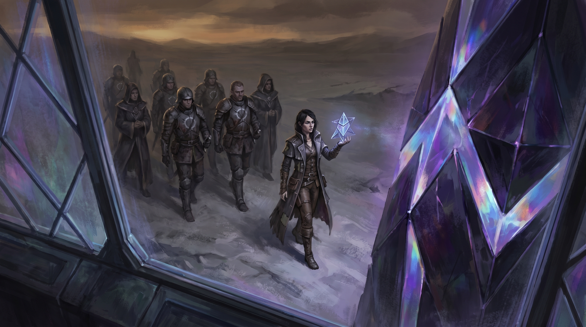
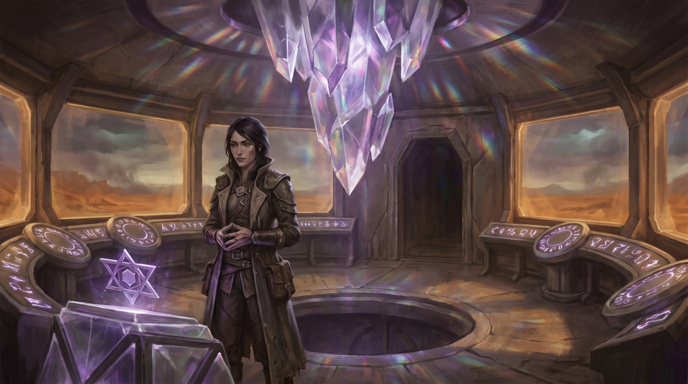
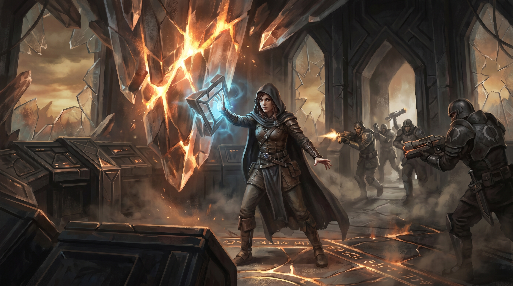
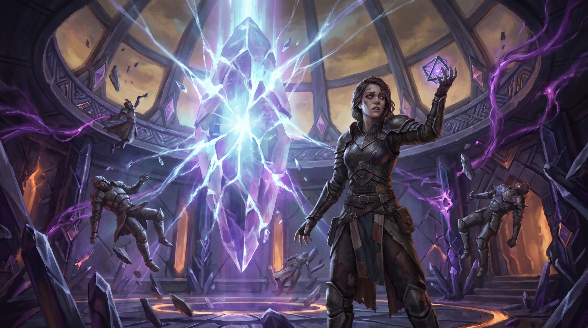
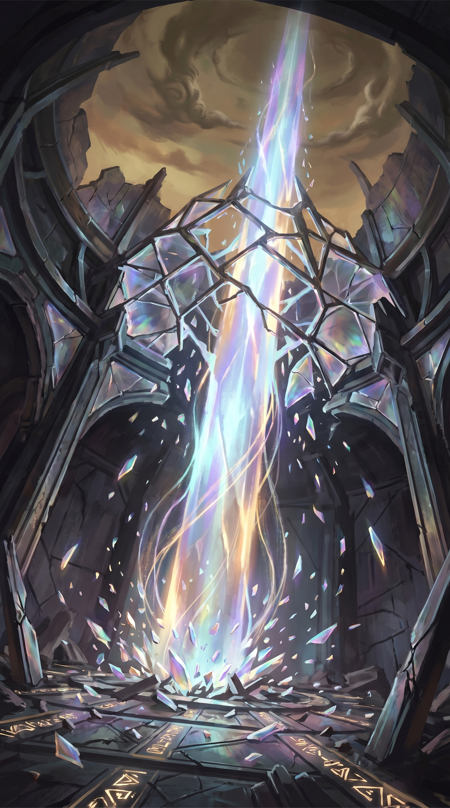
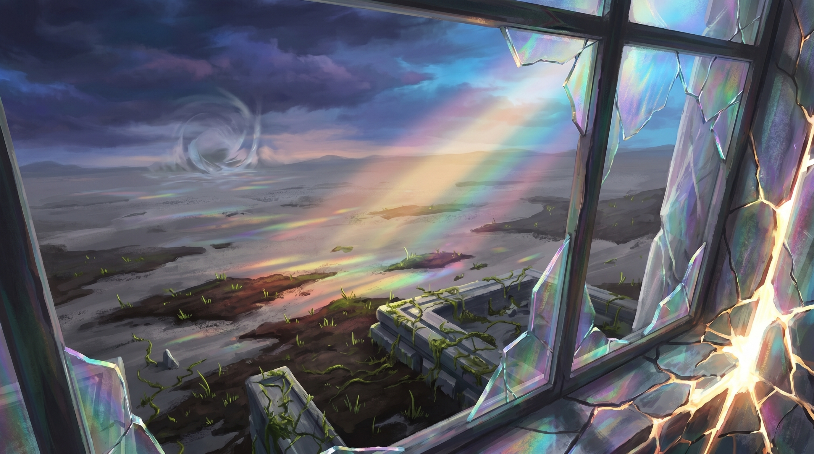
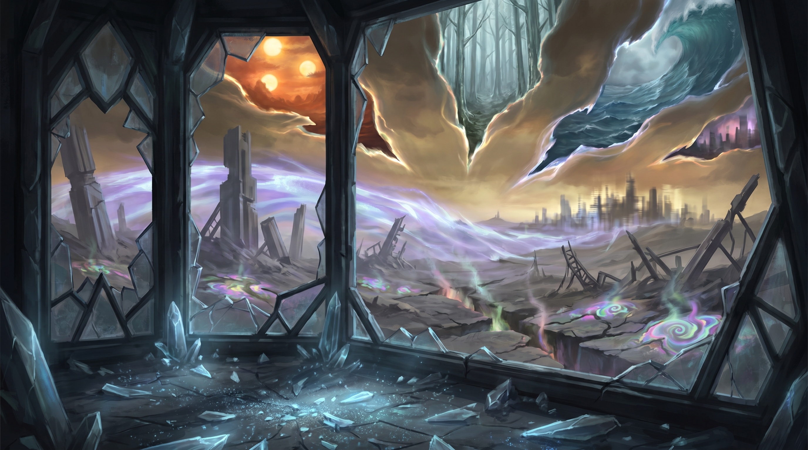

# Chapter 7: The Crimson Threshold

**Session(s):** 7-8
**Level:** 7
**Expected Duration:** 3-4 hours
**Time:** Day 11-12 of the campaign (immediately following Chapter 6)

---

## Chapter Overview

**Synopsis:** [Sera Mourne](npcs.md#sera-mourne-the-threadcutter) -- the Threadcutter -- arrives at the [Eld Pylon of Keth](locations.md#the-eld-pylon-of-keth) with her remaining Unraveler forces and the Resonance Key, a device capable of shattering the Pylon's crystal matrix and destroying the fifth Beam. What follows is the campaign's climax: a multi-phase confrontation that weaves combat, moral reckoning, and the accumulated weight of every choice the party has made. Sera's argument is not hollow -- the Old Ones' own records suggest the Beams were transitional, never meant to hold forever. But her method is a sledgehammer where a scalpel was needed, and the people she broke along the way cannot be unbroken. The party must decide: preserve the Beam, let it fall, or find a third way that costs something personal from everyone in the room.

**Objectives:**
- Confront Sera Mourne and hear her case
- Survive a multi-phase combat where the Pylon itself becomes a hazard
- Determine the fate of the fifth Beam through one of multiple resolution paths
- Resolve the campaign's central moral question: are the Beams sutures or chains?
- Experience the consequences of choices made throughout the campaign

**Key NPCs:** [Sera Mourne](npcs.md#sera-mourne-the-threadcutter), [Commander Dace](npcs.md#commander-dace) (conditional), [Wren](npcs.md#wren) (conditional), [Aldric Vane](npcs.md#aldric-vane) (via communication crystal), [Moth](npcs.md#moth) (conditional)
**Key Locations:** [The Eld Pylon of Keth -- Control Chamber and Core](locations.md#the-eld-pylon-of-keth)

---

## Scene 1: The Threadcutter's Arrival

*Estimated time: 45-60 minutes*

### Introduction

> Dawn finds you in the Control Chamber, sixty feet above the Ashlands, and for the first time since the Waystation, the light looks almost right. The crystal matrix hangs from the ceiling like a chandelier carved from a single impossible gem -- twelve feet across, multifaceted, pulsing with the Beam's energy in a deep, rhythmic glow that you feel in your ribs. It is a heartbeat. The Beam's heartbeat. It has been beating since before your grandparents' grandparents drew breath, and standing beneath it, you understand viscerally what it means for something this old and vast to be fragile.
>
> Control consoles ring the chamber walls, their geometric surfaces dark but warm to the touch. The floor's inscribed patterns glow faintly -- amber and rose -- tracing circuits that connect the consoles to the matrix above. Windows of transparent crystal offer a panoramic view of the Ashlands in every direction: ash-gray earth, the skeletal fingers of dead forests, a sky that can't decide what color it wants to be.
>
> The light is the first thing that changes. The prismatic patterns the matrix scatters across the Ashlands -- those fragments of color that made the wasteland almost beautiful -- dim. Not extinguished. Eclipsed. Something is between you and the horizon.
>
> You see them on the western approach. A column of figures, dark against the amber sky, moving with purpose across the ash. At their head, a woman walks with the unhurried certainty of someone who believes history is on her side. She does not run. She does not need to. She has been walking toward this moment for years.
>
> She carries something in her right hand. Even at this distance, the crystal matrix reacts -- a shudder in its rhythm, a stutter in its light, as if the heart skipped a beat.



### DM Information

This is the campaign's most important social encounter. Everything that follows depends on how this conversation unfolds. Sera Mourne has arrived to do what she believes is necessary, and she is willing to talk first -- not because she doubts herself, but because she respects what the party has accomplished. She wants to be understood, not just obeyed.

**Sera's Timeline:** Her letter in Chapter 4 estimated arrival at the Pylon "within eight days" -- written six days before the party found it, leaving roughly two days. But the Thinny storm that struck Loom also tore across Sera's route. Her column was forced into a multi-day detour through stable terrain, and the Resonance Key required recalibration after exposure to the storm's reality warps. She arrives on Day 11--12, roughly four days later than her original estimate.

**Sera's Forces:** She has 6 Unraveler soldiers (Veterans, MM p.350) and 2 Channelers (Mages, MM p.347) with her. They hold position at the Pylon's base while Sera approaches the entrance alone. Dace's earlier estimate of 15--20 soldiers was accurate when he left Sera's main force, but the same Thinny storm that delayed Sera tore through their column -- she lost nearly half her soldiers to reality warps and desertions in the aftermath. The force that arrives is what survived.

**The Guardians:** The Pylon Guardians from Chapter 6 still control the entrance. They will not admit Sera unless the party deactivates them or she uses a bypass code she obtained from the Old Ones' records.

- If the Guardians block her: Sera can crack their defenses in 10 rounds using the Resonance Key from outside. The party hears the Guardians' distress -- a keening harmonic that reverberates through the Pylon's structure.
- If the party lets her in: She ascends alone, leaving her forces below. She enters the Control Chamber unarmed except for the Key.
- If the party forces her to breach: She does, but it costs her -- the forced entry damages the Pylon's outer systems and sets her mood from "respectful" to "resolved." The Persuasion DC to convince her to stop increases by 2.

### NPC Present

**[Sera Mourne](npcs.md#sera-mourne-the-threadcutter) -- The Threadcutter**
- **Appearance:** Early 40s, lean and intense. Dark hair cut short -- practical, not stylish. Sharp features that might have been beautiful before years of obsession carved them into something harder. Her eyes burn with certainty -- not madness, not cruelty, but the absolute conviction of someone who has done the math and accepted the answer. She wears a scholar's coat over traveling leathers, and her hands are ink-stained. She carries the Resonance Key in her right hand like a professor carrying a lecture pointer.
- **Attitude:** Calm, articulate, respectful. She addresses the party as equals -- people who have earned the right to hear the truth, even if they disagree with her conclusions. She does not gloat, does not threaten, does not posture. She is a woman who has made peace with being the villain of someone else's story, because she believes the alternative is worse.
- **Speech Pattern:** Measured, academic, with sudden flashes of passion when she talks about freeing reality. She speaks in complete, precise sentences -- the habit of someone who spent decades writing and defending theses. She quotes the Old Ones' records from memory, in translation, with the casual authority of someone who has read the primary sources. When emotional, her cadence quickens and her voice drops rather than rises. *"I have read every surviving record the Old Ones left. Every one. And do you know what they never wrote? They never wrote 'forever.' Not once."*
- **Wants:** To complete her life's work. To destroy the fifth Beam. To prove that her sacrifices -- and the sacrifices she demanded from others -- were not in vain.
- **Fears:** That she is wrong. That the Breakers suffered for nothing. That she has become the kind of person she once studied with horror in history books.
- **Stats:** Archmage (MM p.342) with the following modifications: spell save DC 19 (base 17 + 2), add Telekinesis to her prepared spells, and she carries the Resonance Key. She has legendary resistance (2/day).

### The Parlay

When Sera enters the Control Chamber, read:

> She stops three paces inside the doorway. Her gaze sweeps the room -- the consoles, the matrix, the Beam's light pouring upward through the crystal and into the sky -- and something crosses her face that is not triumph or hunger but *recognition*. She has been here before, in her studies. In her dreams. She has imagined this room ten thousand times.
>
> Her eyes find you. She sets the Resonance Key on the nearest console -- a deliberate gesture, placing the weapon down -- and folds her ink-stained hands in front of her.
>
> "You're the ones the Constant chose." Not a question. Her voice is measured, each word placed like a stone in an arch. "I'd hoped you would be. People who can survive the Ashlands, infiltrate a Breaker Station, and activate a dormant Pylon -- those are people worth talking to."
>
> She pauses. Looks up at the crystal matrix.
>
> "You know what that is. You've read the records -- I can see it in the way you look at it. Not with awe. With understanding." A breath. "So let me say what I came to say, and then you can decide whether I'm a monster or the only person in this dying world who's willing to do what needs to be done."



**Sera's Argument (deliver through dialogue, not monologue -- let the party interrupt):**

**Point 1 -- The Beams Were Never Permanent:**

> "The Old Ones built the Beams as a transitional system. Their own records say so. The Beams were meant to stabilize reality during a period of planar upheaval -- the same upheaval that eventually became the Fracturing. They were sutures, yes. But sutures are meant to come out. You don't leave them in forever. The wound heals or it doesn't, but the stitches staying in? That creates its own kind of damage."

**Point 2 -- The World Is Trapped:**

> "Two hundred years. The Beams have held reality in a fixed state for two hundred years. The planar boundaries can't adjust. The world can't evolve. New forms of magic that should have emerged naturally are being suppressed. The Feywild and the Shadowfell are pressing against barriers that should have thinned gradually over generations -- instead they're building pressure like water behind a dam. When the last Beam breaks -- and it *will* break, with or without me -- that dam doesn't open. It bursts."

**Point 3 -- The Breaker Stations (acknowledging the cost):**

> "I won't pretend the cost was nothing."
>
> She stops. For the first time, the measured cadence fractures.
>
> "Every person in those chairs haunts me. Their names are written in a book I keep. I know them. I *chose* to know them, because if I'm going to demand that kind of sacrifice, I owe them the dignity of remembering who they were."
>
> She steadies.
>
> "The Beams are killing reality slowly. The Stations accelerated what needed to happen. I chose the lesser evil. I will carry that choice for the rest of my life. But I will not apologize for it -- because the alternative is watching every living thing in this world die by inches while we congratulate ourselves on our clean hands."

**Point 4 -- The Ask:**

> "You've seen the records. You know I'm right about the premise. We only disagree on timing and method. So I'm asking -- not demanding, *asking* -- you to step aside. Let me do what the Old Ones intended. What they failed to finish."

### Player Responses and Sera's Counters

**If the party presents the Old Ones' truth from Chapter 6** (the Beams were meant for GRADUAL removal):

> Sera pauses. Her eyes narrow -- not with anger, but with the sharpened attention of a scholar encountering new data. She considers it. You can see her processing, cross-referencing, weighing.
>
> "Gradual." The word comes slowly. "Over millennia. A controlled deceleration across centuries of adjustment." Another pause. "We don't have millennia. Two Beams remain. The system is failing on its own -- you've *seen* the Thinnies, the phasing, the temporal drift. The gradual approach assumed six functional Beams and a civilization capable of managing the transition. We have two Beams and a handful of survivors hiding in a city that can't decide what century it exists in."
>
> She gestures at the crystal matrix.
>
> "I'm offering a controlled demolition instead of an uncontrolled collapse. The Resonance Key doesn't just shatter -- it *channels*. I've calibrated it. The energy release will be directed, shaped, managed. It will be violent, yes. But it will be *intentional*. And that is more than this world will get if we wait for the Beam to fail on its own."

**DM Note:** Sera has a point about the urgency -- but "controlled" with the Resonance Key means *sudden*, not gradual. The Key channels the energy release, but the Beam still dies in seconds. The difference between her "controlled demolition" and a natural collapse is that her version is directed. The similarity is that both are catastrophic.

**If a PC challenges her on the Breaker Stations with evidence of suffering:**

> "I know what I did to them." No defensiveness. Raw. "I held Wren's hand while we connected her. She was sixteen. Did you know that? Sixteen years old and more psychically powerful than anyone I've ever tested. I told her it would save the world. I believed it. I still believe it."
>
> A beat.
>
> "Do you think I don't see their faces when I close my eyes? I'm not asking you to forgive me. I'm asking you to consider the possibility that sometimes the right thing and the monstrous thing wear the same face."

**If a PC makes a personal connection** (appealing to her as a scholar, sharing their own sacrifices, or speaking about the cost of certainty):

Sera responds with genuine engagement. She leans forward. Her academic armor cracks, and the person underneath -- exhausted, haunted, desperately hoping she hasn't wasted everything -- becomes visible.

> "You understand. Even if you disagree, you *understand*. That's more than the Covenant ever offered me. They just said 'no' and called me a heretic. As if questioning the Old Ones' design was the same as questioning the gods."

### Persuasion Mechanics

**Base DC:** 18 Persuasion to convince Sera to stand down.

**Reductions:**
- Old Ones' truth presented (gradual transition plan from Chapter 6): -2
- [Commander Dace](npcs.md#commander-dace) turned against her and speaks to her directly: -2
- Evidence of Breaker suffering presented compellingly (from Chapter 4): -2
- A PC makes a genuine personal connection (DM judgment -- the argument must be specific and sincere, not generic): -2
- [Aldric Vane's](npcs.md#aldric-vane) secret revealed (he was her teacher, and he speaks to her through the communication crystal): -2

**Minimum DC:** 12 with all reductions applied.

**If Aldric's Secret Is Revealed:**

If the party contacts Aldric through the communication crystal and he reveals that he was once an Unraveler -- that Sera was his student -- the effect is immediate and profound. Read:

> The crystal hums. Aldric's voice fills the chamber, and Sera goes still. Utterly, completely still. Like a woman who has just heard a dead language spoken aloud.
>
> "Sera." His voice is quiet. Careful. The way you handle something fragile. "It's been a long time."
>
> She stares at the crystal. The certainty in her eyes doesn't break -- but it bends. Something beneath it shifts, like ice over a river that still moves.
>
> "You left." Two words. A decade of fury compressed into a whisper.
>
> "I did. Because I saw what the Stations did to people, and I couldn't--"
>
> "*I* saw what they did to people. Every day. I stayed because someone had to finish what you started." Her hands are shaking. "You don't get to leave and then tell me I'm wrong."
>
> "I'm not telling you you're wrong, Sera. I'm telling you there's another way. There was always another way. I was too afraid to look for it, and you were too certain to need one."

This exchange reduces the Persuasion DC by an additional 2 and gives the party advantage on the check.

### Resolution of the Parlay

**If the party succeeds (Sera is convinced):**

> The silence in the Control Chamber is absolute. Even the crystal matrix seems to hold its breath.
>
> Sera looks at the Resonance Key on the console. She reaches for it -- and for one terrible moment, you think she's going to activate it anyway. Instead, she picks it up, holds it in both hands, and closes her eyes.
>
> "If I stop now," she says quietly, "the Breakers suffered for nothing."
>
> She opens her eyes. They are bright. Not with certainty this time, but with something rawer and more honest.
>
> "No. That's not true. They suffered because I was wrong about the method. Not about the premise." She sets the Key back down. "Show me the gradual transition. Show me the Old Ones' protocol. If there's a way to do this without breaking the world apart... I'll help you find it."

Sera agrees to a ceasefire. She orders her forces to stand down. The Beam is preserved, and a fragile alliance forms. The campaign ends with the Beam intact and a new mission: find the Old Ones' transition protocol. Proceed to **Scene 5: Epilogue**.

**If the party fails (Sera is not convinced):**

> Sera listens. She considers. You can see her weighing your words the way she weighs everything -- carefully, thoroughly, with the full force of a brilliant mind.
>
> And then she shakes her head.
>
> "You've given me arguments. Good ones. But arguments don't change the math." She picks up the Resonance Key. "Two Beams. One dying on its own. The dam is cracking and you're asking me to apply sealant. I'm sorry. I genuinely am. But I didn't walk through the Ashlands and build the Stations and sacrifice everything I had so I could stop at the threshold and say 'maybe next century.'"
>
> She turns to the crystal matrix. The Key begins to hum.
>
> "If you want to stop me, stop me. But know that you're choosing the slow death over the painful cure. And I hope -- I truly hope -- you're right and I'm wrong."

Combat begins. Proceed to **Scene 2: Phase 1 -- The Assault**.

### Connections
- **To Scene 2:** If Sera is not convinced, the Key activates and combat begins.
- **To Scene 5:** If Sera is convinced, skip to the Epilogue.

---

## Scene 2: Phase 1 -- The Assault

*Estimated time: 30-40 minutes (rounds 1-4)*

### Introduction

> The Resonance Key screams. Not the mechanical whine of a device powering up -- a *scream*, high and anguished, as if the Key itself knows what it's about to do. Sera presses it against the crystal matrix, and the moment metal touches crystal, the world flinches.
>
> The matrix shudders. A hairline crack appears across its largest facet -- and from that crack, light pours. Not the warm, rhythmic glow of the Beam. Something harsher. Something that burns the back of your eyes and tastes like copper and regret.
>
> From below, the sound of boots. Her soldiers are coming.



### DM Information

This is a complex combat encounter with a ticking clock. The party must either stop the Resonance Key, defeat Sera, or convince her to stop -- all while fighting her soldiers and dealing with increasing environmental hazards.

**Dramatic Question:** Can the party stop the Key before the Beam shatters?

**Stakes:** If they succeed, the Beam survives (damaged but intact). If they fail, the fifth Beam is destroyed and only one remains.

### Terrain: The Control Chamber

```
                    N
+--------------------------------------------+
|                                            |
|         [Crystal Matrix - 15 ft]           |
|           (suspended from ceiling,         |
|            center of room)                 |
|              * KEY HERE *                  |
|                                            |
|   [Console]                    [Console]   |
|                                            |
|                                            |
|        [Console]      [Console]            |
|                                            |
|   [Console]                    [Console]   |
|                                            |
|                                            |
|            [Shaft Entrance]                |
|                  S                         |
+--------------------------------------------+
         60 ft diameter circular room
```

- The **crystal matrix** hangs from the ceiling at the room's center. The Resonance Key is pressed against its lowest facet, 8 feet off the ground. Reaching it requires either a 10-foot reach, a DC 10 Athletics check to climb the solidified light-threads, or flight.
- Six **control consoles** ring the walls, each 3 feet tall -- providing half cover.
- The **shaft entrance** on the south side opens to the Pylon's interior shaft. Soldiers enter from here.
- **Crystal windows** line the walls between consoles. They are transparent but reinforced (AC 15, HP 30). Breaking one creates a 5-foot opening to a 60-foot drop.
- The **floor inscriptions** glow brighter as the Key activates. Standing on a glowing inscription when it pulses grants resistance to force damage for that round (DC 12 Arcana to notice this pattern).

### Enemies

**In the room at combat start:**
- **Sera Mourne** (Archmage, modified -- see NPC stats above)
- **2 Channelers** (Mages, MM p.347)

**Reinforcements:**
- **Unraveler Soldiers** (Veterans, MM p.350) enter from the shaft -- 2 per round starting on round 2, maximum 6 total. They arrive at the shaft entrance and act on initiative count 10.

### The Resonance Key Countdown

Once the Key is placed against the crystal matrix, it begins a 10-round countdown. Track this visibly -- announce the round number. The players should feel the clock.

| Round | Energy Pulse | Effect |
|-------|-------------|--------|
| 1-3 | 1d6 force damage | DC 14 Constitution save for half. The matrix cracks. Light pours through. |
| 4-6 | 2d6 force damage | DC 14 Constitution save for half. The cracks widen. Reality stutters. |
| 7-9 | 3d6 force damage | DC 14 Constitution save for half. The Beam is visible -- a pillar of light wavering like a candle. |
| 10 | The Beam shatters | No save. The fifth Beam is destroyed. |

The pulse affects every creature in the Control Chamber at the start of each round (before anyone acts). The damage is force energy bleeding from the matrix.

**Narrative beats for each pulse:**

*Rounds 1-3:*
> The matrix cracks like ice in spring. Light escapes through the fracture lines -- not warm, not cold, but *heavy*, pressing against your skin with the weight of something that has been constrained for centuries.

*Rounds 4-6:*
> The cracks are spreading. The light pouring from them casts shadows that move on their own -- your shadow takes a step you didn't take, turns a direction you didn't turn. The taste of copper fills your mouth. The Beam's heartbeat is arrhythmic now, stumbling.

*Rounds 7-9:*
> The Beam itself is visible through the shattered facets of the matrix -- a pillar of light shooting upward through the crystal and into the sky, wavering, thinning, dying by degrees. It is beautiful and terrible and you understand, in this moment, that you are watching one of the oldest things in the world decide whether to live or die.

### Stopping the Key

**Option 1 -- Physical Removal:**
- DC 18 Strength check while adjacent to the matrix (within 5 feet, 8 feet up).
- If Sera is alive and can see the attempt, she uses her reaction to impose disadvantage with Telekinesis.
- On success, the Key detaches. The countdown pauses. Sera will attempt to reattach it on her next turn if she can reach it.
- If the Key is removed and held by a PC, Sera targets that PC with everything she has.

**Option 2 -- Destroy the Key:**
- AC 18, HP 50, immune to force and psychic damage.
- The Key is attached to the matrix 8 feet up. Ranged attacks work normally. Melee attacks require the same positioning as physical removal.
- When destroyed, the countdown ends. The matrix is damaged but stabilizes. A shockwave of force energy deals 3d6 force damage to everyone within 10 feet (DC 14 Dexterity save for half).

**Option 3 -- Convince Sera Mid-Combat:**
- DC 15 Persuasion during combat, but Sera must be below half HP for her certainty to waver. Above half HP, she is resolute -- persuasion attempts fail automatically.
- Below half HP, apply the same DC reductions as Scene 1. If the party already presented strong arguments during the parlay, those reductions carry over.
- Convincing Sera mid-combat causes her to deactivate the Key as a free action. She collapses against the nearest console, spent. Her soldiers surrender within 1d4 rounds.

### Sera's Tactics

Sera fights defensively. Her goal is to run out the clock, not to kill the party.

**Priority Order:**
1. Maintain position near the crystal matrix. She stays within 15 feet of the Key at all times.
2. Use Shield (reaction) and Counterspell (reaction) to survive. She saves her legendary resistances for effects that would incapacitate her or move her far from the matrix.
3. Target the party's strongest martial character with Hold Person to remove them from the fight.
4. Use Telekinesis to push PCs away from the Key or to impose disadvantage on removal attempts.
5. If cornered, she uses Wall of Force to create a barrier between herself (and the Key) and the party. This buys 10 minutes -- more than enough for the countdown.

**What Sera Will NOT Do:**
- She will not use Fireball or other area damage in the Control Chamber -- the risk of destabilizing the matrix further is too great even for her.
- She will not target downed PCs. She has no interest in killing them.
- She will not flee. She has staked everything on this moment.

### Commander Dace (Conditional)

**If Dace is an ally (turned in Chapter 6):** He fights alongside the party, focusing on the incoming soldiers. He knows their tactics and calls out warnings. *"Two coming up the shaft -- they'll fan left. Channeler behind them."* If he was Sera's lieutenant, his presence visibly shakes her. When she sees him fighting against her forces, she hesitates -- disadvantage on her next spell attack roll or spell save DC (her choice, DM picks whichever is more dramatic).

**If Dace was captured but not turned:** The party can release him. He is conflicted but will fight against the soldiers (not against Sera directly). He shouts at her: *"This isn't what we were supposed to be, Commander!"*

**If Dace is dead:** His absence is felt in the soldiers' disorganization -- they arrive without coordinated tactics. Each soldier acts independently rather than in tactical pairs.

### Connections
- **To Scene 3:** At round 5, or when Sera drops below half HP, the crystal matrix destabilizes. Phase 2 begins.

---

## Scene 3: Phase 2 -- The Surge

*Estimated time: 20-30 minutes (rounds 5-7)*

### Introduction

> The matrix screams.
>
> Not the Key's mechanical shriek -- the *crystal* screams, a sound that bypasses your ears entirely and detonates in the center of your skull. The largest facet of the matrix splits open like a wound, and what pours out is not light. It is *reality*, unfiltered and raw, and it hits the Control Chamber like a wave hitting a seawall.
>
> The floor tilts. Not metaphorically -- the *floor tilts*, as if gravity has decided that north is now down. Consoles tear from their mountings and slide. The windows crack. Through the cracks, you see the Ashlands, but they're *wrong* -- the sky is three different colors simultaneously and the ground is breathing.
>
> And at the edges of the room, where the crystal's light doesn't quite reach, shapes press against the walls of reality. Dim. Vast. Patient. Things from the Far Realm, drawn to the wound in the world like sharks to blood. They are not through yet.
>
> But they are watching.



### DM Information

The Control Chamber has become a hazard zone. The Pylon's crystal matrix is destabilizing, and reality is breaking down around everyone -- party, enemies, and Sera included. This phase is designed to raise the stakes dramatically while opening the door for Sera's emotional armor to crack.

### Environmental Hazards

At the start of each round (before the Resonance Key pulse), roll or choose one of the following effects. Each lasts until the start of the next round unless noted otherwise.

**Gravity Shift:**
> The world lurches. What was the floor is now a wall.
- Every creature in the room makes a DC 14 Dexterity saving throw. On a failure, the creature falls toward the "new" floor (a wall or the ceiling), taking 2d6 bludgeoning damage and landing prone.
- Creatures that succeed grab onto a console, a light-thread, or another fixed surface and are not moved.
- The gravity shift lasts one round, then reverts. Creatures "on the ceiling" fall again when gravity normalizes unless they are secured.

**Temporal Stutter:**
> The air thickens. Time skips like a scratched record.
- At the start of the round, one random creature (roll d20; 1-10 = a PC chosen randomly, 11-18 = an enemy chosen randomly, 19-20 = Sera) is frozen in a temporal loop. That creature loses its turn entirely -- it is visible but motionless, eyes fixed on a moment that has already passed. The effect ends at the start of the affected creature's next turn.

**Far Realm Bleed:**
> The walls of the chamber become translucent. Beyond them, vast shapes move in impossible geometries. Eyes the size of moons blink slowly. A sound like wet laughter echoes from no direction.
- Every creature in the room makes a DC 13 Wisdom saving throw. On a failure, the creature is frightened until the end of its next turn. While frightened, it cannot willingly move closer to any window or wall.
- Creatures that succeed feel the presence but are not overwhelmed.

**DM Note:** Choose the hazard that creates the most dramatic moment. If a PC is about to reach the Key, hit them with a gravity shift. If the fight is too easy, use the temporal stutter on a key PC. If the mood needs to shift from tactical to terrifying, use the Far Realm bleed. The randomness is a suggestion, not a mandate.

### The Crystal Matrix Deterioration

Describe the matrix's ongoing collapse between rounds:

> The cracks in the matrix are spreading like frost across glass. Each new fracture releases a beam of light so bright it leaves afterimages -- the silhouette of the room's true geometry burned into your vision even when the walls have shifted. The crystal's scream is constant now, a harmonic that makes your teeth ache and your bones hum.

The light pouring from the cracks is painful. Any creature that starts its turn within 5 feet of the matrix (in addition to the Key's pulse damage) takes 1d4 radiant damage. No save. The light of a dying Beam cares nothing for resistance.

### Sera During the Surge

Sera is affected by the environmental hazards too. She is struggling. Her concentration on maintaining the Key's calibration is being shattered by the same forces she unleashed. Describe her:

> Sera braces against a console as gravity shifts, her boots scraping across the tilting floor. The certainty on her face is cracking with the matrix. She is not in control. She thought she would be. The Resonance Key was supposed to make this *clean* -- a controlled demolition, she said. This is not controlled. This is a wound that has decided to bleed.

**Sera's combat effectiveness is reduced during Phase 2:**
- She loses one of her prepared 5th-level spell slots (she used it maintaining the Key's calibration field).
- Her Telekinesis concentration is at risk. If she takes damage, she must make a concentration check as normal. If she loses Telekinesis, she cannot reimpose disadvantage on Key removal attempts.
- She does not use her legendary resistances against environmental hazard saves -- she saves them for PC-imposed effects only.

### Turning Point: The Call

If any PC speaks directly to Sera during this phase -- not a Persuasion check, not a mechanical interaction, just *talking to her* -- she responds. This is the moment where the person beneath the Threadcutter becomes visible.

> She turns to you. The chamber is breaking apart around you both, gravity uncertain, the Far Realm pressing close, and for one moment the fight stops being about the Beam and becomes about a woman standing in the ruins of her own certainty.
>
> "I've given everything for this." Her voice cracks. Not the measured academic cadence -- something younger, rawer, the voice of the student Aldric once knew. "*Everything.* My career, my principles, the people I -- don't you understand? If I stop now, it was all for nothing. The Breakers suffered for *nothing.*"

This is the moment where mid-combat persuasion becomes possible. DC 15, reduced as described in Scene 1 (and those reductions carry over from the parlay). The party has advantage if Sera is below half HP and visibly shaken by the Surge's effects.

**If a PC succeeds:** Sera reaches for the Key with trembling hands. She deactivates it. The countdown stops. Proceed to **Scene 5: Epilogue** (Beam saved path). Remaining enemies surrender within 1d4 rounds.

**If no PC engages with Sera:** She refocuses. The window for mid-combat diplomacy narrows. After round 7, she is no longer open to persuasion -- she has committed fully.

### Connections
- **To Scene 4:** At round 8, or when the situation becomes desperate, Phase 3 begins.

---

## Scene 4: Phase 3 -- The Choice

*Estimated time: 20-30 minutes (rounds 8-10)*

### Introduction

> The crystal matrix is fracturing. Not cracking anymore -- *fracturing*, pieces of it falling away like shards of a broken mirror, each fragment trailing threads of solidified light that snap and whip through the air. The Beam is naked now -- visible through the matrix's skeleton as a pillar of light, vast and ancient and wavering like a candle flame in a hurricane.
>
> The light is beautiful. It is the most beautiful thing you have ever seen. It is the color of every dawn you've ever watched and every star you've ever wished on, compressed into a single pillar that stretches from the crystal matrix into a sky that has forgotten how to be blue.
>
> It is dying.
>
> The countdown continues. The Key pulses. The room shakes. And in this moment -- this desperate, fractured, impossible moment -- you understand that you have a choice to make. Not a tactical choice. Not a strategic choice. A choice about what the world should be.



### DM Information

This is the climax of the climax. The party has seconds to act. Three paths remain open, and the one they choose defines the campaign's ending. Present all available options clearly -- this is not the time for obfuscation. The players should know what they can do, even if the outcomes are uncertain.

### Option 1: Destroy the Key

Stop the destruction. Save the Beam.

**How:** Physical removal (DC 18 Strength), destruction (AC 18, HP 50 -- it has taken damage from whatever the party dealt earlier), or defeating/convincing Sera.

**What Happens:** The Key is removed or destroyed. The Beam stabilizes -- damaged, dimmer than before, but alive. The crystal matrix seals its cracks over the next minute, a process that looks like watching a wound heal in fast-forward. The countdown ends.

**The Cost:** The Beam is weakened. It will hold, but for how long? The system was never meant to run on two Beams. The world continues as it was -- broken, decaying, but not dead. The fundamental question remains unanswered: what happens when the last Beams eventually fail on their own?

### Option 2: Let the Beam Fall

Step aside. Let the Key complete its work.

**How:** The party stops fighting. They let the countdown reach 10. Or they decide, through conversation and consensus, that Sera is right -- or right enough.

**This requires no check.** It requires the party to make a choice and live with it.

**What Happens:** The Resonance Key completes its work. The crystal matrix shatters. The Beam dies.

Read:

> The crystal matrix detonates. Not outward -- *inward*, collapsing in on itself like a star dying, drawing the Beam's light down into a single, impossibly bright point that hangs in the air where twelve feet of crystal used to be. The point holds for one heartbeat. Two.
>
> Then it goes out.
>
> The silence that follows is the loudest thing you have ever heard. It is the sound of something that has been humming for millennia finally stopping. The absence is physical. You feel it in the pull of the Constant -- a phantom limb where the Beam used to be.
>
> Through the broken windows, you see it begin. The Ashlands shudder. The sky tears. In the distance, Thinnies bloom like poisonous flowers -- tears in reality opening one after another, a chain reaction spreading outward from the dead Pylon. The world is dying faster now.
>
> Sera stands in the center of the room, the Resonance Key dark and spent in her hand. She is staring at the sky. At the Thinnies. At the cost of her conviction, written across the world in wounds of light.
>
> She does not look triumphant.

**The Cost:** The fifth Beam is gone. Only the sixth remains. Reality in the region begins to unravel. The party must live with this choice -- and with the knowledge that the world is one catastrophic failure away from total collapse. But the pressure behind the dam has been reduced. The question is whether the relief was worth the flood.

### Option 3: The Third Way

Modify the Beam. Not destroying it, not preserving it -- *loosening* it. Begin the gradual transition the Old Ones intended.

**Requirements:**
- [Wren](npcs.md#wren) must be present (freed in Chapter 4)
- [Moth](npcs.md#moth) must be present (activated in Chapter 2)
- The Old Ones' truth must have been discovered (Chapter 6)

If all three conditions are met, this option becomes available. If Wren is NOT present, a PC can take her role -- at greater cost (see below).

**How It Works:**

Wren explains (or a PC intuits, if they have the Old Ones' records and Moth's guidance):

> "The Pylon's systems can be recalibrated. The Key isn't just a weapon -- it's a *tool*. It was designed to interact with the matrix. If we channel the right energy through it -- not to shatter, but to *tune* -- we can loosen the Beam's structure without breaking it. Like... like easing a tourniquet instead of cutting it off."

**The Process:**

1. **Wren channels her psychic energy through the Pylon's systems.** She places her hands on the crystal matrix and opens herself to the Beam's resonance. She takes **6d6 psychic damage** and must succeed on a **DC 15 Constitution save** or gain a permanent flaw: her psychic senses become erratic -- she hears the Beam's echo at random moments, perceiving things that are between worlds. (This is not purely negative -- it gives her occasional flashes of insight, but it is painful and disorienting. She lives with whispers.)

2. **A PC channels the Constant through the crystal matrix.** This requires physical contact with the matrix and a willing acceptance of the energy. The PC takes **3d6 force damage** (no save) as the Beam's raw energy flows through them. The Constant in their blood acts as a filter, translating the Beam's rigid structure into something more flexible.

3. **Moth interfaces with the Pylon's control systems.** If Moth is present, this is automatic -- Moth connects to a console and begins recalibrating the Key's frequency. If Moth is not present, a PC must make a **DC 16 Arcana check** to manually recalibrate (failure means the process still works, but the PC takes an additional 2d6 force damage from feedback).

**If Wren Is NOT Present:**

The third option is still available, but a PC must take Wren's role. The cost is higher: **6d6 psychic damage** and a **DC 15 Constitution save**. On a failure, the PC suffers a **permanent reduction of 2 to one ability score** of their choice (representing the part of themselves they poured into the Beam). This cannot be reversed by anything short of a Wish spell.

**What Happens:**

Read when the Third Way succeeds:

> The crystal matrix shudders -- not the violent fracturing of the Key's assault, but a slower, deeper vibration, like a muscle unclenching after years of tension. The cracks in the matrix don't seal. They *soften*. The edges blur, becoming less like wounds and more like... seams. Deliberate. Structural. Part of a new design.
>
> The Beam's light changes. It was rigid before -- a pillar, a column, an inflexible line drawn between earth and sky. Now it breathes. It flexes. It shifts through colors you've never seen -- colors that exist in the spaces between the planes, colors that the Beams have been suppressing for two hundred years.
>
> Through the windows, the Ashlands respond. Not dramatically -- not the sudden healing of a miracle. But the sky's wrong amber shifts a degree closer to blue. A wind rises that smells of rain, not copper. And in the distance, where a Thinny was beginning to bloom, the tear in reality hesitates. Tightens. Closes. Not sealed. *Dissolved* -- the boundary between planes adjusting, becoming permeable where it was once rigid.
>
> The Constant hums through you. Not the pull you've felt since the Waystation -- something gentler. An approval. A recognition that what you've done here is what was always meant to happen.
>
> Wren collapses. [Or: You stagger backward from the matrix, something inside you permanently changed.] She is breathing. She is alive. But her eyes, when she opens them, have changed -- the irises shifting through colors like oil on water, seeing things that exist between worlds.
>
> "I can hear it," she whispers. "The Beam. It's... singing."

**The Cost:** Wren (or a PC) is permanently changed. The Beam holds, but it is less rigid -- reality in the region becomes slightly more fluid. The Thinning effect is gentler. Strange things will happen: flowers that bloom in impossible colors, animals that phase briefly between planes, the occasional whisper of the Feywild on the wind. It is not dangerous. It is *different*. And a precedent has been set: the Beams *can* be gradually removed, one at a time, over years, if the right people do the work.

---

## Scene 5: Epilogue

*Estimated time: 20-30 minutes*

### The Immediate Aftermath

Pause after the climactic moment. Let the players breathe. Let them process. Then, when the silence has said what it needs to say, deliver the epilogue for the outcome they chose.

### If the Beam Holds (Option 1 or Option 3)

> The Pylon's light strengthens. It is slow -- like watching a sunrise in fast-forward -- but it is unmistakable. The crystal matrix, cracked and battered but whole, seals its fractures. Each crack fills with new light, brighter than what was there before, as if the matrix is healing itself from the inside. The Beam's heartbeat steadies. Finds its rhythm. Holds.
>
> Through the windows, the Ashlands respond. It begins at the Pylon's base and ripples outward like a stone dropped in still water: the ash-gray earth darkens, enriches, becomes *soil*. Green pushes through -- not dramatically, not a forest springing to life, but a blade of grass here, a tendril of moss there, life remembering what it is and daring to try again.
>
> The sky clears. Not to the blue you remember from before the Fracturing -- this sky is something new. Broader. Deeper. A sky with room for colors that didn't exist before the Beams began to flex.
>
> In the distance, a Thinny that was blooming on the horizon pauses. Contracts. Fades. Not sealed -- *absorbed*. The boundary between worlds adjusting, accommodating, healing.
>
> The Constant hums. It is quiet and warm and, for the first time since the Waystation, it does not feel like urgency. It feels like gratitude.



### If the Beam Falls (Option 2)

> The Pylon goes dark.
>
> The crystal matrix -- what remains of it -- falls from the ceiling in a cascade of shards, each one catching the last of the Beam's light and scattering it across the chamber like funeral confetti. The threads of solidified light that held it snap, whipping through the air and dissolving into nothing. The sound of impact is enormous and small at the same time: the death of something ancient, registered by a world that barely noticed it was alive.
>
> Then the silence. And into the silence, the wrongness.
>
> Through the broken windows, you see it happen. A wave of distortion ripples outward from the Pylon, spreading across the Ashlands like a shockwave made of absence. Where it passes, things change. The sky tears -- not one tear but dozens, opening and closing like mouths gasping for air. The ground heaves. In the distance, Loom -- if Loom still stands -- flickers through time periods so fast it becomes a strobe.
>
> Thinnies bloom. They unfurl across the landscape like poisonous flowers, each one a wound in the world that will not close. Through them, you see glimpses of places that should not exist: a sky with three suns, a forest of glass, an ocean that flows upward. Beautiful and terrible and wrong.
>
> The Constant in your chest lurches. The pull shifts -- suddenly, violently -- pointing in a new direction. Distant. Desperate. The sixth Beam. The last one.
>
> The world is dying faster now. But it is not dead yet.



### Sera's Fate

**If alive and unconvinced (defeated in combat):**

> Sera sits against a console, her hands in her lap, the Resonance Key on the floor beside her. She does not reach for it. She is watching the windows -- watching the Beam's light strengthen, or watching the Thinnies bloom. Either way, her expression is the same: the look of someone who has arrived at the destination they spent their life walking toward and found it wasn't what they expected.
>
> If the Beam holds: "You saved it." A pause. "I hope you're right. I hope the gradual way works. Because if it doesn't -- if the last two Beams fail on their own in ten years or a hundred -- you'll wish you'd let me finish today."
>
> If the Beam fell: She stares at the Thinnies. At the tearing sky. Her hands are shaking. "It was supposed to be controlled." Almost a whisper. "I calculated the energy release. I accounted for the cascade. This wasn't... this wasn't supposed to..." She trails off. Swallows. "What have I done?"

**If alive and persuaded:**

> Sera stands by the nearest window, her arms crossed, watching the world change. She is shaken but present -- a woman who walked to the edge of an abyss and chose to step back. There is no relief on her face. Not yet. But there is the fragile, terrifying openness of someone who has admitted they were wrong about something fundamental and is still figuring out who that makes them.
>
> "I want to see the Old Ones' records. All of them. The gradual transition protocol -- I need to understand it. If there's a way to do what I tried to do without..." She gestures at the room. At the scars on the matrix. At everything. "Without *this*... I'll find it. I owe that much to the people in the chairs."

**If dead:**

> Sera's body lies near the crystal matrix, one hand still reaching for the Resonance Key. In death, the intensity is gone from her face. What remains is younger than you expected. Tired. The ink stains on her fingers are the last evidence of the scholar she was before she became the Threadcutter.
>
> In her coat pocket: a leather-bound journal, filled with meticulous handwriting. Research notes, translation fragments, and -- on the last page -- a list of names. Every Breaker who sat in a chair in a Station she built. She knew them all.

### Aldric's Message

> The communication crystal hums. Aldric's voice fills the chamber -- and for the first time, you hear what he sounds like when the weight he carries shifts.

**If the Beam was saved:**

> "I felt it." Relief. Raw, unguarded relief, the kind that comes from holding your breath for decades and finally being told you can exhale. "The Beam steadied. I felt it from here -- the Waystation's barrier brightened. Just for a moment. As if it remembered what it was like when all six were singing."
>
> A pause. When he speaks again, the measured cadence is back, but warmer.
>
> "You did what I couldn't. What I was too afraid to try and too broken to attempt. The Covenant will want to know everything -- the records, the Key, the Threadcutter's research. All of it."
>
> Another pause. Longer.
>
> "There is one Beam left. And now... now we know how to save them properly. Not by holding them in place -- by guiding them toward what they were always meant to become." His voice steadies. "Go. Find the sixth. And this time, do what the Old Ones couldn't finish."

**If the Beam was lost:**

> "I know." Two words, and they carry the weight of a man who has spent decades preventing exactly this. "I felt it die. The Waystation's barrier -- it dimmed. Not failing, not yet. But *grieving*. I didn't know a barrier could grieve."
>
> Silence. The crystal hums with static that sounds like breathing.
>
> "One Beam. One Beam between the world and the nothing." His voice hardens. Not with anger -- with resolve. The measured cadence becomes steel. "There is one Beam left. And now... now we know the cost of losing one. We know what the Threadcutter's 'controlled demolition' looks like."
>
> "Find the sixth Beam. Protect it. Find the Old Ones' true protocol -- the gradual way. Because if we lose the last one the way we lost this one..." He doesn't finish the sentence. He doesn't need to.

### The Constant

> As the dust settles and the light stabilizes -- or doesn't -- you feel it. All of you, at the same moment. The Constant.
>
> Not the familiar pull, not the directional sense you've carried since the Waystation. Something deeper. A vast awareness turning its attention toward you, the way a sleeping giant shifts in its dreams. It sees you. All of you. Not your names or your faces or your histories, but the shape of what you chose and the weight of what it cost.
>
> And it pulls. Gently, this time. Not the desperate yank of the Doors that dragged you from your lives -- a request. A direction. Far to the east, past the Ashlands, past the lands you know, toward something ancient and enormous and patient.
>
> The sixth Beam. The Tower. Whatever comes next.

### The Final Image

> You stand at the top of the Eld Pylon of Keth, sixty feet above a world that is broken but not yet dead. The wind through the shattered windows carries the smell of [ash and copper / rain and new earth -- choose based on outcome], and the sky is [three colors that shouldn't coexist / clearing to a blue deeper than any you've seen].
>
> Behind you: the crystal matrix, [dark and empty, a monument to what was lost / scarred but whole, pulsing with a light that has learned to breathe]. The people who fought beside you, bruised and bleeding and alive. The choices you made, carved into the world like letters in stone.
>
> Before you: the horizon. And beyond it, the pull. The Constant, pointing east. The last Beam. The Tower at the center of all things, waiting with the patience of something that has always known you were coming.
>
> The wind rises. You turn toward it.
>
> Whatever remains, you'll face it together.

---

## DM Notes & Tips

### Pacing This Chapter

| Scene | Time | Energy Level | Key Moments |
|-------|------|-------------|-------------|
| Scene 1: The Threadcutter's Arrival | 45-60 min | High tension (social) | Sera's argument; the parlay; the choice to fight or talk |
| Scene 2: Phase 1 -- The Assault | 30-40 min | High (combat) | Key countdown; soldiers breaching; Sera's tactics |
| Scene 3: Phase 2 -- The Surge | 20-30 min | Maximum (combat/hazard) | Reality warping; Sera's certainty cracking; the Call |
| Scene 4: Phase 3 -- The Choice | 20-30 min | Peak into resolution | The three options; the cost of each; the decision |
| Scene 5: Epilogue | 20-30 min | Falling -- emotional catharsis | Consequences; Sera's fate; Aldric's message; the final image |

**Tempo Notes:**
- Scene 1 is the most critical scene in the campaign. Do not rush it. Sera's argument should be compelling enough that at least one player at the table considers her position. If the DM plays her as a cartoon villain, the entire chapter loses its moral weight.
- If the party convinces Sera during the parlay, that is a *victory*. Do not punish them for avoiding combat. Skip to the Epilogue and give them a full, satisfying conclusion.
- The three combat phases should feel like a movie climax: each phase raises the stakes and changes the dynamic. Do not let the fight become a grind. If the party is clearly winning, accelerate the Key's countdown. If they're struggling, give Sera a moment of hesitation.
- The Epilogue should be slow and deliberate. Read the text carefully. Give pauses room to breathe. This is the last thing the players will hear, and it should resonate.

### Running Sera Mourne

Sera is the campaign's most important NPC, and this is her defining scene. The following guidelines are essential:

**She is not evil.** She is brilliant, driven, haunted, and wrong about the method while being partially right about the premise. Play her as a person, not a boss monster. She should make the party uncomfortable because her arguments have merit, not because she's threatening.

**Her emotional arc in this chapter:**
1. Arrival: calm, certain, respectful
2. Parlay: passionate but controlled, presenting her case like a scholar defending a thesis
3. If combat begins: focused, determined, fighting for her life's work
4. During the Surge: her certainty cracks as the "controlled demolition" proves to be neither
5. If the Call happens: raw, vulnerable, the person beneath the title
6. Resolution: devastated (if she sees the cost), relieved (if convinced), or dead

**Her voice:** Practice these lines before the session. Sera speaks in complete sentences with precise vocabulary. She does not curse, does not raise her voice (until the Surge), and does not use slang. When she becomes emotional, her cadence quickens and her voice drops. She is an academic who became a revolutionary and never quite lost the professor's cadence.

### Running the Combat

**Action Economy:** Sera alone cannot survive against a level 7 party. She is meant to be a defensive fighter with minions and a ticking clock, not a solo boss. The soldiers and Channelers provide action economy; the Key countdown provides urgency; the environmental hazards in Phase 2 provide chaos.

**The Key is the fight.** Every round, remind the players of the countdown. Describe the matrix cracking further. The Key's pulse damage should make remaining in the room uncomfortable but not lethal. The tension should come from the *clock*, not from the *damage*.

**Sera should feel dangerous but not invincible.** Her modified spell save DC of 19 is high but not impossible. Her legendary resistances (2/day) mean she can survive two critical saves but must face the rest honestly. She should feel like a final boss who has pushed herself to the absolute limit -- not an unstoppable force.

**If the party is struggling:** Reduce incoming soldiers. Have a Channeler go down from a stray Resonance Key pulse. Let Dace (if present) heroically hold the shaft entrance alone. The point is the dramatic choice, not a TPK.

**If the party is dominating:** Accelerate the Key's countdown by one round. Have Sera use Wall of Force to buy time. Make the environmental hazards in Phase 2 more aggressive. The point is tension, not a cakewalk.

### Running the Third Way

The Third Way is the campaign's most narratively satisfying resolution, but it should feel *earned*. It requires:
- Wren (freed in Chapter 4)
- Moth (activated in Chapter 2)
- The Old Ones' truth (discovered in Chapter 6)

If the party has all three, they deserve this option. Present it clearly when Phase 3 begins. Wren volunteers -- she knows what the Pylon can do, and she wants to make her suffering in the Breaker Station mean something. Moth interfaces with the systems because it was built for this. The PC who channels the Constant does so because the Constant chose them for exactly this moment.

If the party is missing one or more requirements, they lose options. This is *by design*. Choices matter. If they didn't free Wren, they don't have a psychic. If they didn't activate Moth, they don't have a systems interface. If they didn't find the Old Ones' records, they don't know the gradual transition is possible. The campaign rewards thoroughness without punishing players who made different choices -- they still have Options 1 and 2.

### Running the Epilogue

**Every ending is valid.** Say this to yourself before the session. The party may save the Beam, let it fall, or find the third way. They may kill Sera, convince her, or watch her destroy herself. Every combination of these outcomes is a legitimate ending that deserves to be presented with weight and dignity.

**If the Beam falls:** Do not punish the party. Present the consequences honestly and unflinchingly -- the Thinnies, the tearing sky, the accelerating decay -- but also present the open door. One Beam remains. The party knows more now than they did. The world is dying, but it is not dead. There is still something to fight for.

**If the Beam holds but Sera is dead:** Present the loss. She was a brilliant scholar who might have been the key to understanding the Beams. Her journal -- the list of names -- should haunt the party. She was a person. She mattered.

**If Sera is convinced:** This is the rarest and most difficult outcome, and it should feel triumphant. Not easy, not clean, but *right*. Two people on opposite sides of an impossible question chose to look for a third answer. That matters.

### Tracking Campaign Choices

This chapter's outcome is shaped by decisions made throughout the campaign. Before the session, review:

| Choice | Chapter | Impact on Chapter 7 |
|--------|---------|---------------------|
| Wren freed | 4 | Enables the Third Way; Wren can channel through the Pylon |
| Wren left behind | 4 | Third Way requires a PC to take her role at greater cost |
| Moth activated | 2 | Moth can interface with Pylon systems (automatic success) |
| Moth not activated | 2 | A PC must manually recalibrate (DC 16 Arcana) |
| Old Ones' truth discovered | 6 | Enables the Third Way; reduces Sera's Persuasion DC by 2 |
| Old Ones' truth missed | 6 | Third Way not available; Sera's argument harder to counter |
| Dace turned | 6 | Dace fights alongside party; shakes Sera; reduces DC by 2 |
| Dace captured | 6 | Can be released to fight; conflicted but helpful |
| Dace killed | 6 | Soldiers are disorganized; no DC reduction from him |
| Loom saved | 5 | Party carries confidence; no mechanical effect but moral weight |
| Loom abandoned | 5 | Party carries guilt; Sera may reference it: "You've already chosen pragmatism over compassion once" |
| Aldric's secret unrevealed | 1-6 | No Aldric intervention; Sera has no personal emotional anchor |
| Aldric's secret revealed | 7 | Aldric can speak to Sera; reduces DC by 2; advantage on Persuasion |

### Common Player Approaches

**"We let her in and attack immediately":** Sera came under a flag of parlay. Attacking her before she speaks is the party's right, but Aldric (via crystal) and Dace (if present) will both express dismay. Sera herself, if she survives the surprise round, will say: *"So much for the Constant's chosen."* This does not change the combat mechanically, but it makes the moral weight heavier.

**"We side with Sera":** Valid. Let them. The Beam falls, and the party lives with the consequences. Present it honestly. If Sera is alive, she is grateful but not vindicated -- seeing the Thinnies bloom shakes her. The epilogue should feel heavy, not triumphant.

**"We try to negotiate a deal -- destroy the Beam but slowly":** This is essentially the Third Way, rephrased. If they have the requirements (Wren, Moth, Old Ones' truth), let them propose it and guide them toward the mechanic. If they don't have the requirements, Sera will point out that she has been working on this for years and has not found a gradual method that works -- hence the Key.

**"We destroy the Key before the parlay":** The Key is in Sera's possession. Attacking it means attacking her. If they try to steal it (Sleight of Hand vs. her Perception +1, but she is holding it), success means they have the Key and the leverage shifts dramatically. Sera will negotiate much more earnestly if she doesn't have her weapon.

**"We use the Key ourselves":** The Key requires attunement and knowledge Sera has spent years acquiring. A PC cannot simply pick it up and use it without a DC 20 Arcana check (and even then, they lack the calibration knowledge -- using it without Sera's expertise turns the "controlled demolition" into an uncontrolled one).

**"We contact Aldric before Sera arrives":** Smart. Aldric can provide background on Sera (she was his student), suggest the Persuasion approach, and prepare his own words for the crystal conversation. If they do this proactively, reward them by reducing the initial Persuasion DC by 1 (preparation advantage).

### What-If Contingencies

**If the party negotiated with Sera and combat never happens:** Congratulations. This is the cleanest outcome and should feel earned. Skip Scenes 2-4 entirely. The epilogue should reflect the fact that the Beam was saved without violence -- the crystal matrix is undamaged, the healing is more dramatic, and the future feels brighter.

**If a PC dies:** The Constant reacts. Every surviving PC feels a searing pain -- not phantom pain, real pain, 1d6 psychic damage with no save -- as the bond between them tears. Sera, if she felt it (and she can feel the Constant, dimly), is visibly shaken. A PC death during the climax should be treated with gravity. If resurrection is possible, the Pylon's energy can serve as a narrative catalyst (DM discretion).

**If Sera dies early in the fight:** Her soldiers fight on for 1d4 rounds, then surrender. The Key continues its countdown -- it doesn't need Sera once activated. The party must still deal with the Key. Sera's death removes the mid-combat persuasion option and the diplomatic resolution, making the chapter's resolution more mechanically focused. The epilogue should address the loss of her knowledge.

**If the party tries to use the crystal matrix offensively:** The matrix is not a weapon -- it's a support system. A PC who attempts to weaponize it must make a DC 18 Arcana check. On success, they can redirect one pulse of the Key's energy at a target (damage equal to the current round's pulse damage). On failure, they take the pulse damage themselves with no save. This can only be attempted once.

**If the party does something completely unexpected:** The Constant is on their side. If they come up with a creative solution that the DM hasn't anticipated -- and it's consistent with the campaign's established rules -- let it work. The best sessions are the ones where the players surprise you. Reward ingenuity. Adjust the epilogue accordingly.

---

## Quick Reference

### NPCs This Chapter

| Name | Location | Attitude | Key Info |
|------|----------|----------|----------|
| [Sera Mourne](npcs.md#sera-mourne-the-threadcutter) | Control Chamber | Calm, certain, then cracking | The Threadcutter; Archmage+; carries Resonance Key; legendary resistance 2/day |
| [Commander Dace](npcs.md#commander-dace) | Control Chamber (conditional) | Conflicted, loyal to party or uncertain | Allied if turned in Ch6; captive if not; dead if killed |
| [Wren](npcs.md#wren) | Control Chamber (conditional) | Determined, afraid, willing | Enables Third Way; takes 6d6 psychic damage; risks permanent flaw |
| [Aldric Vane](npcs.md#aldric-vane) | Via communication crystal | Relieved or grieving | Reveals he was Sera's teacher; provides emotional anchor |
| [Moth](npcs.md#moth) | Control Chamber (conditional) | Dutiful, precise | Interfaces with Pylon systems; enables automatic calibration |

### Encounters This Chapter

| Scene | Type | Creatures | Difficulty |
|-------|------|-----------|------------|
| Scene 1: The Parlay | Social (critical) | None | -- |
| Scene 2: Phase 1 -- The Assault | Combat + ticking clock | Sera (Archmage+), 2 Mages, up to 6 Veterans | Hard-Deadly |
| Scene 3: Phase 2 -- The Surge | Combat + environmental hazards | Same as Phase 1 + reality warping | Deadly |
| Scene 4: Phase 3 -- The Choice | Narrative/combat | Dependent on choice | Variable |

### Sera Mourne -- Combat Stats

| Stat | Value |
|------|-------|
| Base | Archmage (MM p.342) |
| Spell Save DC | 19 (base 17 + 2) |
| Legendary Resistance | 2/day |
| Added Spell | Telekinesis |
| HP | 120 |
| AC | 12 (15 with mage armor) |
| Key Tactics | Shield, Counterspell, Hold Person, Telekinesis, Wall of Force |
| Goal | Run out the clock; defend the Key |

### Resonance Key Countdown

| Round | Pulse Damage | DC | Narrative Beat |
|-------|-------------|-----|----------------|
| 1-3 | 1d6 force | 14 Con (half) | Matrix cracks; light pours through fractures |
| 4-6 | 2d6 force | 14 Con (half) | Cracks widen; shadows move independently; copper taste |
| 7-9 | 3d6 force | 14 Con (half) | Beam visible; wavering like a candle; beautiful and terrible |
| 10 | -- | -- | The Beam shatters. Fifth Beam destroyed. |

### Stopping the Key

| Method | Requirement | Notes |
|--------|------------|-------|
| Physical removal | DC 18 Strength (adjacent to matrix) | Sera imposes disadvantage via Telekinesis (reaction) |
| Destroy the Key | AC 18, HP 50 (immune force/psychic) | 3d6 force shockwave on destruction (DC 14 Dex half) |
| Convince Sera | DC 15 Persuasion (she must be below half HP) | Same reductions as parlay; advantage if visibly shaken |

### Phase 2 Environmental Hazards

| Hazard | Save | Effect |
|--------|------|--------|
| Gravity Shift | DC 14 Dexterity | Fall to "new" floor; 2d6 bludgeoning; prone |
| Temporal Stutter | None (random target) | One creature loses its turn entirely |
| Far Realm Bleed | DC 13 Wisdom | Frightened until end of next turn |

### The Third Way Requirements

| Component | Source | If Missing |
|-----------|--------|------------|
| Wren (psychic channel) | Freed in Chapter 4 | A PC takes her role: 6d6 psychic, DC 15 Con or -2 to one ability score |
| Moth (systems interface) | Activated in Chapter 2 | DC 16 Arcana check; failure = 2d6 additional force damage |
| Old Ones' truth (knowledge) | Discovered in Chapter 6 | Third Way is not available |

### Treasure & Rewards

| Item | Type | Source | Condition |
|------|------|--------|-----------|
| Resonance Key | Very Rare (wondrous, plot item) | Sera Mourne | If preserved (not destroyed) |
| Sera's Journal | Plot item | Sera's body/possession | If Sera is dead or captured |
| Covenant recognition | Reputation | Campaign-wide | Automatic |
| Future campaign hooks | Narrative | The Constant | Automatic |

### Skill Check DCs

| Check | DC | Context |
|-------|----|---------|
| Persuasion (Sera, parlay) | 18 (min 12) | Convince Sera to stand down; reduced by evidence and allies |
| Persuasion (Sera, mid-combat) | 15 (min 9) | Only possible when Sera is below half HP |
| Strength (remove Key) | 18 | Physical removal from crystal matrix |
| Arcana (floor inscriptions) | 12 | Notice that inscriptions grant force resistance |
| Arcana (recalibrate Key without Moth) | 16 | Manual recalibration for Third Way |
| Arcana (weaponize matrix) | 18 | Redirect one pulse at a target (risky) |
| Arcana (use Key without Sera) | 20 | Attempt to operate the Key independently |
| Constitution (Wren/PC channel) | 15 | Avoid permanent flaw from Third Way psychic channeling |
| Dexterity (gravity shift) | 14 | Avoid falling during Phase 2 hazard |
| Wisdom (Far Realm bleed) | 13 | Resist fear during Phase 2 hazard |
| Constitution (Key pulse) | 14 | Half damage from Resonance Key energy pulse |

### Resolution Summary

| Outcome | Beam Status | World Effect | Sera's State | Future Hook |
|---------|-------------|-------------|--------------|-------------|
| Option 1: Destroy the Key | Saved (damaged) | Region heals slowly; fundamental question remains | Defeated, captured, or dead | Find the sixth Beam; address underlying decay |
| Option 2: Let the Beam Fall | Destroyed | Thinnies bloom; reality accelerates toward collapse | Triumphant but shaken | Protect the last Beam at all costs |
| Option 3: The Third Way | Modified (loosened) | Gentle healing; reality becomes more fluid | Convinced or defeated | Gradual Beam transition; find the protocol |
| Diplomatic Victory (Scene 1) | Saved (undamaged) | Region heals dramatically; brightest outcome | Reluctant ally | Collaborative search for transition method |

---

*End of Chapter 7*
