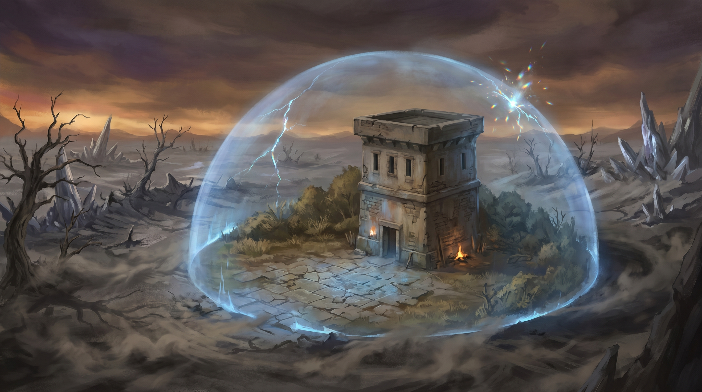
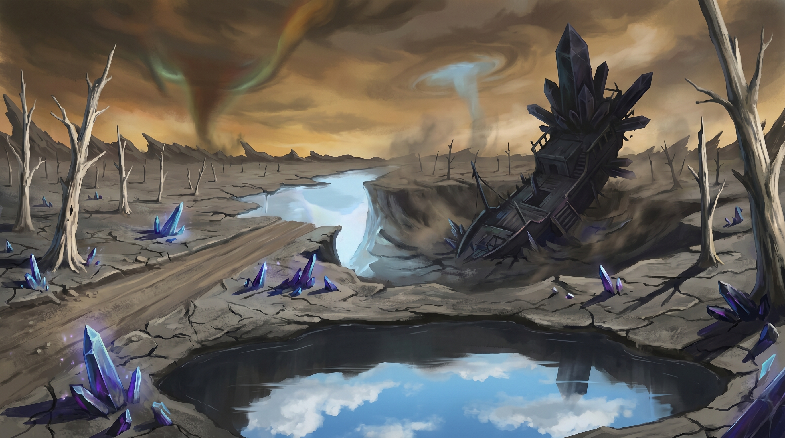
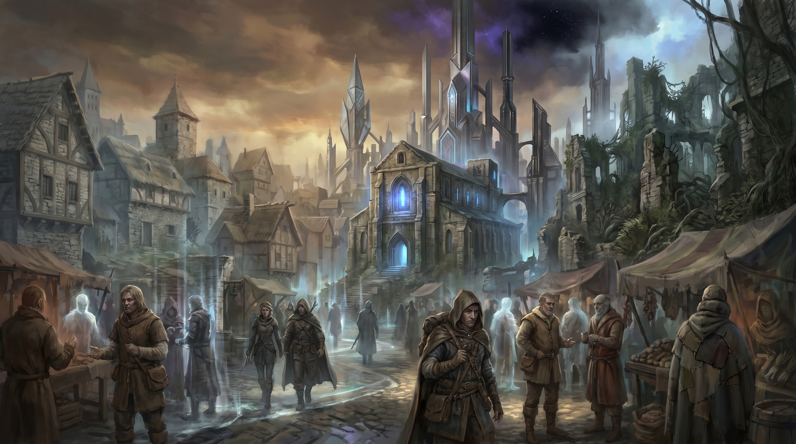
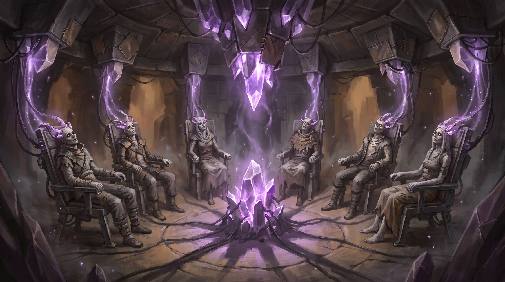

# Locations - The Shattered Beams

This document contains detailed descriptions of all key locations in the campaign.

---

## Major Locations

### The Waystation

**Type:** Outpost / Safe Haven
**Size:** Small (single tower compound)
**Population:** 1 (Aldric Vane)
**First Appearance:** [Chapter 1, Scene 2](chapter-01.md#scene-2-the-waystation)

#### Overview

A crumbling watchtower from an era no one remembers, surrounded by a shimmering barrier of pale blue light that holds reality together in a sphere roughly 200 feet across. Inside the barrier, the world works: gravity pulls down, time flows forward, the sky is the right color. Outside, the Ashlands stretch in every direction — a blighted landscape where none of those things are guaranteed.

The Waystation is one of a dozen Pylon outposts the Old Ones built along the Ley Beam network, designed as maintenance stations and shelters. This is the only one still functioning, kept alive by [Aldric Vane](npcs.md#aldric-vane)'s decades of solitary work channeling what little Beam energy reaches this far from an active Pylon.

#### Atmosphere & Mood

**Sights:** Pale blue light plays across stone walls, shifting like sunlight through water. The tower itself is squat and functional — two stories, flat roof, arrow slits instead of windows. A courtyard of cracked flagstones surrounds it, edged by the barrier's shimmer. Beyond the barrier, the Ashlands are visible but muted, as if seen through frosted glass.
**Sounds:** Near-silence, broken by the barrier's hum — a low, constant drone just below the threshold of hearing, felt more than heard. Wind outside the barrier is visible but inaudible.
**Smells:** Clean air — startlingly clean after the Ashlands' metallic tang. Old stone. The faint mineral scent of arcane energy.
**Feel:** Safe, but fragile. The kind of sanctuary that makes you aware of what's outside.

#### History

Built during the Old Ones' era as Pylon Outpost 7, this station was designed to monitor a secondary Ley Beam junction. When the Fracturing destroyed the junction, the outpost was abandoned. Aldric Vane discovered it thirty years ago and repurposed its residual systems to create the barrier.

#### Current Situation

The barrier is failing. Aldric has managed to slow the deterioration, but the Beam energy he draws on is increasingly erratic as the remaining Beams weaken. Thinny breaches occur with growing frequency — the breach in Chapter 1 is the latest in a pattern of escalation. Aldric estimates the barrier has weeks to months before it collapses entirely.

#### Key Features

1. **The Barrier:** A hemisphere of pale blue energy, visible as a shimmer in the air. Inside, reality is stable. The barrier's edge flickers periodically, and touching it feels like pressing against warm glass.
2. **The Tower:** Two stories. Ground floor: a circular room with a fire pit, Aldric's supplies, and a door to the courtyard. Upper floor: Aldric's living quarters and a crystalline resonance array he uses to maintain the barrier.
3. **The Courtyard:** 40x40 ft of cracked flagstones surrounding the tower. Rubble from the tower's original upper floors provides half cover in two locations. The north wall of the barrier is weakest — this is where breaches occur.

#### Notable NPCs

| Name | Role | Location Within | Notes |
|------|------|----------------|--------|
| [Aldric Vane](npcs.md#aldric-vane) | Keeper | Tower, ground floor | Cannot leave the barrier unattended |

#### Secrets & Hidden Elements

- **DC 14 Arcana:** The barrier is powered by a secondary system beneath the tower — an Old Ones resonance conduit that Aldric has jury-rigged. It's remarkably sophisticated for one person's work.
- **DC 16 Investigation:** Aldric's personal effects include a journal. Most entries are maintenance logs, but the earliest entries reference his time with "the unmakers" and his decision to leave. (This foreshadows his Unraveler past.)
- **DC 18 Perception:** Faint geometric patterns on the courtyard flagstones glow when a Constant-bound individual stands on them — a dormant Door system that no longer functions.

#### DM Notes

**Running This Location:**
- The Waystation should feel like a campfire in the wilderness — warm and safe, but the darkness is *right there*.
- Don't rush the party through. This is where they learn the premise and bond with each other. Let them explore, ask questions, and react.

**If Players Skip:** If they leave immediately without talking to Aldric, he shouts after them with the essential information: "Find Loom! Find the Covenant! The Beams are dying and you're the only ones who can see it!" They'll miss the supplies but not the mission.

---

### The Ashlands

**Type:** Wilderness / Blighted Region
**Size:** Vast (hundreds of miles)
**First Appearance:** [Chapter 2, Scene 1](chapter-02.md#scene-1-the-ashlands)

#### Overview

The Ashlands are what remains of the countryside after the Fracturing and the subsequent Beam failures. Once fertile farmland, forest, and rolling hills, the region is now a blighted expanse where reality's rules are *suggestions*. The sky is a bruised amber-grey. The sun tracks wrong. Dead trees stand like bones. The ground is ash-grey cracked earth, and the air tastes faintly of copper.

The Ashlands are not uniformly hostile — there are pockets of normalcy, places where a stream still runs clear or a stand of trees still grows green. But these pockets are shrinking, and the wrongness between them is getting worse.

#### Atmosphere & Mood

**Sights:** A landscape of muted colors punctuated by wrongness. Shadows that fall at impossible angles. A road that ends mid-air, the terrain beyond it simply *absent*. Crystalline fragments from shattered magitech glinting in the ash. The sun, when visible, is the wrong shade of yellow.
**Sounds:** Wind that carries sounds from other times — distant laughter, the clash of metal, a child crying. The hum of buried magitech conduits. Silence that is too complete, as if the world forgot to make noise.
**Smells:** Metallic ozone. Dry ash. Occasionally, a phantom scent from another era — fresh-baked bread, woodsmoke, flowers — that fades before it can be identified.
**Feel:** Thin. Reality here feels stretched, like fabric pulled taut. The ground sometimes vibrates underfoot at frequencies that make teeth ache.

#### Key Features

1. **Temporal Anomalies:** Time flows unevenly. Travelers might age hours in minutes, or experience the same sunset twice. These effects are usually minor but disorienting.
2. **Magitech Ruins:** Scattered throughout — crystalline fragments, corroded conduits, half-buried machinery that hums with residual energy. Most are inert. Some are dangerous.
3. **Thinnies:** Tears in reality where the Far Realm bleeds through. They shimmer like heat haze and make a sound like discordant singing. Approaching one without protection is extremely dangerous.

#### Locations Within

##### The Skyship Graveyard
Three crashed skyships in a shallow valley. The largest is a merchant vessel, tilted at 30 degrees, its levitation engine a dead crystal the size of a horse. The interior is preserved by temporal stasis in some areas, rotting in others. Contains a log crystal with the captain's final moments and salvageable supplies.

##### The Endless Field
A flat, featureless plain where a battle from another era replays endlessly. Ghostly soldiers fight and die, then reset every few minutes. A temporal loop anchored by some long-forgotten catastrophe. Navigating through it requires understanding the loop's pattern (skill challenge in Chapter 2).

##### The Ruin of Vethara
A half-buried Old Ones facility. Geometric architecture of dark metal and pale crystal. The entrance is a triangular door that responds to the Constant. Inside: corridors that shift when observed, a central chamber with a dormant warforged ([Moth](npcs.md#moth)), and automated defenses. Contains the chrono-compass.

#### Environmental Hazards

- **Temporal Disorientation:** DC 12 Wisdom save when entering a temporal anomaly zone. Failure: disadvantage on checks for 1 hour.
- **Thinny Proximity:** DC 14 Wisdom save when within 100 ft of a Thinny. Failure: frightened for 1 minute. On a failed save by 5+: also 2d6 psychic damage.
- **Reality Fluctuation:** Random environmental effects. 1d6: 1-2 nothing, 3 gravity shifts briefly, 4 time stutters, 5 phantom sounds/smells, 6 spatial displacement (teleported 10 ft in random direction).

#### Travel & Distance

| From | To | Distance | Travel Time (foot) |
|------|-----|----------|-------------------|
| The Waystation | Loom | ~60 miles | 3 days |
| Loom | Breaker Station Terminus | ~15 miles | Half a day |
| Loom | Eld Pylon of Keth | ~30 miles | 1 day |

---

### Loom

**Type:** City (phasing settlement)
**Size:** Medium
**Population:** ~800 (in the "present" phase)
**Government:** Council led by [Elder Soraya](npcs.md#elder-soraya)
**First Appearance:** [Chapter 3, Scene 1](chapter-03.md#scene-1-arrival-at-loom)

#### Overview

Loom is a city that exists in temporal flux. Named because reality here is "woven thin," the settlement phases between time periods: a street might show medieval hovels one moment, gleaming Old Ones architecture the next, then crumbling ruins a moment later. The phasing follows no predictable pattern and has been worsening as the Beams deteriorate.

The settlement survives because Elder Soraya anchored a stable core around the Council Hall using Beam-shard fragments. Within this core, reality holds. Beyond it, the phasing makes navigation treacherous and daily life a constant negotiation with temporal uncertainty.

#### Atmosphere & Mood

**Sights:** A city in constant, subtle motion. Buildings flicker between eras — a stone wall becomes crystal becomes rubble becomes stone again. People walk streets that occasionally aren't there, stepping around gaps in reality with practiced nonchalance. The stable core glows faintly with Beam-shard light.
**Sounds:** Overlapping sounds from different eras — medieval market calls layered over the hum of Old Ones technology layered over the silence of ruins. The effect is like hearing three radio stations at once.
**Smells:** Cooking fires, ozone from the phasing, and occasional phantom scents from other eras — perfume, machine oil, flowers that haven't grown in centuries.
**Feel:** Unsettling but inhabited. The people of Loom have adapted. They know which streets phase dangerous and which are merely disorienting. They've built a life in the impossible, and they're proud of it.

#### Locations Within

##### The Council Hall
The most stable building in Loom, anchored by Beam-shard fragments embedded in its foundation. Stone and crystal construction with warm interior lighting from the shards. Soraya governs from here. The stability makes it the default gathering place for anything important.

##### The Phasing Market
An open-air marketplace where merchants from different eras sell goods simultaneously. A present-day baker operates next to a ghostly Old Ones vendor offering crystalline tools, next to a future-era stall that's usually empty ruin. Temporal disorientation is common but manageable. Contains a Covenant dead drop.

##### Jorin's Apothecary
A narrow, cluttered shop in a side street. Herbs, tinctures, and dubious remedies fill the shelves. A hidden trapdoor leads to a basement that serves as the Covenant of the Pylon's local cell — maps, intelligence, and a communication crystal linked to other Covenant outposts.

#### Notable NPCs

| Name | Role | Location Within | Notes |
|------|------|----------------|--------|
| [Elder Soraya](npcs.md#elder-soraya) | Settlement leader | Council Hall | Hiding a deal with the Unravelers |
| Keeper Jorin | Covenant contact | Apothecary | Nervous, knowledgeable, desperate for help |

#### Secrets & Hidden Elements

- **DC 16 Insight:** Soraya's pendant is a Beam-shard — given to her by the Unravelers as part of their deal. She uses it to anchor the Council Hall's stability.
- **DC 14 Investigation:** The Phasing Market contains a Covenant dead drop — a sealed scroll wedged into a wall that only exists in the present phase.
- **DC 18 Arcana:** The phasing pattern is not random — it follows the Beam's resonance cycle. If the Beam stabilizes, Loom stabilizes. If the Beam falls, Loom may phase permanently into ruin.

---

### Breaker Station Terminus

**Type:** Underground Facility / Dungeon
**Size:** Small (three levels)
**First Appearance:** [Chapter 4, Scene 1](chapter-04.md#scene-1-approach-and-infiltration)

#### Overview

An Old Ones facility repurposed by the Unravelers as a Breaker Station. Built into a hillside half a day's travel south of Loom, its exterior is a reinforced metal door disguised as a rocky outcropping. Inside, three levels of utilitarian corridors, magitech machinery, and the Breaker Chamber where captive psychics are used to erode the Beams.

The station was originally an Old Ones "Harmonic Dampener" — a facility designed to modulate Beam resonance during the planned transition period. The Unravelers reversed its function, turning a tool of calibration into a weapon of destruction.

#### Atmosphere & Mood

**Sights:** Dark metal corridors lit by bioluminescent crystal strips. Geometric Old Ones architecture warped by Unraveler modifications — welded plates, jury-rigged conduits, practical brutality layered over elegant design. The deeper you go, the more the violet light from the Breaker machinery dominates.
**Sounds:** The hum. It permeates everything — a low, resonant drone that vibrates in the chest and makes concentration difficult. On Level 3, the hum becomes a chorus of whispered voices.
**Smells:** Ozone, metal, and beneath it — on Level 3 — the smell of unwashed bodies and something burnt.
**Feel:** Oppressive. Claustrophobic. The walls feel like they're pressing inward. The magitech machinery is warm to the touch, almost organic.

#### Key Features

1. **Level 1 — Entry and Barracks:** Guard post, barracks for 6 soldiers, storage, mess hall. Functional and military.
2. **Level 2 — Processing Hall:** The magitech machinery. Crystalline conduits pulse with violet light, connecting the Breaker chairs below to the broadcast antenna above. The Unraveler Channeler maintains the systems from a control station here.
3. **Level 3 — The Breaker Chamber:** 8 magitech chairs in a circle around a central crystal node. 5 occupied by semiconscious psychics. The chairs are part restraint, part neural interface — crystalline tendrils connect to the occupants' temples. [Wren](npcs.md#wren) is here.

#### Entry Points

| Entry | Location | Discovery DC | Access DC | Notes |
|-------|----------|-------------|-----------|-------|
| Main Entrance | Hillside door | Automatic | DC 15 Stealth | Guarded by 2 soldiers |
| Ventilation Shaft | Hillside, 40 ft above entrance | DC 14 Perception | DC 12 Athletics | Tight squeeze, opens to Level 1 storage |
| Collapsed Section | Ravine behind the hill | DC 15 Investigation | DC 13 Athletics | Opens to Level 2, bypasses Level 1 |

#### Notable NPCs

| Name | Role | Location Within | Notes |
|------|------|----------------|--------|
| [Wren](npcs.md#wren) | Captive Breaker | Level 3, Breaker Chamber | The party's moral fulcrum |
| Station Commander Vekk | Station commander | Level 1, Barracks | Pragmatic dwarf soldier |

---

### The Eld Pylon of Keth

**Type:** Ancient Landmark / Vertical Dungeon
**Size:** Massive (200 ft tall, 80 ft diameter at base)
**First Appearance:** [Chapter 6, Scene 1](chapter-06.md#scene-1-approach-to-the-pylon)

#### Overview

One of the six Eld Pylons built by the Old Ones to anchor the Ley Beams. The Pylon of Keth is the larger of the two remaining intact Pylons, a massive crystalline tower rising from shattered earth in the eastern Ashlands. Its surface is faceted like a cut gem, catching light in prismatic patterns even under the bruised sky. Dormant but structurally intact, it awaits activation by Constant-bound individuals.

The Pylon's interior is a vertical dungeon: a progression from the Entry Hall at ground level through the Resonance Chamber, Armory, and Memory Banks to the Control Chamber at the top. The architecture is the Old Ones at their most impressive — crystalline geometry that is simultaneously technology, art, and something approaching prayer.

#### Atmosphere & Mood

**Sights:** Impossible geometry in crystal and dark metal. Surfaces that shift when observed directly. Light that bends around corners. The Beam anchor — a massive crystal suspended from the ceiling of the Control Chamber — pulses with deep, rhythmic light like a heartbeat.
**Sounds:** The Pylon hums at a frequency that resonates in the bones. Deeper inside, the hum differentiates into tones — almost musical, almost speech. The Old Ones' language was built into the architecture.
**Smells:** Clean ozone. A mineral scent like deep caves. Something faintly floral that has no identifiable source.
**Feel:** Awe. The Pylon is beautiful in a way that is not entirely comfortable. It feels *aware* — not sentient, but attentive. Like standing inside a sleeping god.

#### Key Features

1. **The Entry Hall:** A vast chamber with geometric floor patterns. Two Pylon Guardians (Shield Guardians) stand sentinel, scanning visitors for the Constant bond.
2. **The Resonance Chamber:** A 100-ft vertical shaft lined with crystal nodes. Platforms of solid light form and dissolve. Resonance pulses echo through the shaft every 2 rounds.
3. **The Armory:** A sealed side chamber containing Old Ones equipment, including the Essence Pistol and a Guardian control amulet.
4. **The Memory Banks:** Crystal walls that play holographic recordings when touched. Contains the Old Ones' records of the Beams' purpose and their transition plan.
5. **The Control Chamber:** The Pylon's heart, 60 ft diameter. The Beam anchor crystal hangs from the ceiling. Control consoles ring the walls. Windows of transparent crystal provide panoramic views.

#### Notable NPCs

| Name | Role | Location Within | Notes |
|------|------|----------------|--------|
| [Commander Dace](npcs.md#commander-dace) | Unraveler lieutenant | Control Chamber | Can be fought or turned |
| [Sera Mourne](npcs.md#sera-mourne-the-threadcutter) | The Threadcutter | Arrives Chapter 7 | Final confrontation |

#### Secrets & Hidden Elements

- **The Guardians** recognize Constant-bound individuals and [Moth](npcs.md#moth) as authorized visitors. All others are rejected or attacked.
- **The Memory Banks** contain the campaign's central revelation: the Beams were designed as a transitional system, not a permanent one. The Old Ones planned to remove them gradually.
- **The Armory** contains a Guardian control amulet that can command one of the Entry Hall Guardians for 1 hour — a tactical asset for Chapter 7.
- **The Control Chamber** has defensive systems that can be activated to protect the Pylon against external assault: energy barriers on the Entry Hall, resonance weapons in the shaft, and a lockdown protocol for the Control Chamber itself.

---

## Location Quick Reference

### By Type

#### Outposts & Settlements
- [The Waystation](#the-waystation) - Aldric's barrier-protected outpost
- [Loom](#loom) - Phasing city of ~800 survivors

#### Dungeons & Facilities
- [Breaker Station Terminus](#breaker-station-terminus) - Underground psychic exploitation facility
- [The Eld Pylon of Keth](#the-eld-pylon-of-keth) - Ancient crystalline tower

#### Wilderness
- [The Ashlands](#the-ashlands) - Blighted wasteland between all locations

### By Chapter

#### Chapter 1
- [The Waystation](#the-waystation) - Starting location, mentor introduction

#### Chapter 2
- [The Ashlands](#the-ashlands) - Journey, exploration, discovery of Moth

#### Chapter 3
- [Loom](#loom) - Social hub, faction contacts, intelligence gathering

#### Chapter 4
- [Breaker Station Terminus](#breaker-station-terminus) - Infiltration, moral decision

#### Chapter 5
- [Loom](#loom) - Defense/evacuation during Thinny storm
- [The Ashlands](#the-ashlands) - Storm approach

#### Chapters 6-7
- [The Eld Pylon of Keth](#the-eld-pylon-of-keth) - Vertical dungeon and climax location

---

## Travel & Distance

### Travel Times

| From | To | Distance | Travel Time (foot) | Notes |
|------|-----|----------|-------------------|-------|
| The Waystation | Loom | ~60 miles | 3 days | Through the Ashlands; temporal anomalies may alter time |
| Loom | Breaker Station Terminus | ~15 miles | Half a day | South through the Ashlands; less anomalous terrain |
| Loom | Eld Pylon of Keth | ~30 miles | 1 day | East through the Ashlands; Beam proximity stabilizes the route |
| Breaker Station Terminus | Eld Pylon of Keth | ~25 miles | 1 day | Southeast; passes through unstable terrain |

### Travel Conditions

**Roads:** Mostly gone. Some ancient paths remain, marked by Old Ones' geometric waymarkers. Following them reduces travel time by 25%.
**Weather:** Unpredictable. The Ashlands don't have conventional weather — they have reality fluctuations that sometimes *look* like weather. A "storm" might be wind carrying temporal distortion rather than rain.
**Dangers:** Temporal anomalies, Thinnies, aberrant creatures (escaped from Thinny breaches), and the occasional Unraveler patrol.

### Random Travel Encounters

Roll 1d6 when traveling between major locations:

| d6 | Encounter |
|----|-----------|
| 1-2 | No encounter — but an environmental detail emphasizes the wrongness (a pond reflecting a different sky, animal bones in geometric patterns, a road ending mid-air) |
| 3 | **Temporal Echo:** A ghostly scene from another era plays out. Non-hostile but disorienting (DC 12 Wisdom save or 1 hour of disadvantage on checks). Provides atmospheric lore. |
| 4 | **Scavengers:** 2d4 Dretches (MM p.57) that wandered through a Thinny. Confused and aggressive. Easy combat for level 4+ parties. |
| 5 | **Thinny Proximity:** The path skirts a Thinny. DC 14 group Survival check to navigate safely. Failure: each PC makes a DC 14 Wisdom save or takes 2d6 psychic damage and is frightened for 1 minute. |
| 6 | **Magitech Cache:** A half-buried Old Ones container. DC 14 Investigation to open. Contains: 1d4 × 25 gp in crystalline components, a 50% chance of a *Potion of Healing*, and a 25% chance of a minor wondrous item (DM's choice). |
