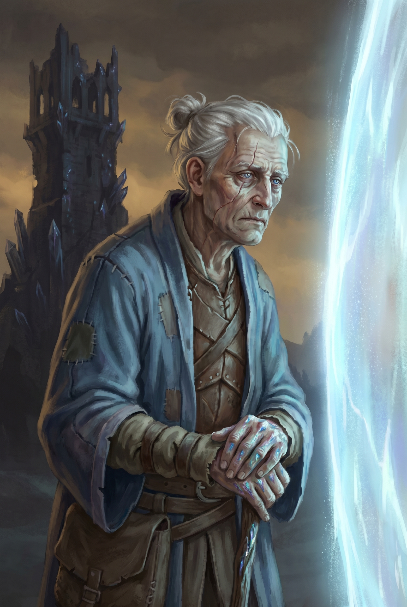
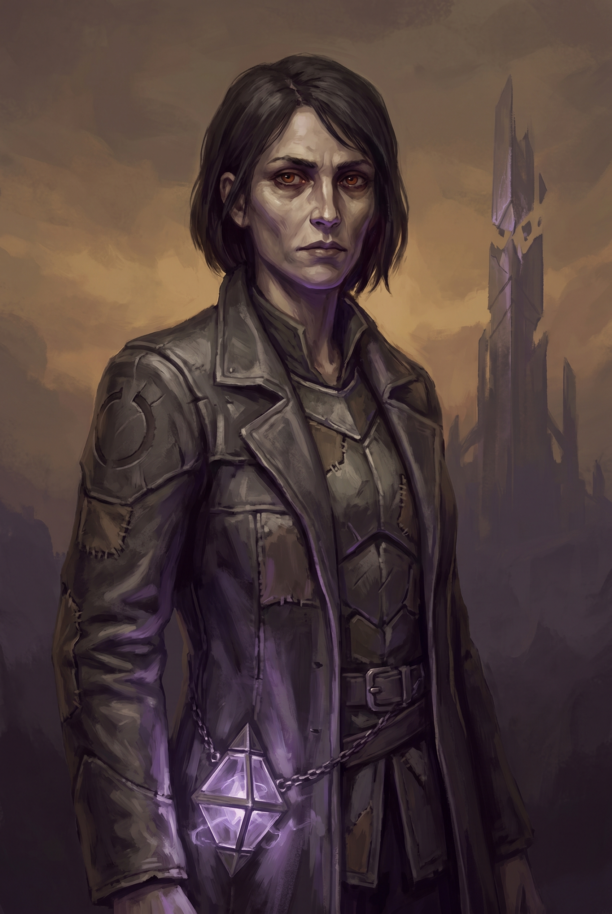
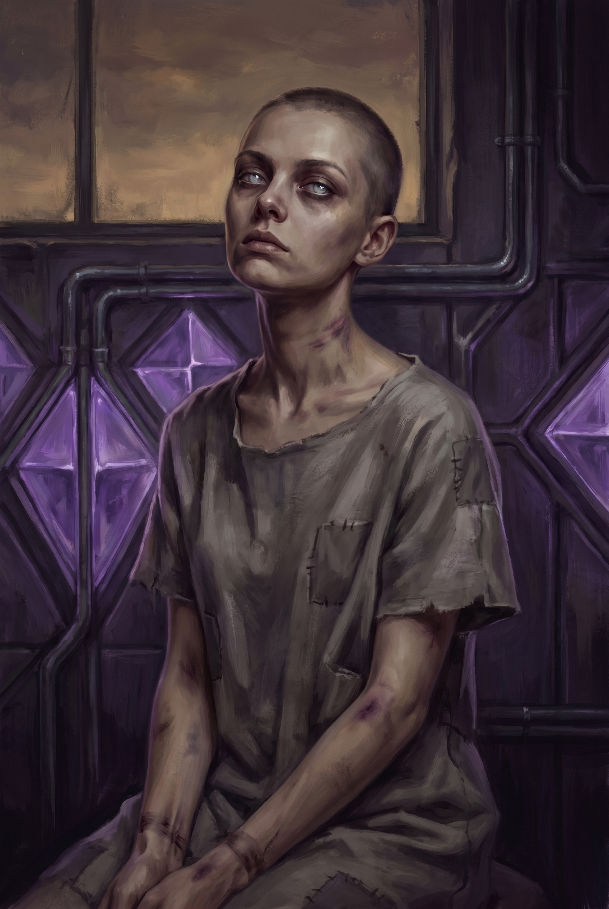
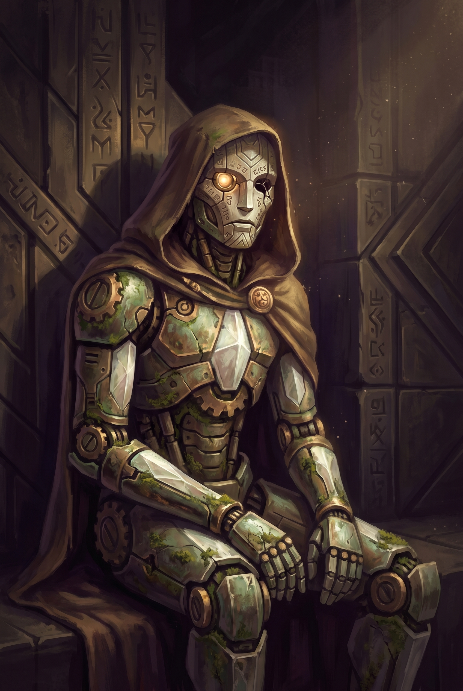

# NPCs - The Shattered Beams

This document contains all important NPCs in the campaign, organized by importance and location.

---

## Major NPCs

These NPCs are central to the campaign's story and appear in multiple chapters.

### Aldric Vane

**Role:** Waystation Keeper, mentor, guide
**Race/Gender:** Male Human
**Location:** [The Waystation](locations.md#the-waystation)
**First Appearance:** [Chapter 1, Scene 2](chapter-01.md#scene-2-the-waystation)

#### Appearance
A tall, gaunt man in his late sixties with a scholar's stoop and a soldier's hands. His white hair is pulled back in a loose knot, his skin weathered to the color of old parchment. His eyes are pale blue — the color of ice on a lake — and they carry the particular focus of someone who has spent decades watching for something specific. A thin scar runs from his left temple to his jaw, old and well-healed. He wears a faded blue robe over practical traveling clothes, and his fingers are stained with crystalline residue from years of maintaining the Waystation's barrier.

#### Personality
**Traits:** Patient, deliberate, quietly burdened
**Ideals:** The truth matters more than comfort. Knowledge without conscience is the root of every catastrophe.
**Bonds:** The Waystation is his penance and his purpose. He will not leave it while it still functions.
**Flaws:** He withholds information to protect people, even when transparency would serve them better. He carries guilt that sometimes manifests as paternalism.

#### Mannerisms & Speech
- Pauses mid-sentence to choose his words, as if each one is a small commitment
- Presses his fingertips together when thinking — a habit from his scholarly days
- Addresses strangers formally ("You are welcome here") and shifts to first names only after trust is established
- Speech pattern: measured, precise, with an occasional dry observation that reveals a buried sense of humor

#### Background & History
Aldric Vane was once a member of the Covenant of the Pylon — one of its senior scholars. Thirty years ago, he discovered evidence that the Beams might not be strictly necessary for reality's survival, and he began questioning the Covenant's orthodoxy. This questioning led him to the Unravelers — or rather, to their philosophical predecessors. He worked with them briefly, convinced that the Beams could be safely removed.

Then he saw what the early Breaker experiments did to people. He left the Unravelers, reported what he knew to the Covenant (who exiled him for his betrayal), and retreated to the Waystation — a forgotten Pylon outpost — where he has maintained the barrier alone for decades. He watches, he waits, and he sends anyone the Constant Draws in the right direction.

#### Motivations & Goals
**Wants:** To guide the Drawn ones toward the Beams before it's too late
**Needs:** Absolution for his role in the Unravelers' early work
**Fears:** That the Threadcutter is right and he abandoned the cause that could have saved reality — or that the Drawn ones will repeat his mistakes

#### Secrets
- He was an Unraveler. He left after witnessing the first Breaker experiments. He has never told anyone this.
- He knows Sera Mourne personally — she was his student in the Covenant before she left to found the Unravelers. He blames himself for planting the seeds of her ideology.
- The Waystation's barrier is failing faster than he lets on. He has weeks, not months, before it collapses entirely.

#### Relationships
- **[Sera Mourne](#sera-mourne-the-threadcutter):** Former student. He taught her to question the Beams. He considers her radicalization his greatest failure.
- **[The Covenant of the Pylon](factions.md#the-covenant-of-the-pylon):** Exiled member. They consider him a traitor. He considers them willfully blind.
- **[The Unravelers](factions.md#the-unravelers):** Former associate. They consider him a coward who lost his nerve.
- **The Party:** He sees them as hope — the Constant's answer to a world running out of time. He'll do everything he can to prepare them, short of leaving the Waystation.

#### Stat Block
**Stats:** Archmage (MM p.342), but will not engage in combat — maintaining the Waystation barrier requires his full concentration. If the barrier falls, he can fight, but the Waystation is lost.

#### Roleplaying Tips
- Aldric is kind but not warm. He cares deeply, but decades of isolation have made him awkward with people.
- He answers questions honestly — except about his past. When asked about himself, he deflects to the task at hand.
- He should feel like a man carrying an enormous weight who is quietly, desperately relieved to see the party arrive.

#### Story Role
**Acts as:** Mentor / Quest giver
**Can Provide:** Knowledge of the Beams, the Constant, the Old Ones, and the Fracturing. Supplies and direction. In Chapter 7, he can be contacted via communication crystal for advice — and his secret.
**Will Ask For:** Go to Loom. Find the Covenant. Stop the Beams from falling.

#### Potential Outcomes
- **If befriended:** Becomes a reliable remote advisor via communication crystal. His secret about Sera is powerful leverage in Chapter 7.
- **If antagonized:** Provides minimum information and the party leaves poorly prepared.
- **If killed:** The Waystation barrier falls immediately. The party loses their safe haven and a critical information source. Moth and the Covenant must fill the knowledge gap.

---

### Sera Mourne (The Threadcutter)

**Role:** Primary antagonist
**Race/Gender:** Female Human
**Location:** Mobile; arrives at [Eld Pylon of Keth](locations.md#the-eld-pylon-of-keth) in Chapter 7
**First Appearance:** Named in [Chapter 3](chapter-03.md), physically in [Chapter 7, Scene 1](chapter-07.md#scene-1-the-threadcutters-arrival)

#### Appearance
A lean, sharp-featured woman in her early forties. Dark hair cut short and practical, framing a face that is all angles — high cheekbones, narrow jaw, deep-set eyes the color of burnt amber. She moves with the economy of someone who has eliminated everything unnecessary from her life. She wears a long coat of dark grey over leather armor, and the Resonance Key hangs from a chain at her hip — a device of crystalline geometry that hums faintly when she touches it. There is nothing soft about her, but there is nothing cruel either. She looks like a woman who has made peace with a terrible decision.

#### Personality
**Traits:** Brilliant, driven, unflinching. Compassionate in principle if not always in practice.
**Ideals:** Reality should be free to evolve. The Old Ones had no right to freeze the world in amber, and neither does anyone else.
**Bonds:** Her cause is everything. The people she's hurt along the way are a debt she intends to pay — after the work is done.
**Flaws:** She has become so certain of her conclusion that she has stopped questioning her methods. She treats suffering as a budget line item in a cosmic accounting.

#### Mannerisms & Speech
- Speaks with academic precision, as if presenting a thesis — but her voice tightens when she talks about the Breakers, revealing emotion she works to suppress
- Quotes the Old Ones' records from memory, in the original language
- Makes eye contact that is uncomfortably steady — she is assessing everyone she meets
- When challenged, she doesn't raise her voice. She asks questions: "And what would you do instead? How many more centuries would you wait?"

#### Background & History
Sera Mourne was the most gifted scholar the Covenant of the Pylon had produced in a generation. Mentored by Aldric Vane, she dedicated her life to understanding the Beams. Five years ago, she discovered records in a buried Pylon archive that revealed the Beams' transitional nature — they were never meant to be permanent. The Covenant's leadership suppressed her findings, fearing that the knowledge would destabilize their authority.

Sera left the Covenant and founded the Unravelers. She built the Breaker Stations because she needed a way to weaken the Beams without access to the Old Ones' controlled transition protocols, which she has never been able to fully reconstruct. The Resonance Key is her alternative — crude, violent, but effective.

She is not a sadist. She does not enjoy the Breakers' suffering. But she has decided that the world's freedom is worth any cost — and she has paid too much to stop now.

#### Motivations & Goals
**Wants:** To destroy the remaining Beams and free reality from the Old Ones' framework
**Needs:** To believe that the suffering she's caused was necessary — that there was no other way
**Fears:** That there *was* another way and she chose the path of cruelty out of impatience

#### Secrets
- She has nightmares about the Breakers. She visits the stations less and less frequently because she cannot bear to watch.
- She has a fragment of the Old Ones' transition protocol — enough to know that gradual removal is theoretically possible, but she convinced herself it would take too long. If presented with evidence that it's feasible on a shorter timeline, her certainty cracks.
- Aldric Vane was her mentor. His abandonment of the Unravelers' early work is something she considers a personal betrayal. If Aldric speaks to her directly, it reaches her.

#### Relationships
- **[Aldric Vane](#aldric-vane):** Former mentor. She considers his departure a betrayal — he showed her the truth and then lacked the courage to act on it.
- **[Commander Dace](#commander-dace):** Her most trusted lieutenant. She relies on his pragmatism and loyalty. If he turns against her, it devastates her.
- **[Wren](#wren):** She doesn't know Wren by name. The Breakers are numbers to her — not by choice, but by necessity. If forced to confront Wren as a person, her emotional armor cracks.
- **[The Covenant of the Pylon](factions.md#the-covenant-of-the-pylon):** Former home. She sees them as cowards clinging to a broken system.
- **The Party:** She respects them — the Constant chose them for a reason. She genuinely wishes they would join her cause.

#### Stat Block
**Stats:** Archmage (MM p.342) with modifications:
- Spell save DC increased to 19
- Add *Telekinesis* to prepared spells
- Carries the Resonance Key (artifact, see Chapter 7)
- **Legendary Resistance (2/day)**
- HP: 120 (increased from 99)

#### Roleplaying Tips
- Sera is the campaign's most important NPC to get right. She should never feel like a villain — she should feel like a protagonist who made different choices.
- When she talks about her cause, she should be *persuasive*. If the DM doesn't at least partially agree with her argument while performing it, they're not performing it well enough.
- Her vulnerability is specific: she breaks when confronted with the *human cost* of her methods, not the abstract wrongness of her goals.

#### Story Role
**Acts as:** Antagonist (but potentially redeemable)
**Can Provide:** The most complete understanding of the Beams, the Old Ones, and the Resonance Key technology
**Will Ask For:** The party to step aside — or join her

#### Potential Outcomes
- **If persuaded:** Agrees to a ceasefire. Becomes a reluctant ally in finding the gradual transition method. She is haunted but relieved.
- **If defeated in combat:** Can be killed or captured. If captured, she cooperates — but with the bitter awareness that her life's work has been stopped. Her knowledge is invaluable.
- **If she succeeds:** The fifth Beam falls. She watches the consequences with the expression of someone who expected to feel vindicated and instead feels hollow.

---

### Wren

**Role:** Captive Breaker, potential ally
**Race/Gender:** Female Human
**Location:** [Breaker Station Terminus](locations.md#breaker-station-terminus); later mobile with the party
**First Appearance:** [Chapter 4, Scene 4](chapter-04.md#scene-4-the-breaker-chamber)

#### Appearance
Young — sixteen years old, though weeks in the Breaker chair have aged her beyond her years. Gaunt face, shaved head (the chair's tendrils require direct contact), dark circles under luminous grey eyes that seem to look *through* things rather than at them. Tall and thin, she moves with the unsteadiness of someone relearning their body. Her hands tremble constantly. She wears the shapeless grey shift the Breakers are given, and her wrists bear the marks of the chair's restraints.

#### Personality
**Traits:** Fragile but fierce. Perceptive to the point of discomfort. Quietly, stubbornly hopeful.
**Ideals:** No one should be used as a tool. Power is a gift, not a resource to be harvested.
**Bonds:** The other Breakers — the ones she couldn't save, the ones still in chairs somewhere. She carries them.
**Flaws:** Her psychic abilities make boundaries difficult. She sometimes reads thoughts without meaning to and finishes sentences before they're spoken. This unnerves people, and she knows it, which makes her withdraw.

#### Mannerisms & Speech
- Speaks in short, halting sentences — as if translating from a language that doesn't use words
- Occasionally finishes other people's sentences, then looks stricken when she realizes she's done it
- Wraps her arms around herself when anxious, which is often
- When her abilities activate involuntarily, her eyes briefly glow silver-white

#### Background & History
Wren was a street kid in a settlement that no longer exists — consumed by a Thinny two years ago. She survived because her latent psychic abilities warned her before the Thinny hit. The Unravelers found her in the aftermath, recognized her power, and took her to the Breaker Station. She has been in the chair for six weeks.

She doesn't know much about the wider world — just the fragments she's absorbed from the other Breakers' minds and the Beam's resonance. She knows the Beams are real. She knows they're hurting. She knows the Constant is a force that connects certain people. And she knows, with a certainty that she can't explain, that the party was coming for her.

#### Motivations & Goals
**Wants:** To be free. To never be in a chair again. To matter as a person, not a power source.
**Needs:** Safety, connection, and time to heal — things she won't ask for because she doesn't believe she deserves them.
**Fears:** Being used again. That her power makes her a tool, not a person — that everyone who helps her is really just investing in her abilities.

#### Secrets
- Her psychic abilities are growing, not stable. The Breaker process didn't just use her power — it expanded it. She can now perceive things she shouldn't be able to: the Beams directly, the Constant's threads, and fragmentary visions of possible futures.
- She occasionally hears the other Breakers' thoughts — the ones still in chairs at other stations. This is agonizing and she doesn't talk about it.
- She is aware, dimly, that the "Third Way" in Chapter 7 will cost her. She will do it anyway.

#### Relationships
- **The Party:** She imprints on them immediately — they're the first people who treated her as a person in weeks. This is both genuine and concerning; her attachment is intense and fragile.
- **[Sera Mourne](#sera-mourne-the-threadcutter):** She knows of Sera but has never met her. She hates what Sera represents but understands, painfully, that Sera believes she's right.
- **[Moth](#moth):** If both are present, they develop an odd rapport. Moth's fragmented speech and Wren's psychic sensitivity mean they communicate in half-sentences and intuitions.

#### Stat Block
**Stats:** Commoner (MM p.345) with the following modifications:
- INT 16 (+3), WIS 18 (+4), CHA 14 (+2)
- Proficiency in Arcana, Insight, Perception
- **Psychic Sensitivity:** Can sense the Beams' condition, the Constant bond, and emotional states within 60 feet. Can project emotions (not thoughts) at will.
- **Beam Sight:** Can perceive Ley Beam energy and Thinny formations that others cannot.
- Non-combatant by default, but in Chapter 7 she can channel energy through Pylon systems (see Chapter 7 for mechanics).

#### Roleplaying Tips
- Wren is not a damsel. She's been through hell and she's angry — but she's learned to make herself small because powerful people have used her and she's terrified it will happen again.
- Let her be awkward. She hasn't had a normal conversation in weeks. She doesn't know how to accept kindness gracefully.
- Her psychic slips (finishing sentences, reacting to emotions she shouldn't know about) should be played for characterization, not comedy.

#### Story Role
**Acts as:** Ally, emotional anchor, key to the "Third Way" resolution
**Can Provide:** Beam perception, psychic sensitivity, emotional insight, and the ability to interface with Pylon systems
**Will Ask For:** Nothing. She doesn't know how to ask for things. She needs the party to offer.

#### Potential Outcomes
- **If freed and brought along:** Becomes a core NPC ally. Her power is immense but her trauma is real. She's the key to the best ending in Chapter 7.
- **If left in the station:** She's moved to another station. The party loses the "Third Way" option and a powerful narrative connection.
- **If she dies (Chapter 7 sacrifice):** One of the campaign's most emotionally devastating outcomes — but she chose it freely, and that matters.

---

## Supporting NPCs

### Commander Dace

**Role:** The Threadcutter's lieutenant
**Race/Gender:** Male Human
**Location:** [Eld Pylon of Keth](locations.md#the-eld-pylon-of-keth)
**First Appearance:** [Chapter 6, Scene 5](chapter-06.md#scene-5-the-control-chamber)

#### Quick Description
Late thirties, military bearing, close-cropped brown hair, tired eyes that don't match his rigid posture. He wears practical armor with Unraveler insignia — a broken circle. A longsword at his hip, well-maintained but rarely drawn for show.

#### Personality
Disciplined, pragmatic, and increasingly conflicted. He joined the Unravelers because he saw the Beams failing and wanted to be on the side that had a plan. He stayed because Sera's vision gave him purpose after the war. But the Breaker Stations trouble him — he has never visited one, by deliberate choice.
**Quirk:** When uncertain, he touches the pommel of his sword — a grounding gesture from his soldiering days.

#### What He Knows
- The Threadcutter's full plan: use the Resonance Key on the Eld Pylon of Keth to destroy the fifth Beam
- The Resonance Key's capabilities and limitations
- The Unravelers' force disposition and Sera's timeline
- **What he'll share freely:** The tactical situation, if he believes the party is reasonable
- **What requires persuasion (DC 14):** His doubts about Sera's methods
- **What requires significant persuasion (DC 16):** Details about the Resonance Key's weaknesses

#### What He Wants
To do the right thing — he's just no longer sure what that is.

#### Stat Block
**Stats:** Warlord (VGM p.220). Fights tactically with coordinated attacks. Surrenders at low HP rather than die.

#### Roleplaying Notes
- Dace is a soldier, not a fanatic. He follows orders because he trusts the chain of command, not because he's incapable of independent thought.
- When confronted with the moral cost of the Unravelers' work (especially the Breakers), he doesn't defend it — he deflects, then falls silent.
- If turned, he doesn't suddenly become the party's best friend. He's an ally of convenience who is quietly grateful someone gave him a reason to stop.

---

### Moth

**Role:** Warforged remnant, lore source, companion
**Race/Gender:** Non-binary Warforged
**Location:** [The Ashlands](locations.md#the-ashlands) (found in the Ruin of Vethara)
**First Appearance:** [Chapter 2, Scene 4](chapter-02.md#scene-4-the-ruin-of-vethara)

#### Quick Description
A medium-sized warforged of tarnished bronze and pale crystal. One eye glows faintly amber; the other is dark and cracked. Moss and lichen grow in the joints, and the surface is pitted with age. Geometric patterns are etched into the plating — Old Ones' script that no one alive can read, except Moth, in fragments.

#### Personality
Confused, earnest, and slowly awakening. Moth's memory crystal is corroded — they speak in fragments, half-remembered phrases, and broken syntax. But beneath the damage, there is a gentle, curious intelligence trying to reassemble itself.
**Quirk:** Tilts their head at a precise 15-degree angle when processing new information, accompanied by a faint clicking sound.

#### What They Know
- Fragmentary knowledge of the Old Ones: their technology, their language, their purpose
- The existence and function of the Eld Pylons, Breaker Stations (by their original name: "Harmonic Dampeners"), and the Ley Beams
- How to interface with Old Ones technology (+5 bonus on related Arcana checks)
- **What they share freely:** Anything they can articulate, which is limited by their damaged memory
- **What requires repair:** Deeper memories unlock as the party progresses (DM can reveal lore as needed)

#### What They Want
To remember. To complete the task they were built for — maintaining the Pylons.

#### Stat Block
**Stats:** Use Warforged racial traits. Non-combatant. AC 16 (natural armor), HP 30. Can interface with Old Ones technology (grants advantage on related checks to PCs working with them).

#### Roleplaying Notes
- Moth's speech is distinctive: incomplete sentences, repeated words, subject-verb disagreement. "The builders... they built for... for healing. The beams were... were healing. But the healing was... was supposed to end."
- They're not comic relief — they're tragic. A being designed for a purpose that no longer exists, slowly piecing together a world that left them behind.
- They bond with Wren instinctively if both are present — two damaged beings who communicate without needing complete sentences.

---

### Elder Soraya

**Role:** Leader of Loom
**Race/Gender:** Female Human
**Location:** [Loom](locations.md#loom)
**First Appearance:** [Chapter 3, Scene 2](chapter-03.md#scene-2-the-council-hall)

#### Quick Description
Mid-fifties, silver-streaked black hair pulled back tight, sharp dark eyes that calculate cost and benefit in real time. She wears practical clothes — no finery, no affectation — with a single piece of jewelry: a pendant of Beam-shard crystal on a silver chain.

#### Personality
Direct, pragmatic, and exhausted. Soraya has been keeping 800 people alive in a city that phases between time periods, and she's done it through hard choices and harder compromises. She doesn't have patience for idealism, but she respects competence.
**Quirk:** Taps her pendant when making decisions — a nervous habit she doesn't realize she has.

#### What She Knows
- The Beams' deterioration is accelerating
- The Unravelers exist and are actively destroying the Beams
- The name "Threadcutter" and her reputation
- The general location of Breaker Station Terminus (obtained through her deal)
- **What she'll share freely:** The state of Loom, the danger of the Beams
- **What requires trust (DC 14 Persuasion):** Information about the Unravelers and the Breaker Station
- **What requires discovery (DC 18 Insight or investigation):** Her secret deal with the Unravelers

#### What She Wants
To keep her people alive. Everything else is secondary.

#### Stat Block
**Stats:** Noble (MM p.348)

#### Roleplaying Notes
- Soraya is not a villain. She's a leader who made a desperate bargain and hates herself for it.
- If her secret is exposed, she doesn't fight — she collapses into honesty. She's been waiting for someone to call her on it because she couldn't bring herself to stop on her own.
- She is genuinely grateful to anyone who gives her a way out of her impossible situation.

---

## Minor NPCs

| Name | Role | Location | Chapter | Key Feature |
|------|------|----------|---------|-------------|
| Keeper Jorin | Covenant contact | [Loom](locations.md#loom) | Ch. 3 | Nervous half-elf apothecary who whispers everything |
| Station Commander Vekk | Breaker Station commander | [Breaker Station Terminus](locations.md#breaker-station-terminus) | Ch. 4 | Scarred female dwarf, pragmatic soldier — not cruel, just efficient |
| Unraveler Channeler | Magitech operator | [Breaker Station Terminus](locations.md#breaker-station-terminus) | Ch. 4 | Maintains the Breaker systems, deeply uncomfortable with the work |

**Generic NPCs:**
- **Unraveler Soldiers:** Use Veteran (MM p.350)
- **Unraveler Channelers:** Use Mage (MM p.347)
- **Loom Citizens:** Use Commoner (MM p.345)
- **Covenant Members:** Use Acolyte (MM p.342) or Priest (MM p.348)

---

## NPC Quick Reference

### By Location

#### The Waystation
- [Aldric Vane](#aldric-vane) - Keeper, mentor

#### The Ashlands
- [Moth](#moth) - Warforged companion (found in Ruin of Vethara)

#### Loom
- [Elder Soraya](#elder-soraya) - Settlement leader
- Keeper Jorin - Covenant contact

#### Breaker Station Terminus
- [Wren](#wren) - Captive Breaker
- Station Commander Vekk - Station commander

#### Eld Pylon of Keth
- [Commander Dace](#commander-dace) - Unraveler lieutenant
- [Sera Mourne](#sera-mourne-the-threadcutter) - The Threadcutter (arrives Ch. 7)

### By Chapter

#### Chapter 1
- [Aldric Vane](#aldric-vane) - Waystation, exposition and quest giving

#### Chapter 2
- [Moth](#moth) - Ruin of Vethara, discovery and activation

#### Chapter 3
- [Elder Soraya](#elder-soraya) - Council Hall, social encounter
- Keeper Jorin - Apothecary, intelligence

#### Chapter 4
- [Wren](#wren) - Breaker Chamber, moral decision
- Station Commander Vekk - Guard Barracks, combat/social

#### Chapters 5
- [Elder Soraya](#elder-soraya) - Emergency council
- [Wren](#wren) - If freed, psychic support

#### Chapter 6
- [Commander Dace](#commander-dace) - Control Chamber, social/combat
- [Moth](#moth) - Pylon systems integration

#### Chapter 7
- [Sera Mourne](#sera-mourne-the-threadcutter) - The climax
- [Commander Dace](#commander-dace) - If alive, potential ally
- [Wren](#wren) - If freed, Third Way option
- [Aldric Vane](#aldric-vane) - Via communication crystal

### By Faction

#### The Covenant of the Pylon
- [Aldric Vane](#aldric-vane) - Exiled member
- Keeper Jorin - Active cell leader in Loom

#### The Unravelers
- [Sera Mourne](#sera-mourne-the-threadcutter) - Founder and leader
- [Commander Dace](#commander-dace) - Military lieutenant
- Station Commander Vekk - Station commander

#### The Remnants
- [Elder Soraya](#elder-soraya) - Leader of Loom

#### Unaligned
- [Wren](#wren) - Captive, then free agent
- [Moth](#moth) - Old Ones construct

---

## Random NPC Generator

If you need to improvise an NPC on the spot:

### Names
**Male:** Aldren, Cael, Darvik, Fen, Halric, Josten, Keth, Loren, Mael, Orin, Renn, Soren, Thane, Varek, Wynn
**Female:** Asha, Brenna, Cira, Dael, Elara, Fenn, Gwyn, Hala, Isen, Kael, Lira, Mira, Nessa, Reva, Sera, Talia, Vessa, Wren, Yara
**Surnames:** Ashborn, Beamwalker, Crestfall, Doorward, Greystone, Hallows, Kethmere, Loomborn, Pylonkeeper, Riftwalker, Stormward, Thornfield, Veilcross

### Quick Personality
| d6 | Trait | Quirk |
|----|-------|-------|
| 1 | Cautiously helpful | Always counting something (coins, steps, heartbeats) |
| 2 | Suspicious and watchful | Never sits with their back to a door |
| 3 | Grimly cheerful | Hums a tune that sounds slightly wrong |
| 4 | Resigned and weary | Stares at the sky as if expecting it to change |
| 5 | Desperately hopeful | Touches every doorframe before passing through |
| 6 | Quietly defiant | Speaks only in present tense (past tense feels unsafe) |

### Quick Appearance
| d6 | Distinctive Feature |
|----|-------------------|
| 1 | One eye is a different color than the other (Thinny exposure) |
| 2 | Faint crystalline patterns on their skin (Beam proximity) |
| 3 | Prematurely grey hair on one side of their head |
| 4 | Wears multiple timepieces, none of which show the same time |
| 5 | A scar that shimmers faintly, as if the wound never fully closed in reality |
| 6 | Speaks with a slight echo, as if their voice exists in two moments simultaneously |
